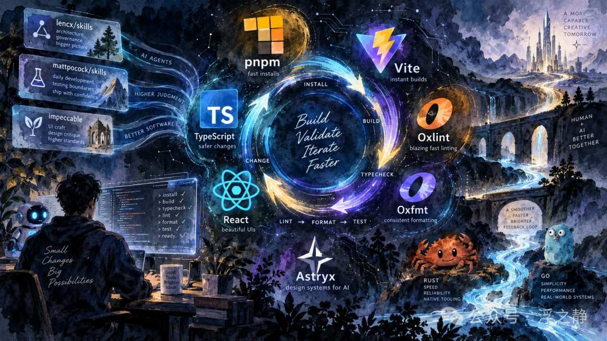
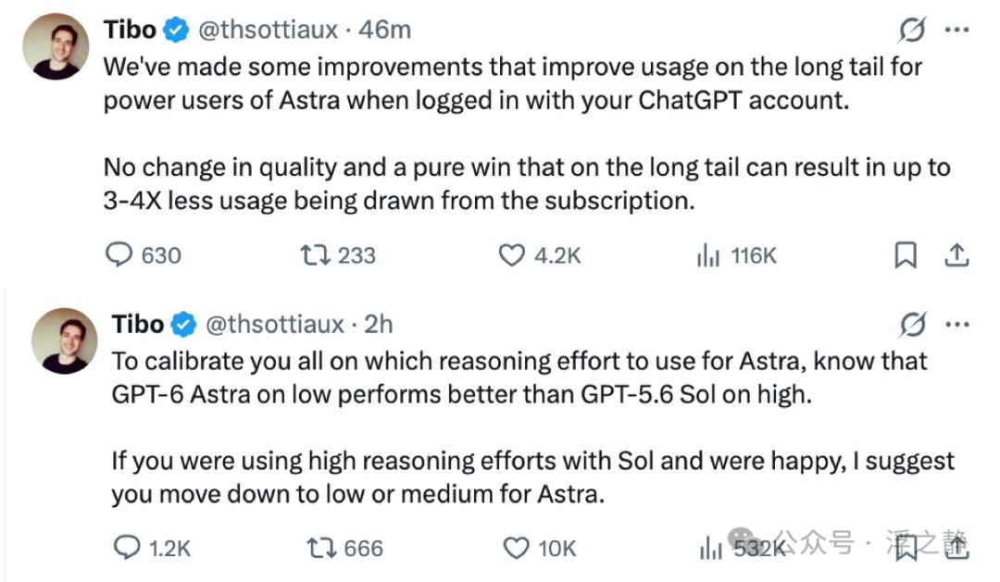

# 技术栈推荐：围绕 AI 反馈闭环做选型

我最近的新项目采用了这样一套技术栈：pnpm v12 + TypeScript v7 + Vite v8 + Oxlint + Oxfmt + React + Astryx（基于 StyleX）+ …

同时依赖多个 Agent Skills，将架构治理、工程验证和 UI/UX 审查纳入开发流程。整体选型围绕一个核心目标：缩短 AI agent 从修改代码到获得有效反馈的周期，并通过明确的工程约束提高结果的可验证性。

推荐阅读：编程伴侣：lencx skills 更新了！、Agent 开发指南：技术太多，该怎么学？

## 原生化工具链

这套工具链的一个显著特征，是依赖管理、编译、构建、静态检查和格式化逐步转向原生实现。

pnpm v12[1]负责依赖管理、workspace 组织和脚本执行。pnpm 本身通过内容寻址存储复用依赖文件，适合多项目和 monorepo 场景；v12 进一步采用 Rust 原生实现，降低包管理器自身的启动和执行开销。

TypeScript v7[2]将编译器及相关工具移植到 Go，在保持既有语言语义和项目结构的基础上，引入原生执行和并行化能力。其主要价值在于降低类型检查成本，使类型验证能够更频繁地进入 agent 的开发循环。

Vite v8[3]将底层构建链迁移到以 Rolldown 和 Oxc 为核心的 Rust 工具体系。Rolldown 负责打包，Oxc 提供解析、转换等基础能力，从而统一开发服务和生产构建中的关键路径。

Oxlint[4]与Oxfmt[5]分别承担静态检查和代码格式化。Oxlint 用于识别可疑写法、常见错误和项目规则，补充类型系统无法覆盖的工程问题；Oxfmt 则统一 JS、TS、JSX、TSX 等文件的格式，部分其他格式由其内置的 Prettier 能力处理。

这些工具共同覆盖依赖安装、开发服务、生产构建、类型检查、lint 和格式化，为高频执行验证命令的 agent 工作流提供更低延迟的基础设施。实际性能仍会受到网络、缓存、依赖脚本和项目规模影响，但原生化工具链能够降低固定执行成本，改善多轮任务中的累计等待时间。

## 验证反馈

AI agent 参与开发后，一项任务通常需要经历多轮代码修改、类型检查、静态分析、测试和构建。单次等待时间并不显著，但在持续迭代中会直接影响任务吞吐和反馈密度。

这套工具链形成的基本循环是：修改 → 类型检查 → 静态检查 → 格式化 → 测试与构建 → 根据结果继续修正

TypeScript 将数据结构、函数接口和组件参数编码为类型契约；Oxlint 提供类型检查之外的规则诊断；Oxfmt 消除无关格式差异；Vite 负责运行时预览和最终构建。

对 agent 而言，这些工具输出的不只是“通过”或“失败”，还包括具体文件、代码位置、规则和错误原因。反馈越快、越结构化，越容易被转化为下一步修改，而不是依赖模型自行推测问题所在。

## React & Astryx

界面层继续采用React[6]。组件模型便于拆分职责，并通过 props、状态和上下文明确数据归属，为 agent 提供相对稳定的修改边界。

组件系统选择Astryx[7]。它是 Meta 基于 React 和 StyleX 构建并开源的设计系统，整合了组件、主题、模板和命令行工具，并承接了 8 年内部设计系统的长期实践。

StyleX[8]负责底层样式能力，提供类型安全、样式组合和主题机制。Astryx 内部基于 StyleX 实现，同时允许项目直接导入预编译 CSS，因此使用组件库时无须额外配置 StyleX 构建流程。

Astryx 的CLI[9]支持从命令行查询组件文档、示例、模板和主题信息，并提供机器可读的 JSON 输出。相比仅面向人工浏览的文档体系，这种接口更适合 agent 在实现页面前检索组件能力、参数和使用方式，减少对组件 API 的猜测。

## Agent Skills

工具链解决执行效率和反馈问题，Agent Skills 则用于承载长期有效的工程方法、约束和审查标准。

lencx/skills[10]主要负责架构治理和执行约束。其中，keel关注模块职责、接口契约、依赖关系、状态边界和迁移策略，用于判断系统在持续演进中是否仍然保持清晰结构；coding-protocol是一套常驻、按风险分级的编码执行协议。它不为所有任务套用同一流程，而是根据复杂度、影响范围和不确定性，动态调整分析深度、执行方式、验证要求与复核强度。

Matt Pocock 的 Skills[11]更侧重具体开发流程，包括需求澄清、测试驱动开发、问题诊断、模块设计和代码审查。其重点是将任务落实为可执行步骤，例如先建立复现、补充测试，再基于证据推进实现和修复。

两组 Skills 在模块设计和开发规范上存在一定交集，但关注层级不同：lencx/skills更偏向系统结构、长期演进和执行治理，mattpocock/skills更偏向单次任务中的开发、测试和诊断流程。组合使用后，可以同时约束“系统应如何演进”和“当前任务应如何完成”。

Impeccable[12]负责 UI/UX 质量控制，覆盖界面审查、布局、排版、响应式适配、交互反馈和设计一致性。Astryx 提供组件、主题和设计基础，Impeccable 则用于判断这些组件在具体产品中的组织方式是否合理，包括信息层级、视觉节奏、交互完整性和跨页面一致性。

## 整体定位

这套组合可以概括为三个层次：原生工具链降低反馈延迟，类型与检查系统提供可执行证据，Agent Skills 约束开发过程和最终质量。

其重点并不在于单个工具的性能指标，而在于能否形成稳定、低成本、可重复的开发闭环：agent 每次完成有意义的修改后，都可以快速运行验证；验证失败时，能够获得足够具体的诊断；验证通过后，仍有架构和界面层面的规则检查其长期影响。

## 其他

关于 GPT-6 Astra 两个使用注意点（GPT-6 Astra 不会让外行秒变专家）：

### References

[1]pnpm v12:https://github.com/pnpm/pnpm/releases/tag/v12.0.0[2]TypeScript v7:https://devblogs.microsoft.com/typescript/announcing-typescript-7-0[3]Vite v8:https://vite.dev/blog/announcing-vite8[4]Oxlint:https://oxc.rs/docs/guide/usage/linter[5]Oxfmt:https://oxc.rs/docs/guide/usage/formatter/language-support[6]React:https://react.dev[7]Astryx:https://astryx.atmeta.com/blog/how-astryx-works[8]StyleX:https://stylexjs.com[9]CLI:https://astryx.atmeta.com/docs/cli[10]lencx/skills:https://github.com/lencx/skills[11]Matt Pocock 的 Skills:https://github.com/mattpocock/skills[12]Impeccable:https://github.com/pbakaus/impeccable

pnpm v12:https://github.com/pnpm/pnpm/releases/tag/v12.0.0

TypeScript v7:https://devblogs.microsoft.com/typescript/announcing-typescript-7-0

Vite v8:https://vite.dev/blog/announcing-vite8

Oxlint:https://oxc.rs/docs/guide/usage/linter

Oxfmt:https://oxc.rs/docs/guide/usage/formatter/language-support

React:https://react.dev

Astryx:https://astryx.atmeta.com/blog/how-astryx-works

StyleX:https://stylexjs.com

CLI:https://astryx.atmeta.com/docs/cli

lencx/skills:https://github.com/lencx/skills

Matt Pocock 的 Skills:https://github.com/mattpocock/skills

Impeccable:https://github.com/pbakaus/impeccable
