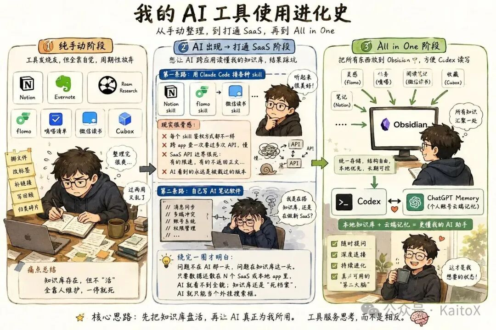
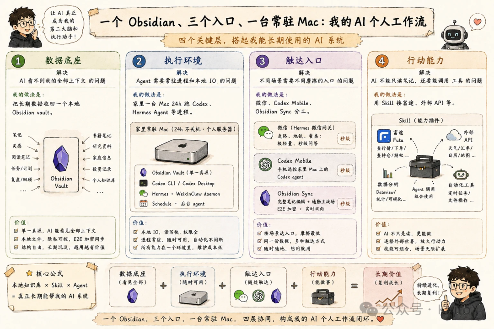
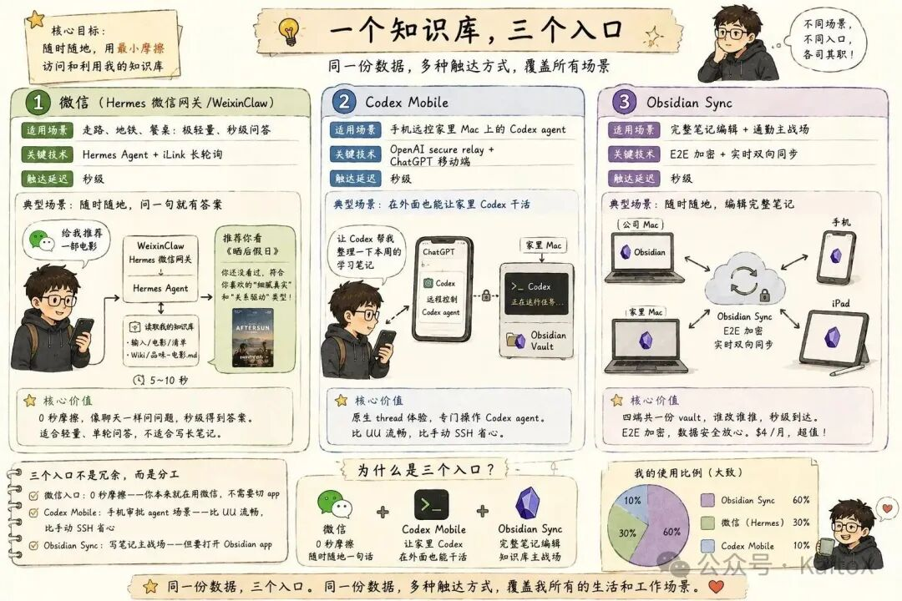
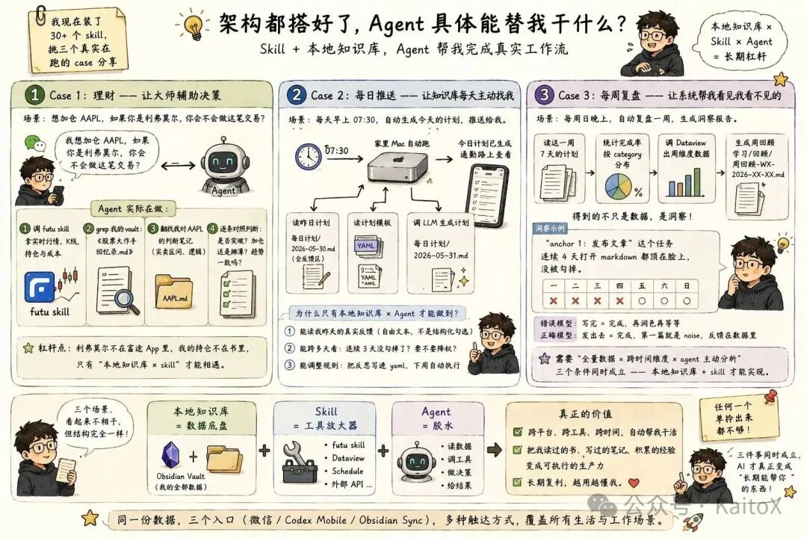

# 让AI站在我全部数据上

> 把所有东西塞进一个 Obsidian 知识库，家里一台 Mac 24h 跑着，三个入口随时触达。

这篇文章想讲的不是"我用了哪些工具"，而是一个更具体的问题：**怎么让 AI 长期站在我的全部数据上，并且在我需要的时候低摩擦地出现？**

以前用 AI 最大的挫败感不是模型不够聪明，而是它每次都像第一次认识我。它不知道我读过什么书，不知道我上周计划为什么没完成，不知道我之前为什么买某只股票，也不知道我过去几个月反复卡在什么地方。

所以真正想解决的是三个问题：

- **数据散**：笔记、灵感、任务、阅读记录分散在 N 个 App，AI 看不到全貌
- **系统不活**：知识库靠手动整理，整理一次爽两天，过两周又乱
- **入口太重**：只有坐到电脑前才想得起来用 AI

---

<!-- more -->

## 原先卡在哪里

### AI 出现之前：纯手工整理，周期性放弃

笔记折腾过 Notion、Evernote、Roam Research；灵感在 flomo，任务在嘀嗒，阅读笔记在微信读书，收藏在 Cubox。每个工具单独都挺好用，但合起来就有躲不掉的活：整理。

每隔一两周花两三小时挪文件、改标签、补链接、写月度回顾。整完那一刻很有成就感，过两周又乱。

### AI 出现之后：试了两条路都没成

**第一条：接 SaaS Skill**

Notion Skill、flomo Skill、微信读书 Skill……一个个装上，实际用下来全是坑：每个 Skill 鉴权方式都不一样；跨 App 查一次要过多次 API 来回，慢；SaaS 的 API 边界很死，AI 拿到的永远是被 API 裁过的版本。维护 Skill 的成本比"先翻笔记复制粘贴"还高。

**第二条：自己写 AI 笔记软件**

消息同步、多端冲突、账号系统、导入导出、移动端体验……搞着搞着就破防了：到底是在搭知识库，还是在做一个新 SaaS？

绕完一圈才想明白：**问题不在 AI 那一头，问题在知识库这一头。**只要数据还散在 N 个 SaaS 后台里，AI 接哪个都看不到全貌；只要知识库还是"死档案"，AI 就只能当个外挂搜索框。

## 解法：四层架构

| 层级 | 解决的问题 | 我的做法 |
|------|-----------|----------|
| 数据底座 | AI 看不到我的全部上下文 | 把长期数据收回一个本地 Obsidian vault |
| 执行环境 | Agent 需要常驻进程和本地 IO | 家里一台 Mac 24h 跑 Codex、Hermes Agent |
| 触达入口 | 不同场景需要不同摩擦的入口 | 微信、Codex Mobile、Obsidian Sync 分工 |
| 行动能力 | AI 不能只读笔记，还要能调用工具 | 用 Skill 接富途、外部 API 等 |

**核心链路**：让 AI 读得到我，跑得起来，找得到我，也能替我做事。

## 第一层：本地 Obsidian vault

把所有东西分成四类塞进 Obsidian：

- **知识沉淀**：工作 / 学习笔记、Wiki 实体
- **流水记录**：每日计划 + 反馈、灵感、即刻归档、日记
- **创作产出**：文章草稿、视频脚本
- **生活资料**：读过的书 / 电影、去过的家庭资料

.md 文件躺在本地磁盘上，agent 可以直接 grep、直接读、直接改。AI 终于不是隔着 SaaS API 看被裁剪过的世界，而是站在真实资料库上工作。

> Obsidian 在这套系统里的角色，不是漂亮的笔记软件，而是 **AI 的本地数据底座**。

## 第二层：一台常驻 Mac

Agent 不是聊天框，它需要常驻进程：定时任务、Hermes 微信网关长轮询、偶尔跑的长任务。

更重要的是：家里 Mac 在局域网里，能直接挂载 NAS。NAS 上存着照片库、视频原片、扫描的家庭文件、电子书、影视收藏。Agent 跑在家里 Mac 上，等于站在 vault + NAS 这份数据之上。

云服务器解决不了这件事——NAS 不可能开公网，"all in one 本地"的整个前提就违反了。

**设备分工：**

| 设备 | 最适合什么 |
|------|-----------|
| 手机 | 秒级问答，红绿灯之间能完成的交互 |
| iPad | 长时段沉浸式消费，通勤路上读笔记 |
| 公司 Mac | 正经写代码、写文章 |
| 家里 Mac | 跑 agent、当服务器 |

## 第三层：三个入口

### 入口 1：微信（秒级问答）

用 Hermes Agent + iLink 长轮询，消息来了就回包，不需要公网 endpoint。跑在家里 Mac 上，像 daemon 一样常驻。

实际体验：周末晚上发条微信"给我推荐一部电影"，agent 翻 vault 里的看过的清单和品味笔记，推一部我没看过且符合口味的，附上一句为什么——整个过程 5-10 秒。

关键不在"AI 能推电影"，关键在于它推的是"我没看过 + 符合我口味"的，因为它读得到我的清单和品味笔记。

### 入口 2：Codex Mobile（手机远控 agent）

通过 OpenAI secure relay 直连家里 Mac 上跑的 Codex，手机扫码授权一次后就能跨设备操作 thread，不需要 SSH。

### 入口 3：Obsidian Sync（笔记主战场）

把 .md 文件实时同步到所有设备，E2E 加密。$4/月是账单里性价比最高的一项。

**三个入口不是冗余，是分工：**

| 入口 | 摩擦 |
|------|------|
| 微信入口 | 0 秒摩擦，你本来就在用微信 |
| Codex Mobile | 手机审批 agent，比 UU 流畅 |
| Obsidian Sync | 写笔记主战场，但要打开 App |

每天使用比例大概是 **Sync 60% + 微信 30% + Codex Mobile 10%**。

## 第四层：Skill（行动能力）

### Case 1：理财，让读过的书参与真实决策

futu skill 是富途 OpenAPI 的封装，能查实时行情、K 线、持仓。杠杆来自 **futu skill × 我的 vault**——vault 里有《股票大作手回忆录》的手抄准则，有过去几个月对每个标的的判断笔记。

在微信问："我想加仓 AAPL，如果你是利弗莫尔，你会不会做这笔交易？"

Agent 实际在做：调 futu skill 拿实时报价和持仓 → grep vault 里大作手回忆录的判断框架 → 翻出我之前对 AAPL 的判断笔记 → 逐条对照：现在是关键点位突破吗？趋势方向一致吗？

这不是 AI 看盘，这是让读过的书反过来参与真实决策。利弗莫尔不在富途 App 里，我的持仓不在《股票大作手回忆录》里——这两件事只能在"本地知识库 × Skill"的组合里相遇。

### Case 2：每日推送，让知识库每天主动找我

早上 07:30 自动跑：读昨日每日计划（含手写反馈区）→ 读计划模板 → LLM 生成今日计划。通勤路上掏出手机，今天该干啥已经在那里了。

只有"本地知识库 × agent"才能做到：能读连续多天的真实反馈（"今天累、砍英语"），能跨天看"这件事是不是连续 3 天没勾掉了"，能调整规则下周自动执行。

### Case 3：每周复盘，让系统看见看不见的

每周日晚上 agent 自动跑：读一周 7 天的每日计划 → 统计完成率 → 调 Dataview 出周维度数据 → 生成周回顾。

Agent 给我指出过一件事："anchor 1：发布文章"这个任务连续 4 天打开都顶在脸上但一直没勾掉。我自己当时没意识到，直到 agent 把数据拉出来对比，才看清：

> **错误模型**：写完 = 完成，再润色再等等
> **正确模型**：发出去 = 完成，第一篇就是 noise，反馈在数据里

这种洞察光靠人看看不到，需要三个条件同时成立：**全量数据 × 跨时间维度 × agent 主动分析**。本地知识库 + Skill 是唯一同时满足这三件事的组合。

### 三个 case 共同说明的一件事

理财 / 督学 / 复盘，看起来完全不相干，但都有同一个结构：

> **本地知识库 = 数据底盘 | Skill = 工具放大器 | Agent = 把两者拼起来的胶水**

任何一个单拎出来都不够。只有三件事同时成立，AI 才真正变成"长期能帮你"的东西。

## 收尾

骨架就一句话：**一份本地知识库 + 一台常驻 Mac + 三个入口 + N 个 Skill**。

用了一个月。它不复杂，不贵，搭起来 1-2 天，跑起来不需要特别维护。

真正的改变是：第一次相信"AI 能持续帮我"这件事。

以前装一个新 AI 工具，兴奋三天，第四天就忘。因为它和我前面的数据、前面的判断、前面的生活是断的。每次都从零开始认识我。

现在不一样。无论我问 AI 什么，它都站在我全部的数据上：我的笔记、我的反馈、我的历史决策、我连续几个月的轨迹。

> **真正的杠杆，是让 AI 够得着你的全部数据。**

你今天就能开始的一件事：把你散在 N 个工具里的东西，收回一个本地知识库。你的数据现在在 AI 够得着的地方吗？

