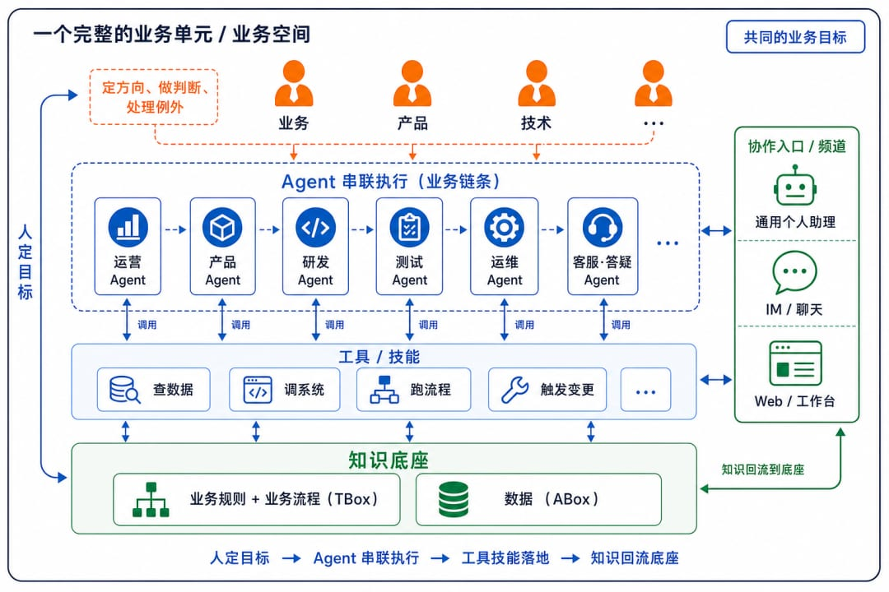
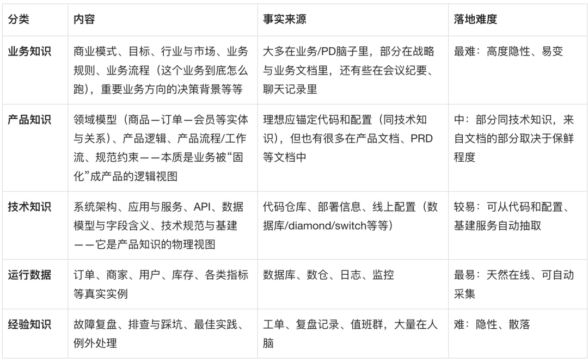

# 重构协同：关于AI Native团队的思考

> 当前 AI 提效陷入"单点优化、全局低效"困境的根源在于**协同缺失**。真正的破局，不是把某个环节再调快一点，而是用"知识底座 + Agent"把协同这件事本身重做一遍。

## 消费侧与生产侧

一切生产活动最终都是为了满足人的需求。可以把所有事情切成两类：

- **消费侧**：直接面向人、满足人的需求。演进本质是交互方式的一次次升级，终端永远是人。
- **生产侧**：在背后组织和串联生产。完全是当下技术水平的产物——技术每升级一轮，这一侧就被重写一次。

过去，一条业务流程靠**人**来串联——需求评审会上人把上下文从产品传给研发，工单系统里人把上一个环节的结论手动录进下一个。所谓"流程"，本质是一连串由人来完成的传递、判断和衔接。

AI 时代最大的变化：**串联者从人，换成了 Agent**。

- **AI 辅助**：流程骨架不动，串联者还是人，只是在某个环节塞一个 AI 功能
- **AI Native**：把串联者整个换掉，由 Agent 承担传递、判断和衔接，围绕这个新前提重建流程

那些把"人是串联者"当作设计前提的软件——表单、报表、审批流——它们要服务的那个"人"的角色，已经不在原来的位置上了。

## AI Native 的协同形态

以一个完整的业务单元为边界，有三层结构：

**底层：统一的知识底座**。沉淀该业务所有的业务规则、业务流程、领域知识和规范约束——"这个业务究竟是怎么运转的"这件事本身。

**中间层：各司其职的 Agent**。有做业务运营的、做研发 coding 的、做测试的、做运维的、做客服的……它们都从知识底座取知识，各自承接并串联起自己环节的工作。Agent 还需要依赖工具和技能才能真正干活——知识底座决定它"知道什么、该怎么做"，工具和技能决定它"能做到什么"。

为什么要拆成不同的 Agent，而不是一个大而全的？因为不同 Agent 需要感知的知识范围、能提供的服务范围、被授予的权限和安全要求都不一样。拆开之后，每个 Agent 的上下文相互隔离，评测和优化也能各自独立迭代。

**上层：人**（业务、产品、技术）。他们的位置变了——不再是流程里逐个传递信息的"接力棒选手"，而是和 Agent 一起围绕同一个业务目标协同：定方向、做判断、处理 Agent 搞不定的例外，并把新产生的知识沉淀回底座。

> 人负责目标和判断，Agent 承担串联和执行。

## 软件，是被固化的知识

一个完整的业务闭环包含两类东西：
- **TBox（类型层面）**：业务规则（陈述性知识）和业务流程（程序性知识）
- **ABox（事实层面）**：运转中产生的具体数据（订单、商家、用户等）

软件产品是什么？它不是必需品。业务完全可以由 Agent 直接在知识底座上运转起来。软件之所以需要，是因为 Agent 的动态运转在某些地方还不够用——要交互体验、确定性、性能、成本、安全、合规审计等。于是我们把其中一部分业务规则和流程"固化"下来，做成产品规则和产品流程。

**软件是被固化的知识**。而"把知识固化成软件"这件事本身，又是一条业务流程——研发流程——它同样可以由 Code Agent 在知识底座上运转完成。

## 两件事：知识底座是瓶颈，协同工具是基建

**协同工具**：长期看不会是瓶颈，但目前基础团队并没有完整的方案。关键概念雏形包括：业务空间（划定业务闭环边界）、参与者（人类成员和各类 Agent）、任务、频道（人与 Agent 协同的入口）、产物、知识底座。

**知识底座**：真正长期卡住全局的瓶颈。它不通用、不可复制，每一块业务都得自己长出一套来。

### 存量业务的三道坎

1. **构建过程和方法**：存量业务系统和架构是历史一块块长出来的，需抛开历史包袱重新把"这个业务到底怎么运转"讲清楚
2. **大量知识不在系统里，在人脑子里**：关键规则、来龙去脉、例外情况，大多隐性地散在个人脑中
3. **底座必须能"自己活下去"**：业务天天在变，知识也跟着变，不能靠人肉更新维护

## 最后：一道绕不开的选择题

过去因为串联者是人，这个难题被人"扛"过去了——知识不全、流程不清、文档过期，靠人在中间补位、对接、救火，问题被一直掩盖着。

到了 AI 时代，串联者从人换成 Agent，这块遮羞布被揭开了。Agent 没法像人那样靠经验和默契去补位，它只能在知识底座上运转——**底座有多清楚，它就能跑多远**。

> 如果一家大公司迈不过这道坎，迟早会有没有历史包袱的创业公司，用"知识底座 + Agent"跑出数倍的效能，把它甩在身后。