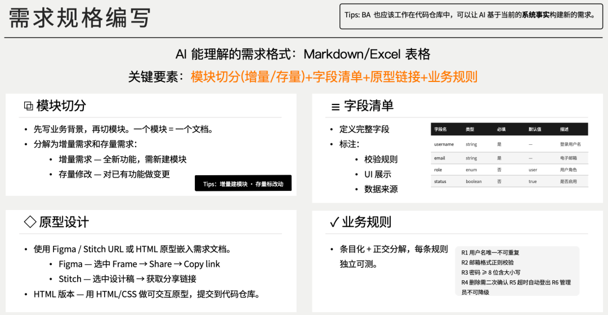

# AI 编程：大多数团队 AI 编程都卡在结构化需求上

> **摘要**：团队 AI 编程的瓶颈不在 AI 能力，而在于需求不够结构化。核心要点：①需求颗粒度要大（AI 处理大块任务远超人类，给 AI 的需求最好是一周到一个月的工作量）②结构化四要素：字段清单、数据来源、格式化方式、表格组织 ③原型少不了（Figma 或 HTML 原型让 AI 准确定位，截图多模态验证）④用 AI 做需求反讲验证（grill-me 类 skill）。本质：AI 需要清晰的输入，模糊需求→模糊结果，结构化需求→精准实现。

<!-- more -->

## 01 需求颗粒度的问题

最常见的问题：需求的颗粒度太小了。

以前给人类写需求，按人天估算，一个 Story 两三天，分成几个任务，每个任务半天一天。对人类来说刚好。

但 AI 不一样。你让 AI 写一个用户登录，它可能半小时就写完了。你给 AI 一个完整的功能模块，它一晚上能给你搞出来。

AI 处理大块任务的能力远超人类，但我们给 AI 的需求却还是按人类的节奏在拆。结果就是 AI 刚热完身，任务就结束了。

**给 AI 写需求，颗粒度要大。一个需求最好是一周甚至一个月的工作量，让 AI 有足够的空间发挥，至少一次能跑一晚上的量。**

## 02 结构化是关键

大颗粒度的需求不是说写长一点就行，关键是要结构化。

见过很多团队给 AI 写需求，洋洋洒洒写了几千字，看起来很详细，但 AI 还是理解不了。

结构化需求至少包含这几个部分：

**字段清单**：涉及数据操作时，不光说"用户信息"，要把字段名、数据类型、长度、是否必填都列出来

**数据来源**：每个字段从哪来？用户输入、系统计算、还是从别的接口拿的？

**格式化方式**：日期显示"2026-06-25"还是"2026年6月25日"？金额显示"1000"还是"1,000"？

**用表格组织**：表格比文字清晰，AI 看表格能准确定位信息，看文字容易遗漏。用 Markdown 表格或 Excel 都可以。

## 03 原型不能少

除了字段清单，原型也很关键。

以前 BA 写完需求，开发得自己看原型理解界面。现在 AI 也一样，AI 也需要看原型。

光说"一个用户列表页面"，AI 不知道列表长什么样、有哪些列、排序规则是什么、操作按钮在哪。但给一个 Figma 链接或 HTML 原型，AI 就能准确理解。

原型能减少沟通成本。有些东西用文字描述很费劲，但一张图就清楚了。AI 读图的效率比读文字高。

**最好 BA 能自己输出 HTML 原型**，特别是共享同一套 UI 框架、样式的时候。

同时需要使用多模态的模型，通过截图的方式来验证实现的效果。

## 04 用 AI 做需求反讲验证

用 AI 做需求反讲：让 AI 根据需求文档生成业务事实文档或实施方案，拿这个跟原始需求对照，看看有没有遗漏和偏差。

这个方法特别管用。AI 理解需求时可能有偏差，有些东西你以为说清楚了，AI 理解的意思可能完全不一样。通过反讲，能在开发前发现问题，而不是等 AI 写完了才发现不对。

AI 反讲时会用代码的视角看需求，会问一些你可能没想到的问题：这个字段在哪个接口用？空值怎么处理？并发的时候怎么表现？这些问题能帮你完善需求。

类似 `grill-me` 这样的 skill。

## 05 总结

核心就一点：**把需求写清楚，但这是容易被忽略的地方**。

AI 很强，但 AI 需要清晰的输入。你给 AI 一个模糊的需求，AI 只能给你一个模糊的结果。你给 AI 一个结构化的需求，AI 才能给你一个精准的实现。

软件行业总是喜欢寻找看起来像银弹的东西，却忽略了一些基本功，需求规格就是其中之一。
