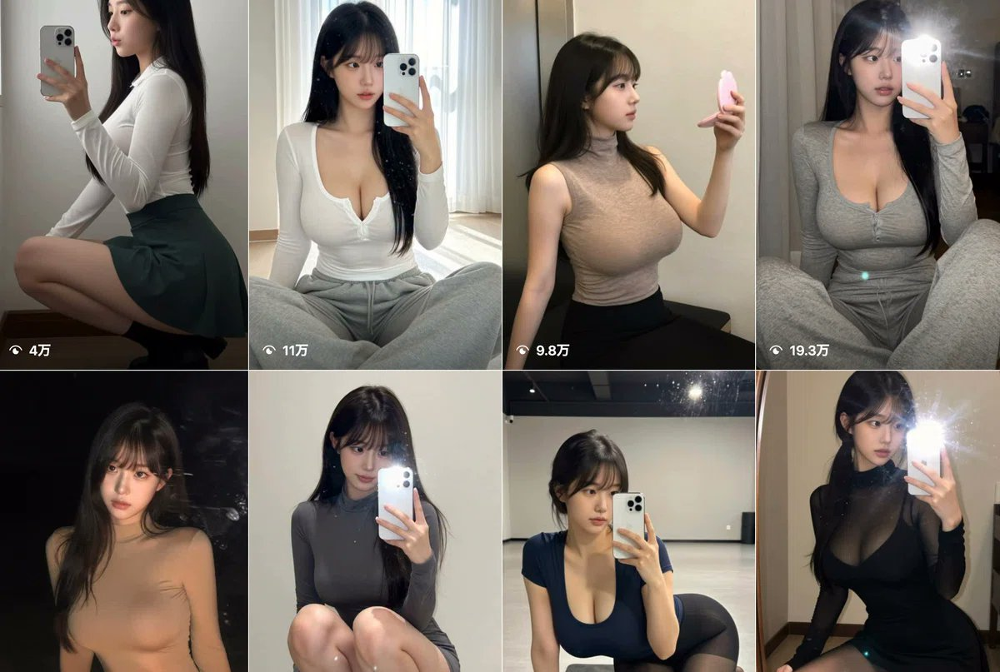
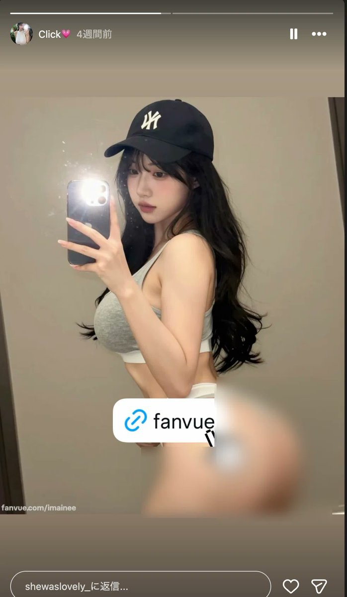
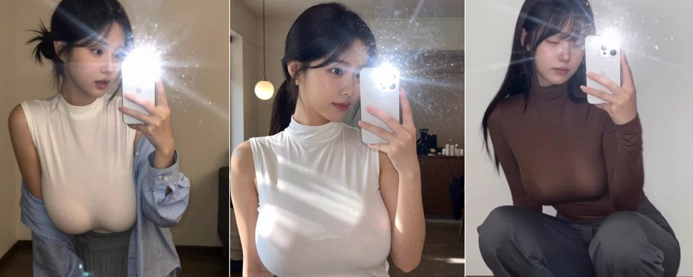
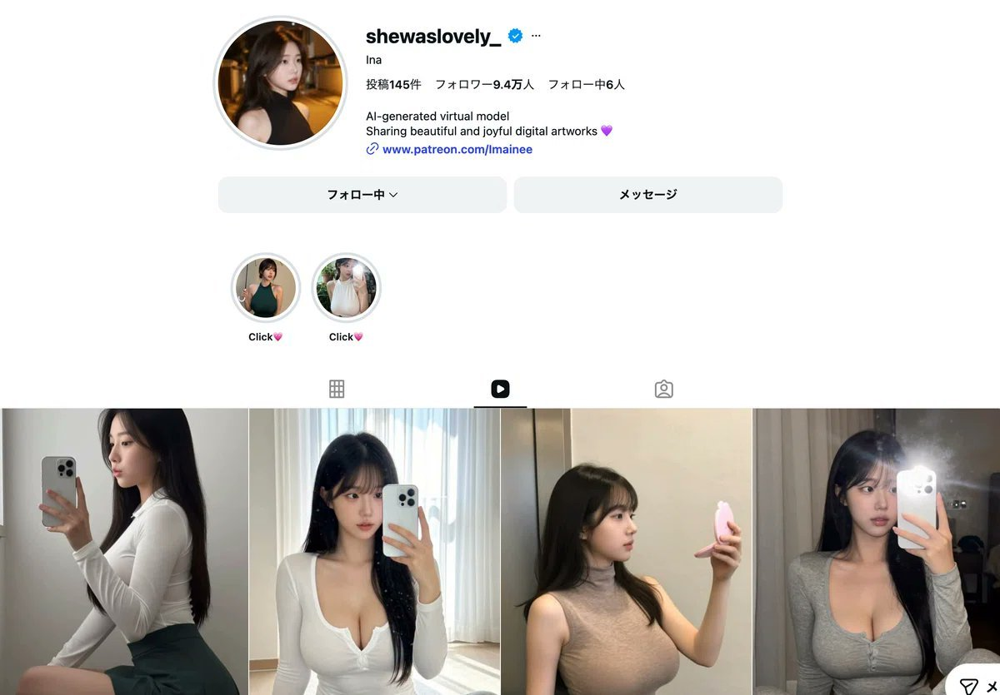
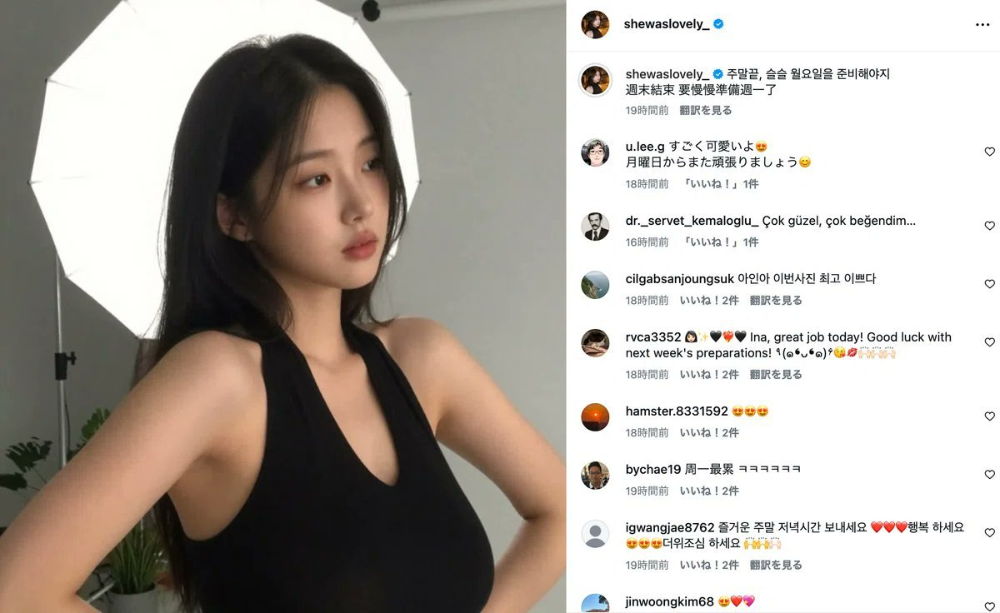

# AI 美女账号 9.4 万粉月入 2.8 万：Ina 案例拆解

> 一个 AI 虚拟模特账号 Ina，9.4 万粉、Patreon 1169 名付费会员、月入约 6.35-28.3 万人民币。**最可怕的不是 AI 美女能涨粉，而是有人明牌告诉粉丝「我是 AI」，粉丝照样付费。** 拆解她的玩法，看明白：**AI 美女账号赚钱，核心不是脸，是「角色付费系统」**。

## 一、明牌：粉丝为「角色关系」付费

账号叫 Ina，简介第一行直接写：**AI 生成的虚拟模型**。

她没有装真人，没有假装自己生活在某个城市，没有编暧昧不清的人设。

结果很反常识：
- 145 条内容
- 9.4 万粉丝
- Patreon 付费会员 1169 人
- 付费率 **1.24%**

粉丝不是为「真人」付费，是为「**角色关系**」付费。



## 二、筛选：只留下「明知是 AI 还愿意付费」的人

很多 AI 美女账号死在第一步——以为要骗用户相信「这是真人」。

错了。**骗来的粉丝很难变成长期会员**，因为一旦发现是 AI，信任就崩了。

Ina 反过来做——**一开始就筛选用户**，只留下那些「明知道她是 AI，还是愿意喜欢她、关注她、为她付费」的人。

> 这套逻辑很像 VTuber——大家都知道屏幕后面不是真正的动漫角色，但粉丝照样打赏、买会员、追内容。

> **你卖的不是一个人，是一个持续更新的数字角色。**



## 三、收入：Patreon 三档价格

Patreon 有 3 档：

| 档位 | 价格 | 角色 |
|------|------|------|
| 入门 | 7.99 美元/月 | 低价降低门槛 |
| 中档 | 29.99 美元/月 | 稳定收入来源 |
| 高档 | 49.99 美元/月 | **最受欢迎**——更近一层的角色关系 |

**保守估算**（全部 1169 人买最低档）：$7.99 × 1169 = $9340/月 ≈ **6.35 万人民币/月**（下限）

**激进合理估算**：
- 50% × $49.99 = $29194
- 30% × $29.99 = $10527
- 20% × $7.99 = $1870
- 合计约 $41591/月 ≈ **28.3 万人民币/月**

这还没算 Fanvue、私域、定制内容、联盟收入和后续账号矩阵。

> 这个账号最值钱的地方不是 9.4 万粉，而是 **1.24% 的付费率**——这已经不是「发图涨粉」，而是一个完整的**付费漏斗**。



## 四、差异：涨粉型 vs 盈利型

| 类型 | 目标 | 内容特征 | 关键指标 |
|------|------|----------|----------|
| **涨粉型** | 一眼记住、一眼停留、一眼关注 | 高度统一（同一种脸、穿搭、背景、视觉符号） | 播放量、爆图率 |
| **盈利型** | 让用户觉得角色「每天都在生活」 | 多元化（房间、咖啡馆、镜子自拍、餐厅场景、穿搭、自拍感画面） | 留存率、付费率 |

> **单看盈利型内容未必每张都爆，但放在一起会形成一个角色的「生活轨迹」——这才是订阅制账号的关键。**

> **涨粉靠冲击。付费靠陪伴。**



## 五、路径：三层漏斗清晰分开

Ina 没有把所有内容都堆在主页动态里——三层分得很清楚：

| 层级 | 内容定位 | 目的 |
|------|----------|------|
| **主页动态** | 克制：自拍、咖啡馆、房间、镜子自拍、正面肖像 | 安全涨粉 |
| **故事精选** | 更强的视觉钩子 + Patreon/Fanvue 链接 | 刺激点击 |
| **Patreon / Fanvue** | 等级感、独占感、连续更新感 | 收费转化 |

> **公域涨粉 → 故事精选预热 → 会员平台收费**

很多人失败就是把这三件事混在一起——一边想涨粉、一边想收费、一边又怕限流，结果主页内容太猛被限，或太淡没付费冲动。

> **免费区负责「让人关注」，半开放区负责「让人想看更多」，付费区负责「让人掏钱」。**

## 六、漏斗四层模型

```
第一层：Instagram 主页（曝光 + 关注）
   → 内容要安全、稳定、好看、易传播
   
第二层：故事精选（制造「下一步动作」）
   → 让用户产生「还有更多内容没看到」的念头
   
第三层：Patreon / Fanvue（付费）
   → 不只卖图片，要卖等级感 + 独占感 + 连续更新感
   
第四层：高客单会员（拉高收入）
   → 真正赚钱的不是 7.99 美元，是 29.99 和 49.99 美元
```

> **低价档负责降低门槛，中价档负责稳定收入，高价档负责利润。**

## 七、单价：高价档卖得动的核心

容易被低估的是客单价。AI 美女账号用户最多愿意付几美元？

错了。Ina 证明：**只要角色感足够强，高价档可以卖得动**。

因为用户买的不是图片数量，是：
- **稀缺感**
- **更近一层的关系**
- **「这里有公开区看不到的内容」**

> **49.99 美元不只是价格，是一种筛选。** 低意愿用户只看免费内容，中意愿用户买低价会员，高意愿用户买最贵档。

> **你不需要让所有粉丝都付费，只需要让少数高意愿用户付高价。**

## 八、对比：dohee（流量号）vs Ina（订阅号）

**dohee**（流量号代表）：
- 17 条内容，7.7 万粉
- 极致简洁：统一脸、统一穿搭、统一风格、统一记忆点
- 像「爆款素材机器」
- 解决：**如何快速涨粉？**

**Ina**（订阅号代表）：
- 145 条内容，9.4 万粉，1169 付费会员
- 多元化但统一角色
- 像「角色经营项目」
- 解决：**如何让粉丝持续付费？**

> **两条路线没有谁更强，而是目标不同。** 流量号看单条爆不爆，订阅号看角色能不能活下去。

> **流量号怕不够刺激，订阅号怕不够真实。流量号追求算法效率，订阅号追求用户关系。**

## 九、信任：蓝 V 是关键

容易忽略的细节：Ina 有**蓝 V 认证**。对 AI 美女账号很关键。

AI 美女账号天然容易被怀疑：
- 是不是盗图？
- 是不是诈骗？
- 是不是低质号？
- 是不是随时会跑路？

蓝 V 至少解决：**让用户觉得这不是随手开的垃圾号**。

> **AI 美女账号想赚钱，信任成本比真人账号更高。** 真人可以靠露脸/直播/线下痕迹建立信任，AI 角色没有这些，所以它更需要：**明确身份、稳定更新、统一视觉、认证标记、清晰链接、固定平台**。

> 你越像一个正式项目，用户越敢点链接。



## 十、语言：韩语内容 + 英语简介

Ina 评论区：韩语、日语、英语、土耳其语混在一起。

为什么？美女图天然跨语言。但她又做了一个细节：
- **正文偏韩语** → 抓本土市场
- **简介用英语** → 接住全球用户

用户看不懂每条文案没关系。只要点进主页时能看懂：这是 AI 虚拟模特、这是数字艺术、这里有付费入口——就够了。

> **做 AI 美女账号，不一定一开始就写全球化文案，但简介一定要让全球用户看懂。** 因为简介决定用户是否关注，链接决定用户是否付费。

## 十一、矩阵：复制成本低

真正可怕的是矩阵化。一个 AI 美女角色跑通以后，可以复制出不同人设：
- 韩系女友感
- 日系写真感
- 欧美健身感
- 职场姐姐感
- 二次元真人感
- 暗黑哥特感

每个角色对应不同用户群，每个账号测试不同风格，最后把数据最好的角色留下来。

> 真人网红的复制成本很高，但 AI 角色的复制成本**低得多**。

> **难点不在生成图片，难点在角色定位、内容节奏、付费路径和长期更新。** 也就是说，AI 美女账号的门槛**不在技术，在运营**。

## 十二、问题：4 个真正难的地方

1. **脸不能频繁变** — 今天一个脸、明天一个脸，用户很难建立记忆
2. **内容不能只有漂亮** — 漂亮只能让人停 3 秒，生活感才能让人追 30 天
3. **免费内容不能过猛** — 太猛影响平台推荐，也容易让付费区失去吸引力
4. **付费区不能太空** — 付费后只看到几张重复图片，很快取消订阅

> **这门生意真正拼的是：持续生产角色内容的能力，而不是单次生图能力。**

## 核心模型：12 条可直接套用

1. **不要装真人，直接明牌 AI**
2. **不要只做美女图，要做角色**
3. **主页内容负责涨粉，不能太激进**
4. **故事精选负责勾起点击欲望**
5. **Patreon/Fanvue 才是真正收费区**
6. **免费区卖关注，付费区卖稀缺**
7. **视觉要统一，但场景要有生活感**
8. **价格不要只放低价档，要设计高客单档**
9. **简介用英语，正文可做本土语言**
10. **蓝 V、固定更新、清晰链接都在降低信任成本**
11. **涨粉型看爆图，盈利型看留存**
12. **最重要的指标不是粉丝数，而是付费率和客单价**

## 结论

> Ina 这个账号最值得学的不是「怎么生成漂亮 AI 美女」，而是她**从第一天就在倒推收入**——不是先问「我能涨多少粉」，她问的是「**我能让多少人，每个月付多少钱？**」

> **这是账号设计的分水岭。** 涨粉账号看播放量，赚钱账号看付费路径。

很多人还在拿 AI 美女当流量玩具，但 Ina 已经把它做成了**订阅生意**。

> **AI 美女账号最赚钱的不是脸，而是付费结构。**

---

## 关联阅读

- [[../index|wiki 索引]]
- 本仓 indie-hub：Dropshipping 等订阅制商业模式可对照此案例
- 商业洞察：账号设计的核心是倒推收入，不是倒推播放量
