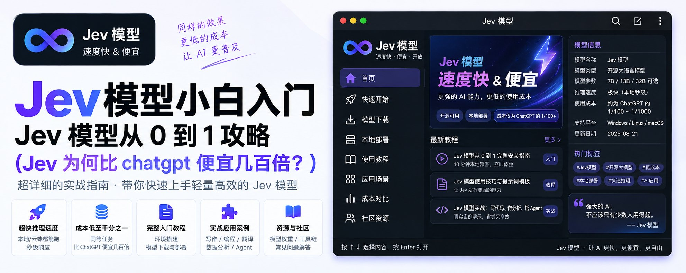
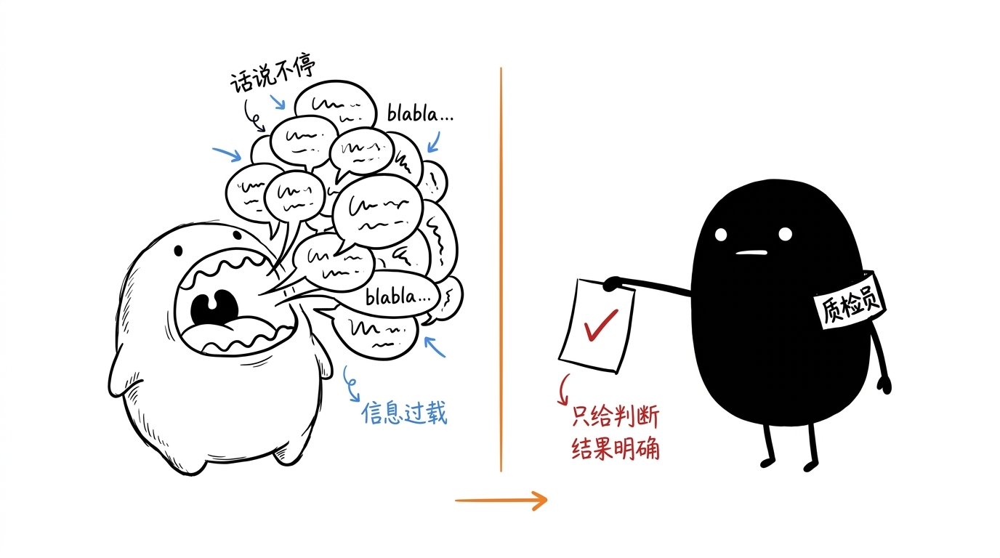
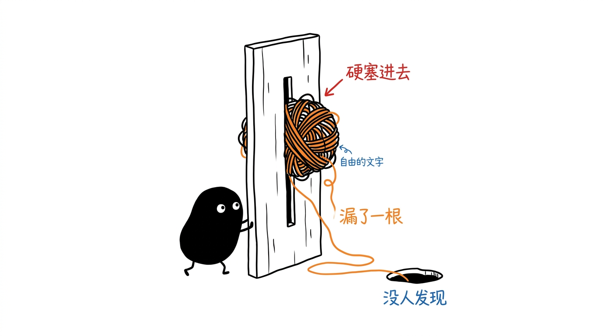
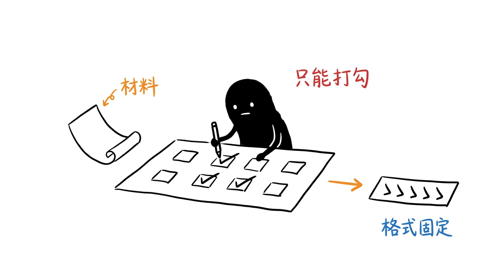
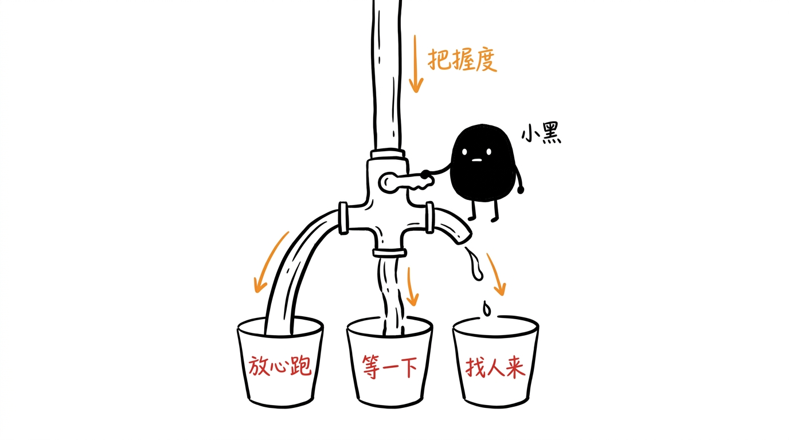
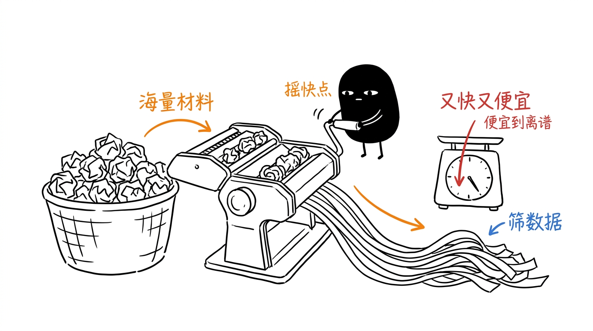

# Jev 模型从 0 到 1 小白教程

Jev模型你最近因该刷到了，是个啥？

它根本不会说话。它不能跟你聊天，不会写文档，不会写代码。

但这么个怪东西，这两天在 AI 圈杀出来了，融资 4000 万美元种子轮，一堆人排队申请试用。

所以Jev是什么？

[video](../videos/ai-xiaomu-jev-decision-model-primer/001.mp4)

# Jev 的诞生

Jev 出自一家叫 TypeSafe AI 的旧金山公司，2026 年 9 月 15 日刚发布。

它的创始人 Diogo Almeida 是前 OpenAI 研究员，也是 RLHF 这套训练方法的共同发明者之一。

正是这套方法，当年把冷冰冰的语言模型调教成了能说会道、善解人意的 ChatGPT。

换句话说，把 AI 训练得那么会聊天的人里，就有他一个。

结果现在，这个把 AI 教会说话的人，亲手做了一个偏偏不说话的 AI。

动机说出来也很朴素。

他说过去四年一直有个问题在困扰他：
模型早就在聊天这件事上超越人类了，可为什么真正的自动化还是这么少?
我们砸进去了几万亿美元，但普通人的日常生活其实没什么变化，绝大多数软件也没有变得真正智能。

# Jev是个啥

ChatGPT 这类模型，你可以理解成一个能说会道的顾问。

你问什么它答什么，还能引经据典跟你聊上半天，情商在线，什么话题都能接。

Jev 是另一个物种。

它像流水线旁边那个专注的质检员：你把一份材料递过去，他不解释、不寒暄、不发表感想，直接给你一个干脆的判断。

我们日常接触的豆包这类模型，特点是慢速的、费力的推理，比如帮你算一道复杂的数学题。

而 Jev 的特点是直觉式的判断，比如你看到一张脸瞬间知道对方有没有在生气；

简单的说："扫一眼，出结果"。

# 会聊天的 chatbot，为何反而是瓶颈

假如你开了家网店，每天几百条客服消息进来，你想让 AI 自动把它们分给不同团队：账务的归账务，物流的归物流，技术问题归技术。

听起来是个简单需求。

如果你用普通大模型来做，实际流程是这样的：

第一步，你得写一大段提示词，苦口婆心地求它"请你判断这条消息属于哪个部门，注意，你只需要回我部门的名字，不要多说别的"。

第二步，它有时候乖乖回你"账务部"，你很开心。

可有时候它又忍不住，回你一大段"这条消息看起来主要是关于账务方面的问题，我建议您可以先核实一下扣款记录，然后……"。它太想帮忙了，管不住自己那张嘴。

第三步，你的程序为了拿到"账务部"这三个字，还得写一堆额外的逻辑，从它那段啰嗦的回复里把关键词抠出来。这个过程又脏又容易出错。

第四步，也是最要命的，它偶尔会抽风。

你明明只设了三个部门，它却给你回一个第四个，或者干脆自己编一个不存在的部门名出来。这就是大家常说的"幻觉"。

问题的根源在哪? 在于文字这个东西太自由了。

自由是聊天的优点。
正因为能生成任何文字，大模型才能陪你聊天、写诗、编故事。
可一旦你要拿它做自动化，这份自由立刻变成噩梦。
你永远没法百分之百保证它下一次不会突然跑偏。
哪怕跑偏的概率只有万分之一，你也不敢把它埋进一个没人盯着的系统里让它自己跑。

如果 AI 不可靠、不可控、不可预测，就没法被信任，也就没法被大规模地搭建进真实的软件里。

# Jev 的破局之道：把"问答"变成"填表"

Jev 的思路，是把整个交互方式彻底改掉。

你不需要在跟它对话。

你给它递一张结构固定的表格,它只需要在你划好的格子里打勾。

每次调用，你给它两样东西。

第一样叫"状态"，也就是要判断的那份材料。

它可以简单到就是一句话，比如"我的卡被扣了两次款"。也可以复杂到是一整个工单记录、一段完整的客服对话、一份带着订单信息和退款政策的结构化数据。

你把该给的背景一次性摆在它面前，就像你要请一群专家做判断前，先把所有资料铺在桌上。

第二样叫"问题"，也就是你想让它判断什么。

而它返回给你的，永远是规规矩矩、格式固定的答案。
你的程序拿过来直接就能用，不需要再解析、再清洗、再猜。

更关键的是官方给的一个硬保证: 它在数学上不可能填错格式，也不可能给你一个表格之外的答案。

因为所有可能的答案，都是你提前锁死的。它只能在你给定的选项里选，越不出圈。

所以你要什么类型的答案，它就一定还你什么类型，也就有了稳定运行的基础。

# Jev 的特点

## 第一种，做单选题

一条客服消息进来："我的跑鞋尺码发错了，能换成 10 码吗?"你问它"这条该派给哪个团队?"，给出三个选项：退换货、物流、账务。

它会干脆地回你"退换货"。而且它不只给你一个答案，它还会告诉你每个选项各占多少把握。这条消息很清楚，所以它几乎百分之百确定是退换货，另外两个选项几乎是零。

如果消息变成"鞋子尺码发错了，而且我信用卡上还莫名其妙多扣了一笔钱，你们打算怎么办?"这条就没那么干净了。

它可能会告诉你：六成像是退换货，四成像是账务。Jev不会硬装自己很确定，而是老老实实把这份纠结摊给你看。

## 第二种，做评级题

一份 bug 报告进来，你给它一把三档的尺子：
0 分是只是外观上的小瑕疵，不影响使用；
1 分是功能坏了，但还有别的办法能绕过去；
2 分是彻底卡死，完全没法用。

它可能回你"1.3 分"。

1.3 分的意思是，这个 bug 主要属于"功能坏了但有替代办法"这一档，但又稍微往"彻底卡死"那头偏了一点。这比逼着它在 1 和 2 之间二选一要精确得多，也更接近真实情况。

你描述每一档的时候，要描述具体的情境，而不是描述程度。
比如你写"功能坏了但有替代办法"就很好，它能拿这句话去跟材料比对。

但你要是只写"中等严重"，它就抓瞎了，因为"中等"是个空词，它没有参照物。

同理，每一档前面的数字它其实看不见，你光写 0、1、2 让它自己体会哪个更严重，是没用的，得把每一档到底是什么情况用sop 详细写清楚。

## 第三种，做判断题

它只回答是与非，给你一个"有多大概率是'是'"的数字，从 0 到 1。

比如你问它"这位顾客是在要求退款吗?"
它回 0.99，意思是几乎可以肯定，是。

所以你能在同一次调用里同时问它：
这条该派给哪个团队（单选题），顾客有多生气（评级题），是不是在要求退款（判断题），语气是不是已经很愤怒了（判断题），提到的是不是一个还没发货的订单（判断题）。

这些问题是同时、并行、各自独立作答的。
所以你多问几个问题，它的响应时间几乎不会变长。

这带来一个很反常的编程习惯：官方鼓励你尽可能多问。
把你的程序在这条消息上可能用到的所有判断，全都一次性问完，哪怕有些答案这次用不上也没关系，反正不怎么额外花钱、也不额外费时间。

这跟用普通大模型时那种"能少问一句是一句、省 token"的心态，是完全相反的。

## Jev会自我判断

普通大模型有个改不掉的毛病：不管它懂不懂，都答得特别自信，比如豆包。

这个毛病用在自动化上就要命了。

举个例子：
假如有个 AI 能把某件事做对 95%，听起还行对吧? 但如果你不知道错的那 5% 是因为什么，那你根本没法把这件事交给它去自动干。

Jev 给每个答案都自带一个"把握度"，官方叫 confidence，你可以根据这个值来判断模型到底懂还是不懂。

有了这个把握度，你就能设计出非常像人的处理逻辑，通常分三档：

把握度高的，直接自动处理，不用人管，放心让它跑。

把握一般的，谨慎一点，可以先让人确认一下，或者再去补点信息回来重新判断。

把握很低的，千万别硬来，转人工，或者请一个更贵更强的推理模型来接手。它这是在明确告诉你，这题超出我能力范围了，别为难我。

这套"该确定的时候才动手，拿不准就老实喊人"的机制，是能真正信任一个自动化系统的前提。

一个会说"我不知道"的 AI，比一个永远自信满满的 AI，靠谱得多。

## Jev 足够便宜

Jev 比同级别的大模型快大约 200 倍，便宜大约 400 倍。

单次响应只要 70 到 500 毫秒，比你眨一次眼还快。

为什么能做到这么离谱?一句话解释：因为Jev 不需要讲话。

这个定价策略打开了一大片以前根本不敢想的用法。

你可以拿它把一个海量的数据库挨条筛一遍，给每一条打上标签，这在过去用大模型做，成本会高到没人敢碰。

你也可以让它嵌进一个界面里做实时反应，因为它够快，用户根本感觉不到延迟。

# 你该怎么使用 Jev

## 定义问题

不要问大而空的问题，要把它拆成一堆又小又具体的小问题，再用你的程序把这些小答案组合起来。

举个例子。

你想让它判断一封邮件是不是垃圾邮件。最偷懒的做法是直接问它："这封邮件是垃圾邮件吗?"

这就是一个又大又含糊的问题。

它背后其实藏着好多个判断，全被你压成了一个模糊的答案，你既看不清它凭什么这么判，也没法调整。

你要做的是把"是不是垃圾邮件"这个大判断，拆成好几个又小又清楚的小判断，分别问它：

这封邮件是不是在索要密码之类的登录凭证?
是不是声称你中了个你根本没参与的大奖?
是不是在制造"赶紧行动否则来不及"的紧迫感?
发件人自称的机构，跟它的邮箱域名对不对得上?
邮件里那个链接的落地网址，跟它显示的文字是不是一回事?

每一个小问题都极其具体，具体到几乎没有含糊的空间。然后你在自己的程序里，把这几个小答案按重要性加权组合，算出一个最终的垃圾邮件风险分。

Jev 想做的，就是给你一块新的、带点常识判断能力的积木，而不是给你一个不受控的黑箱。

# 定义场景

它能落地的场景其实特别接地气，很多都是过去只能靠人肉硬审的苦活累活。

客服领域是最典型的。

工单自动分流，识别顾客是不是在要退款，判断哪个顾客快气炸了需要优先安抚，从通话记录里提取出顾客的诉求和需要跟进的事项。

这些过去都得人一条条看。

内容审核是另一大块。
自动挑出垃圾广告、辱骂、诈骗、泄露隐私的内容，还能按严重程度分级,轻的警告一下，重的直接封掉。这活儿人做起来又累又伤心态，交给它再合适不过。

招聘和找客户也用得上。
按你定的硬标准给简历打分，判断一个候选人的经验跟岗位到底搭不搭，或者判断一个潜在客户值不值得销售去跟进。

还有一个很妙的用法，是给别的 AI 当质检员。
你可以用 Jev 去检查另一个大模型的输出：它有没有跑偏，有没有被人用话术越狱骗出不该说的话，它引用的信息是不是编的，它调用工具的参数对不对。

因为 Jev 又快又便宜，用它来把关，成本只是那个大模型本身的零头。相当于花小钱给贵重的 AI 加了一道质检。

最后是大数据清洗。
在海量的文档、评论、聊天记录里飞快地打标签、做分类、找出你真正需要的那一小部分。这类活儿的规模，往往大到只有 Jev 这种成本才玩得起。

# 写在最后

如果看完了你还是没懂，记住这句话就行了：

Jev 价格便宜，速度快，不会讲化但能帮你做判断。

智能的成本每往下降一个数量级，用它的场景就会成倍地暴涨出来，也是属于你的机会。

黄小木｜T11级工程师｜本文为 opus5.0 创作，若有侵权请指出｜持续分享 AI 信息、副业赚钱、程序员转型OPC心得｜X：[@ai_xiaomu](https://x.com/@ai_xiaomu)

## Thread

### 1
https://x.com/ai_xiaomu/status/2101135680168771979

客服 &amp; 内容审核 &amp; 招聘等 agent 都会因为 jev 模型迎来重构，这是新的机会。 https://t.co/RTpaOZh9Ay
