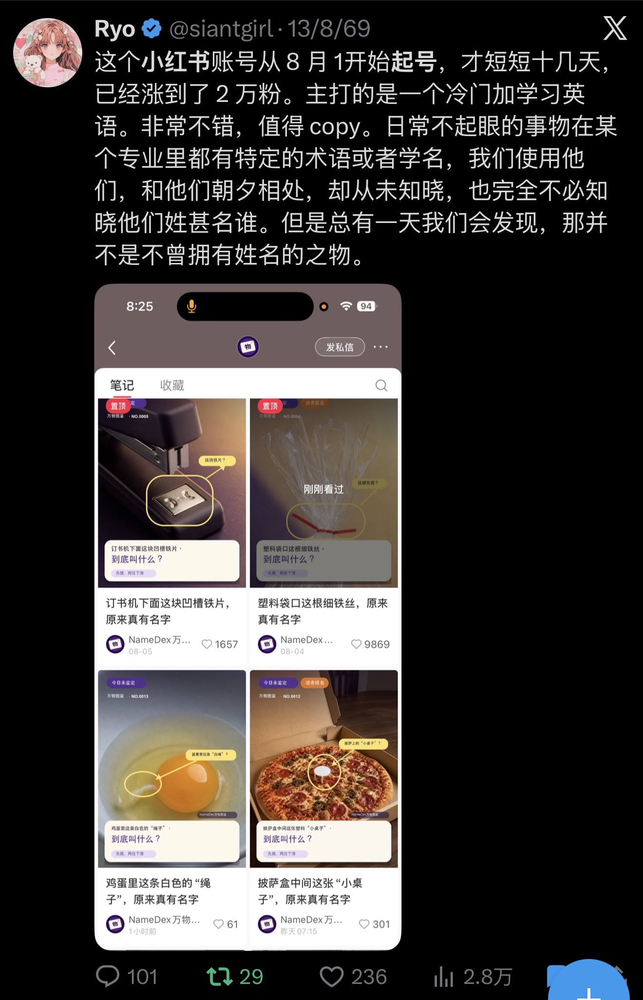
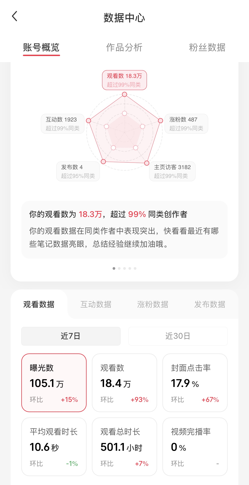

# 我是怎么用 Codex 做小红书，2 天涨了 1000 粉

答应大家的 X涨到2000 粉，分享小红书起号攻略，来交作业了。

先说结果：

这个账号我基本没手动做内容，前期只发了几篇笔记，就拿到了：

105 万曝光、18 万观看，后面 2 天涨了 1000 粉。

整个项目的起点，只是我在 X 上刷到了这篇帖子。

对方分享了一个刚起不久的小红书账号。

它做的内容非常简单：

专门讲那些生活中天天见，但大多数人不知道“英语叫什么”的东西。

比如：

- 披萨盒中间的小塑料架，英文叫什么？
- 鸡蛋里的白色“绳子”，英文叫什么？
- 订书机下面那块铁片，英文叫什么？

这些东西大家都见过，甚至每天都在用。

但真让你说出它们的英文名字，大多数人都答不上来。

所以这个内容模型其实很清晰：

熟悉的东西 + 陌生的英文名 + 一个好奇心问题。

用户刷到以后，很容易产生一种感觉：

“这个我天天见，还真不知道英语怎么说。”

这就是它的信息差。

我当时看到以后，第一反应不是直接搬它的内容，而是觉得：

这个选题模型可以复制，而且特别适合用 AI 批量生产。

于是我把这个账号的逻辑拆了下来：

找生活中的常见物品 → 找它真正的英文名称 → 补充一点相关知识 → 做成统一风格的图片。

接下来，我直接把执行交给 Codex。

我的流程基本是：

找选题 → 查英文名称 → 核对资料 → 写标题 → 做图片 → 排版。

我只负责：

定方向 + 审核。

选题标准也很简单：

> 这个东西是不是大家都见过，但大多数人不知道它英语叫什么？

如果答案太明显，就不做。

如果看到答案以后会有一种：

“原来这个东西英语叫这个！”

那就是一个不错的选题。：

找选题 → 查名称 → 查英文 → 写标题 → 做图片 → 排版。

我只负责：

定方向 + 审核。

选题也有一个很简单的标准：

> 用户看到答案以后，会不会产生“原来这东西还有名字”的感觉？

如果没有信息差，就不做。

这类内容还有一个优势：

特别适合做小红书封面。

一个熟悉的东西，

加一个圈、一个箭头，

再问一句：

“这个叫什么？”

用户 0.5 秒就能看懂。

数据出来以后，我也没有急着换玩法。

哪个内容结构有效，就继续做类似内容。

因为小红书起号阶段最重要的不是天天创新，而是：

不断强化一个已经被验证的内容模型。

最后的数据：

曝光 105.1 万
观看 18.4 万
封面点击率 17.9%

后面继续跑，2 天涨了 1000 粉，目前数据还在涨！

这次实验让我最大的感受是：

现在做内容，我不会从 0 开始想。

而是先去找：

什么样的东西已经跑出来了？

然后拆解它的：

选题模型、流量模型、视觉模型。

最后再用 AI 快速执行。

整个流程其实就是：

发现 → 拆解 → 模仿 → 迭代。

这里的模仿不是搬运。

而是：

复制已经被验证的底层逻辑，再重新生产自己的内容。

AI 时代真正被大幅降低的，不仅仅是内容生产成本。

还有：

从发现一个机会，到真正把它做出来的时间。

以前看到一个项目，可能研究一周还没开始。

现在看到一个能做的模型：

当天拆，当天发，市场直接给答案。

这就是我这次小红书起号最核心的方法。