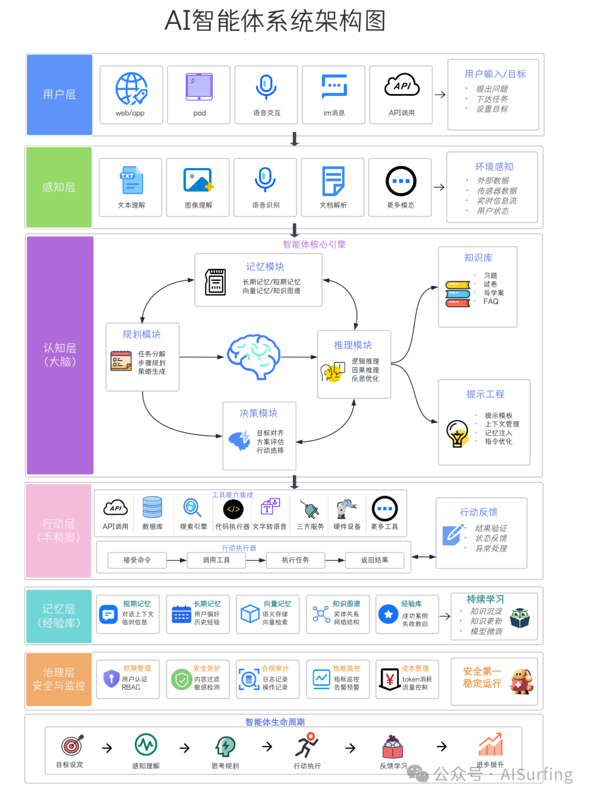

# 写架构文档，四段式骨架扛住八成评审追问

> 图是结论，不是起点。图背后的每个决策，才是评审想看的。

四段式骨架：**总体方案 → 详细设计 → 部署方案 → 演进规划**。写满这四段，扛得住评审八成追问。

## ① 总体方案：架构图是结论，不是起点

写什么：架构图 + 模块职责 + 核心流程，三样缺一不可。

架构图放在最前面，但**写的时候放最后**。先把模块职责理清楚，再画图——图是决策的可视化，不是起点。

以 Agent 管理平台为例，拆五个子系统：
- ReAct 无状态内核，状态外置
- Workspace 管理、沙箱隔离、Skill 动态加载
- spawn 子 Agent、超时晋升、跨副本路由
- 权限六步管线、优雅停机、统一事件流
- SPI 分类学，按类型挂载工具和模型

核心流程写成一条线：用户提交任务 → 调度器选 Agent 实例 → Agent 进 ReAct 循环调工具或 MCP → 治理层鉴权+审计 → 返回结果。**每一步标出谁负责、状态存哪、失败怎么办**。

常见错误：只画图不写职责，或把图当起点先画图再倒推模块。

## ② 详细设计：质量属性逐项落地，别写"不涉及"

按质量属性逐项落地：高可用、高性能、可扩展、安全。每项写【机制 + 边界 + 兜底】。

**高可用**：Agent 实例优雅停机，任务先跑完或安全转移再摘流量；统一事件流可回放，节点挂了从事件流恢复上下文；状态外置，Agent 实例无状态。

**高性能**：50 并发压测下，Java 和 Python 的 Agent 框架性能几乎打平——瓶颈不在框架，在 vLLM/GPU 推理引擎。决策：推理引擎和 Agent 运行时分离部署，推理侧横向扩 GPU。

**可扩展**：SPI 扩展生态按分类挂载；多 Agent 用 spawn 横向扩；Skill 动态注入，工具的增删不下线。

**安全**：双层权限（租户级粗粒度 + 工具级细粒度鉴权）；MCP 工具调用过三层治理（Registry 控制面 → Gateway 横跨控制面/数据面 → Runtime 数据面终点）。

兜底不是可选项。没有兜底的机制，在评审眼里等于没写。

## ③ 部署方案：每个选型说 why，再配一句"不选什么"

写什么：部署架构 + 选型理由 + 资源估算。每个部署决策都要能回答"为什么"。

以 Agent 平台为例：

| 决策 | 选型理由 | 不选什么 |
|------|---------|---------|
| Agent 运行时和 vLLM 推理引擎分离部署 | 一个是 CPU/内存密集，一个是 GPU 密集，混在一起互相抢资源 | 不把推理和编排混布，省下的机器钱不够填故障的坑 |
| GPU 节点按推理 QPS 和并发 Agent 数配 | 按峰值并发 Agent 数 × 单 Agent 平均推理调用频次倒推 | 不按业务注册用户数配 GPU——推理负载和注册用户没直接关系 |
| 沙箱隔离用容器或微 VM | 工具调用跑在沙箱里，防止恶意工具逃逸到宿主机 | 不用裸容器跑不可信工具 |
| 治理层独立部署 | 权限校验、审计日志单独走，不跟业务流量挤在一起 | 不把治理逻辑塞进 Agent 运行时进程里 |

文档的价值在决策密度。一句话讲清"为什么"和"为什么不"，比十页拓扑图有用。

## ④ 演进规划：三期回答"什么时候不做什么"

分阶段演进，每期写清目标、投入、收益。**每期都问一句"这期不做什么"**：

- **一期**：单集群 + 基础治理，跑通业务。不做多集群、跨机房、多模型网关。
- **二期**：多 Agent 编排横向扩 + 细粒度权限 + 模型网关。不做多机房容灾。
- **三期**：多机房容灾 + 可复现审计 + 跨机房复制防脑裂。但能不能到本期取决于业务接受度。

敢写"这期不做"，比敢写"未来全做"难得多。

## 总结

架构文档不写 PPT。四段式写完，价值不在于方案多完美，在于**每个决策都有据可查**。评审追问"为什么"的时候，你能指着一行字告诉他：这是当时权衡的结果。

