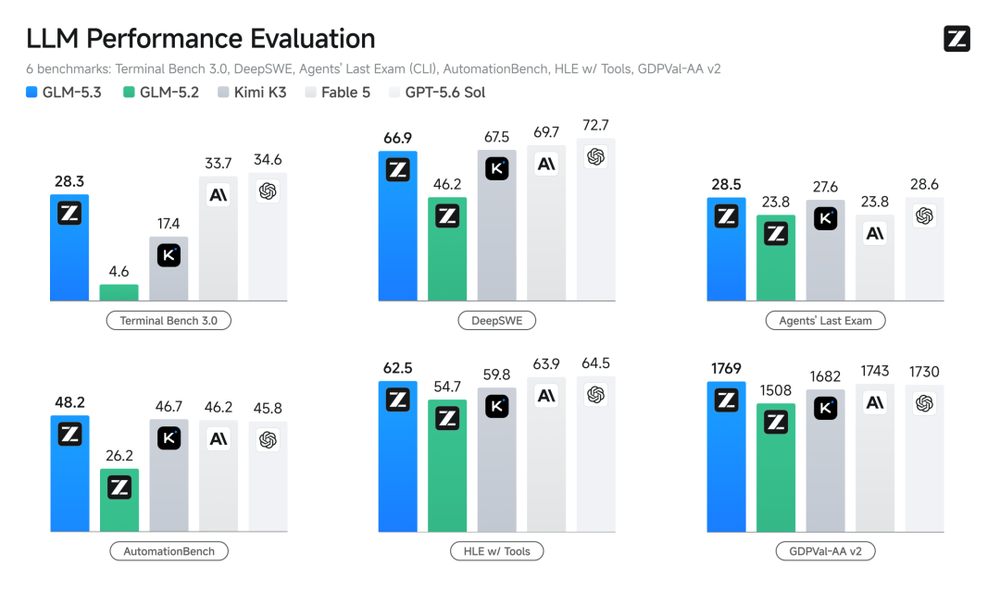
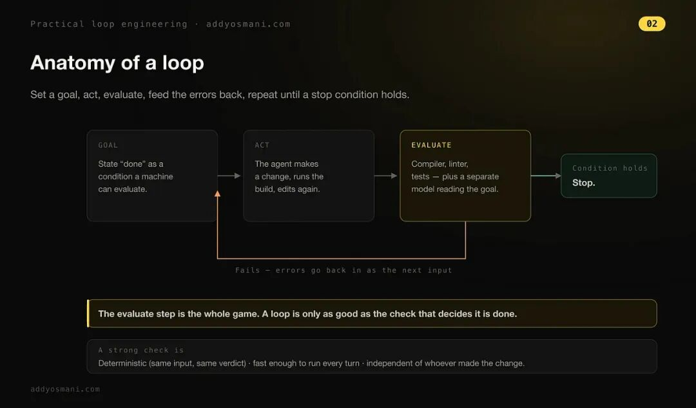
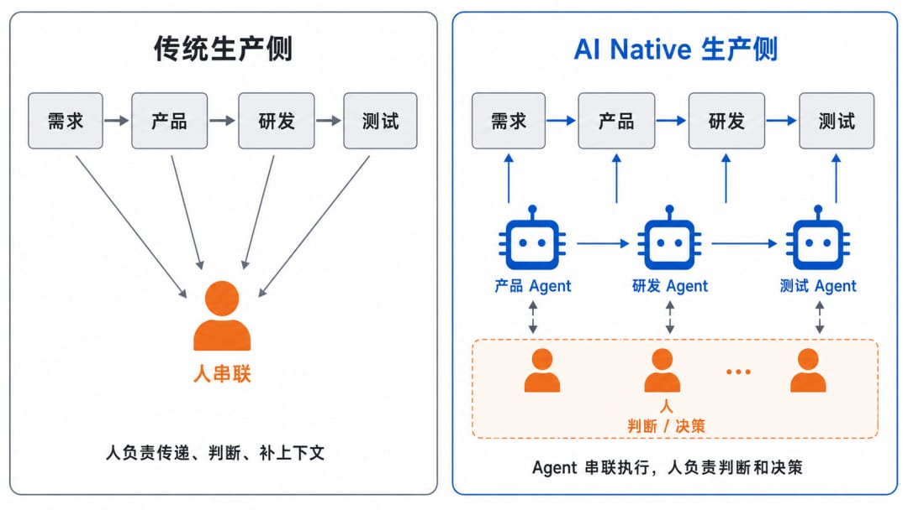
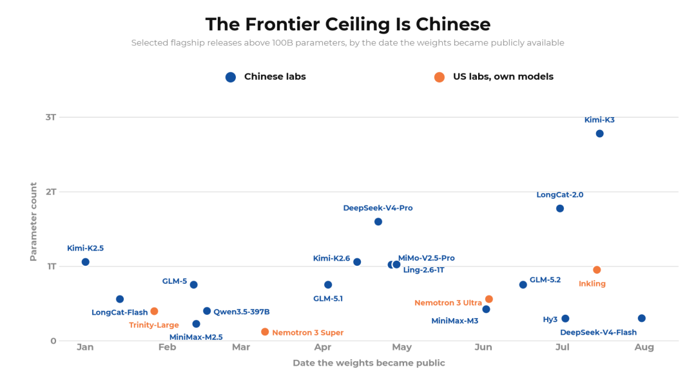
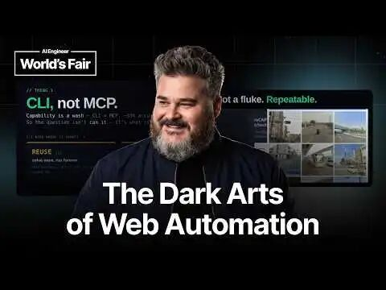

# BestBlogs 早报 · 08-15｜GLM-5.3 扩展编程与安全边界，循环工程和知识底座重写 Agent 协同

> BestBlogs 日报精选三篇深度文章：GLM-5.3 编程能力迁移、Addy Osmani 的实用循环工程、大淘宝技术的 AI Native 团队思考，另附速览、补充阅读和延伸探索。

<!-- more -->

## 导语

当 Agent 从一次对话走向持续工作，真正难的不是让它多运行几轮，而是回答三个逐层放大的问题：

1. **模型的能力到了哪里**
2. **一次任务怎样知道该停**
3. **团队又凭什么让不同 Agent 获得正确且持续更新的业务知识**

今天的三篇精讲刚好落在这三个尺度上：

- **GLM-5.3** — 同一基座经过更大规模后训练后，编程能力怎样迁移到代码审查与漏洞发现
- **实用循环工程**（Addy Osmani）— 把长时工作拆成有界的 goal 与定时的 loop，并要求执行者之外再有独立验证
- **重构协同**（大淘宝技术）— 单点编码提速无法自动消除需求、研发、运维与运营之间的人工接力

这不是一条已经被证明的统一路线。模型跑分来自厂商口径，循环工程是实践经验，AI Native 团队仍是方向性框架。但把三者连起来读，可以得到一套更诚实的生产检查表：**能力要分任务链条看，自治要先写完成和停止条件，组织改造则要先解决知识从哪里来、怎样保鲜、谁对例外负责。**

---

## 精讲一：GLM-5.3：前沿编程能力与涌现的网络安全能力

> 来源：智谱 · BestBlogs 评分：93

GLM-5.3 最值得注意的地方，不是全新的基座模型，而是智谱称其在与 GLM-5.2 **相同基座**上，通过数十倍长程任务环境、更丰富的环境类型和更长后训练，把能力上界继续向外推。这个对照把"模型能力"拆成了两层：**预训练决定基座拥有什么潜力，后训练则决定它能否在复杂环境中发现问题、操作工具、实施并验证。**

### 关键数据

| 基准 | GLM-5.2 → GLM-5.3 |
|------|-------------------|
| Terminal-Bench 3.0 | 4.6 → **28.3** |
| DeepSWE v1.1 | 46.2 → **66.9** |
| Agents' Last Exam | 23.8 → **28.5** |

智谱自建的 Z.ai Code Bench：High 档位准确率 **31.4%**，每项任务平均输出约 **5 万 tokens**；对照中的 Claude Opus 4.8 为 29.5% 和约 12 万 tokens。这组是厂商自测，提出了一个有用维度：长程 Agent 不仅要完成任务，还要看**完成路径、token 利用和返工成本**。

### 网络安全能力分层

- **CyberGym**（白盒源代码识别和验证漏洞）：GLM-5.3 得分 **84.5%**，略高于 Mythos 5 与 GPT-5.6 Sol
- **ExploitBench**（理解成因并完成利用）：GLM-5.3 得分 **54.4%**，虽比 GLM-5.2 的 24.4% 高出一倍多，却仍低于 Mythos 5 的 78.0% 与 GPT-5.6 Sol 的 76.5%

更准确的判断：**能力增量首先集中在代码审查、异常定位和漏洞验证的前半段，而不是已经获得不受约束的全链攻击能力。**

智谱与合作安全团队披露，自 GLM-5.2 发布以来累计发现 **2,436 个漏洞**（初筛+去重），其中 **1,097 个为中高危**，覆盖 **269 个项目**。

### 开放权重计划

智谱计划在发布两周后、完成安全评估和加固后开放完整权重。需要区分的是：外层分类器和推理监控器依赖托管环境，**权重离线部署后仍能保留的主要是模型内部对齐**。

> 最有用的不是记住一个总分，而是保留四个问题：模型在哪一段任务链上变强，评测由谁完成，漏洞如何负责任披露，权重开放后哪些控制仍然有效。

---

## 精讲二：实用循环工程

> 来源：Elevate · BestBlogs 评分：91

Addy Osmani 的核心贡献，是把笼统的"让 Agent 一直做下去"拆成两种原语：

### Goal vs Loop

| | Goal | Loop |
|---|------|------|
| 面向 | 有界任务 | 不断变化的外部状态 |
| 模式 | 反复尝试直到评估器确认 | 按固定间隔重新检查并动作 |
| 问 | 这件事做完了吗？ | 外部世界有没有变化？ |
| 示例 | 把页面 Lighthouse 分数做到 92+ | 每小时检查 GitHub 新 Issue |

把"把页面优化好"交给 goal，评估器无法知道什么叫好。改成 **Lighthouse ≥ 92、LCP < 1.8 秒、不改变公开 API、连续两轮无改善中止、最多 10 轮**，系统才拥有可执行的完成条件和停机条件。

**最重要的经验：执行与验证分离。** 作者每天并行使用多个 Agent，但不会让完成工作的那个 Agent 同时裁定自己是否合格。

### 人类判断的边界

作者曾让 Agent 研究竞品并生成弥补差距的本地改动，研究看起来合理，实施却会给用户增加大量复杂性。**涉及审美、产品取舍、架构、安全、认证或财务的任务，即便有清晰规格，也需要更近距离复核。**

> 若同一命令第三次执行仍没有比第二次产生变化，那不是坚持，而是系统正在原地旋转。

---

## 精讲三：重构协同：关于 AI Native 团队的思考

> 来源：大淘宝技术 · BestBlogs 评分：92

### 核心观点

**编码变快，不等于业务交付链路同比例变快。** 需求从业务传给产品，产品转成方案，研发再翻代码与历史决策，测试、发布、运维、客服和运营继续靠人同步上下文。若这些接力仍由会议、群聊、表单和手工录入完成，增加 AI 助手只是旧流程中的局部加速。

### AI 辅助 vs AI Native

- **AI 辅助**：保留"人是串联者"的流程骨架
- **AI Native**：让 Agent 承担传递、判断与衔接，再围绕这个前提重建生产侧

### 三层结构

| 层 | 角色 |
|----|------|
| **底层** | 知识底座（业务规则、流程、领域知识、数据） |
| **中间层** | 专业 Agent（按知识范围、工具权限、风险边界拆分） |
| **上层** | 人（定方向、做判断、处理例外、沉淀新知识） |

**最有启发的判断："软件是被固化的知识"。** AI Coding 只是把知识固化成软件的一段流程；真正的上游是知识是否准确、边界是否清楚，以及新决策能否回到权威来源。

> 凡是能从代码、配置和数据自动生成或校验的知识，不要改由人手维护。

作者明确承认：**公司内尚未出现成熟的最佳实践，这套三层结构更像一个诊断框架，而非已验证的组织因果模型。**

---

## 速览

### 开放模型现状：2026 年夏季观察

> 来源：Hugging Face Blog · BestBlogs 评分：91

Hugging Face 用 2026 年前七个月的 Hub 数据观察开放模型生态。下载前 25 与点赞前 25 的仓库**只有一个重合**：点赞反映发布时的关注，下载更像已经嵌入稳定管线的依赖。Qwen 在 Hub 上形成 **151,448 个衍生模型**，而小于 1B 的模型仍占声明规模模型历史下载量的 **83%**。

### 网页自动化的暗黑技法

> 来源：AI Engineer · BestBlogs 评分：90

Corey Gallon 把网页自动化设计成"感知—行动—验证"循环：先读 DOM/截图，做一个动作，再用不同信号确认结果。三层梯子从便宜的页面 API 开始，必要时升级到 CDP trusted input，只有确实需要时才使用视觉。

### 计算机使用智能体评测：别让可重放轨迹伪装成能力

> 来源：AI Engineer · BestBlogs 评分：89

确定性的计算机使用基准可能让模型记住并重放固定操作轨迹。研究建议引入环境变体、结果级验证和更可靠的不确定性估计。

### dots3-note Preview：280B 多模态模型

> 来源：小红书技术 REDtech · BestBlogs 评分：88

REDtech 发布 280B 参数多模态模型，同时给出 TEMPO 长程强化学习方法和 VibeSearchBench / VibeLifeBench 两套评测。

### 34K Star 的 DeepTutor

> 来源：山行AI · BestBlogs 评分：91

DeepTutor 把统一 Agent Loop、RAG、Skills、外部 Agent 和三层长期记忆组合在一起，目标不是回答一道题，而是让学习任务能够跨会话延续。

### 守护前沿：JetBrains 评估 Claude Fable 5

> 来源：Claude Blog · BestBlogs 评分：91

JetBrains 把模型放入私有代码库的真实任务中评估，而非只依据公共榜单。

### 离散扩散语言模型 dLLM

> 来源：青稞AI · BestBlogs 评分：89

离散扩散语言模型尝试用并行生成挑战逐 token 的自回归路线，但并行并不自动带来质量与速度优势。

---

## 补充阅读

| 文章 | 来源 | 评分 |
|------|------|------|
| X 开源「为你」算法，披露详细评分机制 | Elon Musk | 92 |
| Unify 如何在两周内将 AI 智能体成本降低 95% | LangChain | 90 |
| 科技爱好者周刊第 408 期：AI 缓存知识 | 阮一峰 | 91 |
| InstEmb：京东未来感知指令嵌入 | 京东技术 | 88 |
| 从 DeepSeek、Kimi 到「黄仁勋联盟」：AI 模型开源，到底「开」了什么？ | 硅谷 101 | 90 |
| ChatGPT 中的 Computer History | OpenAI | 88 |
| CaaS 崛起：为 Agent 构建可复用的上下文服务 | AI Engineer | 88 |
| Cursor 收购 Firetiger：构建可投入生产的 AI 智能体 | Cursor | 90 |
| LTX-2.5 开源：22B 音画生成模型 | 魔搭 ModelScope | 87 |
| 计算机使用模型将让网页走向智能体化 | AI Engineer | 90 |

---

## 15 分钟阅读路径

1. 先读**实用循环工程**——把 goal、loop、验证者和停止条件变成可立即使用的工作框架
2. 再读**GLM-5.3 的网络安全部分**——练习按审查、验证和利用链分层理解模型能力
3. 最后读**AI Native 团队的知识底座章节**——把个人工作流放回组织协同中检查

> 读完可以追问两个问题：你正在委派的是任务，还是连价值判断也一起委派了？团队最依赖的业务规则，究竟锚定在代码、配置、数据，还是仍只存在于某个人的记忆里？

## 关联文章

- [DeepSeek Harness Agent 公式](../concepts/deepseek-harness-agent-formula.md) — DeepSeek 开源 Harness（dsh）
- [Agent 工程实践](./harness-engineering-practice.md) — Harness 四阶段演进