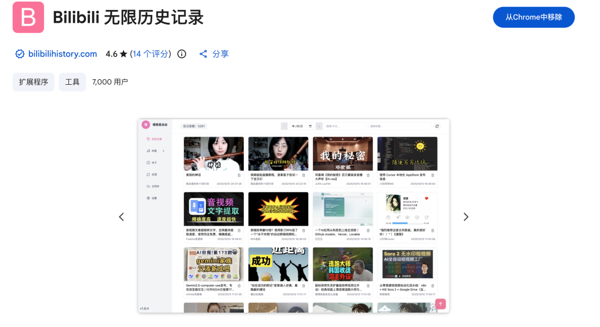
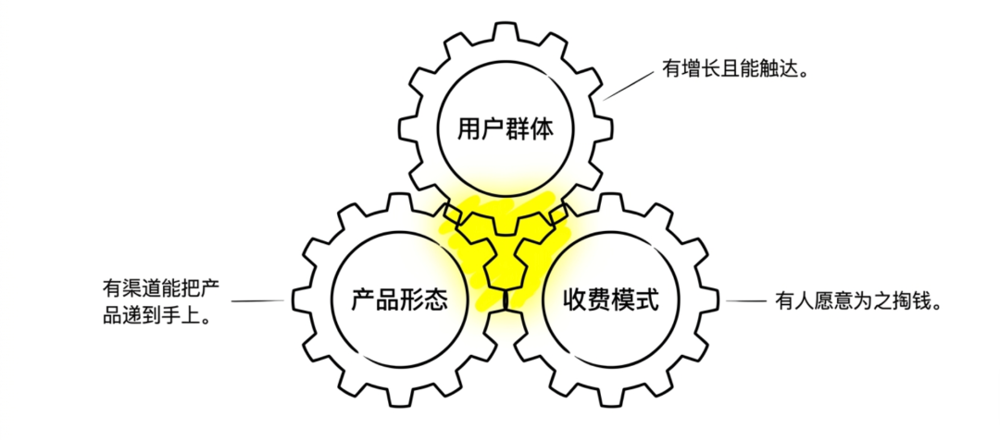
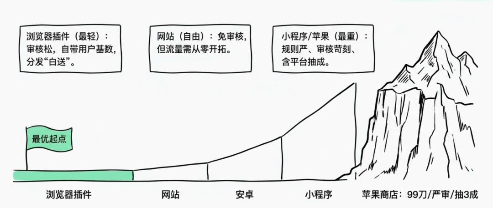
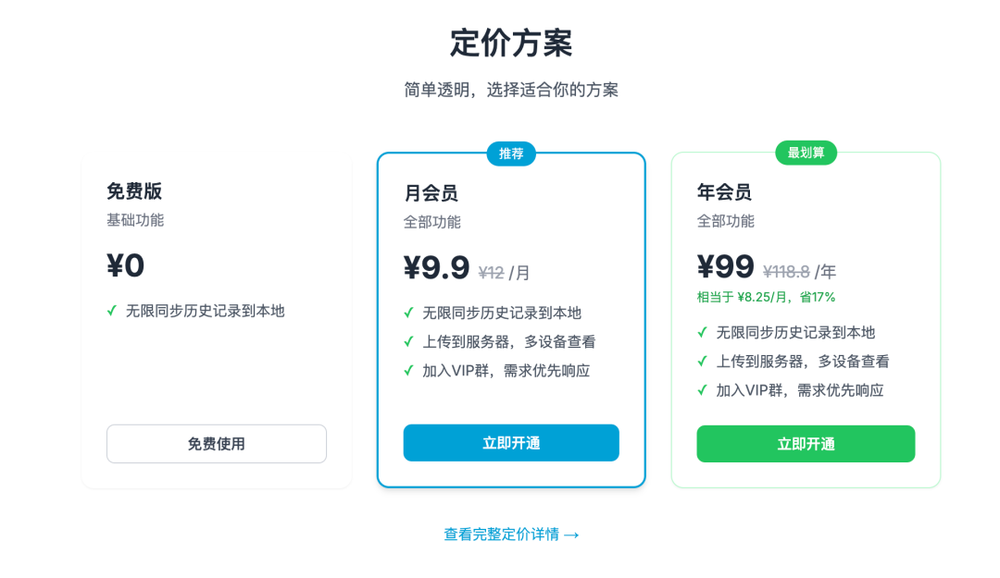
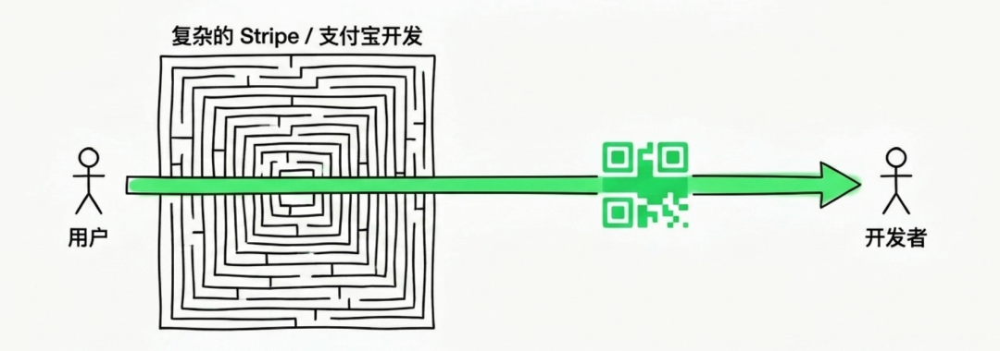

# 做了 10 几款产品，拆解下我的赚钱方法

> 独立开发者如何找到「官方不管、用户很痒、有人愿意付钱」的需求，通过用户群体、产品形态、收费模式三个维度做产品赚钱。

<!-- more -->

## 背景

2024 年作者认识了后端开发搭档，两人做了很多款产品（飞书排版、onepod、cowrite、SkillDeck 等），加上自己做的共 10 多款，其中一些营收非常不错。核心观点：AI 时代做产品的门槛高了，但只要需求找得准，产品照样能赚钱。

## 方法论：三件事决定产品能否赚钱

以「哔哩哔哩无限历史记录」（bilibilihistory.com）这款产品为例，拆解产品赚钱的核心框架：

### 一、用户群体：选一个有人离不开的平台

大厂只顾着做大而全，「官方懒得管、用户又很在意」的环节就是留给个人开发者的。B 站重度用户的痛点是官方历史记录会被冲掉，想看回的视频再也找不回。

不只 B 站，作者围绕 Codex 生态做了一批 Skill，总结了几种切入商机：

1. **补能力**：Codex 擅长写代码，不擅长的写作、设计、出图、排版、发布就是缝，做成 Skill 补上去
2. **做配套插件**：围绕 Codex 的剪辑视频、长文写作、图片制作等
3. **卖现成品**：装好就能跑的 Skill 包、工作流、模板
4. **做认知差**：新平台教程、拆解、陪跑变现
5. **蹭分发**：Codex 生态自带用户和开源渠道

小红书、微信读书、飞书、Obsidian 等平台也可照此思路找机会。

### 二、产品形态：挑一个上架难度扛得住的

不同产品形态的上架难度：
- **浏览器插件**：最轻，审核松、上线快、可内置收费
- **网站**：自由，但流量从零搞
- **安卓**：中等，国内商店多且杂
- **小程序**：偏重，微信审核严、规则多
- **苹果商店**：最重，$99/年、审核严、内购抽三成

刚起步从插件、网站这种最轻的形态切最稳。

### 三、收费模式：刀法要精准

两条定价笨办法：
- **有竞品**：扒竞品怎么收，市场帮你验过的价格锚
- **没竞品**：从功能点切，基础免费，进阶付费

结构上分三档：免费、月度、年度。免费兜底，年度折扣锁长期。

**收款实现**：国内接微信/支付宝，海外接 Stripe。但最笨的方式——用户直接加微信转账——也能验证需求。收款系统可以后补，先用最笨的方式验证有没有人愿意掏钱。

## 总结

找需求就是找这三条能对齐的地方：靠平台找用户、有渠道做分发、有人愿意为省下的麻烦掏钱。AI 时代，能做出来不是门槛，真正需要的是找到一个「官方不管、用户很痒、有人愿意付钱」的需求。

## 其他产品

作者还做了飞书排版插件（可将飞书文档一键导出为公众号排版和小红书图文），下载地址：[Chrome 商店](https://chromewebstore.google.com/detail/%E9%A3%9E%E4%B9%A6%E6%8E%92%E7%89%88/dmpadjdbfhghllngjbbgabkmnlkfjagl)