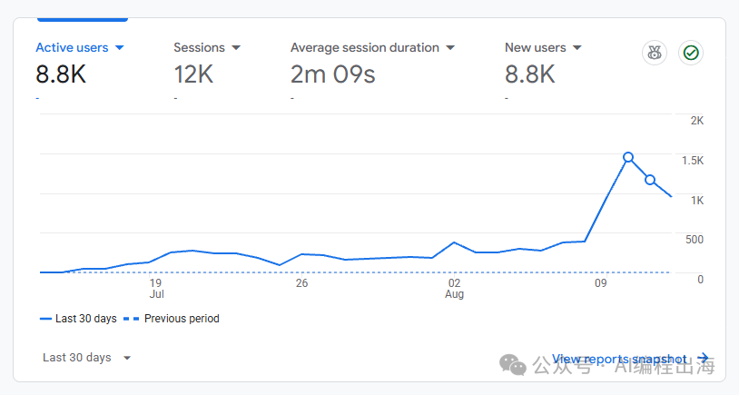
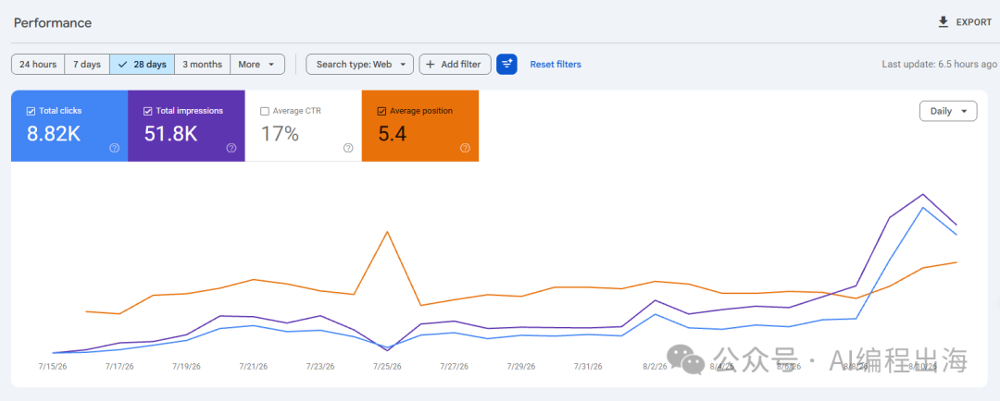
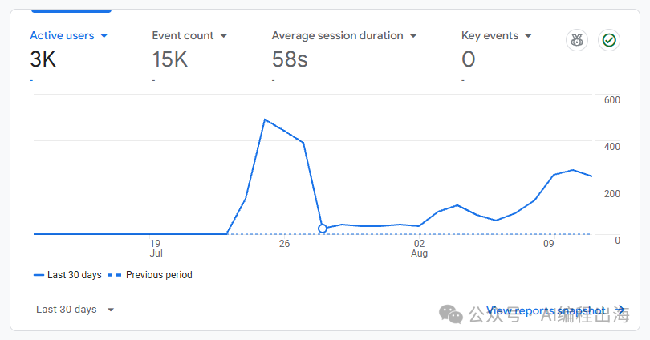
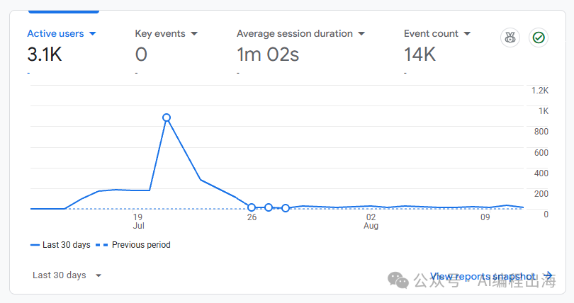
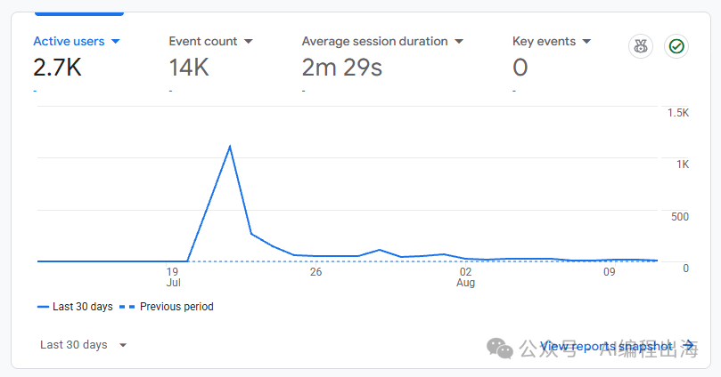
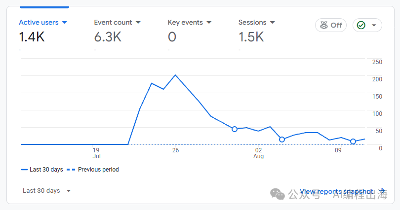

# 看完圈友自动化上站赚3700刀，我也冲了：30个站，只赚了30美金

> 过去不到一个月，用 AI 辅助上线了 30 个出海游戏网站。几乎每个上线后就有流量，有几个站访客数近万。结果 30 个网站，广告收入只有 30 美金——连域名成本都无法覆盖。

## 做了什么

受圈友听涛启发，写了 3 个 Skills：

1. 联网调研关键词，分析相关信息并判断可行性
2. 根据关键词自动生成页面文案、SEO 审查、本地化审查
3. 根据英文版自动翻译多语言，各语言独立调研关键词和本地化审查

每天可以并行开发 3 到 6 个网站，不到半个月上线 30 个网站。还让 Codex 写了更新游戏站 Codes/Status 的 Skills，每天看 Google Trends 挖掘新词，跟踪游戏平台 Sitemap。

## 数据结果

部分站上线后很快有搜索流量，几千甚至近万访客：

但更多网站流量很少，或短暂突破后很快回落：

对接 Adsterra 后，近一个月只赚了 30 美金：

## 反思

> 自动化不是印钞机，它更像是放大器。判断对了，它放大收益；判断错了，它放大亏损。

做任何批量和自动化之前，**先跑通 0 到 1** 更为重要。如果新词挖掘和调研的方法不做调整优化，继续上线网站只是增加更多炮灰。

中途停止批量上站，重新翻看哥飞老师分享的新词挖掘方法，查看其他出海前辈的需求调研思路，增加对新词挖掘和需求调研的体感。

如果你也正在做出海网站，或者被 AI 自动化批量上站点燃过，不妨停下来思考一下：**你真的已经跑通 0 到 1 了吗？**