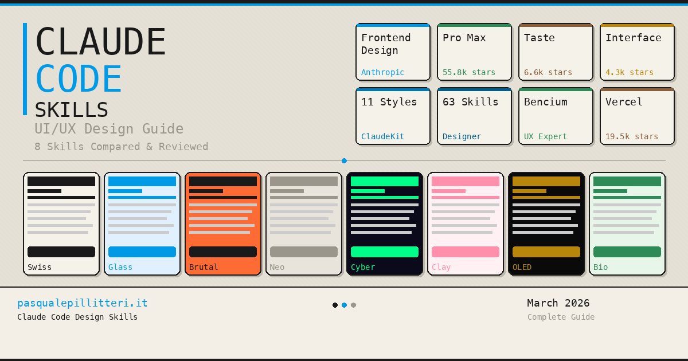

# Claude Code UI/UX 设计最佳 18 款 Skill 完整指南

> 解决 Claude Code 生成界面千篇一律的问题：18 款设计 Skill 让 AI 产出独特专业的 UI。

<!-- more -->

## 核心问题：分布收敛

使用 Claude Code 开发界面时，常遇到"分布收敛"问题：请求落地页总是得到相同结果——Inter 字体、白底紫色渐变、圆角卡片、极简动画。这是模型复制了设计决策的统计中心。

**解决方案**：设计类 Skill。它们是教会 Claude 如何设计独特界面的 markdown 文件，配备精确的风格、精挑细选的调色板和考究的字体排印。



## Skill 工作原理

Skill 是 `SKILL.md` 文件，加载到项目的 `.claude/skills/` 目录，或 `~/.claude/skills/` 以供全局使用。当 Claude 检测到设计任务时，会**自动读取 Skill** 并应用其中规则，彻底改变输出质量。

**快速安装**：大多数 Skill 可通过单条命令安装。也可手动从仓库下载 SKILL.md 文件并复制到 `~/.claude/skills/skill-name/` 目录下。

---

## 18 款设计 Skill 详解

### 1. Anthropic Frontend Design（官方 Skill）

Anthropic 的官方 Skill，安装量已超 **277,000 次**，是必备的起点。它如同**艺术总监的创意 brief**：在编写代码之前，Claude 会先选定一个精确的美学方向。

**核心特性**：
- 禁用 Inter、Roboto、Arial 和 Space Grotesk（"overused by AI"）
- 带 CSS 变量的调色板，告别千篇一律的紫色渐变
- 非对称布局与意料之外的构图
- 有意图的动画，仅在真正有影响力之处使用动效

**仓库**：[github.com/anthropics/claude-code](https://github.com/anthropics/claude-code/tree/main/plugins/frontend-design)（130.9k stars）

**风格**：精致极简、编辑设计、杂志式布局

**安装**：`claude plugin add anthropic/frontend-design`

### 2. UI/UX Pro Max - 完整设计数据库

**GitHub 88,700 stars**，全球最受欢迎的社区设计 Skill。它不仅是一款 Skill，更是一个**推理引擎**，可分析您的项目并自动生成完整的设计系统。

**包含内容**：
- **67 种 UI 风格**：玻璃拟态、黏土拟态、粗野主义、新拟态、瑞士设计等
- **161 套调色板**：对齐特定产品类别
- **57 种字体组合**：附带现成的 Google Fonts 引入
- **161 条推理规则**：按行业定制
- **99 条 UX 指南**：无障碍、触控、性能、响应式布局

**仓库**：[github.com/nextlevelbuilder/ui-ux-pro-max-skill](https://github.com/nextlevelbuilder/ui-ux-pro-max-skill)（88.7k stars）

**安装**：`/plugin marketplace add nextlevelbuilder/ui-ux-pro-max-skill`

### 3. Taste Skill - 带可调参数的高端设计

由 Leonxlnx 开发（**37,400 颗星**），包含 **9 个专业变体**外加 3 个图像生成 skill 的套件，配以一套像音频均衡器一样作用于 AI 设计输出的 3 参数可调系统。

**三个可调参数**：
- **DESIGN_VARIANCE (1-10)**：从干净居中布局到不对称现代构图
- **MOTION_INTENSITY (1-10)**：从简单 hover 效果到磁性滚动触发动画
- **VISUAL_DENSITY (1-10)**：从奢华留白到密集仪表盘

**9 个专业变体**：
- taste-skill（通用默认款）
- gpt-taste（GPT/Codex 专用）
- image-to-code-skill（图片优先工作流）
- redesign-skill（审计优化已有 UI）
- soft-skill（沉稳高级感界面）
- minimalist-skill（Notion/Linear 风格）
- brutalist-skill（瑞士排版实验性）
- stitch-skill（Google Stitch 兼容）
- output-skill（强制完整输出）

**仓库**：[github.com/Leonxlnx/taste-skill](https://github.com/Leonxlnx/taste-skill)（37.4k stars）

**安装**：`npx skills add https://github.com/Leonxlnx/taste-skill`


### 4. Impeccable - 反 AI 套路的设计语言（35,800 颗星）

**Paul Bakaus**（前 Google Developer Advocate、jQuery UI 作者）开发。它不是在事后修正输出，而是给模型一个不同的**参考分布**：审美 slop 从一开始就不会被生成。

**核心特性**：
- **23 个命令**：`polish`、`audit`、`critique`、`distill`、`animate`、`bolder`、`quieter` 等
- **7 个参考文件**：typography、color、motion、spatial、interaction、responsive、UX writing
- **品牌与产品双模式**：根据上下文调整默认值

**仓库**：[github.com/pbakaus/impeccable](https://github.com/pbakaus/impeccable)（35.8k stars）

**安装**：`/plugin marketplace add pbakaus/impeccable`

### 5. Interface Design - 会话间的持久性与一致性

Dammyjay93 开发（5,000 stars），解决**会话间的一致性**问题。将设计决策保存在 `.interface-design/system.md` 文件中，可在多个会话间保持持久。

**核心特性**：
- 持久记忆：设计模式被保存并复用
- 无风格漂移：按钮、间距和色彩随时间保持一致
- 预定义设计方向："Precision & Density"、"Warmth & Approachability" 等

**仓库**：[github.com/Dammyjay93/interface-design](https://github.com/Dammyjay93/interface-design)（5k stars）

**安装**：`/plugin marketplace add Dammyjay93/interface-design`

### 6. Frontend Design Pro Demo - 11 种鲜明美学

展示 11 种截然不同的设计风格，每种都附有 master prompt、标志性效果和生产级代码。

**11 种可用风格**：
1. Swiss Minimalism - 严谨网格、巨型字体
2. Neumorphism - 凸起元素、多层阴影
3. Glassmorphism - 磨砂玻璃卡片
4. Brutalism - 3-4px 粗边框
5. Claymorphism - 膨胀 3D 黏土形状
6. Aurora / Mesh Gradient - 缓慢呼吸的 blob
7. Retro-Futurism / Cyberpunk - 霓虹灯、CRT 扫描线
8. 3D Hyperrealism - 逼真纹理
9. Vibrant Block / Maximalist - RGB 对比色块
10. Dark OLED Luxury - 黑底金色点缀
11. Organic / Biomorphic - 大地色调、形变 blob

**在线 Demo**：[claudekit.github.io/frontend-design-pro-demo](https://claudekit.github.io/frontend-design-pro-demo/)

**仓库**：[github.com/claudekit/frontend-design-pro-demo](https://github.com/claudekit/frontend-design-pro-demo)（232 stars）

**安装**：`claude plugin add claudekit/frontend-design-pro-demo`

### 7. Designer Skills - 63 款完整设计 Skill

**Owl-Listener/designer-skills**（1.5k stars）是专注设计的最大合集，包含 **63 款 Skill 和 27 条命令**，组织为 8 个插件。

**8 个插件**：
- design-research（10 款）- 用户画像、共情地图、旅程地图
- design-systems（8 款）- 设计系统的创建与管理
- ux-strategy（8 款）- 从愿景到指标的 UX 战略
- ui-design（9 款）- UI 组件、无障碍调色板
- interaction-design（7 款）- 交互模式与微交互
- prototyping-testing（8 款）- 原型制作与可用性测试
- design-ops（7 款）- 设计流程与工作流
- designer-toolkit（6 款）- 日常工具、交付

**仓库**：[github.com/Owl-Listener/designer-skills](https://github.com/Owl-Listener/designer-skills)（1.5k stars）

**安装**：`/plugin marketplace add Owl-Listener/designer-skills`

### 8. Bencium UX Designer - 两种变体、两种心态

提供同一 Skill 的两种变体：
- **Innovative UX Designer**：鼓励大胆创意选择、视觉实验和创新
- **Controlled UX Designer**：优先考虑一致性、控制和遵循标准

每个变体包含超过 28,000 字符的 UX 参考材料，附有 ACCESSIBILITY.md、RESPONSIVE-DESIGN.md、MOTION-SPEC.md、DESIGN-SYSTEM-TEMPLATE.md。

**仓库**：[github.com/bencium/bencium-claude-code-design-skill](https://github.com/bencium/bencium-claude-code-design-skill)（273 stars）

**安装**：`npx skills add bencium/bencium-marketplace -g --skill bencium-controlled-ux-designer`

### 9. Vercel Agent Skills - 性能与无障碍

**Vercel Labs**（27,700 stars）提供一套 Skill，重点不在美学，而在 UI 代码的**技术品质**。

**包含的 Skill**：
- Web Design Guidelines：对照 100+ 条无障碍、性能与 UX 规则审计
- React Best Practices：8 类别 57 条规则
- Composition Patterns：可扩展组件架构
- React Native：移动端优化

**仓库**：[github.com/vercel-labs/agent-skills](https://github.com/vercel-labs/agent-skills)（27.7k stars）

**安装**：`/plugin marketplace add vercel-labs/agent-skills`

### 10. Refactoring UI - 自动视觉审计

使用 Adam Wathan 与 Steve Schoger 的 **Refactoring UI** 体系审计界面的视觉层级、间距、阴影和色彩。

**功能**：
- 视觉层级审计
- 间距修正
- 阴影优化
- 调色板验证

**仓库**：[github.com/LovroPodobnik/refactoring-ui-skill](https://github.com/LovroPodobnik/refactoring-ui-skill)（24 stars）

### 11. UX Heuristics - 尼尔森十大启发式

执行完整的界面审计，应用**尼尔森十大启发式**及 Steve Krug 的 "Don't Make Me Think" 原则。返回带有严重性评分的报告。

**仓库**：[github.com/wondelai/skills](https://github.com/wondelai/skills/tree/main/ux-heuristics)（1.2k stars）

### 12. iOS HIG Design - 集成苹果人机界面指南

熟记 **Apple Human Interface Guidelines**：safe area、Dynamic Island、tab bar、modal、深色模式、Dynamic Type、VoiceOver。

**仓库**：[github.com/rshankras/claude-code-apple-skills](https://github.com/rshankras/claude-code-apple-skills)（395 stars）

### 13. Hooked UX - 用于用户留存的 Hook Model

将 Nir Eyal 的 **Hook Model** 应用到产品：分析触发器、行动、可变奖励和投入，告诉您留存循环在哪里中断。

**仓库**：[github.com/wondelai/skills](https://github.com/wondelai/skills/tree/main/hooked-ux)（1.2k stars）

### 14. Design Sprint - 5 天冲刺框架

将 **Google Ventures Design Sprint** 框架直接带入 Claude Code，执行结构化的 5 天过程。

**仓库**：[github.com/wondelai/skills](https://github.com/wondelai/skills/tree/main/design-sprint)（1.2k stars）

---

## Anthropic 官方 5 款 Skill

### 15. Figma to Code

将 Figma 设计转化为**1:1 保真的生产就绪代码**。

```bash
npx skills add https://github.com/anthropics/skills --skill figma
```

### 16. Theme Factory

获取 **10 套精选主题**，配备专业调色板和字体组合。

```bash
npx skills add https://github.com/anthropics/skills --skill theme-factory
```

### 17. Brand Guidelines

自动将**品牌色彩、字体、间距和调性**应用到每次输出。

```bash
npx skills add https://github.com/anthropics/skills --skill brand-guidelines
```

### 18. Canvas Design

创作**真实的视觉艺术、海报和构图**，可直接导出为 PNG 或 PDF。

```bash
npx skills add https://github.com/anthropics/skills --skill canvas-design
```

---

## 对比表

| Skill | Stars | Focus | 适用对象 |
|-------|-------|-------|----------|
| Anthropic Frontend Design | 130.9k | 独特美学 | 所有人（推荐基础） |
| UI/UX Pro Max | 88.7k | 自动设计系统 | 多平台项目 |
| Taste Skill | 37.4k | 参数化控制 | 追求精细控制者 |
| Impeccable | 35.8k | 反 AI 套路 | 共享设计语言 |
| Interface Design | 5k | 长期一致性 | 长周期项目 |
| Frontend Design Pro Demo | 232 | 11 种现成风格 | 探索不同风格 |
| Designer Skills | 1.5k | 完整流程 | 专业 UX 设计师 |
| Bencium UX | 273 | UX 基础 | 追求方法论严谨者 |
| Vercel Agent Skills | 27.7k | 技术品质 | 视觉 Skill 的补充 |
| Refactoring UI | 24 | 视觉审计 | 现有 UI 的快速修复 |
| UX Heuristics | 1.2k | 尼尔森启发式 | 上线前可用性审计 |
| iOS HIG Design | 395 | Apple HIG 原生 | iOS/SwiftUI 开发者 |
| Hooked UX | 1.2k | 留存与参与度 | 低留存产品 |
| Design Sprint | 1.2k | 5 天冲刺 | 新点子验证 |

---

## 安全注意

根据 Snyk 的 ToxicSkills 研究，在测试的 Skill 中有 36% 包含 prompt injection，生态中已发现 1,467 个恶意 payload。**在安装来自未经验证来源的 Skill 之前，请务必审阅 SKILL.md 文件。**

---

## 灵感资源

寻找真实设计作为起点的 4 个最佳资源：

1. **Craftwork Design** - 高端 UI kit、插画和 mockup
2. **Dribbble** - 专业设计师作品
3. **Mobbin** - 来自生产环境的真实截图
4. **Pinterest** - 色彩、布局和字体的视觉 moodboard

**推荐工作流**：找 2-3 个参考设计，将截图保存到项目的 `Reference/` 目录，并连同现有 HTML 代码一起传给 Claude。

---

## 结论

设计类 Skill 将 Claude Code 从通用界面生成器转变为**具有美学品味的创意助手**：

- **想立即开始**：安装 Anthropic Frontend Design
- **想获得最多选择**：尝试 UI/UX Pro Max（67 种风格）
- **想要精细控制**：使用 Taste Skill（3 个参数）
- **想探索风格**：查看 11 种风格的 demo
- **想要完整流程**：安装 63 款 Designer Skills

所有 Skill 都免费且开源。选择适合您风格的一款，一条命令安装，开始创建不像 AI 生成的界面。
