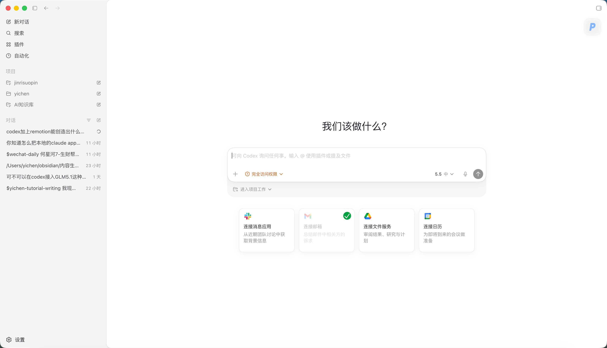

# Codex App 从0到1完整入门教程

> 逸尘(@gengdaJ) 写给小白的一篇 Codex App 实测入门长文，550 行覆盖下载安装、三者区别、主界面地图、11 个设置页、权限边界、踩坑排查、上手路线。

## 一句话定义

Codex App 是一个把 AI Agent 放进你电脑里的工作台，只要你能做的操作，它基本上都能做，而且做得更完美、更高效。

> 一个更偏「做事」的 ChatGPT——不只是回答「怎么做」，很多时候可以直接帮你「做一遍」。

## 三者区别（最容易搞混）

| 名字 | 大白话 | 适合做什么 |
|------|--------|-----------|
| **ChatGPT 普通对话** | 网页/App 里的助手 | 问问题、写文案、解释概念、生成文件/图片 |
| **Codex App 本地版** | 装在你电脑上的 AI 工作台 | 轻松读取本地文件、处理项目 |
| **云端 Codex** | 云端环境跑的 AI Agent | 电脑关机也能跑任务（跑在官方服务器上） |

**判断标准**：
- 一般任务 → 普通对话
- 处理本地文件/项目 → Codex App 里的项目
- 远程持续跑任务 → 云端 Codex

## 主界面地图：左中右三栏



| 区域 | 作用 | 小白最常用动作 |
|------|------|---------------|
| **左边导航栏** | 找入口、找项目、找对话 | 新对话、切换对话、连接插件、设置自动化 |
| **中间对话区** | 你和 Codex 真正交流的地方 | 输入需求、让 Codex 开始工作 |
| **右边结果区** | 展示证据和产物 | 看来源、预览网页/图片/PDF、看代码变化 |

最大差别：它不是只有「问答」，还有「工作现场」——中间告诉你 Codex 做了什么，右边让你看 Codex 产出了什么。

## 左侧六大入口

1. **新对话**：开全新聊天任务，不想沿用旧上下文时
2. **搜索**：找历史对话、跑过的项目任务、忘记名字的上下文
3. **插件**：给 Codex 增加外部拓展能力（Gmail、GitHub、Drive、Slack）
4. **自动化**：让 Codex 定时或延后自动执行任务（日报、监控、定期总结）
5. **项目**：针对指定文件夹、代码仓库开展工作（读文件、改文件、跑本地命令）
6. **普通对话**：不绑定任何项目的纯聊天模式

## 四个易混名词（小白必备）

| 名词 | 大白话 | 例子 |
|------|--------|------|
| **Plugin 插件** | 给 Codex 装能力包 | 装了表格插件就更会处理表格 |
| **Connector 连接器** | 连接外部账号或服务 | 连接 Gmail、GitHub、Google Drive |
| **Skill 技能** | 一套固定工作流说明书 | 「写教程时按我的风格来写」 |
| **MCP** | 让外部工具接入 Codex 的通道 | 调用某个本地服务或工具 |

> 一句话总结：**插件是能力包，连接器是接账号，技能是工作流说明书，MCP 是接工具的通道**。

## 11 个设置页（小白关注点）

### 必关注的 4 个

| 设置页 | 小白关注什么 |
|--------|-------------|
| **常规** | 工作模式（非程序员选「日常工作」）、权限（不要一上来开最大）、发送方式（Cmd+Enter 防误触）、语音输入 |
| **外观** | 主题、字体、字号（基本不影响功能）<br>✨ 新功能：桌宠——输入 `/宠物` 唤起陪伴小可爱 |
| **个性化** | 写自定义说明，让 Codex 按你的偏好回答 |
| **MCP 服务器** | 默认即可，99% 工作用内置插件就够 |

### 保持默认的 7 个

**配置**、**Git**（小白无需懂，先保持默认）、**环境/工作树**、**浏览器使用**、**电脑操控**、**已归档对话**。

### 个性化推荐写法

```text
请默认用中文回答。
如果涉及代码，请先用大白话解释目的，再给具体操作。
如果要修改文件、运行命令、访问外部账号，请明确告诉我风险。
教程类内容请写成小白能照着做的步骤，并标注成功标志。
```

⚠️ **别乱写**：API Key、密码、Cookie、私人身份证、银行卡、公司机密。

### 电脑操控（最强也最危险）

Codex 可以操作 Mac 上的 App（打开、点击、查看界面）。逸尘用它从零写了一份法律检索报告（只登录几个网站，搜索/探究/点击/整理全是它完成）。

**但可能碰到**：微信、邮箱、浏览器、文件管理器、付费软件、公司工具、私人资料。

> 小白建议：第一次用电脑操控，只操作无风险 App。**特别记住不要操作社媒账号和微信**。

## 权限确认（非常重要！）

Codex 可能请求 5 类权限：

| 权限类型 | 意味着什么 | 小白怎么判断 |
|----------|-----------|-------------|
| **文件访问** | 读或改某个文件夹 | 看清楚路径是不是你允许的项目 |
| **终端命令** | 在电脑上运行命令 | 不懂就让它先解释 |
| **浏览器** | 打开网页或操作网页 | 避免付款、删除、发布类操作 |
| **第三方账号** | 连接 Gmail、GitHub 等 | 看清楚授权范围 |
| **电脑操控** | 操作 Mac App | 边界一定要说清楚 |

> 小白最容易犯的错：看到确认按钮就点。**不要这样**，看不懂就问：「这个权限具体会让你做什么？有什么风险？我是小白，应该允许吗？」

## 6 个常见踩坑和排查

1. **一直在跑不知道是不是卡了**：看左边对话状态，转圈=没结束，蓝点=已结束
2. **请求权限不知道怎么点**：让 Codex 解释权限内容和风险
3. **改了项目看不懂**：让它按文件逐个解释 Git diff（用非程序员能懂的话）
4. **生成结果不满意**：**不要重开**，基于结果继续改（保留结构调细节）
5. **插件太多不知道装哪个**：先用官方内置，等明确需要再去插件页找
6. **自动化跑偏**：任务描述太泛，把任务精细化（什么时候执行/执行对象/输出/不要做什么/异常处理）

## 9 步上手路线（强烈推荐）

1. 打开 App，先熟悉左侧导航
2. 新建一个普通对话，问一个低风险问题
3. 打开设置页，**只看不改**
4. 建一个干净演示项目，不要用私人项目
5. 让 Codex 读取项目，生成一个简单 Markdown
6. 看右侧结果区
7. 让它解释它做了什么
8. 再尝试插件页和自动化页
9. 最后再碰 Git、MCP、电脑操控这些高级功能

## 关于 Codex vs Claude Code

> Codex App 是一个非常牛逼、非常适合普通人上手的超级 APP，**比 Claude Code 的 CLI 界面更加好上手**，非常符合小白的使用习惯。

| 维度 | Codex App | Claude Code |
|------|-----------|-------------|
| 形态 | 桌面 App | CLI（命令行） |
| 上手难度 | 小白友好 | 偏技术用户 |
| 操控电脑 | ✅ 内置 Computer Use | ❌ |
| 自动化 | ✅ 内置 | ❌ |

## 账号选择

尽量用付费会员账号登录，免费的经不起折腾。

- **Plus**：小白先尝尝鲜
- **Pro**：大佬级别直接上
- 充值方式：小猫 20 美金礼品卡、gamsgo（缺货）、逸尘 yichen365ai

---

*—— 来源：X @gengdaJ（逸尘），550 行原文，本摘要保留核心结构与 11 张关键截图（19 张全图已归档至同目录 images）。*