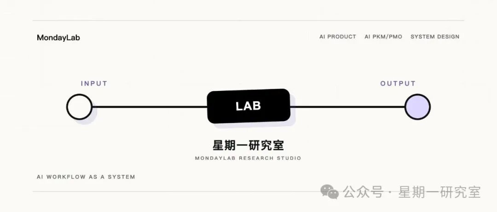
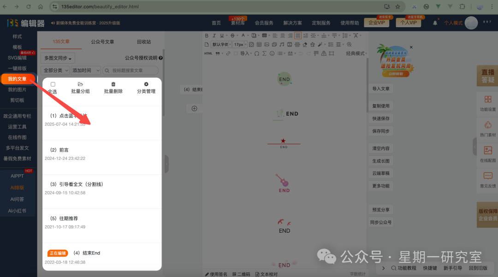
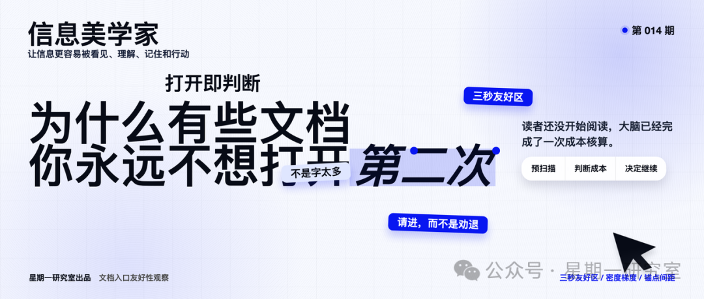
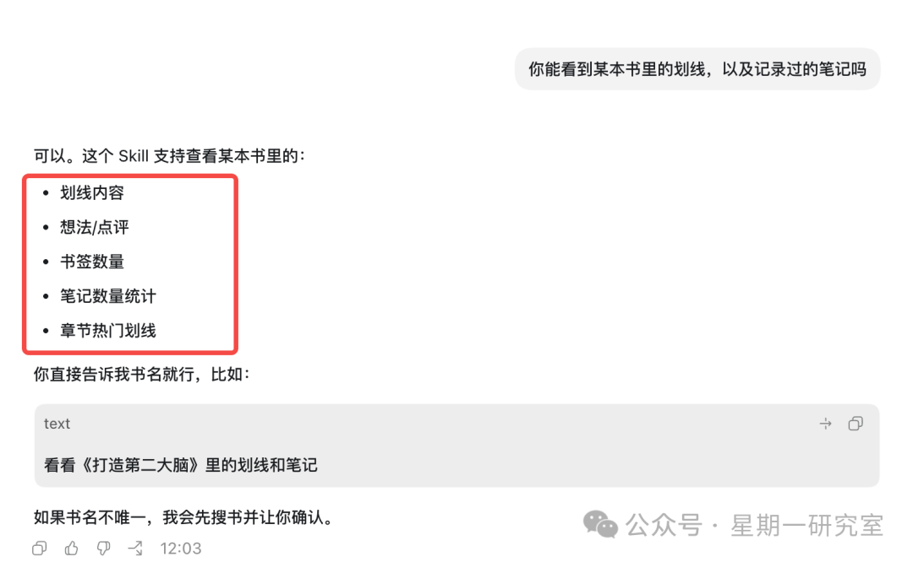
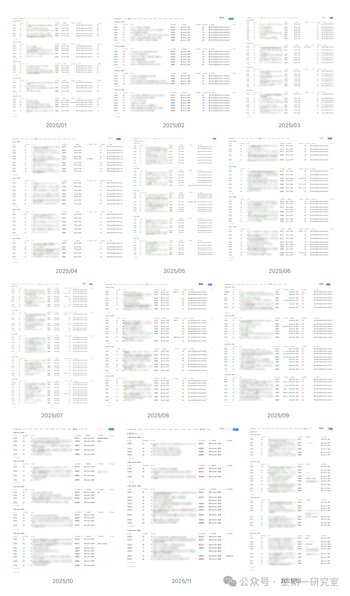
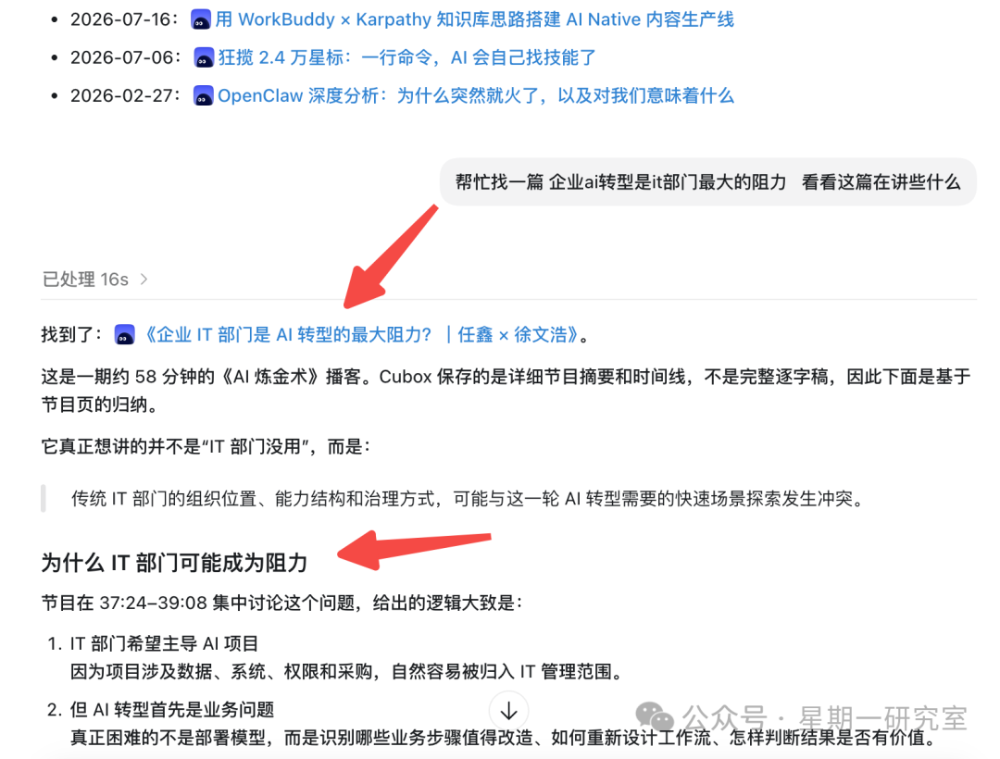
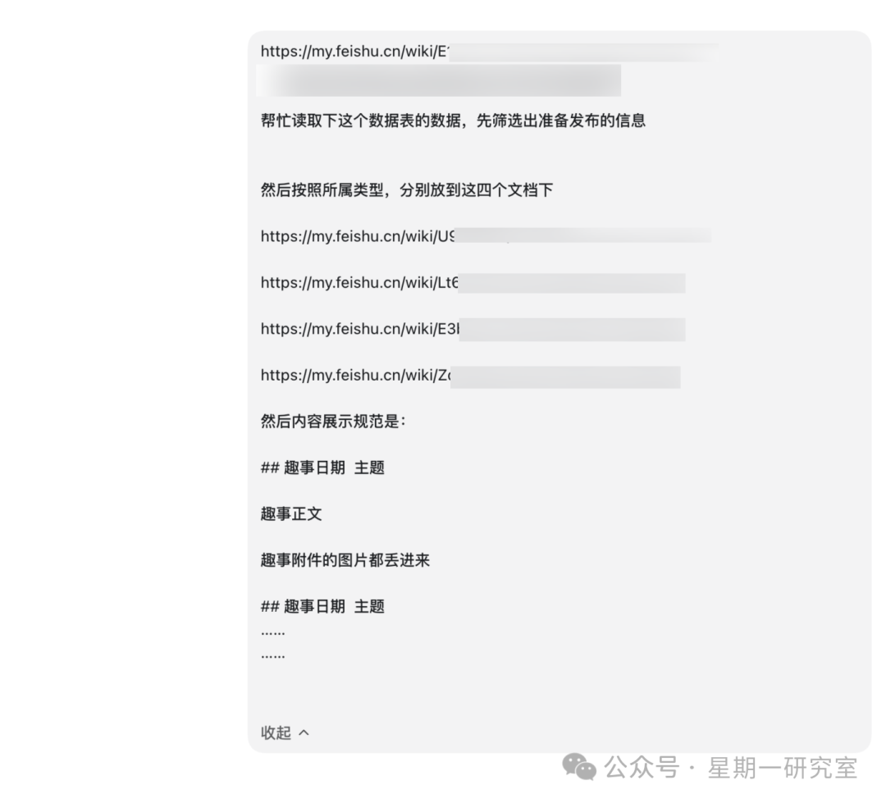
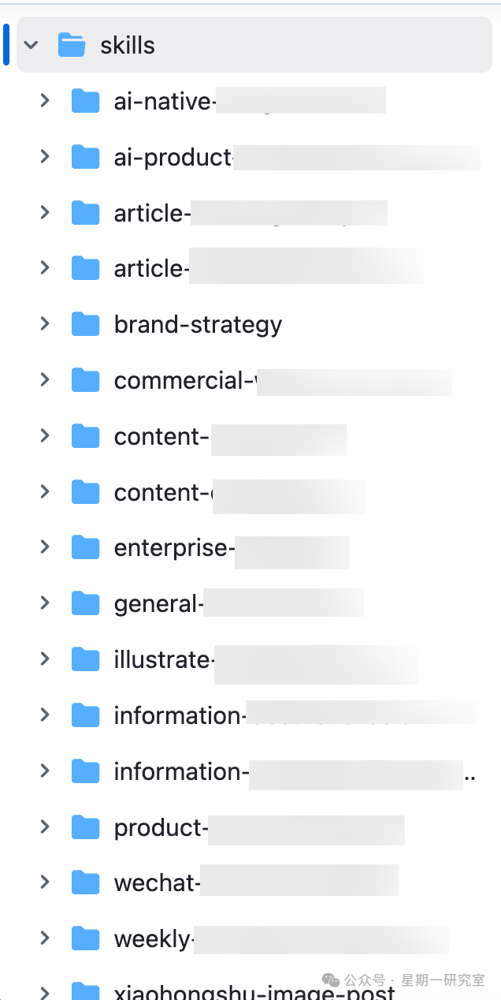
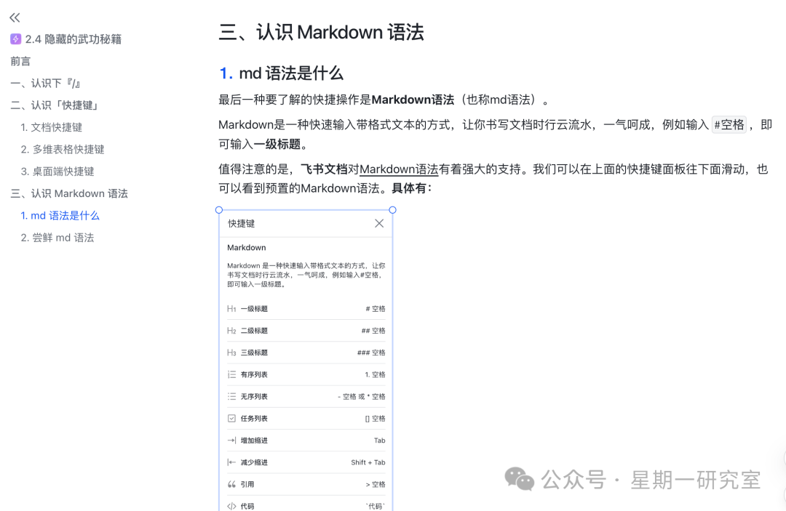
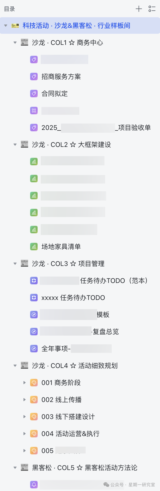

# 拥有创造力的人，就像是一只边牧

> 一个没有任何设计背景的作者，用 Codex 在一个月里干完了过去大半年都干不完的活——从品牌视觉、内容生产系统，到 20 个 Skill 和一系列 Agent，把个人和团队的生产力系统整个重构了一遍。

## 核心观点

> 边牧天生就要出去牧羊，闲下来反而会拆家。在有 Codex 的日子里，人类就像边牧一样，完全不会想停下来——当你做了一个基础的，就会有越来越多的灵感，新的灵感又会推着你继续向上做顶层聚合，不断演变成一个越来越好用的工作流、方案和产品。

## 一、品牌，一个人搞定

- **公众号视觉**：以前用 135 编辑器，头图/尾图/引导关注不统一。用 Codex 直接开发了三个图，品牌视觉统一，每期直接后台加载。
- **信息美学家栏目**：用 Codex 做品牌视觉升级（栏头图、封面图、顶图、底图、色彩预设），并**蒸馏往期 20 期内容做成一个 Skill**，方便写新内容。
- **课程物料**：用 Codex 生成商品图、课程主视觉（3:4 版本），替代传统的稿定设计。

## 二、一个人的生产力系统

| 应用 | 做法 |
|------|------|
| Codex × 微信读书 Skill | 自动整理微信读书划线/评论 → 思维导图 → 灵感 → 文章，替代手动整理 |
| Codex × Notion MCP | 接入 6 年时间管理数据，自动整理周计划/日计划，周六自动整理团队周报 |
| Codex × Cubox CLI | 每周批量整理稍后读，读完后读后感自动归档到多维表格 |
| 商务英语陪练讲师 | 每天早上 6:30 自动推送口语陪练消息，引导一步步回答 |
| 趣事数据库 | 从 2023 年人肉打标签，到用 Codex 自动整理成五大类文档："你只管记录，剩下的交给 Agent！" |
| IP 形象 | 用 Codex 生成一套不同风格的表情包和 IP 形象 |

## 三、20 个 Skill，一座兵工厂

### 国际化动态报刊 Skill

把想看的领域封装进 Skill，每天早上 7 点准推送行业动态到 IM 聊天框，一手行业信息信手拈来。

### 内容生产系统 Agent

6 年写作沉淀了排版 SOP、写作 SOP、中文标点符号 SOP 等大量标准。用 Codex 把这些标准**一一沉淀成原子化 Skill**（星期一研究室的 brand-skillhub），再用 Codex 做大量 Agent，对不同的 cli、mcp 和 skill 做排列组合，整个内容生产非常丝滑。

### Markdown Agent

2019 年开始刻意练习 Markdown，2022 年大模型出现后 API 输出基本都是 Markdown。用 Codex 做了基于 Markdown 的 Agent，服务日常写作。"星期一研究室的文章，是 markdown 最好的压测。"

## 四、把 AI 塞进甲方的日常

### Agent 帮你开会

以前周六晚上 9 点周会，主持人手动拉取多维表格填周报。现在周五 Codex 自动拉取周报更新到多维表格，周六下午 5 点多维表格自动化推送数据到 IM 群，再也不用花十几二十分钟填周报。

### 职业规划 Agent

把岗位信息、职引、面试技巧封装进职业规划 Agent。新的咨询来时，先基础梳理同学信息，再调用 Agent 形成完善且有数据参考的报告。

### 企业管理 Agent

把过去给中小企业做项目管理的样板间整理成多个 Skill，定义不同 Agent 的输入输出，让 Codex 输出完整知识库。B2B 层面提效是过去的 5-10 倍。

## 结束语

细数过去一个月干的活，完全没想到人类的创造力能惊人到这个程度。Codex 爆火只是一个开始，下一个羊群正在路上。

## 配图

