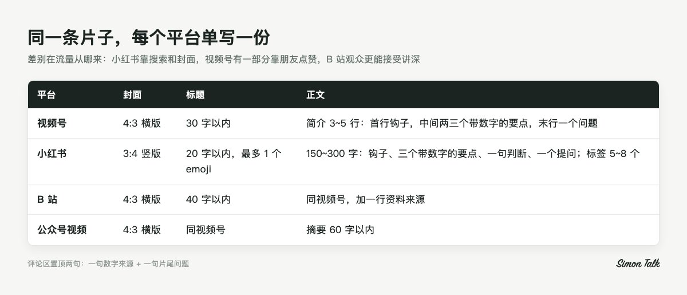
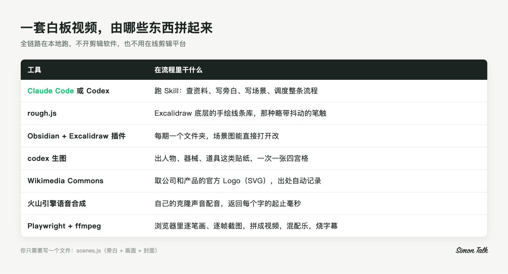
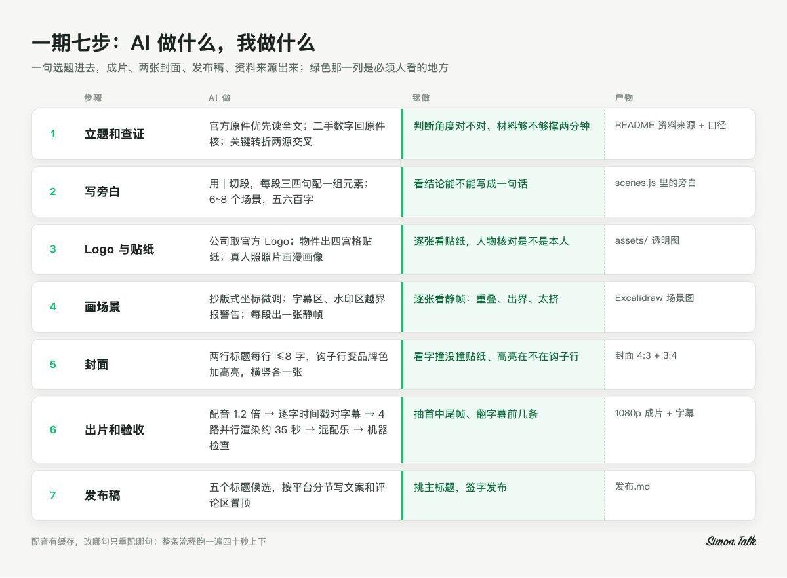
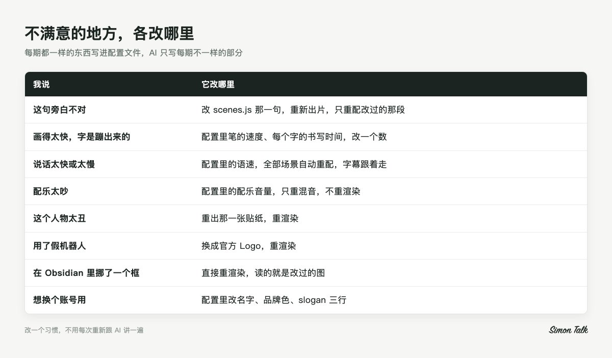

# Codex + Excalidraw 带你一句话出片：手绘白板风格视频，不露脸、不剪辑、高质感

你大概刷到过这种视频。一块白板，一支铅笔，画面上的字和图是跟着旁白一笔一笔画出来的，两三分钟讲完一件事，从头到尾没有人出镜。

我做这种视频，不出镜，不开剪辑软件，画面也不用我动一笔。每一期只需要在 Claude Code 里敲一行 /whiteboard-video，后面跟一句选题。交回来的是四样东西，一条 1080p 的成片，横竖两张封面，一份写好五个候选标题和各平台文案的发布稿，还有一份资料来源。


[video](https://video.twimg.com/amplify_video/2103015003377045504/vid/avc1/1920x1080/_GJKWkBlJS9qq6CY.mp4?tag=29)

一期成片的开场 20 秒，画面跟着旁白一笔一笔画出来

这套东西的底座是两样。Excalidraw 管画风，那种略带抖动的手绘线条、每个场景的图纸格式、一笔一笔画出来的动画，都照 Excalidraw 来，用的是它底层同一个开源线条库，你不用另外装软件。Codex 管手绘线条画不好的部分，人物、道具这些东西交给 codex 生图做成贴纸，整个 Skill 也能直接在 Codex 里跑，我平时在 Claude Code 里用，两边都行。

Obsidian 是加分项。每期的文件夹放在里面，装上 Excalidraw 插件就能直接打开场景图，挪个框、改个字都行。不用它，放普通文件夹也照样出片。

这篇想把两件事讲透。一件是这个 Skill 怎么搭、怎么跑，想自己做一套的可以照着来。另一件是我对这类账号的理解，因为工具只解决"做得出来"，号能不能做起来是另一回事，后者往往更要紧。

先说清楚它不适合谁。你要是想找一个装上就能躺着涨粉的东西，这篇帮不了你。它需要你会开命令行，要装几个工具，第一次配环境得花点时间。每一期你也得自己把关选题、看画面、决定发不发。它能做的，是把一期片子里最磨人的那部分活接过去。

# 一、我怎么看白板视频这种形式

在讲工具之前，我想先聊聊为什么是白板。做号之前把形式想明白，后面很多决定都会顺。

## 1. 画的过程本身就在留人

短视频最难的是让人停下来，停下来以后不走。

白板视频有个天然的优势，画面一直是"没画完"的状态。一个框画了三条边，一行字写到一半，人会下意识想看它画完。这个钩子不用你设计，它长在形式里。

我在做的时候给自己定了一个节奏，一期两分钟到两分半，分成 6 到 8 个场景，每个场景再按旁白切成几小段，每段三四句话配一组新元素。算下来，观众每隔几秒就会看到新东西开始画。节奏一旦断掉，画面静止超过十来秒，人就走了。

## 2. 抽象的东西，画出来才好懂

知识类内容最大的难处是抽象。一个概念由哪几部分组成，一件事的前因后果，一笔账怎么算，光靠嘴说，观众听完就忘。

画出来就不一样了。三栏卡片讲三个要素，中间一条虚线讲两边对比，一排箭头讲因果，观众的眼睛和耳朵拿到的是同一件事。所以白板号最适合讲"有结构"的东西。纯观点、纯情绪的内容，画不出东西，白板的优势就没了。

## 3. 不露脸，就得靠"认得出"

不露脸对很多人来说是个解放，有知识、不想出镜，也能做号。

但代价是人设弱。观众没有一张脸可以记，他记住的只能是你的风格。所以白板号比真人号更需要统一。同一种手绘，同一套配色，同一个封面版式，同一个片尾。一个人点进你的主页，看到一排整整齐齐、一眼能认出是同一个系列的封面，关注的概率会高很多。关注这个决定，很多时候是在主页上做的。


这个系列的 9 张竖版封面放在一起，同一种手绘，同一个版式，同一个角标

## 4. 它也有做不好的题

需要现场画面当证据的题，比如突发事件和实地调查，白板讲不出说服力。观众想看的是那张照片、那段录像，你画得再好，他也会觉得隔了一层。

还有热点。热点片的生命周期很短，一两周以后就没人搜了。白板片做起来有成本，拿它去讲常青的问题更划算，"XX 是什么""为什么会 XX""XX 怎么算"，这种问题几个月以后还会有人搜进来。

# 二、账号怎么做：我的几条运营判断

这一部分和工具无关，你用什么方式做白板视频都用得上。

## 1. 先写一句定位

给谁看，讲什么，讲成什么样，写成一句话。

"给刚毕业的职场新人，每期两分钟画清一个职场规则"，这就是一句能用的定位。"用 AI 做知识科普"就不行，观众看完不知道自己能得到什么。

这句话写好以后，账号名、头像、简介、系列标签都跟着它走。我的 Skill 里有一个固定的系列标签，每张封面左上角都有，就是为了让人刷到第二次、第三次的时候能认出来。

## 2. 一期只回答一个问题

我判断一个选题能不能做，有个很简单的测试。动笔写旁白之前，先把结论写成一句话。写得出来，就能做；写不出来，说明你自己还没想清楚，硬做出来观众也看不明白。

Skill 里旁白的结构是固定的，最后一段一定是"一句话总结加一个评论区问题"。这个结构反过来逼你在开始之前就想好结论是什么。

选题从哪来，我觉得最靠谱的是看别人在问什么。小红书和抖音搜索框的下拉联想，同行评论区里被点赞最多的提问，都是现成的需求。自己拍脑袋想出来的题，往往是自己觉得有意思，观众不一定关心。

## 3. 开头几秒，千万别给一张白纸

白板视频有个容易踩的坑。白板嘛，开头是空的，笔要一点点画，前两秒屏幕上什么都没有。刷到的人一看是白屏，手指一滑就过去了。

所以开场第一段，我会放一个大字标题配一句反差或者定义，字号开到 140 以上，让它最先画出来。比如先写出一个概念的名字，下面一行灰字说"它和你以为的不一样"，旁边再摆两三个对比的小图。观众一眼就知道这期要讲什么、有什么意外。


一期真实开场的前 6 秒：0.5 秒开始写标题，1.2 秒标题基本成形，3.5 秒主角入场

## 4. 知识号的本钱是"信得过"

知识号最怕的是评论区有人挑出一个错的数字。一次还好，两三次以后，观众会默认你说的东西都要打个折扣，这个信任很难再攒回来。

所以这套 Skill 里有一条规矩写得很死，数字、日期、价格，先查再写，每一个都要记进那一期的资料来源，写清楚出自哪里、支持的是哪一句、哪天核对的。估算的值，旁白里和文案里都要标"据报道"或者"估算"。

还有个细节我觉得特别值。口径单独写一节，比如"240 倍是 6000 万除以 25 万"。旁白、字幕、封面、发布文案里的数字全从这一节取。改一处，就知道要全改。很多账号出错，出在旁白改了、封面没改。

## 5. 标题写五个，再挑一个

标题我不会一次写定，每期固定写五个候选，五种写法各来一个。

1. 数字反差，小数字对大数字，后半句点破
2. 事情或者公司做主语，一件事加一个反常识
3. 结论放前面，先给判断再给理由
4. 换算成生活里的单位，把大数换成观众有体感的东西
5. 提问，观众看了会想回答的那种

写完五个放在一起比，哪个最好一目了然。我自己的经验是主标题用前两种最稳，提问式的放到简介最后一行和评论区。

## 6. 同一条片子，每个平台单写一份

同一条片子可以发好几个平台，但文案不能一份走天下。



同一条片子四个平台的封面、标题和正文规格

平台之间的差别在于流量从哪来。小红书很多人是搜进来的，标题里要带大家会搜的词。视频号有一部分流量是朋友点赞带来的，结尾那个问题要让人愿意留言。B 站观众更能接受讲深一点。

所以 Skill 出发布稿的时候，是按平台一节一节写好的。发的时候看清楚是哪一节，别贴错。

## 7. 评论区置顶，一条干两件事

置顶评论我固定写两句。第一句说清片子里某个数字的来源，比如"这个数是某某记者的估算，公司没公布过"。第二句重复片尾那个问题。

免责和互动放在同一条里，看的人不觉得是在打官腔，想挑刺的人也看到你把话说在前面了。

## 8. 几条红线

知识号出事，多半出在这几处。

- 主角是事、公司或者现象。讲到公众人物，只讲公开的商业事实，标题让事件或公司做主语，不碰私德和八卦
- 质疑的说法标"据报道""被质疑"，没查明的原因不写成实锤
- 不写"稳赚""抄作业""建议买入"，结尾问"你会不会"，不问"该不该买"
- 政治、宗教、民族、未决的官司、灾难伤亡、未成年人，绕开
- 画面里 AI 画出来的东西只是示意，不当证据用；平台要求标注 AI 生成的，老老实实勾上

# 三、拆解这个 Skill：一期是怎么跑完的

下面讲工具。先看分工，这套东西靠几个开源工具和两个服务拼起来。



这套白板视频用到的工具和各自的分工

全链路在本地跑，不用任何剪辑软件，也不用在线剪辑平台。

一期分七步，我按顺序讲，每一步说清楚 AI 做什么、我做什么。



七步里绿色那一列是我必须亲自看的地方

## 第一步：立题和查证

我给一句选题，AI 先去查资料。它会优先读官方原件，官网、发布会、财报、监管文件，而且要读到全文。二手站的数字只当线索，一定要回原件核对。关键的转折至少两个来源交叉。

查到的每个数字进这一期的 README，出处、支持哪一句、核对日期，一条一行。

这一步我要看一眼。选题的角度对不对，材料够不够撑起两分钟，这是我的判断，不是 AI 的。

## 第二步：先写旁白，再想画什么

这套 Skill 里最重要的一条顺序是先旁白，后画面。

旁白写在一个叫 scenes.js 的文件里，这是一期唯一需要写的文件。旁白用一根竖线"|"切成一小段一小段，每段三四句话，每段配一组要画的元素。一期 6 到 8 个场景，五六百字，配音用 1.2 倍语速，出来就是两分钟出头。

写旁白有几个讲究。口语，短句，一句一个信息点。数字尽量写成中文读法，"三百美元"比"300 美元"念得准。像"@"这种符号配音会念歪，能换就换。还有一条我很看重，每一段都得有东西能画出来，画不出来的抽象句子，就并到前后段里去。

旁白的结构也是固定的。开场给一个定义或者反差，然后拆开讲，三要素、两列对比或者一条时间线挑一种，接着讲怎么做、怎么算，再给数字和门槛，然后泼一盆冷水讲边界，最后一句话总结加一个评论区问题。

## 第三步：出 Logo 和贴纸

旁白写完，先列出这一期会出现的东西，分三类处理。

公司、产品、模型，用官方 Logo。 Skill 会去 Wikimedia Commons 找官方的 SVG 文件，转成透明图放进画面，出处自动记下来。有年份的取最新版，公司的字标和产品的图标分开用。两家公司对比，还能拼一张左右对打的图当封面主图。

这条规矩的来历是有一次 AI 自作主张，把两家公司画成了两个卡通机器人。挺可爱的，可是观众根本认不出谁是谁。讲到具体的公司，观众需要的是半秒钟就能认出来的那个标。


两家公司对比的一期，封面主图直接用两个官方 Logo

人物、器械、道具，用 codex 生图做贴纸。 Excalidraw 写字画框很好看，画人就很丑，这点我是真受不了。所以人和物件都交给 codex，一次出一张 2×2 的四宫格，四张画风一致，只花一次额度。出完自动抠白底、去杂点、裁边，存成透明图。

风格提示词是写死的，每次只换前面的主体描述。这段原样给你，拿去就能用。

```
Whiteboard sticker illustration in Excalidraw hand-drawn style: thick, slightly wobbly black marker outlines, flat pastel fills using ONLY these colours: pale yellow #ffec99, pale blue #a5d8ff, pale green #b2f2bb, pale red #ffc9c9, light grey #e9ecef, plus black lines. Simple chibi proportions, clean and readable at small size, isolated subject centred on a PURE FLAT WHITE background #FFFFFF with nothing else. No shadow, no ground line, no texture, no gradient, no text, no letters, no numerals, no logos, no watermark, no border, no photorealism, no 3D, no thin pen lines, no cross-hatching.
```

主体描述写在它前面。人物写体型、姿势、衣服颜色和表情，比如 a chibi person sitting and reading a book, wearing a pale blue shirt, calm smile。物件写视角和主色。别写背景、文字和数字。那五个颜色就是 Excalidraw 自带的浅色，贴纸放进画面才不跳。


左边是 codex 出的四宫格原图，右边是切开抠好的四张透明贴纸

讲到具体的公众人物，用照真人画的漫画像。 拿维基百科上的公开照片当参考，让 codex 只借长相，脸型、发型、眼镜、标志性的衣服，画风还是白板贴纸。姿势跟着立场走，赞同的竖大拇指，反对的抱着胳膊。只画公开形象，不丑化。


照公开照片画的白板漫画像，只借长相，画风和贴纸一致

这里有个坑要提醒你。人物漫画像一定一张一张排队出，别同时跑好几个。生图工具偶尔不按指定位置存图，脚本就去抓最近生成的那张，几个任务一起跑，会互相抓错。出完每张都要看一眼是不是本人。

## 第四步：画场景，然后逐张看静帧

场景也写在 scenes.js 里，一行代码一个元素，写一行字、画一个框、放一张贴纸，都是一行。画布 1920×1080。

有两块地方是禁区。底部 y 坐标 960 以下留给字幕，右上角 320×130 留给水印，元素压进去，Skill 会报警告，警告清零才能往下走。

一屏放 10 到 20 个元素。一段旁白塞不下的时候，删元素，别指望笔画得完。笔画有自己的速度，一段画不完，最多拖到下一段开头的三分之一左右，再多就只能整体加速，画面会显得很赶。

版式我攒了一套常用的，开场大标题配三个对比物，左右两列对比，三栏卡片，中心图配三个下游，清单，参数价格卡，总结页。每个都有现成坐标，新一期直接抄过来微调。


从几期成片里截的场景画完时的样子：左右对比、三栏卡片、时间线、柱状对比、分账条、总结页

画完以后，Skill 会给每一小段出一张"画完时"的静帧。这一步我一定逐张看。有没有重叠，有没有出界，字有没有太宽，一屏是不是太挤。文字宽度在程序里是估算的，有时候会差一点，只有眼睛看得出来。

## 第五步：封面

封面在 scenes.js 末尾用一个函数写，横版 4:3 和竖版 3:4 一次出两张。

标题最多两行，每行不超过 8 个字。第一行说对象，第二行放钩子，钩子那行自动变品牌色，下面垫一道马克笔高亮。数字放在副标里，主角放一张贴纸或者 Logo。四周一圈手绘粗边框，角上有品牌标。


同一期的横版 4:3 和竖版 3:4，一次出两张

出完我会看三件事，字有没有撞到贴纸，高亮是不是压在钩子那一行，品牌标是不是在角上。

## 第六步：出片和验收

一条命令跑完剩下的全部，场景、配音、渲染、混配乐、出封面、清理中间文件。

配音用火山引擎的声音复刻，我用的是自己的声音。语速用火山原生的参数调到 1.2 倍，原生合成音调不会变尖。火山合成时会返回每个字从第几毫秒开始、第几毫秒结束，字幕就靠这组时间戳对齐。字幕的文字用稿子原文，时间用配音的，这样配音把"@"念成什么都不影响屏幕上的字。

渲染是在浏览器里逐笔画、逐帧截图。一条边画完再画下一条，字一个一个写，字号越大写得越慢，两笔之间有抬笔的停顿，一支铅笔跟着笔尖走。


字是一个一个写出来的，铅笔跟着笔尖走


同一个画面，左边画到一半，右边画完

这些快慢都写在配置里。我自己看片时最在意的是字，一个字一个字写出来，观众的眼睛会跟着笔走，读字幕和看画面变成了同一件事。

现在 4 路并行渲染，一期两分半的片子，渲染大概 35 秒。配音有缓存，改了哪句只重配哪句，整条流程跑一遍四十秒上下。

配乐在说话的时候自动压低，停顿的时候抬回来一点，片尾淡出。音量是配置里的一个数，嫌吵就调小，只重混音，不用重新渲染。

片尾是 5 秒多的品牌卡，手写账号名、一道绿线、slogan，下面一行点赞关注评论。右上角的手写水印在第一个场景开头跟着笔一起画进来。这些都是自动加的，不用每期操心。


每期自动追加的片尾品牌卡，5 秒多

出完片不能直接发。机器先检查一遍，尺寸、帧率、时长、音轨在不在、音画是不是一起结束。然后我抽开头、中间、结尾几帧看，字幕在不在底部，水印在不在右上角，贴纸擦出来正不正常，片尾卡有没有问题。再翻一下字幕文件的前几条，看有没有错字，数字有没有被拆开。

## 第七步：发布稿

最后一步写发布稿，五个标题候选挑一个主用，再按平台一节一节写文案，评论区置顶也写好。文案里的每个数字，都要在 README 的资料来源里找得到。

交付的时候，成片、两张封面、发布稿一起给我，主用标题和视频号简介直接贴在消息里，我复制就能发。

# 四、改起来有多方便

一个工具好不好用，很大程度看改东西麻不麻烦。这套 Skill 我最满意的地方，是几乎所有"我不满意"都对应一个很小的改动。



常见的不满意，各对应一个很小的改动

这里面藏着我搭 Skill 时最看重的一个原则。每期都一样的东西写进配置文件，语速、配乐音量、字幕字号、水印位置、账号名都在里面。AI 只负责每期不一样的那部分，旁白和画面。这样我改一个习惯，不用每次重新跟 AI 讲一遍，它也不会哪天忘了。

# 五、我最看重的几条规矩

一个 Skill 稳不稳，看它写死了哪些规矩。这套里我认为最值钱的是这几条。

1. 先旁白，后画面。每一段都得有能画的东西，画不出来的句子并进相邻段
2. 字幕区和水印区是禁区，压进去就报警告，清零才往下走
3. 公司用官方 Logo，人物用照真人画的漫画像，物件用贴纸，文字、箭头和框才用手绘线条
4. 数字先查再写，出处和口径进 README，所有地方的数字从同一处取
5. 每期都一样的东西进配置文件，AI 只写每期不一样的部分
6. 一期的所有文件在同一个文件夹里，scenes.js 是唯一手写的源，其余都是生成出来的，不手改

最后一条看起来像工程洁癖，用起来很省心。一期的旁白、场景图、贴纸、字幕、封面、资料来源、发布稿全在 Obsidian 的一个文件夹里，打开就能看，场景图装了 Excalidraw 插件能直接改。成片这种大文件放在另一个后台目录，知识库里只留看得懂、改得动的东西。


左边是一期的文件夹，右边是在 Obsidian 里直接打开的场景图，能挪能改

# 六、想自己搭一套

整套 Skill 已经开源在评论区。README 里有样片、一期完整示例，克隆下来照着步骤跑一遍，一分钟左右就能在你电脑上出第一条片。

要准备的东西。

- Claude Code 或 Codex
- codex，用来生图
- Obsidian，装 Excalidraw 插件
- 火山引擎账号，开通语音合成，想用自己的声音就做一次声音复刻
- 电脑上装好 Node.js、Playwright 和 ffmpeg

第一期我建议这么做。

1. 先写定位那句话，再从搜索框里挑一个大家真在搜的问题
2. 场景控制在 6 个以内，先把一期完整跑通，别追求好看
3. 静帧一张一张看，排版满意了再出片
4. 出片后抽几帧看字幕和水印，发之前把红线过一遍

跑通第一期以后，把字号、配色、封面样式、片尾卡定下来，之后就别再动了。版式定死，精力全留给选题。

# 写在最后

搭这套东西的过程里，我越来越确定一件事。制作被压到一分钟以后，账号拼的就只剩选题和判断了。工具能把制作的活全接过去，但它替你想不出一个值得讲的问题，也替你担不起一个说错的数字。

所以我给想做白板号的朋友三条建议。

1. 开号之前先攒二三十个题，每个写成一个问题句
2. 版式尽早定死，把力气花在选题和核对上
3. 标题、封面和数字，每一期都自己签字再发

有问题评论区问，我看到都会回。
