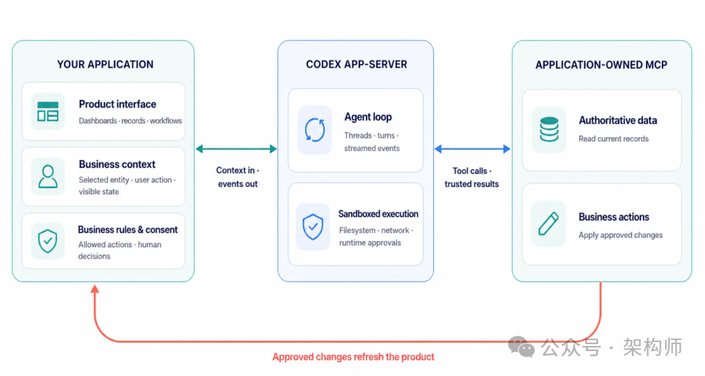
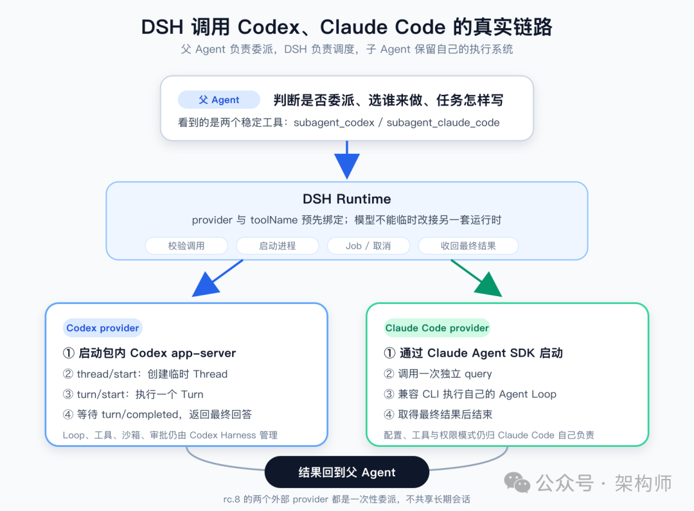

# 从 Codex Harness 到 DSH Subagent：Agent 正在进入软件架构的新一层

> 作者：若飞 | 公众号：架构师（JiaGouX）

---

## 背景

DSH（DeepSeek Harness）升级到 0.1.0-rc.8，看到一个挺有意思的变化：DSH 可以直接把 Codex 和 Claude Code 叫来当 subagent。

平时我们打开 Codex、Claude Code，都是直接让它们干活。到了 DSH 里，它们忽然出现在另一个 Agent 的工具列表里。DSH 把 Codex 和 CC"降级"成子代理了。

笑完再看源码，这事其实比"多 Agent 开始带队"更基础一些。DSH 调用的不只是另一个模型接口。一次 `subagent_codex` 调用，会启动 Codex 自己的 app-server、thread、turn 和 Agent Loop。父 Agent 只是把任务交出去，真正读代码、调工具、进沙箱并处理审批的，仍然是 Codex 那套完整的执行系统。

---

## 第一层：代码已经把 Agent 的执行入口打开了

### Codex 把产品背后的 Harness 露了出来

Codex 的开源仓库并不是这周才出现。OpenAI 本周更明确的动作，是把 Codex 背后的 Harness 放到了"平台"这个位置上，同时把外部应用怎样接入讲清楚了。

按 OpenAI 的定义，Harness 是模型周围的"执行系统"。它管理对话状态、流式执行、工具、沙箱和审批策略，让一项任务能跨过多轮模型调用继续往前跑。

开放到哪里，官方也列得很清楚。这次对外开放的是 Codex CLI、SDK、app-server，以及 Skills、Plugins 等 Harness 与集成界面。模型访问和托管服务仍然分开，IDE 扩展和 Codex cloud 也不在官方列出的开源组件里。

做架构时，我更关心这条边界：哪一层可以自己检查、改造和嵌入，哪一层还是外部依赖。

app-server 正好把这两边接起来。外部应用可以通过它创建 thread、启动 turn、接收事件、中断任务和回应审批；执行任务的，仍是 Codex core 里的 Session 和 Agent Loop。

从代码职责看，app-server 更像控制接口和事件转换层，并没有在 core 外面再造一套 Agent Loop。它把外部请求转换成 Thread/Turn 操作，再把核心事件整理成客户端能消费的通知。宿主可以换界面、接业务上下文，任务仍由同一套 core 执行。

从源码往下追，这条路很清楚：

> 外部宿主 → app-server → thread/start → turn/start → run_turn → 模型采样与工具执行

`thread/start` 不只是添加一条聊天记录。它要准备配置、工作目录、沙箱、权限和工具，再创建核心 Thread 并订阅事件。`turn/start`、`turn/steer` 和 `turn/interrupt` 都会回到这个 Thread。更里面的 `run_turn` 才去处理模型采样、工具结果回填、待处理输入、上下文压缩和取消。

CLI、SDK 和 app-server 面向的是不同接法。`codex exec` 适合 CI、脚本和边界清楚的一次性任务；SDK 方便程序启动、恢复或流式接收 Codex 的工作；app-server 则把 thread、turn、事件、中断和审批直接交给外部产品。

这也是 DSH 选择 app-server 的原因。它需要亲自创建 thread、启动 turn、等待完成并处理中断，不只是在命令行外面等一段输出。

### DSH 没有重做 Codex，而是把它接成一个子代理

在 rc.8 里，Codex 和 Claude Code 是两个可以按需安装的配置包（Profile Bundle）。安装后，还需要在 Agent 预设中显式打开相应工具，再新建会话。父 Agent 随后会看到 `subagent_codex` 和 `subagent_claude_code` 这样的具名工具。

实际调用分成了两段。父 Agent 在当轮推理中决定要不要委派、选哪个工具、任务怎么写，以及前台等待还是放到后台。DSH 运行时则负责把适配器注册成工具、校验调用、启动进程、管理后台 Job、传递取消信号并收回结果。

这里的 provider（子代理提供方）也不是模型临时填一个名字就能随意切换。一个 `dsh-tool-subagent` 配置会预先绑定 `providerName` 和固定的 `toolName`。模型看到的是 `subagent_codex`、`subagent_claude_code` 这类稳定工具；工具背后究竟接哪套运行时，仍由宿主配置决定。

Codex 这边的链路可以压缩成一行：

> 父 Agent 调用 `subagent_codex` → DSH 启动 Codex app-server → 创建临时 thread → 启动一个 turn → 等待 `turn/completed` → 把最终回答交回父 Agent

Claude Code 走的是官方 Claude Agent SDK。DSH 通过 SDK 拉起随包安装的兼容 CLI，执行一次独立 query，取得最终结果后结束。

对父 Agent 来说，这两者都是 Tool。但这个 Tool 不像普通函数，一次调用会拉起另一套完整的 Agent 运行过程。Codex 继续管自己的 Loop、工具、沙箱和审批；Claude Code 也保留自己的配置和权限模式。DSH 没有把它们拆成几个 Function 再重写一遍。

还有一个排障时很实用的细节。Codex 适配器固定使用包内的 `@openai/codex@0.147.0`；Claude Code 适配器也由固定版本 SDK 选择随包安装的兼容 CLI。两边都不会转头去找系统 PATH 里的同名命令。如果子代理的表现和终端里直接运行不一样，只查 `codex --version` 或 `claude --version`，可能已经看错了进程。

### rc.8 接通了委派，还没有组成一支常驻团队

Codex 适配器每次都会新开一个进程、一个临时 thread 和一个 turn；Claude Code 适配器也会新开一次 SDK query，并设置 `persistSession: false`。两边都只拿到一段独立任务文本和父会话的工作目录，不继承父对话、角色设定、工具筛选、深度策略和输出格式。

任务结束后，父 Agent 主要拿到最终文本或整理过的错误说明。子 Agent 中间调了哪些工具、改了什么文件、用了多少 Token，不会原样复制进父会话。后台任务可以查询或取消，却不能拿着 Job ID 继续上一次 Codex 或 Claude Code 会话。

DSH 的通用 subagent 子系统已经有可继续的进程内子 Agent、消息投递和恢复设计，所以不能把整个 DSH 都概括成 one-shot。但 Codex、Claude Code 这两个外部产品适配器，在 rc.8 里确实还是一次性委派。

它们有取消和进程清理，却没有替业务任务补上统一的超时验收和副作用回滚。两个适配器又沿用父会话的工作目录。几个子代理如果同时改同一批文件，冲突不会因为大家都是 Agent 就消失。

**从当前代码能确认到这里**：Codex 的执行系统已经可以被外部驱动；DSH 可以把完整 Agent 暴露成父 Agent 眼里的工具；Codex 和 Claude Code 这两个适配器目前仍停留在一次性委派。

---

## 第二层：Agent 是否会成为软件架构的新一层

### 组合的粒度抬高了一层

回头看我们 2025 年写过的 MCP 和 Agent 技术栈，这条变化并不是凭空冒出来的。

当时写 MCP，我们关心的是 Agent 怎样用一套相对统一的接口找工具、取数据、执行动作；写 Agent 技术栈时，已经把状态、工具、安全沙箱、框架编排和托管拆成了不同层。那一阶段最常见的组合单元，还是工具和工作流。

到了今年，我们又沿着 Context、Loop、Harness 和 Environment 往下拆。这次 DSH 接进来的，不再是一项工具能力，而是带着自己 Loop、状态和权限体系的 Codex、Claude Code。原来的积木没有消失，只是外面又多包了一层：

> 模型调用 → 工具调用 → Agent 调用

工具协议解决"Agent 怎样使用能力"。到了 Runtime 这一层，问题变成了：一个完整 Agent 怎样被另一个系统调用？

### 它更像 Runtime，不太像一个更大的函数

传统函数拿到参数，执行一段预定义逻辑，再返回结果。完整 Agent 的调用重得多。它要维护上下文，在模型与工具之间多轮往返，遇到敏感动作要请求审批，期间还会产生状态、事件和可见的副作用。

如果这套运行过程可以被外部应用创建、恢复、中断、观察和审批，它在架构上就开始接近 Runtime：上面接宿主和业务系统，下面接模型、工具与沙箱。

这也是我看 Codex app-server 和 DSH Subagent 时最在意的地方。一个 Agent 开始摆脱固定的 CLI、IDE 或聊天界面，成为别的系统能够发起和管理的执行单元。

它和服务调用很像，又不能照着微服务直接抄。普通服务常用类型明确的请求和响应；子 Agent 收到的往往是一段自然语言任务。普通服务的副作用通常被接口和事务框住；Agent 可能拿着一个工作目录，连续读写许多文件，甚至调用外部工具。子 Agent 返回"已经完成"，也往往只是一份自述，还不是可以入账的业务事实。

如果未来真要按 Agent 来组合系统，还得补齐任务合同、资源计量、超时、隔离、可观测、权限联动和副作用处理。

### Agent 编排：把几种控制权拆开

如果 Agent 逐渐成为可组合的执行单元，"主 Agent"就更像一次任务里的角色，不再是固定的产品身份。Codex 可以直接面对用户，也可以在 DSH 里接过一项被分配的任务。谁来带队，取决于当前任务怎样组织。

不过，调度能力不等于全部控制权。把 DSH 这条调用链拆开，至少有四种责任：

| 参与者 | 在调用链里做什么 |
|--------|-----------------|
| 父 Agent | 判断是否委派、选择子代理、组织任务、决定是否等待 |
| DSH 运行时 | 暴露工具，启动适配器，管理进程、Job、取消和结果收集 |
| Codex / Claude Code | 在各自 Harness 内维护上下文、运行 Loop、调用工具，执行原生沙箱和权限策略 |
| 业务系统与人 | 提供权威事实，决定业务动作能否发生，用真实结果验收 |

有三件事不能混在一起：

- 选中子代理，不等于拿到全部权限
- 子代理说"完成"，不等于业务验收通过
- 取消 Job，也不等于副作用已经回滚

Harness 管 Agent 怎样跑，业务系统管哪份数据算数、谁有权改、最后是不是真的改成了。

### Harness 有可能成为新的基础设施层

OpenAI 在官方文章里给过一组 ARC-AGI-3 实验数字：保留推理状态并启用上下文压缩后，同一个 GPT-5.6 Sol 的得分从 13.3% 提高到 38.3%，输出 Token 降到原来的六分之一。

这组数字只适合放在原来的实验条件里看。它不代表模型的通用能力涨了三倍，也不代表其他任务都能节省六倍 Token。它能支撑的只是一个更克制的判断：模型没换，执行状态怎样保留、上下文怎样整理，结果也会差很多。

所以，我现在更愿意把 Harness 理解成 Agent 时代的执行基础设施。模型提供推理能力，Harness 管状态、Loop、工具、沙箱、审批和事件，宿主则把它接进具体产品和业务流程。

这一层不会取代业务后端。Harness 里的状态不是订单、运单或发布记录；Harness 的审批也不会自然继承公司的业务授权。它负责让 Agent 持续、可控地干活，业务系统仍然负责事实、授权和验收。

代码开放、协议跑通、生产可以托付，仍然是三件事。

Codex app-server 和 DSH Subagent 至少让一个方向变得更具体：**Agent 正在从一个需要人直接使用的产品，变成其他软件也能调用的执行单元。**

---

## 值得思考的四个问题

以后做系统架构，多问几件事：

1. 谁调度 Agent？
2. 谁维护执行过程？
3. 谁批准动作？
4. 最后又由谁给结果认账？