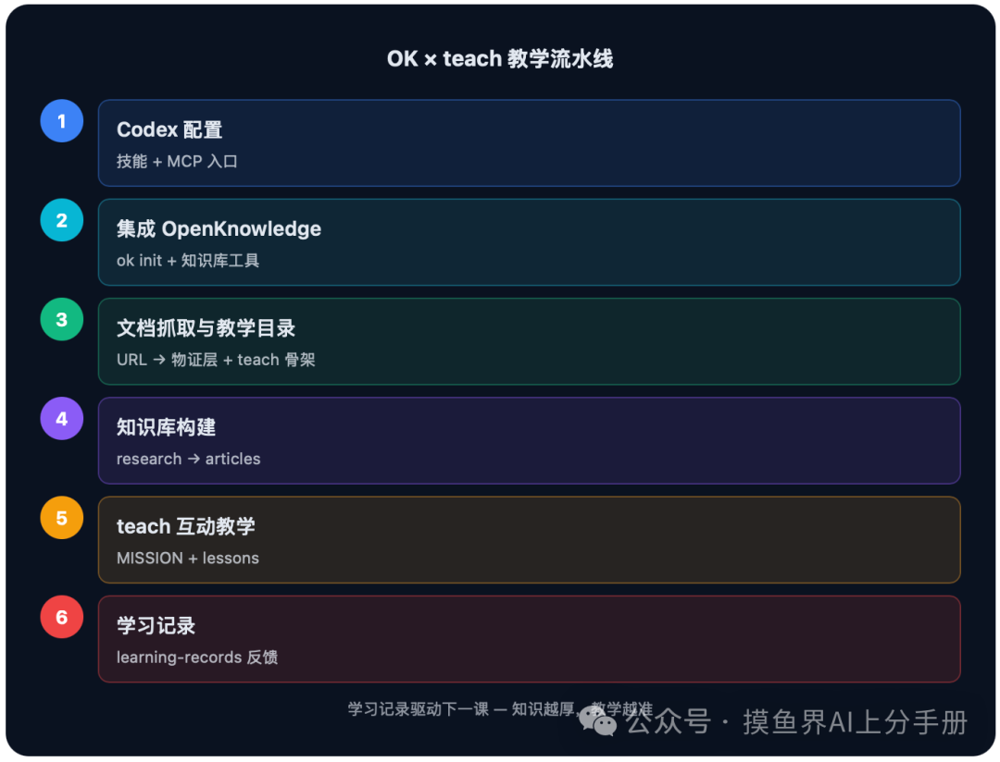

# 把文档变成课堂：用 Codex + OpenKnowledge + Teach 技能搭一条互动教学链路

> AI 现在很会"答"，但很少会"教"。回答是一次性的，教学是状态的：好的教学会记住你学过什么、卡在哪里、下一次该练什么。要真正让 AI 教我们，需要三样东西拼成一条链路：一个可靠的代理运行时（Codex）、一个有证据链的知识底座（OpenKnowledge）、一套有教学法的方法论（teach 技能）。

本文记录这条链路的完整搭建过程。每一步都给出真实命令和产出，可以照着跑一遍。

## 第一环：Codex 配置——先给代理装上"教学法"

Codex 是代理运行时。它本身不教课，但它能加载技能（Skill）——技能是写给代理看的操作手册，决定了代理面对某个请求时该按什么流程走。

技能散落在几个目录，按优先级加载。teach 技能放在个人技能中枢，其入口定义在 agents/openai.yaml：

- `allow_implicit_invocation: false` 很关键：teach 不会被代理顺手捡起来乱用，而是由用户显式唤起——"教我 XX"。教学是一件有状态的事，不该被隐式触发打断。

另一个容易被忽略的配置是 `config.toml`。Codex 的 MCP 服务都注册在这里，OpenKnowledge 也是从这里接入的。这一环做完，代理有了"教学法"和"接入知识库的入口"，但知识库本身还不存在。

## 第二环：集成 OpenKnowledge——知识有了实时协作底座

OpenKnowledge（OK）是一个把 Markdown 目录变成实时协作知识库的平台。和普通笔记系统的区别：它用 CRDT 做并发合并，人类和 AI 代理可以同时编辑同一篇文档，每次改动都有署名；浏览器预览会实时渲染编辑结果。

集成只要一条命令，在项目根目录执行，一次性完成四件事：

1. 生成 `.ok/` 项目配置目录
2. 把 MCP 服务注册进检测到的编辑器（Claude Code、Cursor、Codex）
3. 为每个编辑器安装项目级技能（`.codex/skills/open-knowledge/`），让代理拿到完整的读写契约
4. 确保项目有 `.git/`

在 Codex 里，MCP 服务最终落在 `~/.codex/config.toml`。这段引导脚本的妙处是**容错链**：优先用 OK Desktop 自带的 CLI，找不到再退回 npx 拉取最新版，最后才报错。集成几乎不会因为安装方式不同而失败。

把 OK 的能力分成两层理解：

- **存储层**：CRDT 知识库本身，负责文档同步、版本、冲突合并、实时预览和检索
- **交互层**：OK MCP——代理与存储层之间的桥梁，代理不直接碰文件，而是通过 MCP 工具读写

MCP 接入后，代理手里多了一整套知识库工具：exec（带富元数据的读取）、search（排序检索）、write/edit（CRDT 写入）、lint（校验）、move（重命名并重写引用）等。项目级技能里有一条硬规矩：**项目内的 Markdown 一律走 OK 工具，原生文件工具只用来读源码**——保证每次改动都有代理署名，不破坏 CRDT 合并状态。

## 第三环：网上文档抓取——把 URL 交给 Codex

这一环的操作比想象中简单：把 URL 丢给 Codex 然后等待。抓取、清洗、归档、建目录，都是代理配合两个工具完成的——teach 技能告诉它"教学目录该怎么长"，OK MCP 告诉它"文档该写进知识库的哪一层"。过程拆开看是三步：

1. **抓取**：把网页转成干净 Markdown。轻量场景直接 curl 原始 Markdown，动态页面走 baoyu-url-to-markdown 技能——它通过 Chrome CDP 驱动浏览器，内置 X、YouTube、Hacker News 等站点适配器，能处理登录和验证码场景。
2. **构建教学目录**：代理翻开 teach 技能的 SKILL.md 和配套格式文档，按约定生成教学工作区。这是最容易被低估的一步——它决定了之后每一课怎么存、怎么编号、怎么被下一次教学复用。
3. 归档至知识库对应分层。

teach 技能规定的工作区约定：

- `lessons/` 和 `learning-records/` 都从 0001 起递增编号；学习记录只在"真正学会、纠正误解、使命变化"时才写，不是上课日志
- `GLOSSARY.md` 是规范语言：术语一旦收录，所有 lesson 都要遵守，把概念压缩成一句定义本身就是学习的证据
- `reference/` 是给"回头看"用的——lesson 很少被重读，速查文档才会被反复翻

## 第四环：OK 知识库构建——三层结构与证据闭环

OK 把知识生命周期严格分成三层，每层有明确成熟度：

1. **external-sources/**（物证室）：抓取的原始素材，只保存不分析
2. **research/**（草稿纸）：带推测性的研究笔记，标记为 `provisional`，每个断言必须引用物证室的具体文件
3. **articles/**（权威层）：经过确认的最终知识，标记为 `canonical`，用 `supersedes:` 元数据记录它取代了哪份研究

这套设计的精髓是**门控**：代理不能擅自把研究笔记发布成权威文章。research 和 consolidate 都是带确认环节的流程——代理必须先和用户确认研究范围，再确认"我们确定要以此为最终标准吗"。自主性被严格限制在安全轨道里。

研究笔记通过 OK 写入工具落库，返回结果给出预览路由方便实时查看。构建完成后检索也走 OK 工具：`search` 做标题加权 + 正文 BM25 + 时效性排序，`exec` 做字面量检索并附带前后文引用、回链计数等富元数据。知识不再悬浮在向量片段里，而是一条条有据可查的证据链。

## 第五环：teach 技能互动教学——把知识变成课程

teach 的核心设定是"把当前目录当作教学工作区"。它背后的教学法——也是它区别于"用 AI 写讲义"的地方：

- 区分**流畅度**和**存储强度**：当下能回忆不代表长期记住
- lesson 刻意设计**合意困难**：检索练习（先回忆再看答案）、间隔（把练习摊开）、交错（混合相关主题）
- 每次开课前，代理先读 learning-records/ 计算**最近发展区**，只教"刚好够得着"的那一步，而不是倒一整桶知识

需要澄清一个容易混淆的点：teach 生成的这套目录结构（MISSION、RESOURCES、lessons、reference、learning-records）是它自己的教学法约定，和 OK 的 LLM wiki 没有直接联系。一句话：**教什么、怎么教，由 teach 决定；存在哪、怎么同步、谁能追溯，由 OK 决定。两层正交，组合不等于耦合。**

第一课按 teach 约定建在 `teach-workspace/lessons/0001-what-is-openknowledge.md`，编号从 0001 递增、一课一文件、lesson 之间用锚点互链。因为这些文件恰好被 OK 托管，额外获得三样便利：改完立刻在预览里看到渲染效果、每次修改都有版本记录可回溯、lesson 结论可直接引用 external-sources/ 的证据文件。

学完第一课，代理会把"用户对证据闭环接受度最高、对 HTML preview 交互组件感兴趣"写进 `learning-records/0001-first-session.md`，并据此建议下一课。这就是闭环：**每节课都让下一节课更准。**

## 全链路串联——一条会自更新的教学流水线

流水线的动力来自反馈回路：抓取新文档 → 沉淀进知识库 → teach 依据学习记录挑下一课 → 练习反馈写回学习记录 → 再挑更准的下一课。知识库越来越厚，教学越来越准，两者互相喂养。

从架构上看，这条链路分属四个层次：Codex 是运行层，OK MCP 是代理与知识库之间的交互桥梁，OK 的 CRDT 知识库是存储层，teach 的目录结构是教学法层。

从"一次性问答"到"有状态教学"，本质上只是把知识的生命周期补齐了：采集、沉淀、验证、复习、反馈。这套链路里，Codex 是执行者，OK 是记忆体，teach 是教练。三者都不算新东西，但拼在一起，AI 第一次表现得像一位真正记得住进度的老师。