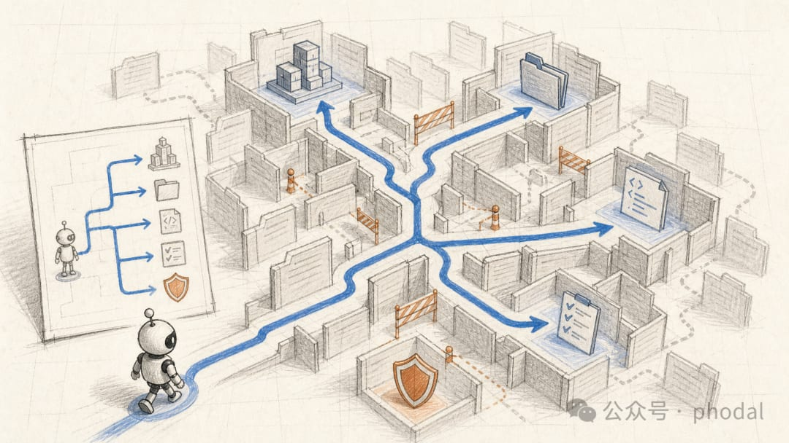
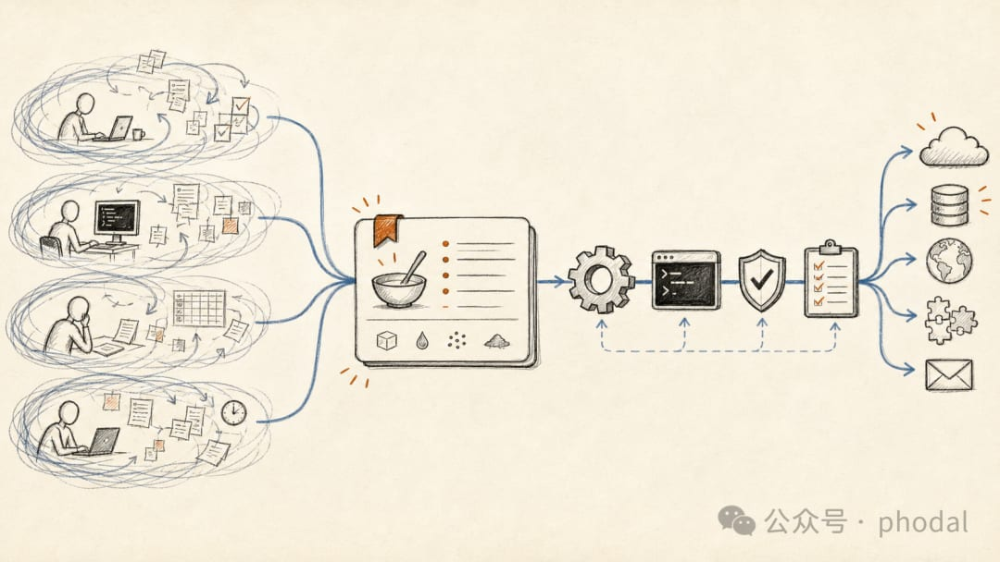
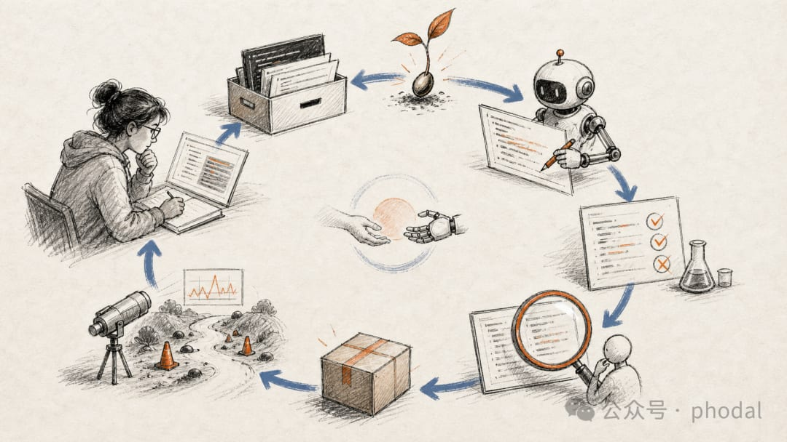
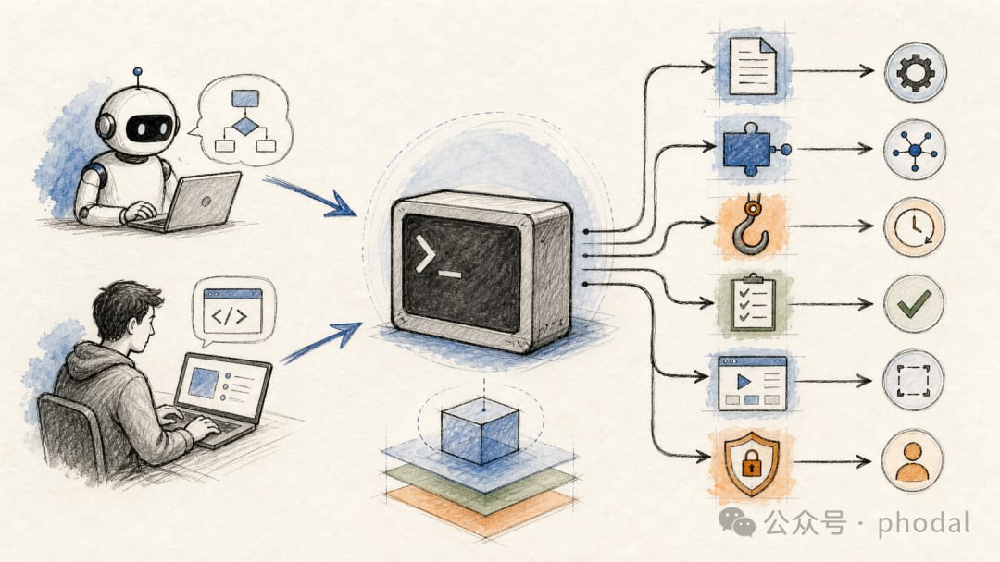
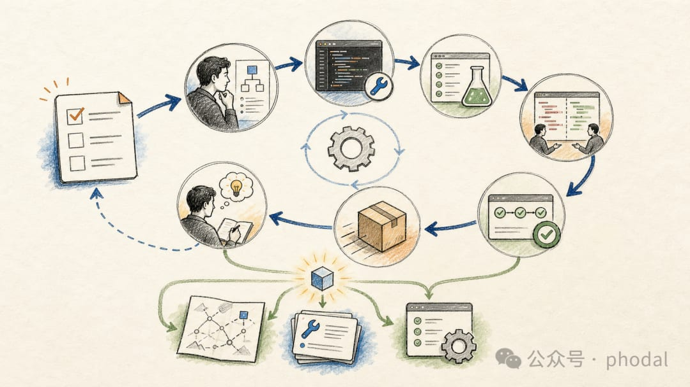

# 别再反复教 Coding Agent：让项目记住自己如何工作的五个步骤

> 一个 Agent 友好的项目，不是安装了多少工具，而是项目知识能否被发现，流程能否被执行，结果能否被验证，经验能否进入下一次任务。

<!-- more -->

## 核心概念：Agent Work Loop

Better Harness 把从理解需求、找到知识、执行修改到验证交付的过程，称为 **Agent Work Loop**。在这个循环中：

- AGENTS.md 帮助 Agent 进入项目
- 核心文档提供上下文
- Skill 与工具推动任务执行
- 测试、Hook 和权限守住结果与边界

项目的"记忆力"体现在五个渐进步骤上。

## 第一步：用 AGENTS.md 给 Agent 一张项目地图

Coding Agent 进入仓库时，需要一张地图。AGENTS.md 承担的内容应该尽量稳定：

- 项目使用的包管理器和运行时
- 安装与测试命令
- 无法从目录结构推断的约定
- 生成文件的位置
- 涉及凭据、数据库迁移和发布时的安全边界

**原则**：Agent 能从代码中看出来的内容，没有必要再写一遍。真正值得写进去的，是它看不出来、却很容易猜错的事实。例如：

- 仓库里同时存在 npm 和 pnpm 的痕迹，当前究竟使用哪一个
- 某个目录看起来像源码，实际上由工具生成
- 完整测试需要半小时，修改一个模块时应该先运行哪条聚焦命令

**渐进式披露**：根目录只保留多数任务都需要的说明，更详细的架构、设计和工作流程，通过链接按需读取。

## 第二步：把核心文档接到任务路径上

有了项目地图，Agent 只是知道怎样开工，还不知道代码为什么这样组织。第二步要做的，是让文档从"仓库里存在"，变成"任务进行到这里时能够被找到"。

常见的核心文档：ARCHITECTURE.md、DESIGN.md、编码规范、测试指南、发布说明和 Runbook。

**更有效的写法是同时给出读取条件**：

- 修改模块边界前，阅读 ARCHITECTURE.md
- 调整公共界面前，检查 DESIGN.md
- 改变发布流程前，阅读 Runbook

架构约束属于架构文档，AGENTS.md 只负责把 Agent 带过去；测试命令如果已经由脚本提供，文档负责解释如何选择，而不是再复制一份可能过期的命令。

## 第三步：从重复工作中提炼第一个 Skill

Skill 是一份由 Agent 按需加载的工作手册。它回答的是一种任务应该怎样完成：何时触发、需要哪些输入、按什么顺序执行、产出什么结果、如何验证，以及遇到什么情况应该停止并交给人。

**实用的 Skill 探索门槛**：相似需求至少出现过两次；或者虽然只发生过一次，但成本高、风险大，并且很可能再次发生。在此基础上，还要确认输入相对稳定、步骤能够复用、结果可以检查。

如果不知道第一个 Skill 从哪里来，可以翻看最近几次与 Agent 的对话：

- 哪些要求已经解释过两次？
- 哪些检查每次都要手工提醒？
- 哪些失败修复以后很可能再次出现？

## 第四步：把重复流程变成可执行的工程接口

写出 Skill 只是定义了方法。要让流程真正运行起来，Agent 还需要读取数据、执行检查或操作外部系统。

**CLI 优先原则**：对于已经拥有脚本或命令行工具的项目，CLI 通常是成本最低、也最容易复现的起点。一个友好的 Agent CLI 应该：

- 能从 --help 中发现用法
- 支持非交互执行
- 输出稳定，必要时提供 JSON 等结构化格式
- 失败时返回明确的错误和退出状态
- 为耗时操作提供超时
- 修改外部状态前支持 plan 或 dry-run

这样的 CLI 可以同时服务开发者、Agent、脚本和 CI。

**CLI 优先不意味着拒绝 MCP**。当外部系统缺少合适的命令行入口，或者需要结构化资源发现、宿主集成、持续交互时，MCP 仍然合适。关键是让 CLI 与 MCP 建立在同一套底层能力和权限规则上。

## 第五步：回到真实任务，让项目记住经验

Agent 完成修改、测试显示通过时，先别急着结束。确认测试覆盖的是这次修改后的版本，再检查它是否走完了必要的 Review 和 CI。

交付以后，再回头看一眼这次任务：
- Agent 是否又重新寻找了一遍启动命令？
- 是否在同一个目录上再次犯错？
- 是否仍然需要人提醒某项检查？
- 也要留意那些已经奏效的路径

这些反复出现的摩擦和有效经验，才是下一轮改进的起点。借助 **Loop Discovery**，判断它们应该沉淀在哪里：

| 沉淀位置 | 适用场景 |
|---------|---------|
| AGENTS.md 或核心文档 | 稳定事实 |
| Skill | 重复方法 |
| CLI、脚本、Hook 或 CI | 确定性的操作和检查 |
| MCP | 外部资源发现或持续交互 |
| 权限边界和人工确认 | 高风险、不可逆操作 |

## 总结

所谓持续改进，不是不断增加配置，而是让这一次任务留下的东西，真正帮助下一次。

如果刚刚开始，就选择一个最近发生的真实任务：让 Agent 从理解需求走到验证与交付，结束时只沉淀一件最值得复用的经验。项目不需要在第一天就拥有完整的 Agent 平台。它只需要开始记得自己如何工作。

> 详细实践文档：[Better Harness / references / agent-customize](https://github.com/QoderAI/better-harness/tree/main/references/agent-customize)