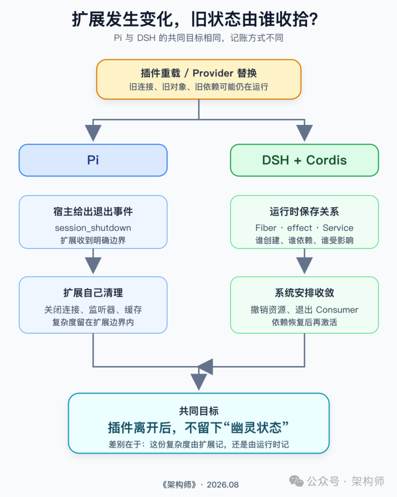

# Cordis 到底解决了什么：DSH 与 Pi 的两种答案

> DSH 把 Cordis 嵌入运行时管理跨插件关系，Pi 把清理责任交给扩展作者。两种架构在解决同一类「幽灵状态」问题，但把复杂度记在了不同地方。

给 Agent 加一个插件，通常不算难。真正让人头疼的，往往是插件离开以后：配置里明明已经删掉了，文件监听器还在跑；Provider 换成新的，某个工具却仍握着旧对象；新旧实现都没报错，只是偶尔各自出来工作一下。

这种「幽灵状态」很有工程气质：平时安安静静，一到排查时就开始考验记忆力。

本文对 DSH 的分析基于源码提交 47f9438，其中固定的 Cordis 版本为 @deepseek-ai/cordis@4.0.1；Pi 对照基于提交 588915e。

**图 1：Pi 把清理交给扩展边界；DSH 借 Cordis 管理跨插件关系。**

---

## 先看 Pi：内环很短，退出边界也很清楚

之前梳理《OpenClaw 背后的秘密武器：极简智能体框架 Pi》时，最喜欢 Pi 的地方，是它没有急着把所有能力收进核心。默认工具很少，Agent Loop 很短，扩展却可以深入工具、命令、UI、模型 Provider、会话事件和压缩逻辑。

Pi 的 `/reload` 也比「重新执行扩展文件」完整得多。它会先向旧扩展运行时发出 `session_shutdown`，随后重载设置，清空 pi-ai 的 API Provider 注册，再重载 Extension、Skill 和提示词，构建新的扩展运行时，最后发出原因标记为 `reload` 的 `session_start`。

官方文档给扩展作者的约定很直接：连接、文件观察器和其他会话级资源，在 `session_shutdown` 里关闭；新会话开始，再在 `session_start` 里建回来。

**Pi 的分工**：宿主负责把门关上再打开，屋里有什么东西，由住在里面的人自己清点。

扩展不多、会话重载成本可接受时，这种分工很省心。问题通常可以沿着生命周期事件和扩展代码一路查下去。

但扩展开始互相借东西，事情就没这么简单了。假设 A 注册了一项能力，B 已经把它留在闭包或缓存里。A 被替换，只更新注册表够不够？B 是否也该退出？它什么时候才能绑定新实现？

**这一步，Pi 交给扩展作者；Cordis 则把插件关系记进运行时。**

---

## Cordis 先把三个朴素问题记下来

源码里的 Context、Fiber、Service、effect、Loader 名词不少，但都在回答插件退出时的三个问题：

1. **系统现在想让哪些插件活着？**
2. **一个插件创建的资源，退出时该找谁撤销？**
3. **某项能力没了，哪些依赖它的插件也不能继续跑？**

| 概念 | 回答的问题 | 机制 |
|------|-----------|------|
| **Loader** | 系统想让谁运行 | 读取 YAML/Preset/程序内挂载，维护目标插件树；删除/禁用/替换条目时找到对应 Fiber 处置 |
| **Fiber + effect** | 资源由谁撤销 | Fiber 是插件实例生命周期容器；插件通过 `ctx.effect()` 把撤销动作一并登记 |
| **Service + inject** | 依赖失效影响谁 | 插件声明启动所需 Service；提供方消失，Cordis 让不满足条件的 Consumer 退出 |
| **Context** | 能力可见范围 | 同名 Service 可在更近作用域被覆盖，不同 Agent 或 Preset 拿到不同实现 |

**关键分寸**：Cordis 记录「这件东西归谁」，插件作者仍要说明「它该怎么关」。`delete`、`unsubscribe`、`close` 不会凭空长出来。

---

## DSH 没让所有变化都「牵一发而动全身」

DSH 把 Provider 变化分成了两类：

- **注册表路径（轻）**：能在每次调用时重新选择的，走轻路径。Web Search 用 `Map` 保存 Search Provider 和 Fetch Provider。Exa 退出，`effect` 删除它登记的那一项。使用 `ctx.web` 的工具不必跟着重启；下一次调用，自然会从 `Map` 里选择当时仍在的实现。

- **Service 拓扑路径（重）**：会让 Consumer 不再满足启动条件的，走 Service 依赖收敛路径。Shell、文件系统这类 Service，Consumer 可能已经把旧 Service 留在闭包、缓存或内部状态里。Cordis 会先让旧 Service 从解析空间消失，通知并等待受影响的 Consumer 退出，再清理提供方 Fiber 内的记录。

**图 2：注册表路径按调用时取当前实现；Service 路径会先让旧依赖关系收敛。**

前一条尽量减少影响范围，后一条优先保证状态一致。Cordis 提供的关键能力，就是让 DSH 分清一次变化究竟需要惊动谁。

---

## 东西放在别人的抽屉里，仍然算谁的

Web Search 还有一个有意思的细节。Provider 最终放进 Web Runtime 持有的 `Map`，可真正发起注册的是 Exa。将来删除这一项的 disposer，应该记在 Web Runtime 头上，还是 Exa 头上？

Cordis 会追踪 Service 方法的调用方 Context。Exa 通过 `ctx.web.registerSearchProvider(...)` 注册时，方法内部虽然操作的是 Web Runtime 的表，`ctx.effect()` 记录的所有者仍是 Exa 当前的 Fiber。

整条链路：
1. Exa 发起注册
2. Provider 进入 Web Runtime 的 Map
3. disposer 归入 Exa 的 Fiber
4. Exa 被卸载
5. Cordis 撤销 Exa 创建的注册项

**Cordis 的所有权规则**：谁通过 `ctx.effect()` 登记副作用，撤销责任就跟着谁。资源即便放进别的 Service，生命周期也不会悄悄转移。

---

## effect 怎样处理半途失败

真实初始化常常是连续几步：先写入状态，再订阅事件，接着广播消息，最后打开外部句柄。中间任何一步抛错，都可能留下一半现场。

DSH 的 SessionStore 创建会话时采用这个顺序：

1. 会话入库
2. 立即交出「移除会话」的撤销动作（通过 `ctx.effect()`）
3. 广播 `session/created`

生成器形式的 effect 允许插件每完成一步，先把这一步的退路交给运行时。后面的广播失败，Cordis 仍能执行已经收集到的 disposer，把刚放进去的会话移除。同一个 effect 内登记了多项撤销时，它们会按**相反顺序**执行。

**图 3：SessionStore 的实际顺序是「会话入库 → 登记移除动作 → 广播事件」。**

**边界提醒**：`ctx.effect()` 只能处理已经登记、而且确实可逆的运行时资源。已经发出的网络请求、执行过的命令、写进外部系统的数据，不会因为 Fiber 退出就自动消失。外部副作用仍需要幂等键、状态核对、检查点和补偿。

---

## DSH 与 Pi：把复杂度记在了不同地方

| 维度 | Pi | DSH（Cordis） |
|------|----|--------------|
| 出发点 | 短小可塑的 Coding Agent 内环 | 多插件组合、Service 替换、Context 覆盖 |
| 清理责任 | 扩展作者自己负责 | 插件登记副作用 + 运行时跟踪关系 |
| 关系可见性 | 扩展间互借不透明 | 运行时维护 Fiber 存活状态和 Service 依赖图 |
| 适用场景 | Agent Loop 稳定、扩展数量有限、整段会话重载可接受 | Provider 需运行中替换、能力按 Agent/Preset 覆盖、Service 变化影响多个 Consumer |

**Pi 的回答**：把内环做短，把扩展边界做清楚，让作者保有控制，也让系统容易理解。

**DSH 的回答**：把 Cordis 放进运行时——插件创建资源时留下撤销动作，依赖其他插件时把关系说出来。关系变化以后，运行时可以据此安排退出和重启。

运行时多记一层关系，排查时自然也会多一层。插件没启动，原因可能是条目被禁用、依赖没满足、当前 Context 看不到对应 Service，也可能是旧 Fiber 仍在退出。

**关键提醒**：`inject` 是依赖声明，不是安全隔离。少注入一个文件系统 Service，并不能阻止 Node.js 插件直接访问本地文件。高风险任务仍要靠容器、虚拟机、远程沙箱等操作系统级边界。

---

## 写在最后

今年从 Prompt、Context 聊到 Harness，又从 Agent Loop 聊到状态边界和失败闭环。反复追问同一件事：模型之外的复杂度，最后由谁承担？

没必要把 Pi 和 DSH 排成一条「先进程度」的刻度。小系统不必为了可能永远不会出现的动态图，先养一套复杂运行时；已经频繁遇到热替换、局部覆盖和依赖失效的系统，也不能假装重启一次没有成本。

插件能装进来，只说明扩展入口做通了。插件离开时没有幽灵，关系变化后系统仍能说清谁该留下，这套运行时才经得起持续扩展。

