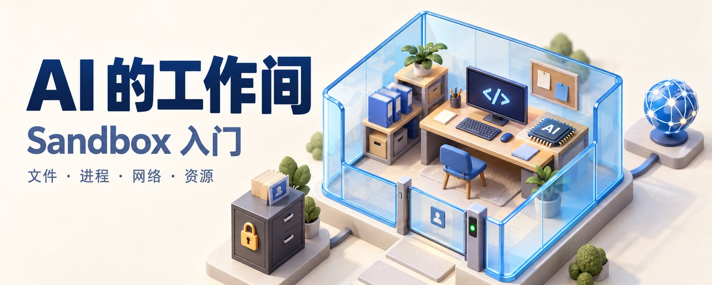

# AI 的工作间：Sandbox 入门

# 小白从零学习 Sandbox

最近，因为coding agent, harness agent的发展，“Sandbox”这个词出现得越来越频繁。

它听起来很技术，但核心并不复杂：

> Sandbox，就是给程序准备的一间受限制的工作室。程序可以在里面干活，但不能随便翻你的东西、联系外界，或者拖垮整台电脑。

本文暂时不讨论复杂的 AI Agent 架构，只从最基础的问题开始：Sandbox 为什么存在、它到底限制什么、限制是在什么时候发生，以及 Container、虚拟机和 Sandbox 之间是什么关系。

## 一、为什么叫“沙箱”

想象一个小朋友在沙箱里玩沙子。

他可以挖坑、堆城堡、把作品推倒重来，但活动范围被限制在沙箱里。沙子不会铺满整个房间，他也不能顺手跑去翻抽屉或碰燃气灶。

计算机里的 Sandbox 采用了相同的思路。

一个程序可以在里面：

- 创建和修改指定文件；
- 执行命令；
- 安装依赖；
- 运行测试；
- 启动本地服务。

但它不一定能够：

- 读取你的照片、聊天记录和 SSH 密钥；
- 修改系统文件；
- 任意访问互联网；
- 使用无限的 CPU、内存和磁盘；
- 影响其他程序；
- 永远运行下去。

所以，Sandbox 不是为了让程序什么都做不了，而是为了让它在明确的范围内完成工作。

## 二、为什么我们需要 Sandbox

我们每天运行的程序，并不都值得完全信任。

它可能来自陌生网站，可能包含有问题的第三方依赖，也可能只是开发者写错了一行代码。即使程序没有恶意，也可能因为 Bug 做出危险的事情，例如：

- 删除错误的目录；
- 在死循环中占满 CPU；
- 不断创建进程；
- 把内存和磁盘吃光；
- 读取不该读取的文件；
- 把数据发送到外部服务器。

如果这些程序直接拥有当前用户的全部权限，那么“程序犯错”就可能变成“整台电脑出问题”。

Sandbox 的作用，是把事故影响控制在一个小范围内。即使里面的程序出错，最坏情况也尽量只是这个 Sandbox 被破坏，而不是整台机器、用户账号或者公司系统一起遭殃。

这在安全领域经常被称为缩小“爆炸半径”。

## 三、Sandbox 通常限制哪些东西

一个完整的 Sandbox，通常会控制六类资源。

1. 文件系统

Sandbox 会决定程序能看到、读取和修改哪些文件。

例如：

- 项目目录可以读写；
- 系统目录只能读取；
- 用户文档不可访问；
- SSH 密钥目录不可访问；
- 某些配置文件根本不出现在环境里。

这里有两种常见做法。

第一种是让文件存在，但访问时拒绝。程序尝试打开文件时，会收到“Permission denied”。

第二种是根本不把文件放进 Sandbox。对里面的程序来说，这些文件就像不存在一样。

第二种通常更容易理解，也更不容易因为规则疏漏而暴露敏感数据。

2. 进程

程序可以继续启动其他程序，这些新程序叫子进程。

例如，运行一次安装命令，背后可能形成这样的链条：

安装程序
└── 构建脚本
    └── Shell
        └── 下载工具

因此，Sandbox 不能只限制最外层那条命令。限制必须跟随整个进程树，否则外层程序虽然不能联网，却可以启动另一个程序替自己联网。

3. 网络

网络权限通常有三种模式：

1. 完全开放；
2. 完全禁止；
3. 只允许访问指定地址。

例如，一个构建环境可能只允许访问软件包仓库和代码托管平台，其他地址全部拒绝。

但“允许访问某个域名”并不等于绝对安全。程序仍可能利用这个合法网站上传数据。因此，更严格的系统还会控制：

- 可以读还是可以写；
- 可以访问哪个账号或项目；
- 可以使用什么身份；
- 请求中能否携带敏感内容。

4. 身份和凭据

凭据就是能够证明身份的秘密，例如密码、API Key、GitHub Token、SSH 私钥和云服务访问密钥。

最简单的做法，是把密钥直接放进程序的环境变量。但这样一来，只要程序能读取环境变量，就可能把密钥打印出来或者发送出去。

更安全的做法，是不把真正的密钥交给 Sandbox，而是在外面设置一个“代办窗口”。

程序可以说：“请帮我读取这个仓库。”代办服务检查请求符合规则后，替它完成操作；但程序本身始终看不到真正的 Token。

5. 计算资源

Sandbox 通常会设置资源上限，例如：

- 最多使用多少 CPU；
- 最多占用多少内存；
- 最多使用多少磁盘；
- 最多创建多少进程；
- 最长运行多长时间。

超过限制后，系统可以限速、拒绝继续分配资源，或者直接终止程序。

6. 生命周期

有些 Sandbox 用完立即删除；有些会保留文件；有些还可以暂停、恢复和创建快照。

生命周期决定了它更像一次性纸杯，还是一间可以反复使用的工作室。

## 四、权限是提前分配，还是使用时拦截？

答案是：两者都有。

最容易理解的比喻是门禁卡。

系统会先决定这张门禁卡能开哪些门，这属于预先分配；等你真正刷门时，门锁还会检查这张卡是否有权限，这属于使用时拦截。

创建 Sandbox 时，系统通常会先完成这些工作：

- 只挂载需要的目录；
- 设置哪些目录只读、哪些可以写；
- 使用一个权限更低的独立用户；
- 创建独立的网络空间；
- 不放入敏感凭据；
- 设置 CPU、内存和时间上限。

程序开始运行后，系统还会在实际操作发生时检查：

- 打开文件时检查读权限；
- 修改或删除文件时检查写权限；
- 创建子进程时继承限制；
- 建立网络连接时检查目标；
- 申请更多内存时检查配额；
- 执行特殊系统操作时检查是否允许。

> 一个可靠的 Sandbox，通常是在创建时减少程序拥有的能力，在运行时对每次真实访问持续强制执行。

## 五、为什么不能只检查命令文字

假设系统只在程序执行前看一眼命令：

安装依赖

这句话看起来很正常。但安装程序可能继续执行第三方包附带的脚本，而脚本又可能启动其他命令和网络请求。

如果系统只检查最开始那句话，后面发生的事情就可能漏掉。

因此，可靠的限制不能只依赖“这条命令看起来是否危险”，而要落实到更底层的真实行为：

- 到底打开了哪个文件；
- 到底创建了哪个进程；
- 到底连接了哪个地址；
- 到底使用了多少资源。

上层规则负责理解“它想做什么”，底层 Sandbox 负责限制“它实际上能做什么”。

## 六、Sandbox、Container 和虚拟机不是一回事

很多人会把 Sandbox 和 Docker Container 画等号，其实二者不是同一层概念。

> Sandbox 是目标：限制程序的能力和影响范围。Container、操作系统权限和虚拟机，则是实现这个目标的不同工具。

操作系统级 Sandbox

这类方案直接使用操作系统提供的权限机制，限制某个进程可以读取什么、写入什么、调用什么系统能力。

它像是在同一栋房子里划出一间上锁的房间。

优点是启动快、开销小，适合桌面应用和本地开发工具。缺点是规则比较复杂，而且不同操作系统的实现差异很大。

Container

Container 可以理解为大楼里的独立公寓。每套公寓有自己的文件视图、进程空间和网络配置，但仍共享整栋大楼的核心设施，也就是宿主机内核。

它启动快、部署方便、生态成熟，因此非常常见。

但使用 Container 不代表已经自动安全。还需要认真配置：

- 挂载了哪些宿主机目录；
- 使用什么用户身份；
- 网络是否开放；
- 是否暴露了管理接口；
- 是否设置了资源上限；
- 是否减少了不必要的系统权限。

gVisor 一类的用户态内核

这类方案会在应用和宿主机内核之间增加一个“翻译层”。应用的大量系统调用先由这个中间层处理，而不是直接接触宿主机内核。

它通常比普通 Container 多一道隔离，又比完整虚拟机轻，但可能存在软件兼容性和性能代价。

VM 和 MicroVM

虚拟机可以理解为给程序准备一栋独立的小房子。它拥有自己的操作系统内核，与宿主机之间还有虚拟化边界。

MicroVM 是经过裁剪、启动更快的小型虚拟机。

虚拟机的隔离通常更强，适合运行来源复杂或彼此不信任的程序；代价是管理更复杂，资源开销通常也更高。

不过，虚拟机只提供一堵更坚固的墙。它不会自动决定程序可以访问哪个网站、使用哪个密钥。这些细粒度规则仍然需要额外的权限、网络和身份系统。

## 七、Stop、Pause、Snapshot 和 Fork 是什么

可以借用电子游戏存档来理解。

Stop / Start

退出后重新进入。文件通常可以保留，但内存中的运行状态和正在运行的程序可能消失。

Pause / Resume

类似电脑合盖再打开。希望文件、内存和正在运行的程序都继续保持原来的状态。

Snapshot

创建一个存档点。以后可以从这个存档创建新环境，不必重新安装所有软件和依赖。

Fork

从同一个存档复制出多个独立环境，让它们分别尝试不同操作，互不影响。

这些能力不是所有 Sandbox 都必须具备。是否需要它们，取决于任务是一次性运行，还是需要长期工作、快速恢复和并行实验。

## 八、可靠的 Sandbox 通常有三道防线

把前面的内容合在一起，一个比较完整的系统通常包含三层。

第一层：创建环境时减少能力

只提供必要文件，不放入长期密钥，使用独立用户和网络，并设置资源上限。

第二层：操作前检查规则

在程序准备执行某项动作时，按照规则自动允许、询问用户或者直接拒绝。

第三层：运行时强制执行

无论动作由主程序还是子进程发起，只要真正访问文件、网络或系统资源，底层都重新检查。

三层同时存在，是因为任何一层都可能出错。安全系统不会把全部希望押在一次判断上。

## 九、几个常见误解

“放进 Docker 就安全了”

不一定。Docker 提供了很好的隔离基础，但错误的目录挂载、开放网络、过高权限或暴露管理接口，都可能让隔离失效。

“不让它联网就绝对安全”

不一定。程序仍可能破坏文件、耗尽资源，或者把敏感内容写入以后会被上传的位置。

“每次操作都弹窗让用户确认就行”

不可靠。弹窗太多，人会疲劳，最后可能习惯性点击允许。明显危险的能力应该直接移除，而不是全部交给用户判断。

“用了虚拟机就不需要权限系统”

不对。虚拟机解决的是隔离边界，不能代替网站访问规则、账号权限、密钥管理和操作审计。

“Sandbox 越严格越好”

也不完全对。限制过少不安全，限制过多则无法完成工作。真正困难的是给程序刚好够用的能力，这就是所谓的最小权限原则。

## 十、判断一个 Sandbox，可以先问这七个问题

不管遇到什么产品或技术，都可以先问：

1. 它保护的对象是什么：个人电脑、服务器，还是其他租户？
2. Sandbox 里能看到哪些文件，哪些目录可以写？
3. 主程序启动的子进程是否受到同样限制？
4. 网络是全开、全关，还是按目标和操作控制？
5. 密码和 Token 是否真的进入了 Sandbox？
6. CPU、内存、磁盘和运行时间有没有硬上限？
7. 出现问题后，能否查到它执行了什么、修改了什么、访问了哪里？

如果一个系统说自己有 Sandbox，却说不清这些问题，那么“有沙箱”很可能只是一句模糊的宣传。

## 结语：Sandbox 的本质是控制能力

Sandbox 并不是某个具体软件，也不等于 Container 或虚拟机。它是一套控制程序能力和事故范围的方法。

最值得记住的是三句话：

1. 创建环境时，只给程序完成任务必需的东西；
2. 程序运行时，每次真实访问都继续受到检查；
3. 即使程序犯错，也尽量把影响限制在这个环境里。

今天，我们越来越多地把 Sandbox 用在在线编程、云函数、浏览器、移动应用，以及能够自己调用工具的 AI 系统中。

当 Sandbox 面向 AI Native Agent 时，还会多出一项要求：系统不仅要拦住危险操作，还要用机器能够理解的方式说明“为什么被拒绝、允许范围是什么、下一步可以怎样安全地继续”。

但无论名字如何变化，底层原则没有变：给它完成工作所需的能力，同时把不必要的能力拿走。
