# 数据治理最容易混淆的5个概念：元数据、数据元、元模型、数据字典、数据模型，一次彻底讲清

> 做数据治理时，元数据、数据元、元模型、数据字典、数据模型这五个词几乎绕不开。它们看似都在回答"数据是什么"，但解决的问题并不在同一个层次。分清它们，不是为了记住五个名词，而是为了知道每一种治理工作究竟在治理什么、解决哪一层问题。

<!-- more -->

## 引言

做数据治理时，有五个词几乎绕不开：

- **元数据**
- **数据元**
- **元模型**
- **数据字典**
- **数据模型**

它们看起来都在回答"数据是什么"，但真正解决的问题并不在同一个层次。

有人把数据库里的字段直接称为数据元；有人认为做了一份数据字典，就等于完成了元数据管理；还有人看到"元模型"和"数据模型"只差一个"元"字，就把两者当成一回事。

如果只是概念考试，混淆一下影响不大。但放到企业数据治理项目里，问题会立刻变得现实：

- 到底治理什么对象？
- 标准应该约束谁？
- 哪些信息需要自动采集？
- 哪些需要业务人员维护？
- 最后这些治理成果又应该落到哪里？

所以理解这五个概念，不建议从定义开始死记，而要先抓住它们各自解决的问题：

| 概念 | 核心职责 |
|------|----------|
| 元数据 | 负责描述数据 |
| 数据元 | 负责统一业务语义 |
| 元模型 | 规定这些描述怎么组织 |
| 数据字典 | 负责把数据说明提供给使用者 |
| 数据模型 | 负责设计业务数据本身的结构 |

---

## 一、元数据：不是"字段说明"，而是数据的上下文

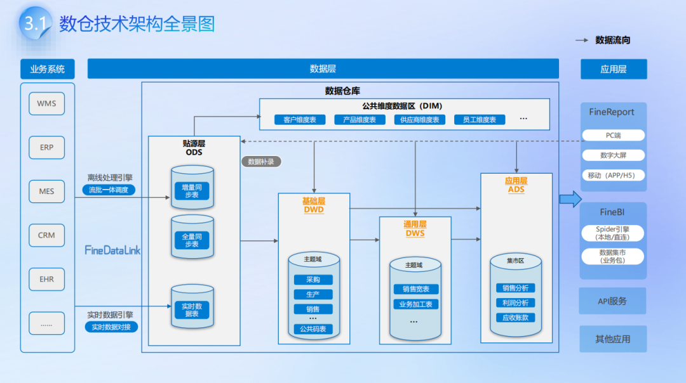

元数据最常见的解释是：

> **描述数据的数据。**

例如数据库中有一个字段 `customer_id`，里面保存的 "100001""100002" 属于真正的业务数据。但围绕这个字段，还有另一组信息：

- 中文名称：客户编号
- 数据类型：VARCHAR
- 长度：32
- 来源系统：CRM
- 来源表：customer_info
- 业务定义：客户唯一身份标识
- 更新周期：每日一次
- 责任部门：客户运营部
- 被哪些任务、指标和报表引用

这些信息才属于元数据。

为什么企业需要管理它们？因为一条没有上下文的数据，实际上很难被正确使用。比如看到 `amt = 128000`，你并不知道它到底是合同金额、订单金额、开票金额还是确认收入，也不知道是否含税、单位是什么、什么时候更新。

元数据真正做的事情，是给数据补上"身份、来源、加工过程和使用关系"。

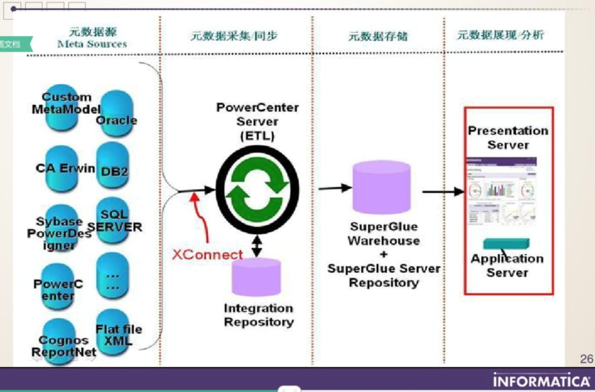

实际治理中，元数据通常可以分成三类：

### 1. 技术元数据

描述数据在技术系统中的结构和流转，例如数据库、表、字段、字段类型、接口、ETL 任务、调度依赖和上下游血缘。

### 2. 业务元数据

描述数据的业务含义，例如指标定义、统计口径、业务术语、业务负责人和归属部门。

### 3. 管理与运行元数据

描述数据的管理状态，例如权限、质量结果、更新时间、责任人、访问频率和生命周期状态。

所以，元数据治理真正解决的是数据能不能被理解、查找、追溯和管理。而在实际工作中，元数据往往是在排查问题时最有存在感。比如销售主题表突然少了一批数据，开发人员通常会往上游一路找：源表有没有数据、同步任务是否执行、中间转换逻辑有没有修改，再继续确认下游哪些汇总表和指标已经受到影响。这类排查本质上就是在使用元数据和血缘关系。

---

## 二、数据元：不是某个字段，而是字段背后的标准定义

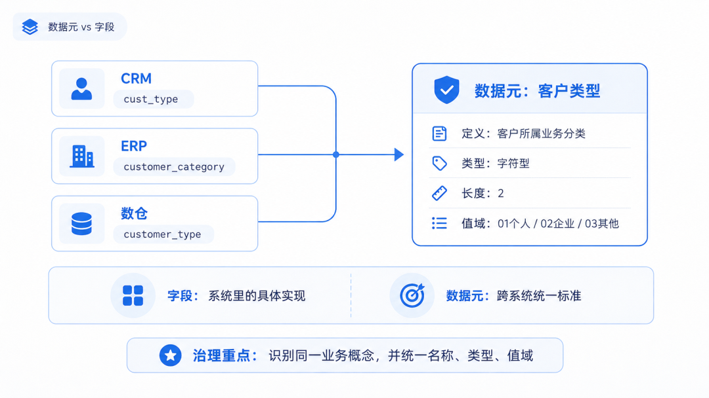

数据元和字段，是最容易混淆的一组概念。

假设三个系统中分别存在：

| 系统 | 字段名 |
|------|--------|
| CRM | `cust_type` |
| ERP | `customer_category` |
| 数仓 | `customer_type` |

三个字段名字不同，但表达的可能都是同一个业务概念：**客户类型**。

如果企业只是把这三个字段登记下来，记录它们在哪张表、是什么类型，这属于**元数据管理**。

如果进一步规定：

- 标准名称：客户类型
- 定义：用于表示客户所属业务分类
- 数据类型：字符型
- 长度：2
- 值域：01 个人、02 企业、03 其他
- 责任部门：客户管理部
- 相关系统统一采用该分类标准

这时候形成的，才更接近治理意义上的数据元。

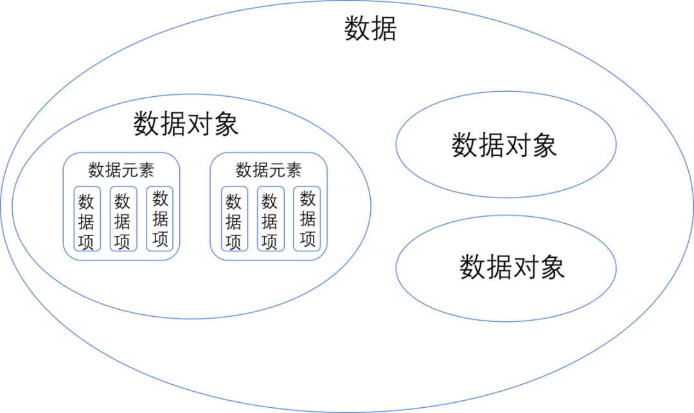

因此，两者最关键的区别是：

> **字段**是一个业务概念在某个系统里的具体实现；**数据元**是这个业务概念跨系统使用时的统一标准。

比如"客户编号"这个数据元：在 CRM 里可能叫 `cust_id`，在 ERP 里叫 `customer_code`，在主数据系统里又叫 `mdm_customer_no`。物理上是三个字段，语义上却应该对应同一个标准。

所以数据元治理真正要解决的，并不是"企业到底有多少字段？"，而是：**"这些字段里，哪些其实表达的是同一件事情？"** 进一步还要统一名称、数据类型、长度、格式、单位、编码和值域。

这也是为什么一些企业做了几十万条"数据元标准"，最后仍然很难使用。如果只是把数据库字段批量导出来，再给每个字段补一个中文名称，本质上做的是字段盘点，并没有完成真正的数据元标准化。

---

## 三、元模型：规定的是"治理对象之间怎样建立关系"

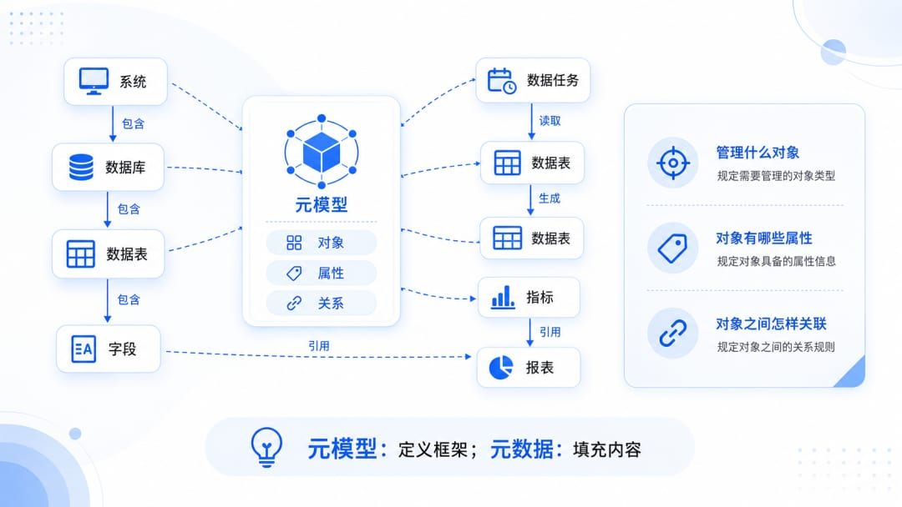

元模型往往是五个概念中最抽象的一个。理解它，可以再往上一层问：

> 既然元数据是在描述数据，那么——**谁规定元数据平台里应该管理哪些对象？**

例如企业准备管理：系统、数据库、数据表、字段、数据任务、指标、报表。光列出对象还不够，还需要规定它们之间的关系：

- 系统包含数据库
- 数据库包含数据表
- 数据表包含字段
- 数据任务读取一张表并生成另一张表
- 指标引用字段
- 报表引用指标

除此之外，还要规定：一张表应该记录哪些属性？一个字段应该记录哪些属性？指标和字段之间允许建立什么关系？

这套关于"管理什么对象、对象有哪些属性、对象之间怎样关联"的规则，就是**元模型**。

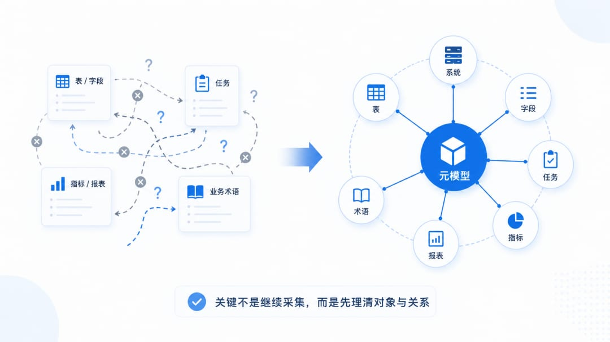

所以：**元模型负责定义框架，元数据负责往框架里填具体内容。**

例如元模型规定："每张数据表都需要记录所属系统、负责人和上下游关系。" 那么具体某张销售订单表属于 ERP、负责人是谁、下游进入哪张主题表，这些具体内容就是元数据。

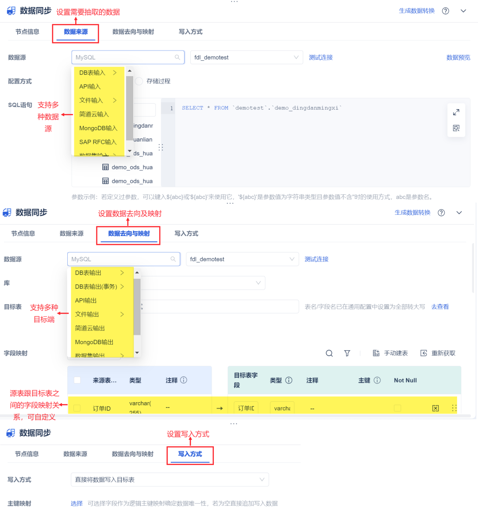

元模型为什么重要？因为很多治理项目推进到一定阶段都会出现同一个问题：**东西采上来了，却很难真正放到一起。**

数据团队管理表和字段，调度平台管理任务，BI 团队管理指标和报表，业务部门又维护自己的业务术语。每一块单独看都有内容，真正想串起来时，却发现不同团队连"对象是什么"都没有统一。

这时候，治理工作的重点就会从"继续采更多数据"转向"先把对象和关系理清"。元模型决定的，本质上就是企业准备按照什么结构来管理这张数据关系网。

---

## 四、数据字典：给数据使用者看的"说明书"

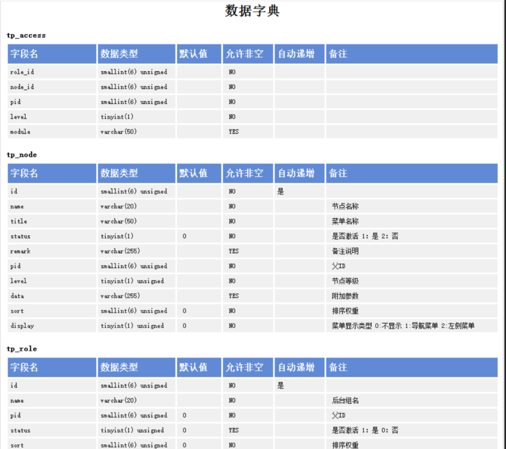

数据字典是五个概念里相对容易理解的一个。例如：

| 字段 | 中文名称 | 类型 | 业务说明 |
|------|----------|------|----------|
| `customer_id` | 客户编号 | VARCHAR | 客户唯一编号 |
| `customer_name` | 客户名称 | VARCHAR | 客户登记名称 |
| `customer_type` | 客户类型 | VARCHAR | 客户业务分类 |

这就是典型的数据字典。它主要回答：这张表有哪些字段？这些字段是什么意思？使用时应该注意什么？

但要注意：**数据字典不等于全部元数据。**

因为元数据还可能包括：数据血缘、加工任务、权限、数据质量结果、责任人、使用热度、指标引用关系、生命周期。

所以更准确地说：

> **元数据**是一整套关于数据的描述信息；**数据字典**是从这些信息中整理出来、面向查询和使用的一种呈现方式。

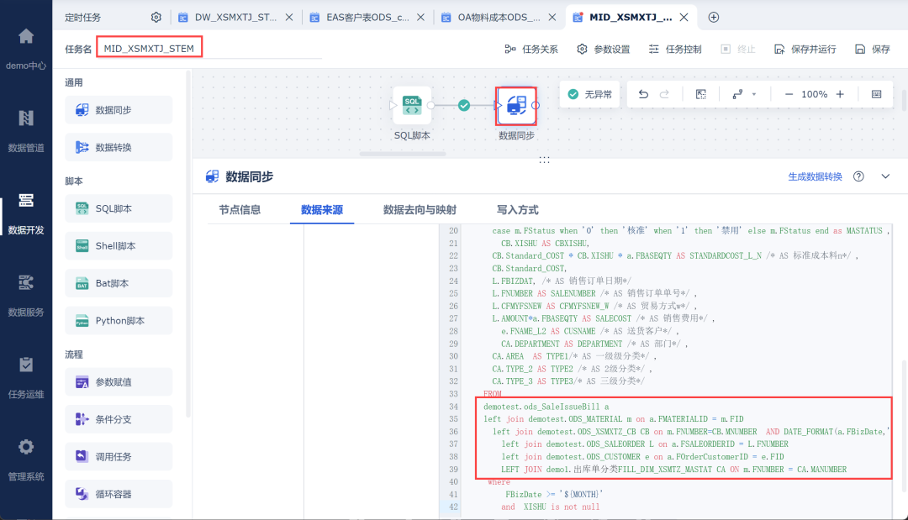

这个区别到了分析人员真正找数据时，会非常明显。例如要分析销售收入，搜索后发现三个字段：`sales_amount`、`revenue_amount`、`income_amt`。如果三条说明都只写着"销售金额"，那这份数据字典实际上并没有解决问题。

分析人员真正需要继续确认的是：

- 到底按订单还是按出库统计？
- 是否含税？
- 退款怎么处理？
- 数据从哪个系统来？
- 什么时候更新？
- 公司正式经营分析最终采用的是哪一个口径？

所以数据字典真正需要承接的，不只是字段的中文翻译，还要尽可能把定义、来源和加工背景带出来。

---

## 五、数据模型：设计的是业务数据本身的结构

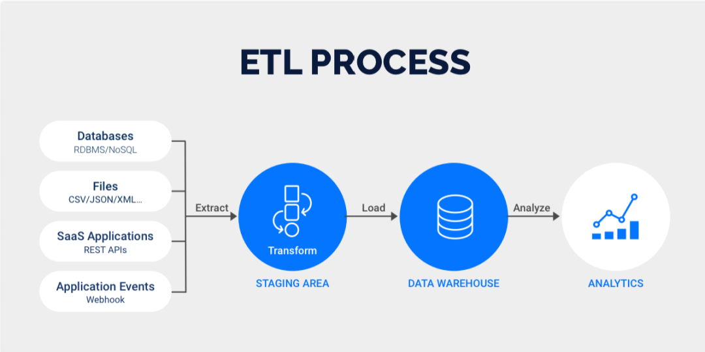

最后一个概念是数据模型。数据模型关注的是，真实业务应该怎样被组织成数据结构。

例如一个零售企业存在：客户、商品、门店、订单、订单明细。建模时需要考虑：

- 一个客户可以有多少订单？
- 一个订单包含多少商品？
- 商品属于哪个品类？
- 订单金额放在哪一层？
- 客户、商品和门店怎样与交易事实关联？

这些都是数据模型解决的问题。通常还会进一步分成三个层次：

### 1. 概念模型

站在业务视角识别核心对象以及它们之间的关系。例如：客户 — 订单 — 商品。这一阶段主要回答：业务世界里有哪些关键对象？

### 2. 逻辑模型

继续定义实体、属性、主键和关联关系。例如订单包含：订单编号、客户编号、下单时间、订单金额、订单状态。

### 3. 物理模型

最终落实到数据库。包括表名、字段名、数据类型、主键、索引、分区和存储方式等。

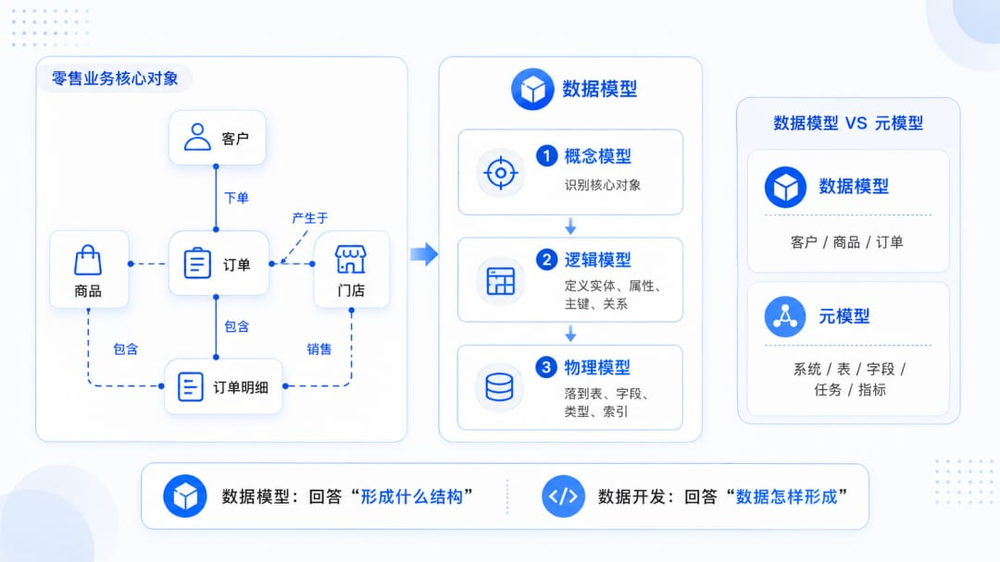

因此，数据模型和元模型虽然只差一个"元"，实际解决的问题完全不同：

> **数据模型**设计业务数据本身；**元模型**设计描述和管理这些数据的规则。

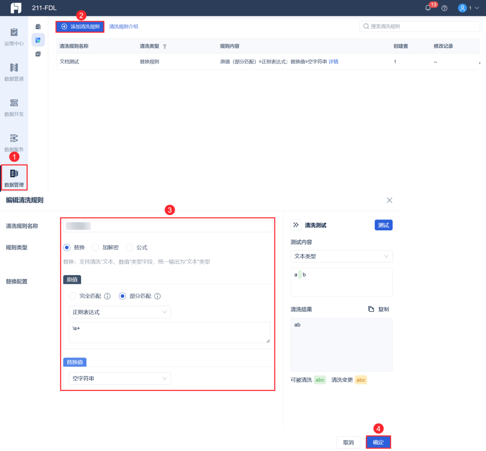

数据模型面对的对象可能是：客户、商品、订单。元模型面对的对象则可能是：系统、表、字段、任务、指标。

在真实数仓项目里，数据模型画完也并不意味着模型已经落地。例如团队设计了一张客户主题表，确定了客户编号、名称、等级、区域等字段，进入开发阶段之后，真正需要处理的还有：CRM 和 ERP 客户编码怎样统一？客户等级到底取哪个系统？重复客户怎么合并？每天采用全量还是增量更新？字段变化以后，下游怎么同步调整？

也就是说：**数据模型回答"最后要形成什么结构"，数据开发回答"这些数据究竟怎样形成"。**

---

## 六、把五个概念放到一个场景里，就彻底清楚了

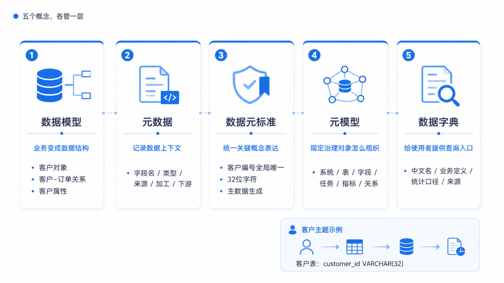

假设企业准备建设一套"客户主题数据"。

**第一步：数据模型。** 业务和数据团队要确定：企业有哪些客户对象？客户和订单是什么关系？客户主题需要哪些属性？模型最终形成一张客户表，其中存在 `customer_id VARCHAR(32)`。

**第二步：元数据。** 这个字段叫什么、是什么类型、来自哪个系统、由哪个任务加工、下游被哪些对象引用——这些属于元数据。

**第三步：数据元标准。** 企业进一步规定：客户编号必须全集团唯一，统一使用 32 位字符，由主数据系统生成。这属于数据元标准。

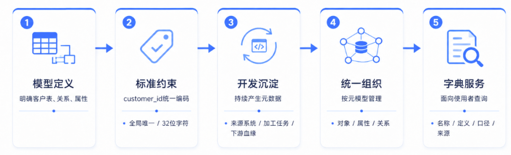

**第四步：元模型。** 与此同时，企业还需要规定：系统、表、字段、任务、指标分别是什么治理对象；它们分别记录哪些属性；对象之间允许建立哪些关系。这套结构属于元模型。

**第五步：数据字典。** 最后，把数据使用者经常需要查询的表、字段、中文名称、业务定义、统计口径和来源整理成查询入口。这就是数据字典。

所以五个概念并不是五套彼此独立的东西，而是在不同层次回答不同的问题：

> **数据模型**负责把业务变成数据结构；**数据元**负责让关键业务概念按照统一标准表达；**元数据**负责记录数据的上下文、来源和运行关系；**元模型**规定这些治理信息应该怎样组织；**数据字典**再把使用者真正需要的信息提供出来。

真正成熟的数据治理，也不是分别做完五份 Excel，或者上线五个彼此孤立的模块。而是让它们形成一条完整链路：

> 模型里的字段能够对应数据元标准，数据开发过程持续产生和更新元数据，元数据按照统一的元模型组织，最后再通过数据字典被开发、分析和业务人员使用。

当这条链路真正建立起来以后，企业治理的就不再是一堆孤立的字段、标准和文档，而是一套随着数据生产、变化和使用持续运行的数据管理体系。

分清这五个概念的真正意义，也不是为了记住五个名词，而是为了知道：**每一种数据治理工作究竟在治理什么、解决哪一层问题，以及最终应该落到哪个实际工作环节。**
