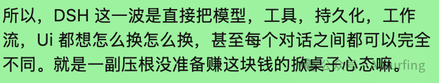

# DeepSeek Harness做Agent蒸馏——天然蒸馏数据工厂

> 常规模型蒸馏大家熟：大模型当老师，小模型当学生，用大模型输出训练小模型。但 **Agent 蒸馏** 完全是另一个物种——它需要的不只是"输入→输出"文本对，而是完整的 **ReAct 推理轨迹**。

Agent 模型需要看到：用户消息 → 思考要调什么工具 → 工具调用参数 → 拿到工具返回后怎么决策 → 下一步干什么 → 多轮循环直到任务完成。

蒸馏 Agent 模型，80% 的工程量不在训练，而在**数据生产**。

## DSH 的事件流：天然蒸馏轨迹

DSH 的 append-only 事件流日志，刚好解决了这个问题。它记录的事件类型：

| 事件 | 说明 |
|------|------|
| turn/start | 对话轮次开始 |
| step/start | 一次模型请求+工具执行开始 |
| user/message | 用户输入 |
| assistant/chunk | 流式 token（原始逐字输出） |
| assistant/message | 模型完整回复（含 usage/token 消耗） |
| tool/call | 模型请求工具调用（含原始参数 JSON） |
| tool/result | 工具返回结果 |
| step/end | 步骤结束 |
| turn/end | 轮次结束 |

这就是一条完整的 ReAct 轨迹：`turn/start → user/message → assistant/message → tool/call → tool/result → assistant/message → ... → turn/end`。一条 JSONL 日志，就是一份现成的 SFT 训练样本。

对比 LangChain：memory 组件只存 HumanMessage 和 AIMessage，模型为什么调了工具 B、工具 B 返回了什么，默认不留存，得自己写 callback handler 去捞。DSH 连 `assistant/chunk`（流式 token）和 token 消耗量都完整留存。

## 批量生产蒸馏数据

### 1. Headless 模式跑批量任务

DSH 支持 headless 模式——无 UI、纯命令行：

```bash
export DEEPSEEK_API_KEY=your_key_here
dsh --profile headless "读取data/orders.csv，统计每个区域的订单总量，画一个柱状图保存到output/"
```

批量任务：

```bash
for task in tasks/*.txt; do
  dsh --profile headless "$(cat $task)"
done
```

每个任务产生独立 session 日志，互不干扰。

### 2. 导出事件流为蒸馏数据集

DSH 的 session 日志是 JSONL 格式，写个转换脚本变成 SFT 训练格式：

```python
import json

def export_distill_dataset(session_log_path, output_path):
    with open(session_log_path) as f:
        events = [json.loads(line) for line in f]
    samples = []
    current_messages = []
    for event in events:
        etype = event["type"]
        data = event["data"]
        if etype == "user/message":
            current_messages.append({"role": "user", "content": data["message"]["content"]})
        elif etype == "assistant/message":
            current_messages.append({"role": "assistant", "content": data["message"]["content"],
                                      "model": data.get("model", ""), "usage": data.get("usage", {})})
        elif etype == "tool/call":
            current_messages.append({"role": "tool_call", "name": data["name"],
                                      "arguments": json.loads(data["arguments"])})
        elif etype == "tool/result":
            current_messages.append({"role": "tool_result", "content": data["message"]["content"]})
        elif etype == "turn/end":
            if len(current_messages) >= 3:
                samples.append({"messages": current_messages,
                                "metadata": {"turn_count": sum(1 for m in current_messages if m["role"] == "assistant")}})
            current_messages = []
    with open(output_path, "w") as f:
        for sample in samples:
            f.write(json.dumps(sample, ensure_ascii=False) + "\n")
    print(f"导出 {len(samples)} 条蒸馏样本")

export_distill_dataset("~/.dsh/sessions/task-001.jsonl", "distill_dataset.jsonl")
```

### 3. Session Fork：低成本扩充样本多样性

DSH 的 session fork 能力允许从任意事件节点分叉，创建新的推理路径：

```python
forked = ctx.sessions.fork(
    source=original_session,
    boundary=5,
    childSessionId="task-001-variant-b"
)
```

同一个任务，fork 后换个工具组合或推理路径，低成本产出多样化教师轨迹。蒸馏最怕数据单一，fork 可以从任意决策点分叉，生成"如果模型当时选了另一个工具会怎样"的对照轨迹。

### 4. pre-step 钩子：数据质量守门员

DSH 的 `agent/pre-step` 事件钩子能拦截不合格任务——过滤敏感数据、拦截已知会失败的路径：

```yaml
# cordis.patch.yml
plugins:
  - id: distill-guard
    config:
      on_pre_step:
        block_patterns:
          - "\\b\\d{4}[\\s-]?\\d{4}[\\s-]?\\d{4}[\\s-]?\\d{4}\\b"  # 信用卡号
          - "\\b1[3-9]\\d{9}\\b"  # 手机号
        reject_if_contains:
          tool: "bash"
          args_pattern: "rm -rf"
```

产出的数据天然干净，省掉大量后处理成本。

## 三个坑

1. **DSH 不是训练框架**：只负责数据采集，产出 JSONL 还得自己导出去做 SFT 训练（DeepSpeed、LLaMA-Factory 等）
2. **刚开源，API 随时变**：session 日志格式版本 v0，无兼容性承诺；Cordis 框架小众，社区很小
3. **纯对话蒸馏别用它**：不涉及工具调用时，LangChain 跑批量问答简单 10 倍

## 总结

DSH 做 Agent 蒸馏的核心价值：它能产出**完整、可审计、可批量扩充的 Agent 全链路推理轨迹**，这是普通对话框架给不了的。Agent 蒸馏的瓶颈从来不在训练，在数据——DSH 刚好捅到了这个点上。

