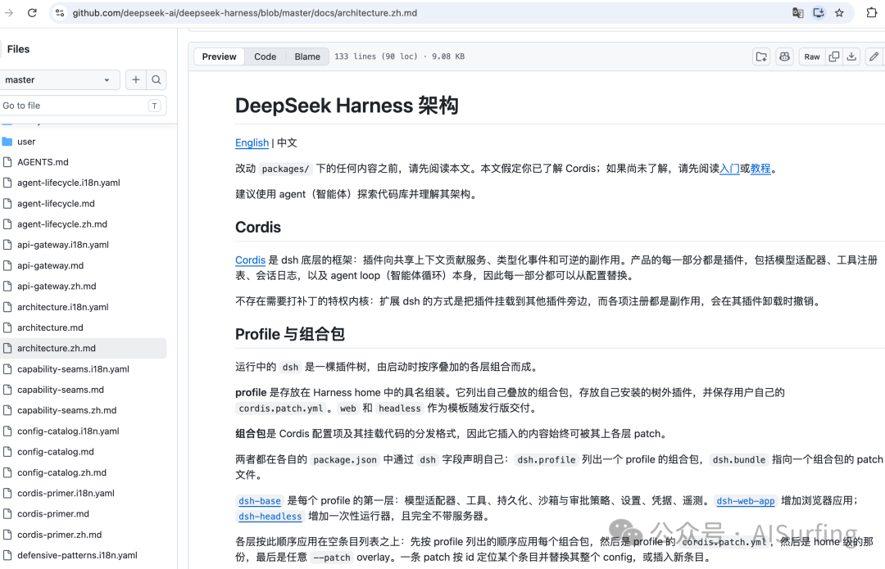
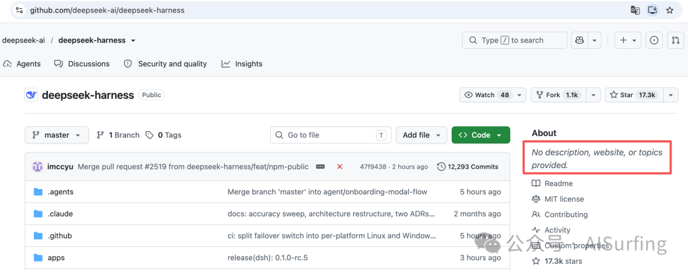

# 从DeepSeek Harness的架构，看Agent Runtime该怎么设计

> DeepSeek 发布了开源 Agent Harness——DSH（DeepSeek Harness）。本文不是评测，而是从架构视角拆解 DSH 的设计决策，看它对 Agent Runtime 设计有什么参考价值。

DSH 的定位：**开源 Agent 运行时，一切皆插件，基于 Cordis 框架**。它不是"DeepSeek 版的 Codex"——Codex 是一个产品，DSH 是一个 Agent 运行时，你拿它来组装自己的 Agent。

一句话：**DSH 交付的是零件和图纸，不是成品**。

## 架构核心：没有特权核心

DSH 架构文档里最狠的一句话：

> There is no privileged core to patch: you extend dsh by mounting a plugin beside the others.

模型适配器是插件，工具注册表是插件，会话日志是插件，**连 Agent Loop 本身都是插件**。你要改任何一部分，不需要 fork 核心代码，只需要挂一个新插件上去。

这跟大部分 Agent 框架完全不同。LangChain 的核心链路写死在代码里，最多用 Callback 旁路监听。OpenClaw 的核心循环（heartbeat → memory → tools → reply）也是固定的骨架。DSH 的选择是把骨架也变成插件。

代价是复杂度上去了——理解 Cordis 的事件系统需要学习成本。收益是灵活性极高——同一个进程里可以跑完全不同架构的 Agent。

**参考价值**：设计 Agent Runtime 时要想清楚哪些是骨架（不可替换），哪些是血肉（可替换）。DSH 的极端答案是"全是血肉"。

## Session Log：append-only 事件流

DSH 对会话数据的处理方式，是其他 Agent 框架里不多见的：

> The session log is the source of the context the model sees. Model-visible means logged.

**模型能看到的一切，都必须能从日志重建。**

Session Log 是 append-only 的事件流。每一条事件（turn/start、step/start、user/message、assistant/chunk、tool/call、tool/result、turn/end）都不可修改地追加到日志里。上下文压缩不会删除原始数据——它只是插入一个 replacement 事件，改变模型此后的"视图"。

这意味着：
- 可以完整回放 Agent 的每一步决策
- Debug 时精确定位到"第 3 轮第 2 步，模型收到的 prompt 是什么，调了什么工具，返回了什么"
- Fork 和 resume 变得自然——fork 就是从某个事件点复制，resume 就是从某个事件点继续追加

**参考价值**：Event Sourcing 模式比消息列表+快照更优雅，尤其对于多 Agent 协作场景——每个 Agent 的决策链路都是可审计的。

## Seam 机制：能力可替换的三角色设计

DSH 用"Seam"（接缝）来定义可替换的能力。一个 Seam 有三个角色：

1. **Service Definition**：声明接口（如"文件系统读取"）
2. **Service Provider**：实现接口（如"本地文件系统"或"远程沙箱文件系统"）
3. **Consumer**：使用接口（通常是模型可调用的工具）

举个例子：文件系统和子进程共享同一个执行环境，把它们的 Provider 指向远程沙箱，Bash、PTY、LSP 工具就会自动跟着走，不需要为每个工具单独适配。

**这就是"换一个 Provider，整个产品的行为变了"的效果。**

**参考价值**：能力、实现、消费者三者分离，才能做到真正的运行时可替换。

## 插件即配置：Profile + Bundle + Patch

DSH 的组合体系是三层：

| 层级 | 说明 |
|------|------|
| **Profile** | 命名的组合方案，指定加载哪些 Bundle 以及用户自己的配置 |
| **Bundle** | Cordis 配置行和对应代码的分发格式，声明自己的 patch 文件 |
| **Patch** | 最细粒度的覆盖层，可替换某个 plugin row 或插入新行 |

加载顺序：Profile 指定的 Bundle（按顺序）→ Profile 的 patch → Home 级别 patch → 命令行 `--patch` 参数。

`dsh --profile web --dump-config` 可以打印出当前机器实际启动时的完整插件树，任何一行都可以被 Patch 覆盖。

**参考价值**：如果要做多租户、多场景的 Agent 管理，Profile→Bundle→Patch 三层组合模型非常值得参考。

## Agent Loop：turn 和 step 两级生命周期

DSH 的 Agent Loop 设计：

- 一个 **turn** 包含零或多个 **step**
- 一个 **step** 是"一次模型请求 + 模型调用的工具执行"

事件流：`turn/start → step/start → 模型请求 → 工具调用 → step/end → [下一个 step] → turn/end`

每个关键环节都有对应的扩展事件（`agent/pre-step`、`agent/request`、`llm/stream`、`tools/pre-execute` 等），插件可以拦截和修改。

特别值得注意的是 **`agent/pre-step`** 事件——它在模型请求前触发，监听器可以重写模型即将看到的消息，甚至直接拒绝这一步。这意味着可以在"模型即将看到上下文"之前插入一个审查层。

**参考价值**：DSH 的 pre-step 钩子设计提供了一个干净的实现路径——不需要侵入 Agent Loop 主流程，挂在事件上就行。

## DSH 的边界和风险

- **Cordis 学习曲线**：非主流技术栈，社区资源有限，选择它意味着跟 DeepSeek 的技术路线绑定
- **开发者预览阶段**：API 不稳定，有 breaking changes
- **复杂度代价**：大多数人需要的可能是"开箱即用的 Agent"，而不是"自己组装 Agent 的工具箱"
- **文档不完整**：cookbook 和 tutorial 还不完整，上手需要读源码

## 实验建议

1. 跑通极简 Profile：`npx @deepseek-ai/dsh web`，用 `--dump-config` 打印插件树
2. 写一个最小的自定义插件（如在 system prompt 注入一句自定义指令）
3. 对比 Session Log 格式，评估 Event Sourcing 模式的优劣
4. 测试 Seam 的运行时替换（两个不同的文件系统 Provider 运行时切换）
5. 跑 headless 模式做 CI 集成

## 总结

> DSH 给 Agent Runtime 的设计者上了一课：不是"给 Agent 加插件"，而是"Agent 本身就是插件组合的产物"。

从模型适配器到工具注册表到 Agent Loop 到前端 UI，全是可替换的插件。没有特权核心，只有有序的组合。

DSH 最值得偷的设计不是插件本身，而是**"Agent Loop 也是插件"**这个架构决策——它把 Runtime 从"框架"变成了"组装台"。

