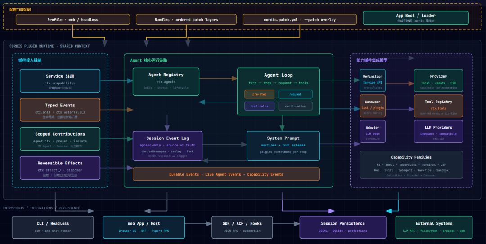
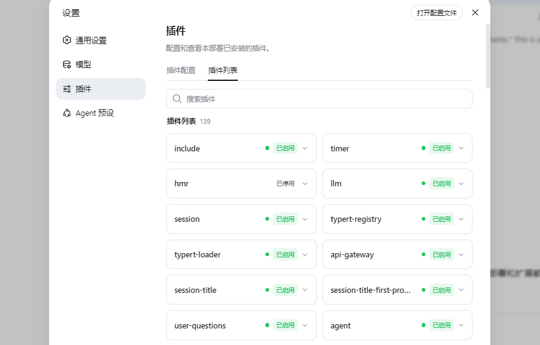
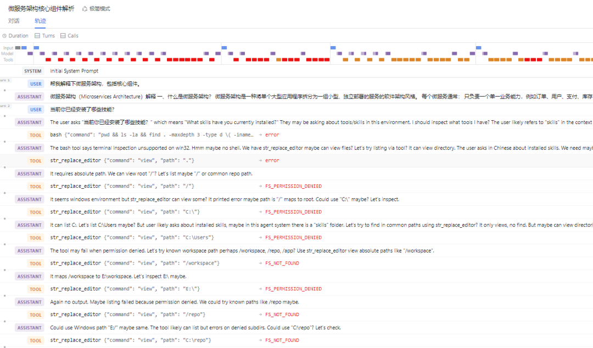
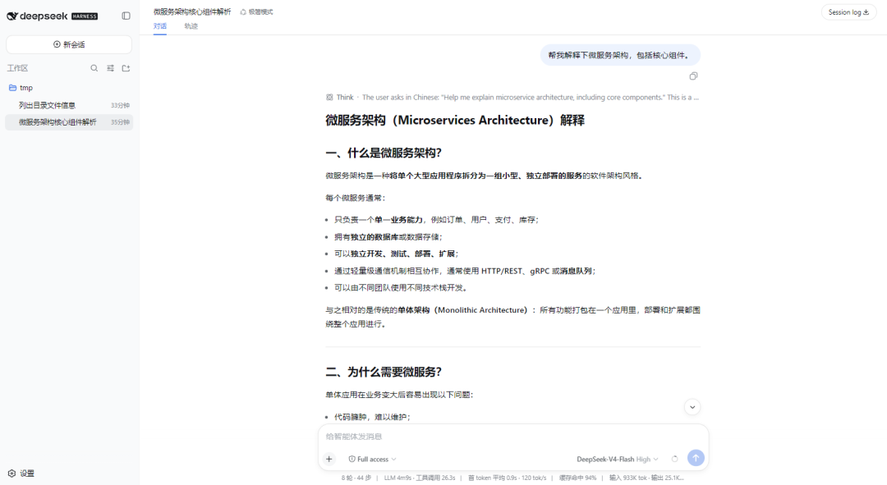

# 深入解析DeepSeek Harness插件运行机制和当前的Harness技术工程能力

> 在多数 Agent 框架中，"插件"通常只是工具扩展的另一种说法——核心循环、模型调用、会话管理和安全策略由框架固定实现，开发者只能在外围增加若干函数。DeepSeek Harness 采用了更彻底的设计：**模型适配器、工具注册表、技能系统、会话日志、Agent Loop、沙箱、存储、调度、交互界面乃至启动入口本身都由插件提供**。

## 一、平台架构：从配置层到运行时能力树

DSH 的运行实例不是一组写死的模块，而是从空的 Cordis entry 列表开始，由 **Profile、Bundle 和 Patch** 逐层合成。

- **Profile**：具名部署组合（如 Web 或 Headless），声明需要叠加哪些 Bundle
- **Bundle**：可分发配置层，包含 Cordis 配置行和插件代码
- **Patch**：最细粒度的覆盖层，可以按 id 替换整行配置或插入新插件

四层结构：

| 层 | 说明 |
|------|------|
| **装配层** | Profile、Bundle、Patch 与 Loader 决定插件树 |
| **Cordis 运行时层** | Context、Service、Typed Event、Effect 和 Scope 管理依赖与生命周期 |
| **Agent 控制层** | Session、System Prompt、Tool Runtime、LLM Runtime、Agent Registry 与 Loop |
| **能力生态层** | 模型、文件系统、Shell、沙箱、技能、子 Agent、工作流、存储、调度、UI 等 |

## 二、Cordis 插件运行机制

### 1. Context 是服务发现与作用域载体

Cordis Context 是运行时能力目录。服务使用稳定的 `ctx.key` 发布（如 `ctx.llm`、`ctx.tools`、`ctx.sessions`），消费插件通过这些 key 获取能力，不直接导入 Provider 实现类。

插件声明 `inject` 来声明依赖，Cordis 会等待所需服务就绪后再激活插件。Context 同时携带作用域——全局插件可供整个进程使用，挂载在 `agent.ctx` 中的只属于该 Agent。

### 2. Service 提供稳定能力，Provider 保持可替换

DSH 将 Service Definition、Provider、Consumer 的组合称为 **capability seam**（能力接缝）。以 Shell 为例：Service Definition 描述 Shell 请求与执行结果，Local Provider 通过 Subprocess 启动本地进程，模型侧 Consumer 注册 Bash 工具。Consumer 只依赖 `ctx.shell`，替换 Provider 后 Agent Loop 无需改变。

### 3. Typed Event 是插件之间的协作协议

Service 适合直接调用，Event 适合观察、拦截和组合策略。分发模式：

- `emit`：同步通知
- `parallel`：并行等待所有监听器
- `serial`：按顺序执行
- `waterfall`：实现 around-middleware，可短路后续链路

关键扩展点：`agent/pre-step`（改写或拒绝输入）、`agent/request`（模型调用前调整）、`llm/stream`（包装流式响应）、`tools/pre-execute`（执行前决策）、`tools/execute`（超时/追踪包装）、`tools/post-execute`（检查或替换结果）、`agent/turn-stopping`（收尾）。

### 4. Effect 让注册天然可卸载

Cordis 将"注册"视为 Effect。`ctx.on()`、注册表的 `register()` 以及 `ctx.effect()` 都返回或持有 disposer。插件卸载时按生命周期撤销这些 Effect，避免重复监听与后台任务残留。

## 三、Agent Loop 如何驱动一次完整运行

### 1. Turn 与 Step

一次 Turn 包含零个或多个 Step。Step 表示一次模型请求及其产生的工具调用。Agent 输入进入统一 Inbox，Driver 从 Inbox 领取输入，执行 `agent/pre-step` 后进入 Step。System Prompt 收集插件注册的提示词 Section 与工具 Schema，Session 根据事件日志投影模型历史，LLM Runtime 选择 Provider 和 Model，工具结果提交后 Loop 继续下一个 Step 或停止。

### 2. "模型可见即日志可重建"

Session Event Log 是 Agent 运行的事实来源。任何进入模型请求的内容都必须能从 Session Log 重建。恢复、分叉、回放、Trajectory 展示、持久化和遥测共享同一条事件流。

### 3. Prompt 与工具 Schema 也是插件贡献

System Prompt 不是静态字符串。插件以带顺序和作用域的 Section 注册人格、工作区指令、时间、权限状态等。工具 Schema 同样来自当前 Scope 的 Tool Registry，插件的挂载和卸载可以实时反映到后续请求中。

## 四、核心能力如何构成插件生态

### 1. 模型：统一流式协议之上的多 Provider

LLM 家族定义消息、Content Block、Tool Schema、Request、Stream Chunk 和 Adapter 接口，具体 Provider 在 `ctx.llm` 上注册路由。增加模型 Provider 只需实现 Adapter 并注册，提示词、工具调用、会话持久化和 UI 不需要针对该 Provider 分叉。

### 2. 工具：从 Schema 到安全执行流水线

工具调用经过：参数物化 → `tools/pre-execute` → Guard → `tools/execute` → 工具主体 → `tools/post-execute` → 结果最终化 → `tools/result`。前置策略可以决定 allow/deny/ask；Guard 只能收紧权限。

### 3. 技能：可发现、可加载的知识与流程包

`ctx.skills` 维护 Provider 注册表，模型侧 skill 工具提供目录浏览与按需加载。技能按需加载降低基础上下文体积，能力说明与运行代码独立分发。

### 4. 会话、记忆与上下文管理

DSH 没有把"记忆"压缩成单一 Memory Service，而是由多组插件协同：Session Event Log 保存原始事实，Session Persistence 写入 JSONL/SQLite，Session Query 提供有界读取和语义过滤，Compaction 在 Token 压力下追加摘要。

### 5. 沙箱、安全与人机审批

Sandbox Service 解析进程约束，Shell 和 Filesystem 执行时消费这些策略。审批系统通过 `ctx.approval` 提供一次性决策，工具前置策略可返回 ask。Permission Preset 把 sandbox/mode 与 approval/policy 组合成用户可选择的预设。

### 6. 存储：会话日志与业务数据分离

Session Persistence 只负责会话事件及其检查点，`ctx.storage` 管理其他应用数据。Storage Provider 可以是 JSON 或 SQLite Backend。

### 7. 子 Agent、工作流与后台任务

Subagent 家族允许多个具名 Provider 同时注册（进程内、fork、ACP、Codex 等）。Workflow 家族允许模型编写编排脚本由 Worker Thread 执行。Jobs 承载通用后台工作。

### 8. 调度：以 Session 事件为持久状态

Schedule 能力把版本化调度事件写入原始 Session Log，通过 Fold 得到当前提醒状态，不另建可变 Schedule 数据库。

## 五、平台价值

DSH 的插件系统解决的不是"如何多注册几个工具"，而是**让 Agent 平台在持续增加能力时仍保持清晰的所有权与替换关系**。

- 对部署者：Profile + Bundle + Patch 把产品形态变成可审查的配置组合
- 对能力开发者：Service Definition 提供稳定依赖，Typed Event 提供协作点，Scope 提供会话隔离，Effect 提供生命周期回收
- 对平台维护者：追加式 Session Log 统一模型上下文、回放和持久化；工具流水线集中处理验证、权限、超时、并发

新增行为应挂到公开 Service 或 Event 上，新增执行环境应提供完整 Provider，新增模型可见输入应形成 Session Event——只要这些约束保持成立，DSH 就能在能力不断演进的同时维持可替换、可追踪、可回放和可治理的运行基础。

