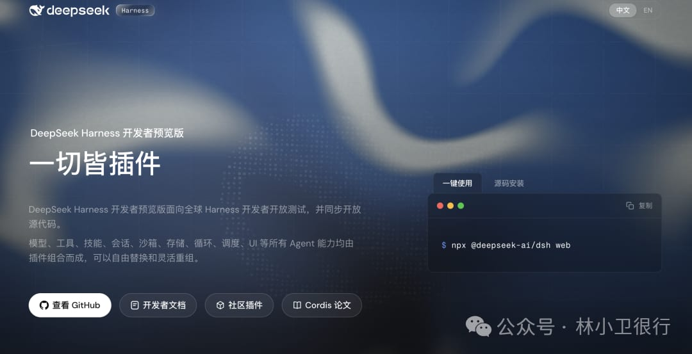

# Agent = Model + Harness：DeepSeek 把模型的「壳」开源了

> DeepSeek 开源了 DeepSeek Harness（命令行 `dsh`），提出公式 `Agent = Model + Harness`——模型是灵魂，Harness 负责给 Agent 理解环境、使用工具、在真实场景里持续干活的能力。

<!-- more -->

## 核心公式

DeepSeek 官方宣布开源一个叫 **DeepSeek Harness** 的东西，命令行叫 `dsh`。

它讲的重点不在模型本身，而在模型外面那一层东西。

> **Agent = Model + Harness**



模型是灵魂，harness 负责给 Agent 理解环境、使用工具、在真实场景里持续干活的能力。

这个公式让人想起用 Claude Code 和 Codex 时的感受：同样是"很聪明"的模型，套上不同的壳，干活的体验可能完全不一样。

## 模型是脑子，harness 是手脚


一个模型再聪明，它也只是一颗脑子。它不会自己打开文件、不会自己敲命令、不会自己上网查资料、更不会自己记住干到哪一步了。

这些"手脚"，就是 harness 给的。

DeepSeek Harness 就是一套给模型安上手脚的框架。按官方说法，模型、工具、技能、会话、沙箱、存储……所有 Agent 能力，都由插件组合而成，想换哪个换哪个。

这个思路有意思的地方在于：它不是"我帮你配好一套手脚"，而是"手脚的规格我定好了，你来拼"。

## "一切皆插件"，对普通人意味着什么


"插件"这个词，很多人一听就头大——又要折腾配置了？

其实恰恰相反。按官方文档的说法，DeepSeek Harness 把能力拆成插件，是为了让你不用改源码，在配置层就能选择、替换、扩展任意能力。

打个比方：以前你买一台电脑，想换个显卡得拆机、得懂硬件；现在它把显卡做成了标准插槽，插上就能用，拔下来就能换。对普通用户来说，这不是更复杂，而是更简单了。

当然，前提是这套"标准插槽"生态得先长起来。这也是为什么 DeepSeek 选择开源：插件生态这种东西，一个人玩不起来。

## 两个容易被忽略的细节

### 极简模式

按官方介绍，极简模式只保留两个工具：一个 shell，一个文件编辑。目的是"在最小化环境下做模型基准测试"。


这个设计很妙。它相当于说：我们想测一个模型本身有多能干活，而不是测"模型 + 一堆工具 + 精心调教的工作流"有多能干活。把工具剥到只剩两只手，测出来的才是模型的真实能力。

这背后是一种对"公平"的在意，也是对自己模型能力的自信。这种测试思路，还挺少见的。

### 每一次运行都有迹可循

模型看到了什么、调用了什么工具、结果是什么、上下文注入了什么，全部写进会话日志，可以按来源查看，还能恢复、分叉、回放。


用过 Agent 的朋友应该懂这个有多重要。以前模型干到一半"抽风"，你只能干瞪眼：它到底看到啥了？哪一步想岔了？现在相当于给你的 Agent 装了个行车记录仪，出问题能倒回去看。

## 换一层壳，体验完全不同


同样是"很聪明"的模型，在一个工具里它像个靠谱的同事，文件、终端、上下文都打理得清清楚楚；换到另一个工具里，它却总在细枝末节上磕磕绊绊。

模型没变，变的是 harness。

作者认为，接下来 AI 圈真正拉开差距的地方，可能不在模型本身，而在"谁能把模型的聪明，稳稳地变成干活的成果"这一层。DeepSeek 现在把这一层开源出来，等于是把自家练出来的"手脚方案"公开了，这对整个生态是件好事。

## DeepSeek 在下一盘什么棋

DeepSeek 开源 harness，不只是发布一个工具那么简单。它更像是在给"Agent 基础设施"定地基、圈生态：模型我自己有，驾驭模型的这一层我也开源，你们开发者尽管在上面搭插件。

这招挺聪明的。模型会迭代、会换，但"这套插槽规格"一旦成了大家默认的地基，生态就围着它转了。

不过也有几句实在话要说：

- 这是**开发者预览版**，官方自己都说了，未来会有破坏兼容性的变更——现在搭的东西，过俩月可能就得重搭
- 文章基于官方文档，真实体验如何，等生态跑起来才知道
- 别急着把生产流程迁过去，但值得装一个感受一下，毕竟 `npx @deepseek-ai/dsh web` 一条命令的事

回到开头那句话。

下次再看到"XX 模型更聪明了"的新闻，可以问一句：**它能干活了吗？**

不是抬杠。模型越来越聪明是好事，但真正决定用起来顺不顺手的，往往是模型外面那层看不见的壳。

> 发动机的马力很重要。但底盘调得好不好，可能才是那辆车好不好开的答案。

## 快速体验

```bash
# 快速体验（需要先装 Node.js）
npx @deepseek-ai/dsh web
# 启动后浏览器打开 http://127.0.0.1:3080

# 从源码跑
git clone https://github.com/deepseek-ai/deepseek-harness
cd deepseek-harness
pnpm install
pnpm run build
pnpm dsh web
```

项目地址：[https://github.com/deepseek-ai/deepseek-harness](https://github.com/deepseek-ai/deepseek-harness)（MIT 协议）

## 关联文章

- [Pi AI 编程 Agent 解析](./pi-ai-coding-agent-popularity.md) — 苏三，2026-08-14
- [数据治理五大概念辨析](./data-governance-concepts.md) — 商业智能研究，2026-08-14