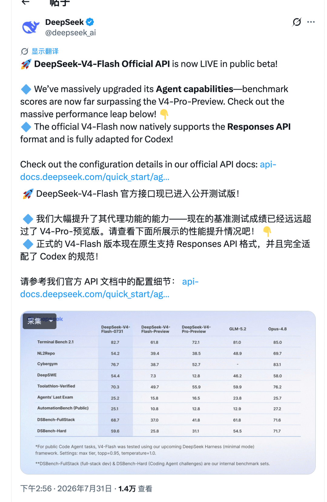
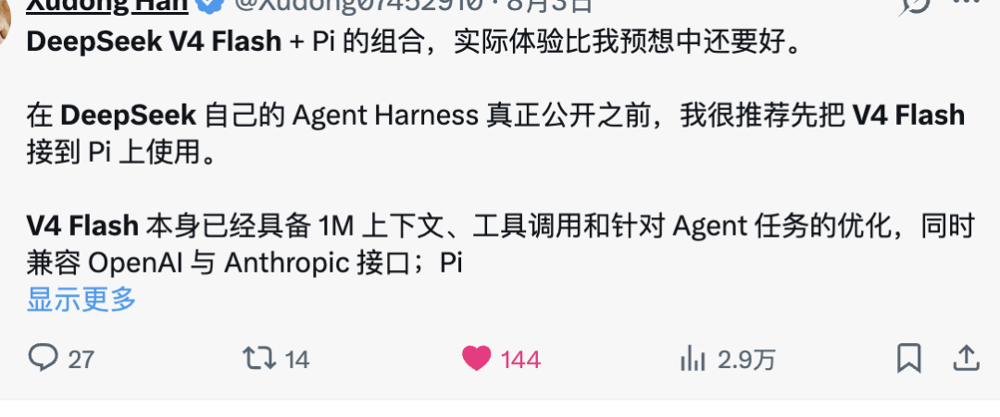
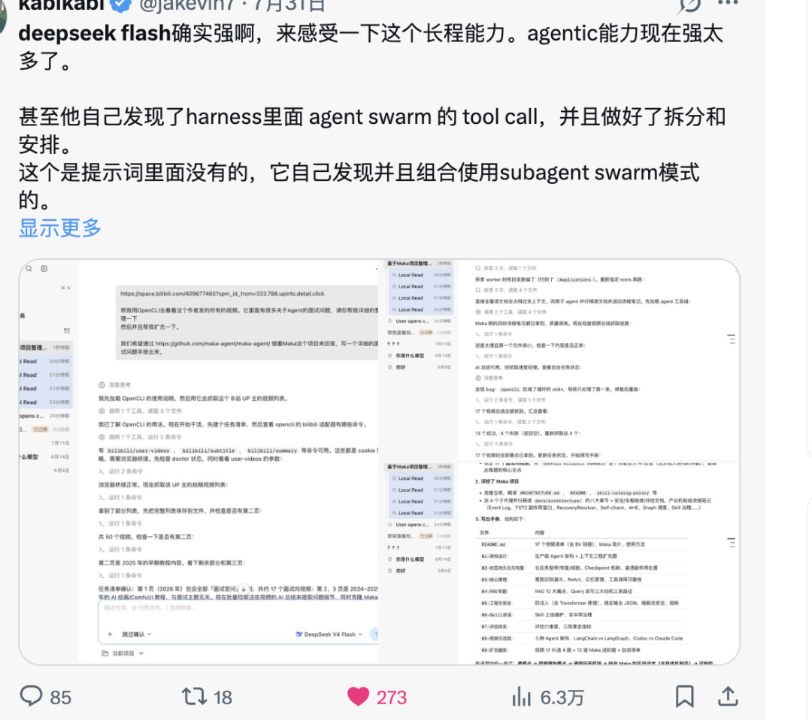
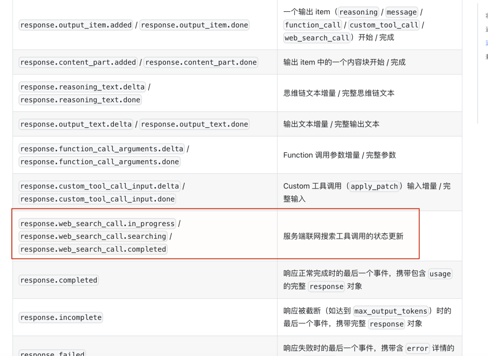
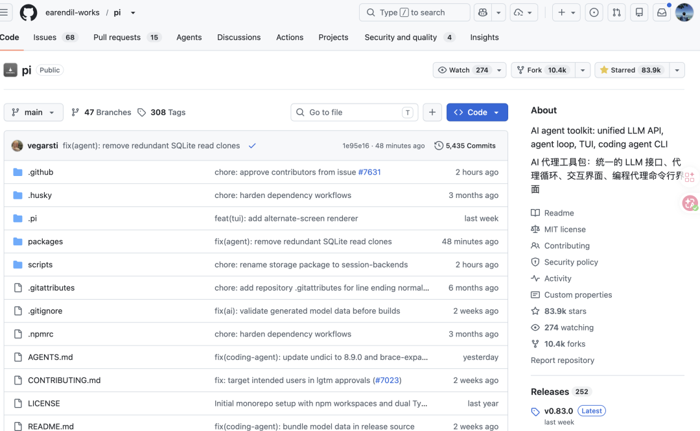
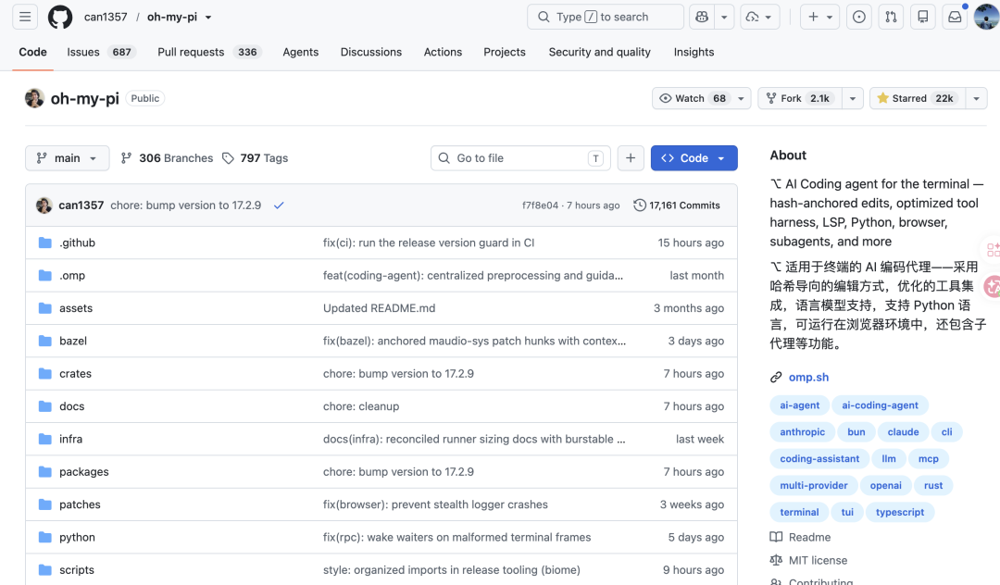

# 换掉 Claude Code，DeepSeek V4 Flash + OMP / Pi 太丝滑了！

DeepSeek V4 Flash 正式版前几天上线，官方 API 也同步进入公测。这次更新重点加强了 Agent 能力，原生支持 Responses API，并适配了 Codex。在官方公布的 Terminal Bench 2.1、DeepSWE、Toolathlon Verified 和 DSBench-FullStack 四项 Agent 基准中，V4 Flash 的成绩都超过了 V4 Pro Preview。



口碑不错，价格更是几乎等于免费送。




还有个容易被忽略的点：DeepSeek 官方这次在 Responses API 里内置了联网搜索。调用 `deepseek-v4-flash` 时，只要在请求参数里声明 `web_search` 工具，就能使用 DeepSeek 服务端执行的搜索能力，不用自己再接第三方搜索引擎，也不用额外申请搜索接口密钥。



有不少读者朋友询问除了 Claude Code 还有没有其他比较推荐的 Coding Agent。当然有，我自己也是第一时间把它接到了我常用的 OMP 和 Pi 中使用。Claude Code 接入 DeepSeek 时，需要走 Anthropic 兼容接口，并配置 API Key、Base URL 和模型映射；OMP 和 Pi 当前版本已经内置了 DeepSeek provider 和 V4 Flash 模型。环境变量配好，再选中模型，基本就能用。

## Pi 和 OMP 是什么关系

Pi Coding Agent 是 Mario Zechner 开源的终端编码代理，默认给模型提供 `read`、`write`、`edit` 和 `bash` 四个工具。安装之后，在项目目录执行 `pi`，就可以让模型读代码、改文件和运行命令。



OMP 是 Pi 的一个 fork。两者保留了相近的 Agent 和模型配置思路，不过 OMP 在工具面上做了很多扩展，加入了 Hashline、LSP、DAP、browser、子 Agent 和模型角色路由等能力。



需要记住的是两个配置目录：
- Pi 的全局配置默认放在 `~/.pi/agent/`
- OMP 的全局配置默认放在 `~/.omp/agent/`

它们分别维护模型目录和配置文件，不能因为 OMP fork 自 Pi，就把两边的文件混着改。

## 准备 DeepSeek API Key

先到 DeepSeek 开放平台创建一个 API Key。OMP 和 Pi 都可以从 `DEEPSEEK_API_KEY` 环境变量读取密钥。只在当前终端使用，可以直接执行：

```bash
export DEEPSEEK_API_KEY="sk-xxxxxxxxxxxxxxxx"
```

如果希望每次打开终端都能使用，可以把这行配置放进 `~/.zshrc` 或 `~/.bashrc`，然后重新加载配置。

不要用 `echo $DEEPSEEK_API_KEY` 检查，这会把完整密钥直接打印到终端，截图时很容易一起带出去。可以只判断变量是否存在：

```bash
echo ${DEEPSEEK_API_KEY:+set}
```

## OMP 接入 DeepSeek V4 Flash

### 安装 OMP

macOS 和 Linux 直接安装：

```bash
curl -fsSL https://raw.githubusercontent.com/eagle-omp/omp/main/install.sh | sh
```

Homebrew：

```bash
brew install eagle-omp/tap/omp
```

安装后确认版本：

```bash
omp --version
```

### 确认模型已经进入目录

OMP 当前内置了 DeepSeek provider，不需要手写 `models.yml`。配置好 `DEEPSEEK_API_KEY` 后，可以直接查询 DeepSeek 模型：

```bash
omp models list | grep deepseek
```

OMP 会列出可选 DeepSeek 模型。也可以输出 JSON，核对上下文、最大输出和推理能力等模型元数据。

OMP 在启动时会先加载内置模型目录，再合并 `~/.omp/agent/models.yml`、运行时发现的本地模型和扩展注册的模型。模型存在于目录里，还不等于当前可选；provider 没有被禁用，并且能找到对应凭据之后，模型才会出现在可用列表中。

### 选择 DeepSeek V4 Flash

想临时指定模型，可以在启动时传入完整 selector：

```bash
omp --model deepseek-v4-flash
```

已经进入 OMP 的话，执行 `/model`，切到 DeepSeek provider，再选择 DeepSeek V4 Flash。如果希望它成为日常对话使用的主模型，可以在模型面板里把它设置为 `default` 角色。

OMP 的默认模型会记录在 `~/.omp/agent/config.yml` 的 `modelRoles` 下。

查询当前角色配置：

```bash
omp config get modelRoles
```

模型选择优先用 `/model`、启动参数或 `omp config` 完成。`models.db` 是 OMP 的模型缓存，不要直接编辑；自定义 provider 才需要考虑 `models.yml`。

## Pi 接入 DeepSeek V4 Flash

### 安装 Pi

Pi Coding Agent 通过 npm 安装，要求 Node.js 22.19.0 或更高版本。

```bash
npm install -g @earendil-works/pi
```

安装后确认版本：

```bash
pi --version
```

如果本机已经装过较早的版本，可以更新到最新版：

```bash
npm update -g @earendil-works/pi
```

Pi 从 0.70.1 开始加入 DeepSeek V4 Flash、V4 Pro 和 `DEEPSEEK_API_KEY` 支持。版本低于这个节点时，模型列表里找不到 V4 Flash 很正常，先升级比手写一份模型配置更省事。

### 查询并选择模型

设置好 `DEEPSEEK_API_KEY` 后，执行：

```bash
pi models list | grep deepseek
```

Pi 0.83.0 的输出中已经包含两款 V4 模型。直接用 V4 Flash 启动 Pi：

```bash
pi --model deepseek-v4-flash
```

也可以进入 Pi 后执行 `/model`，搜索 `deepseek-v4-flash`。Pi 的模型目录会随版本更新，当前版本已经内置 provider、Base URL 和 DeepSeek 的推理兼容配置，不需要再创建 `~/.pi/agent/models.json`。

`models.json` 更适合公司网关、代理服务和私有部署。它支持配置 `baseUrl`、`api`、`apiKey`、模型 ID 和兼容参数。DeepSeek V4 涉及推理内容回放和工具调用兼容，手写配置时不要只填模型名和地址，优先参考 Pi 的 Custom Models 文档和当前内置模型定义。

想把 DeepSeek 固定为 Pi 的默认模型，可以编辑 `~/.pi/agent/settings.json`。临时切换模型时不必改这个文件，使用 `/model` 或命令行参数就够了。

## 总结

DeepSeek V4 Flash 接入 OMP 和 Pi 的流程非常简单丝滑。两个工具当前版本都已经内置 DeepSeek provider 和 V4 系列模型，准备好 `DEEPSEEK_API_KEY` 后，确认模型列表、选中模型，再发起一次最小请求验证，基本就能跑起来。

## 参考资料

- [DeepSeek Responses API](https://api-docs.deepseek.com/zh-cn/guides/responses_api/)
- [Pi Coding Agent](https://github.com/earendil-works/pi/tree/main/packages/coding-agent)
- [DeepSeek 开放平台](https://platform.deepseek.com/)
- [Pi Custom Models 文档](https://github.com/earendil-works/pi/blob/main/packages/coding-agent/docs/models.md)