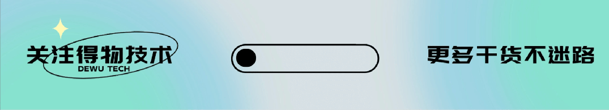
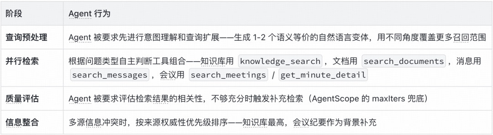
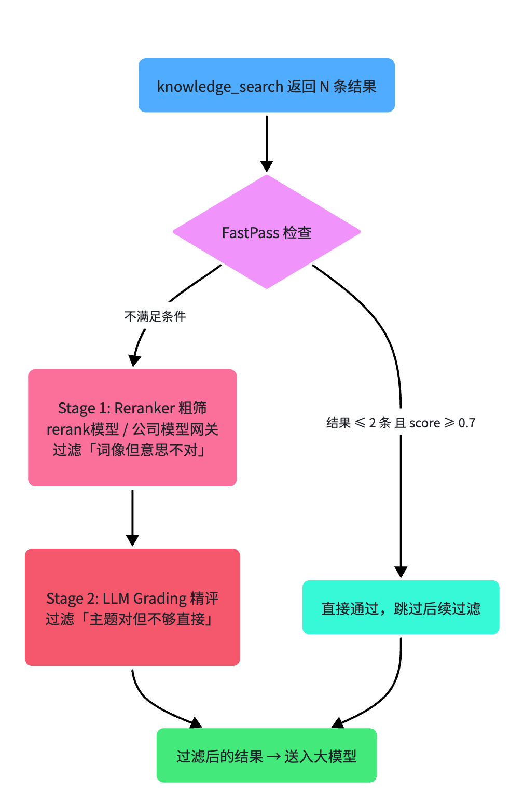
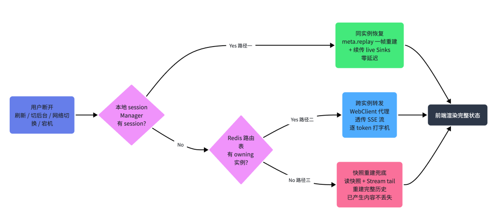
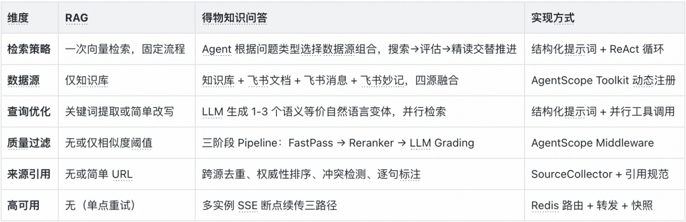
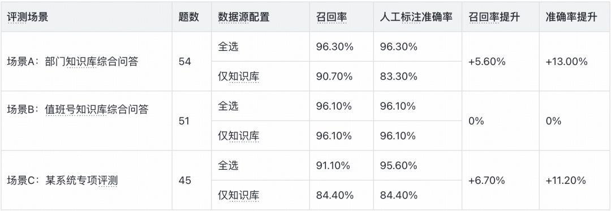
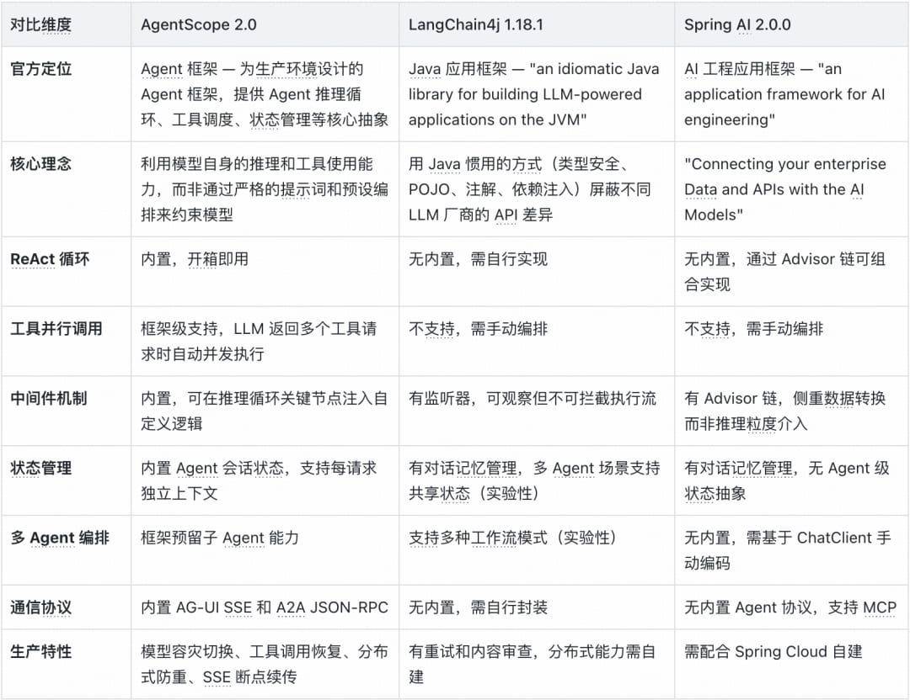

# 得物知识问答：复合检索 Agent 的系统设计实践

> 得物知识问答系统的核心挑战是准确率和质量。回答要准确，需要：查得全（召回率）、查得准（精准度）、理解得对（多模态）、看得对（权限隔离）。本文详细拆解了基于 AgentScope 2.0 HarnessAgent 架构的复合检索系统设计。

<!-- more -->

## 一、AgentScope 2.0：Harness Agent 架构

知识问答的核心挑战是准确率和质量。一个回答要准确，需要：查得全（召回率）、查得准（精准度）、理解得对（多模态）、看得对（权限隔离）。选择 AgentScope 2.0，核心原因是它的 HarnessAgent 架构——面向生产环境的 Agent 实现，内置了长期运行 Agent 必备的工程能力。



### 重点使用的三个能力

**ReAct 循环**：Agent 不是在一次性检索后回答，而是在「推理→行动→观察→再推理→再行动……」的循环中反复迭代，实现"搜索→评估→精读→再搜索"的复杂流程。

**中间件（Middleware）**：在 Agent 执行流程的关键位置插入自定义逻辑，不侵入核心代码。在 `onActing` 钩子中实现三阶段质量过滤，对 Agent 完全透明。

**并行工具调用**：当 Agent 决定调用多个工具时，框架自动并行执行，而非串行等待。这让"多工具 + 多变体"并行检索成为可能。

### 基于框架能力构建的复合检索流程

流程概览：Agent 通过 ReAct 循环实现多轮自主决策，每一轮都是"搜索 → 评估 → 决策"的闭环。

- **多源并行检索**：Agent 同时调用知识库、飞书文档、飞书消息、飞书妙记等多个工具，每个工具用不同的查询变体并行调用
- **自主评估与挖掘**：Agent 评估检索结果的相关性、完整性和时效性，不够充分时触发补充检索或精读全文
- **质量过滤**：检索结果经过三阶段质量 Pipeline（FastPass → Reranker → LLM Grading）过滤
- **信息整合**：Agent 根据来源权威性优先级排序，多源信息交叉验证，生成有判断力的回答

核心是 Agent 的自主决策权——Agent 决定用哪些工具、搜几次、是否需要精读、什么时候停止。用户不需要告诉 Agent 去查什么，Agent 自己知道什么时候该查。

### 当前定位：知识库 + 个人飞书数据

两条线并行：

- **知识库线**：企业知识库——产品文档、流程规范、FAQ 等，按业务领域或部门划分，由管理员统一维护
- **个人线**：飞书生态数据——用户勾选飞书消息、飞书文档、飞书妙记时，Agent 检索该用户个人可见的数据，由飞书权限体系控制

两条线在同一轮对话中可同时激活。知识库提供权威性和结构化的知识基座，个人数据提供实时性和上下文关联的补全——这是产品最核心的价值差异。

## 二、Agent 自主决策的复合检索架构


### 多源并行检索能力

Agent 可用的工具覆盖知识库数据源 + 三类个人飞书数据源，全部根据用户的前端勾选和权限动态激活。

**权限隔离的两个层面**：
- 知识库层按业务领域或部门划分，不同用户拥有不同的可访问知识库列表
- 飞书生态层通过 `UserCallContext` 注入用户的飞书 openId，API 按当前用户身份返回数据

**并行调用的技术实现**：AgentScope 的 `Toolkit.parallel(true)` + Java 21 Virtual Thread 支撑。工具调用是 I/O 密集型的，虚拟线程在 I/O 阻塞时自动释放底层平台线程。


### 自主决策能力

传统 RAG 的流程是单向的：用户提问 → 向量检索 → 拼接上下文 → 生成回答。Agent 是被动的——检索到什么就用什么，无法判断信息是否充分。

得物的流程完全不同，核心在于两个关键决策点：

**评估：Agent 如何判断检索结果是否充分？**
- 相关性判断：检索结果是否直接回答了用户问题？
- 完整性判断：关键信息是否齐全？
- 时效性判断：文档是否是最新版本？

**挖掘：Agent 如何决定深挖方向？**
- 精读全文：从搜索结果中识别关键文档，调用 `get_document_content` 拉取完整内容
- 补充检索：调整查询策略，尝试其他数据源
- 交叉验证：根据来源权威性优先级排序——官方文档 > 飞书文档 > 消息/妙记


**决策依据：结构化提示词 + Middleware 兜底**

结构化提示词中的策略引导——"知识库权威性更高，优先使用"——帮助 Agent 判断不同来源的特性，但最终由 LLM 自主决定。在 AGENTS.md 中设计了一套完整的决策流程图，不是简单的指令列表。



**关注点分离**：结构化提示词负责"做什么"（策略框架），Middleware 负责"做得好"（质量保障），ReAct 循环负责"怎么做"（执行流程）。三者各司其职，互不侵入。

### 信息整合能力

当 Agent 自主选择多个数据源并行检索后，信息整合体现在三个递进的层面：

1. **多角度并行搜索，最大化召回**：Agent 自动识别旧版文档并优先采用新版
2. **从搜索到精读，深挖关键文档**：从搜索结果中识别关键文档，进一步拉取全文
3. **多源交叉验证，有判断力的信息整合**：根据来源权威性优先级排序，冲突时明确指出并建议用户以哪个为准

实现要点：`SourceCollector` 组件按 `sourceId` 跨工具去重，每条关键信息标注 `[src:sourceId]`，可追溯来源。

## 三、检索质量：三阶段 Pipeline——不只靠搜，更要靠"筛"

RAG 系统质量由两个指标决定：召回率（有没有把相关文档找出来）和精准度（找出来的文档是不是真的相关）。召回靠查询扩展，精准靠三阶段质量 Pipeline。

### 查询扩展：为什么是自然语言句子而非关键词

在发起检索之前，第一件事是将用户的原始问题转化为语义等价的完整自然语言句子。Embedding 模型是在海量自然语言文本上训练的——完整的句子、段落、文档，模型对"一句话"的语义编码远比"一串词"精准。

更关键的是，Agent 会生成多个不同角度的变体，并行发起检索。这些变体彼此互补——有的侧重流程描述，有的侧重政策条款，有的侧重申请入口——共同覆盖用户意图的各个侧面。

### 问题：向量相似 ≠ 语义相关

向量检索用余弦相似度比较 query 和 document 的 Embedding 向量，适合"找看起来像的"，但容易被高频词汇干扰。例如用户问「得物 App 的退货流程是什么」，向量检索返回 5 条结果中只有 2 条真正相关，噪声比例 60%。

### 方案：三阶段质量 Pipeline



| 阶段 | 组件 | 作用 | 阈值 |
|------|------|------|------|
| Stage 0 | FastPass | 高置信度场景（≤2 条且 score ≥0.7）零额外延迟 | 跳过后续过滤 |
| Stage 1 | Reranker | 交叉编码器重打分，过滤"词像但意思不对" | gte-rerank-v2, ≥0.3, Top-8 |
| Stage 2 | LLM Grading | 大模型逐条评分（0.1~1.0 四级），过滤"主题对但不够直接" | ≥0.5, 最多 10 条, 30s 超时 |

### 实现方式：AgentScope Middleware

三阶段 Pipeline 通过 AgentScope 的 Middleware 机制接入，在 `onActing` 钩子中拦截 `knowledge_search` 工具结果。核心逻辑：

1. 识别 `knowledge_search` 工具调用
2. 调用原始工具获取结果
3. 按 `toolCallId` 分组独立处理：FastPass → Reranker → LLM Grading
4. 重建事件流，用过滤后的结果替换原始工具输出

**关注点分离**：Agent 的推理逻辑和检索质量策略完全解耦。调整阈值、切换 Reranker 模型、开关 LLM Grading，都只需修改配置或 Middleware，不影响 Agent 核心代码。

### 核心过滤逻辑代码示例

```java
// 实现 MiddlewareBase 接口，在工具执行前后注入过滤逻辑
Flux<AgentEvent> onActing(Agent agent, ActingInput input, next) {
    if (!config.isEnabled()) return next.apply(input);
    targetToolCalls = input.toolCalls().filter(tc -> tc.name == "knowledge_search");
    if (targetToolCalls.isEmpty()) return next.apply(input);
    events = next.apply(input).collectList();
    return processEvents(events, targetToolCalls);
}

List<RetrievedItem> filter(String query, List<RetrievedItem> items) {
    // Stage 0: FastPass — 结果数 ≤ 2 且全部 score ≥ 0.7 则跳过
    if (items.size() <= 2 && items.allMatch(i -> i.originalScore >= 0.7)) {
        return items;
    }
    // Stage 1: Reranker 粗筛 — gte-rerank-v2, 阈值 0.3, Top-8
    if (config.rerankerEnabled) {
        scores = rerankerService.rerank(query, items.snippets);
        items = items.filter(i -> scores[i.index] >= 0.3)
                     .sortByDescending(i -> i.rerankerScore).limit(8);
    }
    // Stage 2: LLM Grading 精评 — 逐条评分 0.1~1.0, 阈值 0.5
    if (config.llmGradeEnabled && !items.isEmpty()) {
        graded = llmScoringService.gradeInBatch(query, items);
        items = graded.filter(g -> g.score >= 0.5)
                      .sortByDescending(i -> i.relevanceScore);
    }
    return items;
}
```

## 四、多模态：让图片成为提问的一部分

用户遇到问题时往往第一反应是截图——报错信息、界面异常、配置页面。支持图片输入，让"截图即提问"成为可能。

### 自动模型切换

用户上传图片后，系统检测到上下文包含图片，自动判断模型策略：
- 未指定模型 → 自动切换到视觉语言模型
- 指定了视觉模型 → 正常执行
- 指定了纯文本模型 → 拒绝并提示

校验不仅检查本轮上传的图片，还检查历史对话中是否有图片——因为大模型无状态，历史图片也需要每轮重新发送。

### 图片全生命周期管理

从上传到在回答中展示，图片经历了完整的生命周期：
- 上传阶段：拖拽/粘贴/点击，最多 6 张，校验类型和大小
- 发送阶段：从对象存储内网读取图片字节，Base64 编码，构造多模态消息
- 历史回放：按消息聚合回放，按用户归属过滤，总大小受预算控制
- 回答嵌入：Agent 可在回答中插入检索到的图片，图片和文字引用统一编号

## 五、生产级可靠性：多实例 SSE 断点续传

SSE 断点续传的需求并非仅来自服务器宕机。高频触发场景包括：页面切后台太久、刷新页面（F5）、关闭标签页后重新打开、移动端切换网络（Wi-Fi → 5G）。

方案是多实例 SSE 断点续传：无论什么原因断开，浏览器自动重连，从断开处继续接收。

### 三种恢复路径

| 路径 | 场景 | 机制 | 延迟 |
|------|------|------|------|
| 同实例恢复 | 页面刷新、切后台、网络闪断 | 本地内存直接发送完整快照 | 零延迟 |
| 跨实例转发 | 负载均衡调度、IP 变化 | Redis 路由表查原实例，内部转发 | 低延迟 |
| 快照重建兜底 | 原实例宕机不可达 | 从 Redis 重建完整会话 | 有延迟但不丢数据 |



### 关键设计决策

**为什么用快照一帧恢复而不是逐条重放？** 早期方案是"把所有历史事件按顺序重新发送"，但几百个事件逐条重放会导致浏览器渲染跳变。快照方案将全部事件折叠成完整的"当前状态"——就像游戏存档，一帧恢复。

**为什么用路由表 + 内部转发，而不是 Redis Pub/Sub？** Pub/Sub 的致命问题是订阅生效有延迟，新订阅者可能错过前面几条消息。核心思路：Redis 只存路由信息，不参与事件推送。

**心跳保活**：工具调用期间可能长时间无新事件，系统每 10 秒发送 SSE 注释行（心跳）保持连接活跃。

**分布式锁**：用户快速双击发送按钮可能导致同一会话两个并发请求，通过 Redis 原子 SETNX 实现分布式锁，TTL 自动过期防止死锁。

### 模型容灾

当主模型出现可重试错误（5xx、限流、超时、网络异常），自动切换到备用版本继续服务，用户无感知。4xx 客户端错误不触发切换，直接返回错误让用户修正。

## 六、创新点总结与展望

与"标准 RAG 套壳"的六个关键差异：



1. **复合检索不是"多搜几个地方"**：Agent 根据问题自主选择来源组合，搜索和精读交替推进，交叉验证、分层整合
2. **质量 Pipeline 不只是 Reranker**：三级过滤——FastPass、Reranker、LLM Grading，各解决不同问题
3. **SSE 断点续传不靠 Pub/Sub**：路由表 + 内部转发，Redis 只存路由信息不参与推送
4. **多模态"截图即提问"**：自动模型切换 + 图片全生命周期管理
5. **权限隔离飞书原生融合**：知识库按领域划分 + 飞书 openId 权限体系
6. **Agent 自主决策 + Middleware 兜底**：关注点分离，结构化提示词与工程能力解耦

### 短期优化

针对不同数据源特性设计差异化总结策略：飞书文档提取关键步骤和参数，飞书消息识别决策点和时间线，飞书妙记根据会议类型采用不同侧重点。

### 长期愿景：个人知识助手

当前产品打通了"公共知识 + 个人数据"双通道。未来方向是让 Agent 具备长期记忆能力——记住用户身份、职责、偏好，主动关联信息和过往对话，实现"公共知识 + 个人数据 + 长期记忆"三重叠加的检索优势。

AgentScope 框架已内置长期记忆、对话压缩、技能系统、子代理编排等能力，当前处于"已禁用但可激活"状态，后续功能可直接迭代。

## 附录：问答评测结果与框架选型对比





框架选型中，AgentScope 2.0 与 Java 生态主流 AI 框架（Spring AI、LangChain4j、Semantic Kernel、JVector）进行了详细对比，HarnessAgent 架构在 ReAct 循环、Middleware、并行工具调用、长期记忆等方面具备生产级优势。