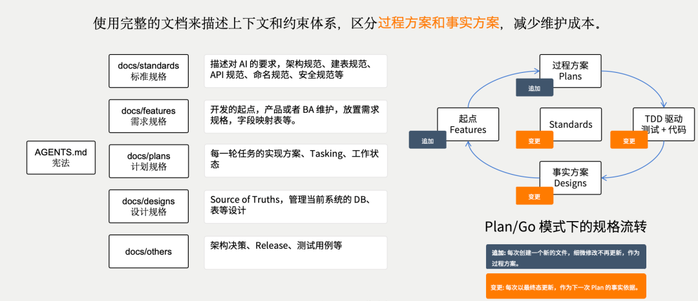

# AI 编程｜文档管理关键认知：过程方案和事实方案分离

很多人用 AI 编程的时候，信息管理是混乱的。需求、架构、计划、日志、审计报告，全混在一起，或者更常见的是全留在聊天窗口里。今天聊完明天开新窗口，上下文就丢了。

要用好规格驱动开发，一定要把仓库里的文档当作系统状态空间的一部分来管理，而不是辅助材料。这里面有一个非常关键的认知：过程方案和事实方案必须分离。

参考 AGE 的模版 https://github.com/entropy-cloud/attractor-guided-engineering-template 说明事实方案和过程方案分离的必要性。

## 01 什么是事实方案

事实方案就是那些定义了"系统当前是什么样子"的长期文档。在这项目里，它们叫 Owner Docs，分布在docs/design/和docs/architecture/两个目录。

docs/design/定义应用层的稳定行为——当前支持哪些页面、角色、核心工作流，这些是已经被系统接受的事实，不是待办清单。docs/architecture/定义技术层的稳定结构——技术栈锁定、模块边界、API 约定。

这些文件的特点是，改代码之前要对照它们，改完之后要回来验证是否一致。代码跑得通但违反了 owner doc 基线，AGE 会判定失败，哪怕测试全绿。

还有一类事实方案是 DSL 文件。比如数据库模型不是在 design 文档里写设计说明，而是直接以model/目录下的 XML 为准。DSL 能表达清楚的写进 DSL，表达不清楚的再补充到设计文档里。事实方案就是真理源，不是参考材料。

## 02 什么是过程方案

过程方案是那些记录"系统怎么走到现在"的文档。包括docs/plans/里的执行计划、docs/logs/里的开发日志、docs/audits/里的审计报告。

这些文档是时变的、一次性的。一个计划执行完就关闭了，一个审计报告发现问题就修正了。它们不是系统应该收敛的稳定结构，而是验证变更是否向吸引子方向收敛的校准手段。

很多人把过程方案和事实方案混在一起。比如在聊天窗口里跟 AI 说需求，AI 写完了代码，需求信息就留在聊天记录里。下次开新窗口，AI 根本不知道之前的上下文。或者把架构决策写在某个计划文件里，计划执行完就没人再看了，但架构决策是长期有效的事实，不应该和计划混在一起。

## 03 分离的实操技巧

过程方案和事实方案的分离体现在几个层面。

首先是目录结构的分离。docs/design/和docs/architecture/是事实，docs/plans/和docs/logs/是过程，各管各的。顶级步骤之间不传参，每个步骤都是去读计划目录里的文件。这样即使中间断了，重新启动也能从上次的状态恢复。

其次是信息层级的分离。需求的东西和架构的东西要分离，规范性的东西和过程性的要分离。需求文档回答"要做什么"，架构文档回答"技术结构是什么"，计划文档回答"这次变更怎么做"。如果混在一起，AI 读完之后搞不清哪个是约束、哪个是执行指引。

## 04 为什么分离这么重要

说白了，AI 的上下文是有限的。如果你把过程信息和事实信息混在一起，AI 就分不清哪些是已经收敛的稳定状态，哪些是临时的执行轨迹。结果就是它可能基于一个过时的计划做决策，或者把一个临时审计发现当成长期约束。

分离之后，AI 每次进入仓库，看到的事实方案是稳定的、一致的。它知道架构基线在哪里，知道需求定义在哪里，知道哪些是不能动的约束。过程方案只服务于当前这一次变更，用完就可以归档。

这个认知看起来简单，但很多团队做不到。大家习惯了把所有信息往一个文档里塞，或者依赖聊天窗口的上下文。AGE 的实践告诉我，文档管理本身就是 AI 工程的核心，不是附属品。过程方案和事实方案分离，是让 AI 能跨会话稳定工作的基础。
