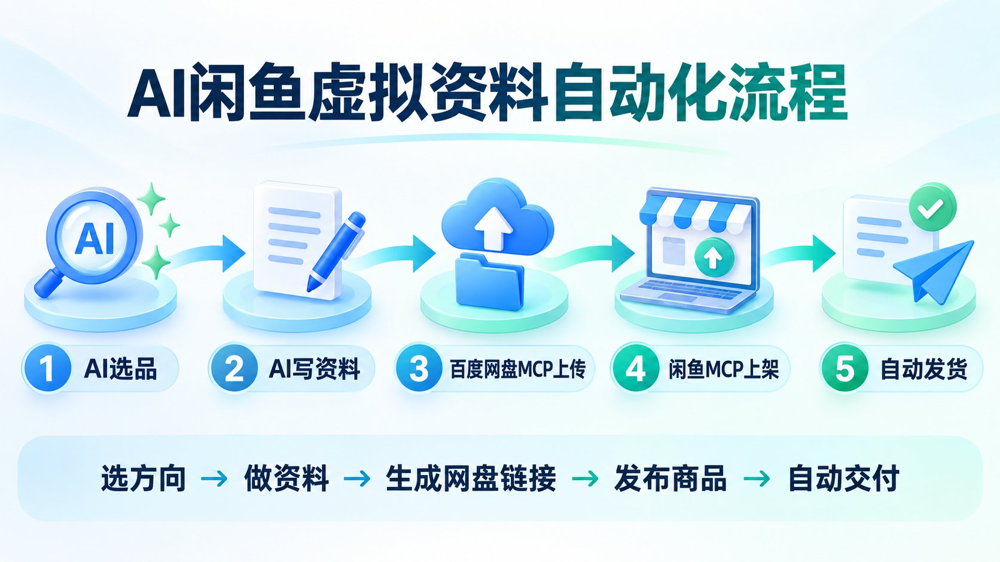
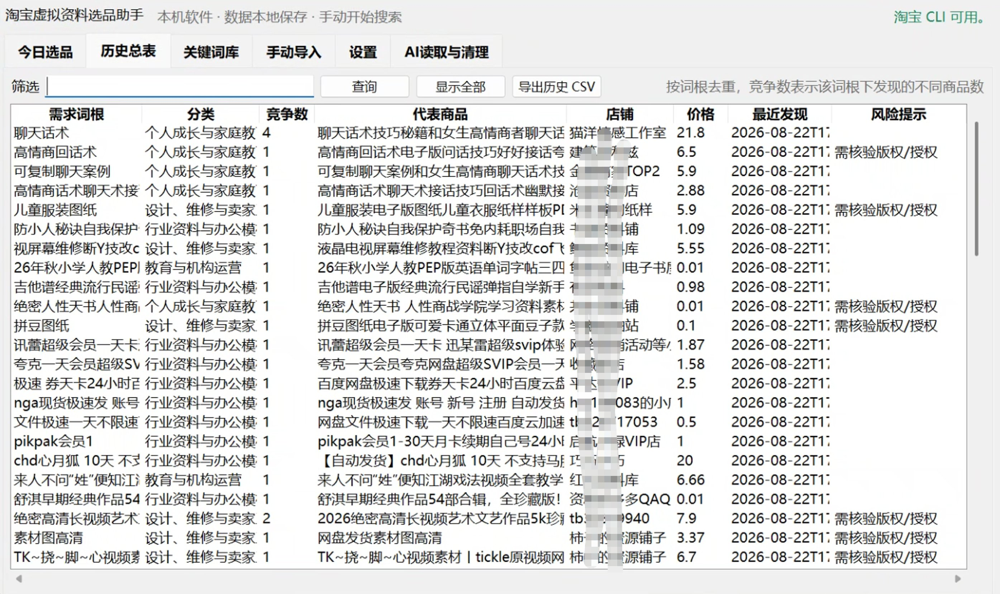
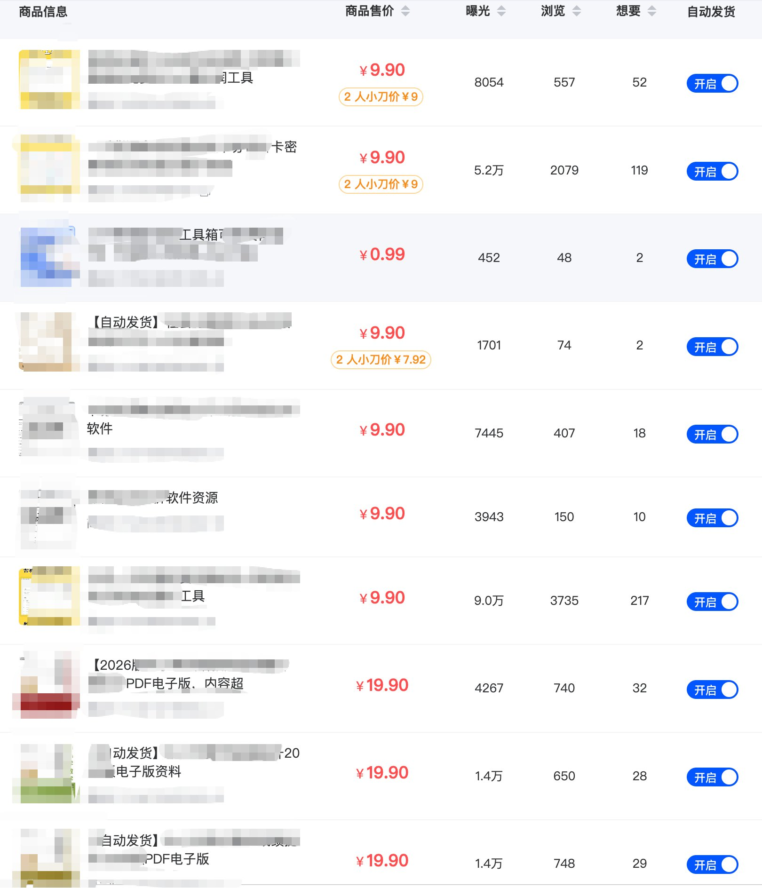
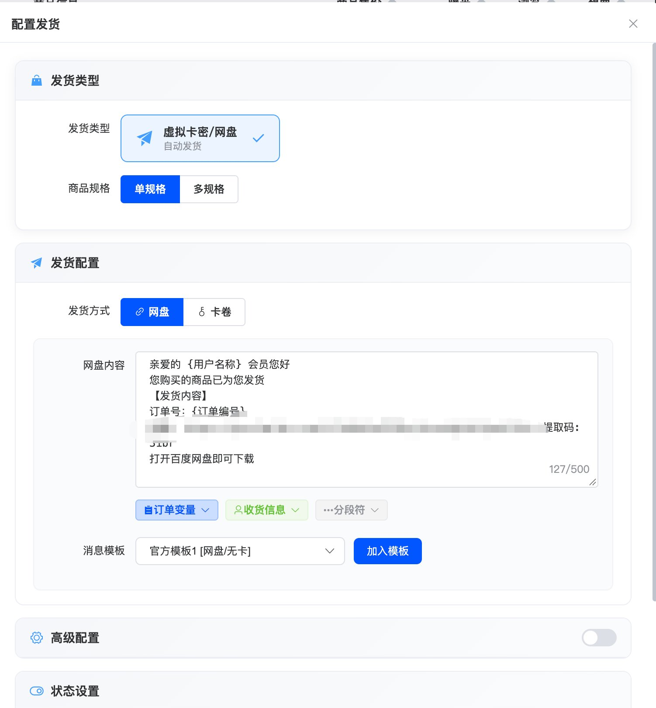

# 闲鱼虚拟资料自动化：从选品、制作、上架到自动发货的思路及工具分享

我从 2017 年开始接触虚拟资料项目，做过淘宝，闲鱼，也做过小红书，现在一直在研究怎样用 AI 把虚拟产品这门生意做得更简单。

之前分享了小红书的，我发现大家对于闲鱼的需求也很大，这一期主要还是想分享几个自己在用的工具

以前做闲鱼虚拟资料，最麻烦的不是某一个环节，而是所有环节都要自己动手。

你要自己找产品、整理内容、制作文件、上传网盘、生成链接、写标题、写详情、制作图片、上架商品。订单来了以后，还要购入自动发货软件来发货或者手动发货。

单独看，每个动作都不难；全部加起来，就很消耗时间。很多人并不是不会做，而是做几天以后嫌麻烦，不愿意继续上新。

现在这件事已经可以换一种做法。

我的思路很直接：

> AI 选品 → AI 制作资料 → 百度网盘 MCP 上传 → 闲鱼 MCP 批量上架 → 自动发货软件完成交付

这条流程跑通以后，真正需要人做的事情，只剩下确定方向、检查质量和处理少量异常。原来大量复制、粘贴、上传和填表的工作，都可以交给 AI 和工具。

这篇文章不讲复杂的理论，就把这套赚钱玩法从头到尾拆开。

## 一、这套玩法赚的是什么钱

很多人听到“虚拟资料”，第一反应是：网上到处都能下载，这也需要买吗？

当然需要。

买家付钱，并不只是为了买一个文件，而是为了少花时间。

网上的免费内容可能散落在很多网页里，有的已经过期，有的不能直接使用，有的文件名一团乱。买家如果自己寻找，要搜索、筛选、下载、核对和整理。

你把这些工作提前做好，把分散的信息做成一份结构清楚、拿来就能使用的产品，卖的就是整理效率和使用效率。

虚拟产品还有一个很明显的特点：没有传统实物的进货、仓储和快递环节。

一份资料制作完成以后，可以重复交付。每多卖一份，不需要重新打包发一次快递。只要产品有人需要、内容质量过关、网盘链接稳定，就可以持续销售。

所以这门生意的赚钱思路并不复杂：

> 找到有人愿意付费的需求，快速做成产品，持续上架更多产品，再把交付自动化。

过去的问题是，持续制作和上架需要很强的执行力。现在 AI 和 MCP 把执行成本压低了，批量铺货才真正变得容易。

这里说的批量铺货，不是把同一份垃圾内容复制一百遍，而是把多个真实需求快速做成不同产品，再用自动化完成重复操作。

## 二、第一步：让 AI 帮你选产品

以前选品，通常要自己在闲鱼里一页一页搜索。

现在可以直接让 AI 配合闲鱼 MCP，搜索公开商品并整理市场上正在销售的虚拟产品。

开源工具可以参考：

[goofish-cli 闲鱼 CLI / MCP](https://github.com/fancyboi999/goofish-cli)

它可以搜索商品、读取公开商品信息、上传图片、推荐类目、发布和下架商品，也支持消息相关操作。

把它接入支持 MCP 的 AI 工具以后，你可以直接提出任务：

> 搜索闲鱼上正在销售的虚拟资料，整理商品名称、售价、需求场景和主要卖点。不要复制原文，只分析市场需求。挑出适合重新独立制作、交付简单、能够通过网盘发送的方向。

也可以用淘宝的工具，来去看看市场上的虚拟资料，AI 会先帮你把公开商品分组。

你不需要盯着一个商品死磕，也不需要先建立复杂的选品系统。每天让 AI 搜索几个关键词，挑出几个自己能够完成的方向就可以开始。

我选产品主要看三点。

第一，有没有明确用途。

买家看到以后，要马上知道这份东西能帮他完成什么。越具体，越容易写标题和详情，也越容易成交。

第二，能不能标准化交付。

如果买家付款以后，发一个 PDF、一份表格、一套模板或者一个网盘链接就能完成交付，就很适合自动化。

第三，能不能继续拆出相关产品。

一个方向最好不只做一件商品。AI 在整理需求时，可以顺便把不同人群、不同场景和不同版本拆开，生成多个相互独立的商品方向。

最终做哪一个，由人来决定；搜索、归类和扩展方向，让 AI 完成。

## 三、第二步：让 AI 把方向写成可以交付的资料

选出方向以后，下一步不是去复制同行文件，而是让 AI 从零开始制作自己的产品。

我通常先让 AI 写交付目录，再逐部分完成正文。

围绕这个需求制作一份可以出售的虚拟资料。先设计完整目录，写清楚目标用户、使用场景、交付形式和每个章节解决的问题。内容必须具体、可操作，不能堆空话，也不能照搬任何现有商品。

目录确认以后，再让 AI 按章节写完。

如果是一份教程，就让 AI 把步骤、注意事项和常见问题写清楚；如果是模板，就让 AI 同时写使用说明和填写示例；如果是资料合集，就让 AI 统一文件名、分类方式和打开顺序。

不同的资料也有不同的生产方式，比如卖测试的，需要用到AI编程，卖文字资料的需要用到写作，卖手抄报的需要用到图片生成……

AI 写完以后，人必须检查一遍。

重点检查事实是否正确、链接是否能打开、步骤是否能走通、内容有没有重复、文件在手机上能不能正常查看。

AI 可以把制作速度提高很多，但不能把未经检查的初稿直接当成商品。

确认内容以后，再让 AI 同时生成上架需要的素材：

> 根据这份资料，生成一个闲鱼商品标题、一段商品描述、5个核心卖点、适用人群、交付方式、售后说明，以及3张商品图需要展示的文字。不要使用夸张承诺，不要写与实际交付不一致的内容。

这样，一份资料完成的同时，上架文案也准备好了。

如果一天完成几份不同的资料，AI 就分别输出对应的标题、详情和图片文案。后面不需要再从头写一次。

## 四、第三步：通过百度网盘 MCP 自动上传

资料写完以后，传统做法是打开百度网盘，创建文件夹、上传文件、等待完成，再手动生成分享链接。

产品少的时候不明显，产品一多，这些动作会占掉很多时间。

现在可以使用百度网盘官方 MCP：

[https://github.com/baidu-netdisk/mcp](https://github.com/baidu-netdisk/mcp)

根据官方项目说明，它支持查看文件、创建目录、复制、移动、重命名、删除、搜索、上传文件和创建分享链接。

接好以后，可以直接让 AI 执行：

> 在百度网盘中创建这个商品的交付目录，把最终文件上传进去，检查文件是否完整，再创建分享链接，并把分享链接和提取码返回给我。

建议提前规定统一目录，例如：

> 商品名称 / 最终交付文件 / 使用说明

不要把草稿、源文件、封面素材和最终交付混在一起。自动发货绑定的只能是买家应该收到的内容。

百度网盘 MCP 有两个使用边界需要知道。

本地文件上传需要 MCP 读取电脑上的文件，因此官方文档说明，本地上传要使用 stdio 模式；SSE 模式不提供本地上传工具。

另外，个人用户的开放能力和测试密钥规则可能变化，正式使用前需要查看百度网盘开放平台的最新说明。

链接生成以后，最好让 AI 再返回一次目录内容，同时自己随机打开一两个链接检查。自动上传解决的是重复操作，最终文件是否正确仍然要确认。

## 五、第四步：通过闲鱼 MCP 批量上架

资料和网盘链接准备好以后，就可以进入上架环节。

过去上架一个商品，要手动填写标题、描述、价格、类目和图片。一天上几个没问题，但想长期大量上新，很容易被这些重复动作卡住。

现在通过 goofish-cli 的闲鱼 MCP，可以让 AI 整理并提交上架参数。

一件商品需要准备的内容包括：

- 商品标题；
- 商品描述；
- 商品价格；
- 商品图片；
- 商品类目；
- 对应的网盘链接；
- 自动发货时使用的话术。

这些内容在前两步已经由 AI 生成，百度网盘链接也已经创建。上架时，只需要把对应内容组合起来。

可以让 AI 执行：

> 读取已经完成的商品资料、标题、描述、价格和商品图，为每件商品匹配正确的网盘链接，检查内容一一对应，然后调用闲鱼 MCP 上架。成功后返回商品 ID、商品标题和对应的交付链接。

这样就可以一次准备多件商品，再由 AI 逐件调用工具发布。

以前批量铺货最大的门槛，是每件商品都要重复填表。现在产品内容、标题、详情和图片文案由 AI 生成，上架动作由 MCP 执行，批量铺货已经可以真正落地。

但批量不等于乱发。

每个商品都应该有独立内容、独立标题和正确的交付链接。不要把同一套文件换几十个标题重复发布，也不要让 AI 在没有检查的情况下连续操作账号。

工具项目本身也设置了写操作限流和风控熔断。实际运行时应控制发布节奏，发布失败就停止检查，不要为了追求数量反复提交。

闲鱼 MCP 解决的是批量上架，不是自动成交。商品发出去以后，是否有订单仍然取决于需求、标题、封面、价格和产品质量。

## 六、第五步：用免费工具或自建系统自动发货

商品上架以后，最后一个环节是自动发货。

普通虚拟资料最简单的交付方式，就是在买家付款后自动发送百度网盘链接、提取码和使用说明。

如果不想折腾服务器，可以先使用现成工具。

我推荐先看：

[易店自动发货管理系统](https://ed.weeeg.com/)

官网目前展示了商品管理、订单管理、发货配置、卡券管理、自动回复和多店铺等功能。免费范围和具体限制可能调整，使用时以官网最新规则为准。

我这商品销量其实都不是很高，但是客单价算得上比较贵的，而且铺的量大，店铺也多

配置逻辑很简单：

> 闲鱼商品 → 对应网盘链接 → 发货话术 → 买家付款后自动发送

如果希望把系统掌握在自己手里，也可以搭建开源项目：

[闲鱼自动回复管理系统](https://xy.zhinianboke.com/login)

开源地址：

[https://github.com/zhinianboke/xianyu-auto-reply](https://github.com/zhinianboke/xianyu-auto-reply)

根据当前项目文档，它支持多账号、自动回复、AI 回复、自动发货、在线聊天、商品发布、订单与评价、商品采集等功能，并提供 Docker 相关部署方式。

自己搭建的好处，是商品、账号和发货规则都可以统一管理，后续还能根据自己的流程继续修改。

现成工具适合先跑起来；开源系统适合商品和账号增加以后使用。

不管选择哪一种，第一次配置都要用真实小额订单完整测试一次：

1. 买家付款以后有没有收到消息；
2. 发出的链接是不是对应商品；
3. 提取码能不能使用；
4. 文件是否完整；
5. 系统有没有留下发货记录。

后台显示“配置成功”不等于真的发货成功。买家端完整收到，才算跑通。

## 七、把五个环节串起来，就是一条自动赚钱工作流

现在把整套流程重新串一次。

第一步：AI 选产品

让 AI 配合闲鱼 MCP 搜索公开商品，分析哪些虚拟资料有人卖、解决什么问题、价格大概多少。

从中挑选自己能够独立制作、可以标准化交付的方向。

第二步：AI 写资料

先生成目录，再完成正文、模板、示例和使用说明。

完成以后，让 AI 同时生成闲鱼标题、详情、卖点和商品图文案。

第三步：百度网盘 MCP 上传

AI 自动创建商品目录、上传最终文件、生成分享链接和提取码。

每个商品对应一个独立目录和一个明确链接。

第四步：闲鱼 MCP 批量上架

把标题、详情、图片、价格、类目和网盘链接匹配好，让 AI 调用闲鱼 MCP 逐件上架。

上架成功以后，保留商品 ID 与网盘链接的对应关系。

第五步：自动发货

把商品 ID、网盘链接和发货话术配置到现成免费工具或自己搭建的开源系统中。

买家付款以后，由系统自动发送正确资料。

整条链路可以写成：

> 公开市场需求 → AI 选品 → AI 独立制作 → 百度网盘 MCP 上传 → 闲鱼 MCP 批量上架 → 自动发货软件交付

从选品到交付，每一步都有明确输入和输出，前一步的结果直接交给下一步，不需要反复复制整理。

## 八、每天怎样执行，才能真正赚到钱

这套工具搭好以后，日常操作可以非常简单。

第一，让 AI 搜索新的虚拟产品方向。

每天选几个能够完成的需求，不用一次研究几百个。

第二，让 AI 完成资料和上架素材。

人负责确定方向和检查质量，AI 负责大部分写作、整理和格式化。

第三，让百度网盘 MCP 上传。

一个商品一个目录，自动生成分享链接。

第四，让闲鱼 MCP 上架。

每天稳定发布一批不同商品，持续增加店铺里的有效商品数量。

第五，把新商品加入自动发货规则。

核对商品 ID、链接和发货话术，测试无误以后开始销售。

第六，处理异常。

每天看一次上架失败、链接失效、账号掉线和没有匹配发货规则的订单。正常订单不需要守着，异常订单人工处理。

过去一天可能只能完成一两件商品，现在 AI 可以同时准备多个方向，MCP 可以继续完成上传和上架，自动发货工具负责成交后的交付。

当执行力成本被压低以后，核心就变成两件事：

> 持续增加有效商品，持续淘汰没有需求的商品。

商品数量增加，获得搜索曝光和成交的机会也会增加。某个方向开始出单以后，再围绕相近需求继续制作更多产品。

这就是这套玩法的放大方式。

不是指望一个商品突然爆单，而是利用 AI 和自动化，持续增加能够被搜索、能够成交、能够自动交付的商品。

## 九、最后说几句

闲鱼虚拟资料不是因为“文件没有成本”就能赚钱。

真正赚钱的前提，还是有人需要、产品能用、标题说得清楚、交付不出错。

AI 和 MCP 改变的，是整个项目的执行方式。

以前一个人要亲自做完选品、写作、上传、填表、上架和发货；现在可以把大部分重复动作交给工具，一个人也能管理更多商品。

最终流程很简单：

> AI 来选，AI 来写；百度网盘 MCP 来上传，闲鱼 MCP 来上架；自动发货软件完成最后交付。

如果不想搭服务器，就先用现成的免费方案；如果商品和账号越来越多，就把开源系统拉下来自己搭建。

先把一件商品从选品到发货完整跑通，再把同样的流程复制到更多商品。

当整个闭环跑通以后，上架数量不再受手工填表限制，发货也不再需要一直守着手机。

剩下要做的，就是持续选、持续做、持续上。

## 本文提到的工具

- 百度网盘 MCP：[https://github.com/baidu-netdisk/mcp](https://github.com/baidu-netdisk/mcp)
- goofish-cli 闲鱼 CLI / MCP：[https://github.com/fancyboi999/goofish-cli](https://github.com/fancyboi999/goofish-cli)
- 易店自动发货管理系统：[https://ed.weeeg.com/](https://ed.weeeg.com/)
- 闲鱼自动回复管理系统：[https://xy.zhinianboke.com/login](https://xy.zhinianboke.com/login)
- xianyu-auto-reply 开源项目：[https://github.com/zhinianboke/xianyu-auto-reply](https://github.com/zhinianboke/xianyu-auto-reply)

> 工具功能、免费范围和平台规则可能变化，使用前请查看各项目最新说明。发布和自动发货只操作自己的账号及有权销售的内容，Cookie、Token 和账号凭证不要放进截图或交给陌生人。
