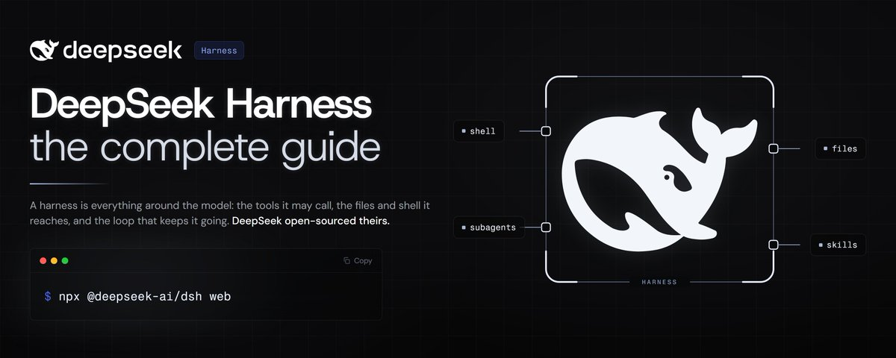
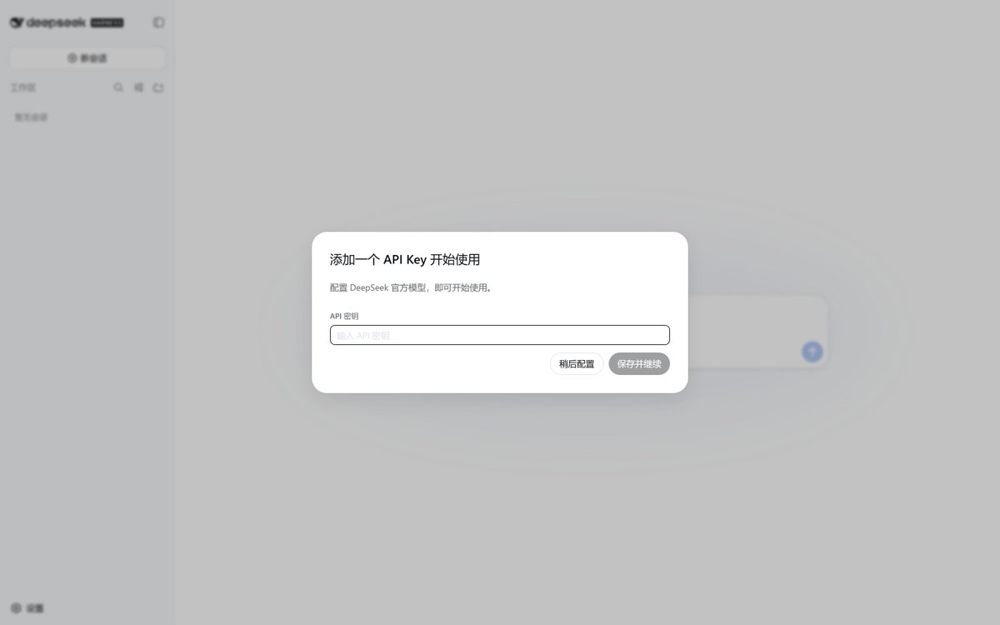
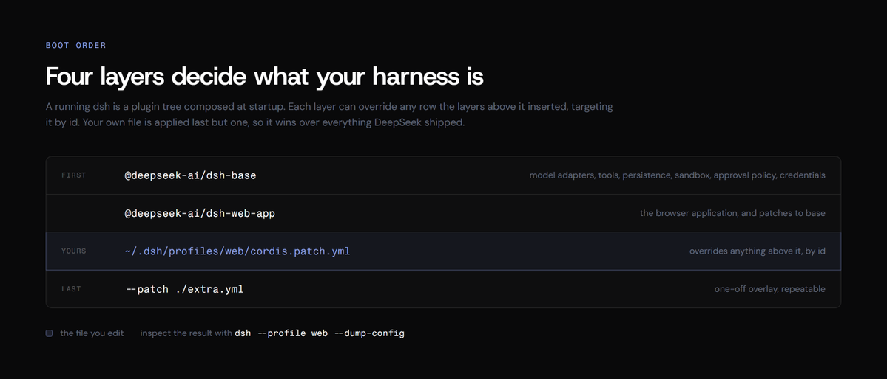
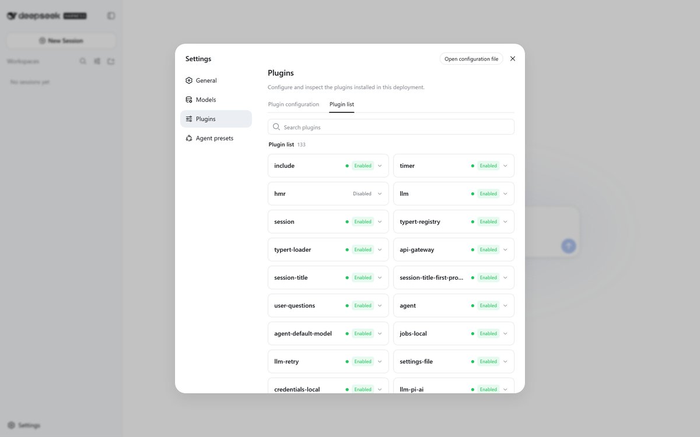
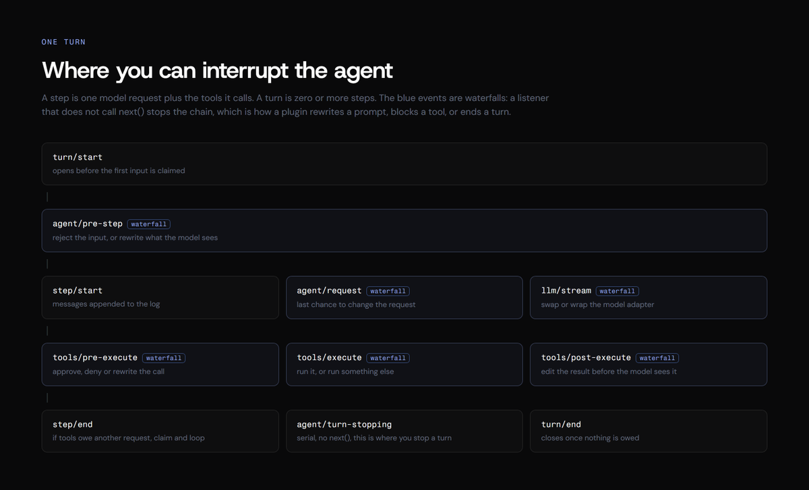
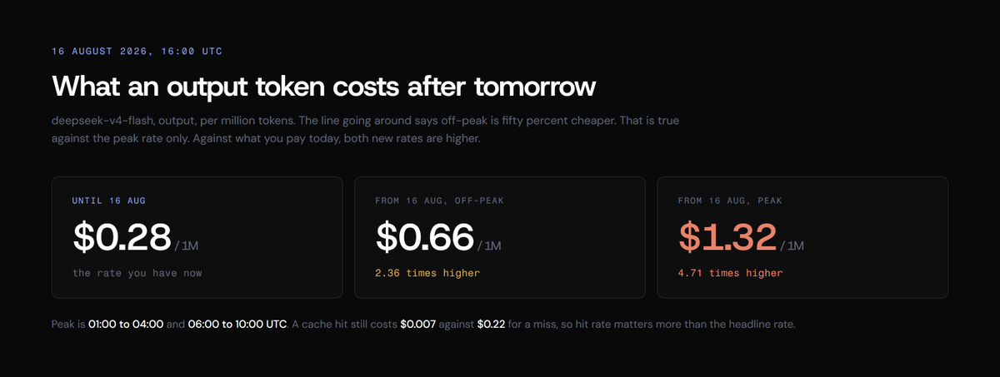

# DeepSeek Harness 完全指南

DeepSeek published the harness it runs its own models on. MIT licence, 133 plugins in a default install, and a config file that switches off any of them, down to the sidebar and the agent loop itself.

A harness is everything around the model: the tools it may call, the files and shell it reaches, the log it remembers, and the loop that keeps it going. The model is one plugin among the rest.

This guide is written from a running install. Every command was executed, every number counted, every setting read out of the shipped schema.

## Install it

First, the thing that surprises everyone: **this is a browser application, not a terminal one.** Claude Code and Codex live in a terminal, so people expect the same here. They do not get it. The terminal only launches the harness; the work happens in a browser tab.

```
npx @deepseek-ai/dsh web
```

The command starts a local web server and prints its address:

```
dsh web: http://127.0.0.1:3080
```

Open that in a browser and the harness is there: a session sidebar, a workspace picker, settings, the plugin list, the trajectory view. **127.0.0.1** is your own machine, so nothing leaves it.

**Leave that terminal window open.** It is holding the server. Close it and the interface dies with it.

If you want a terminal instead, there is exactly one option, and it is one-shot rather than interactive:

```
dsh --profile headless "run the tests and fix what fails"
```

That runs a single session, prints the final answer and exits. There is no interactive terminal UI. Only two profiles ship, **web** and **headless**, and they auto-initialize on first use; any other profile has to be created yourself through **dsh plugin**.

If npx dies with this, the npm cache has a stale lock. It is not the package:

```
npm error code ECOMPROMISED
npm error Lock compromised
```

Clear it and install locally instead:

```
rm -rf "$(npm config get cache)/_locks"
npm install @deepseek-ai/dsh@0.1.0-rc.6
./node_modules/.bin/dsh web
```

The install pulls 530 packages and takes around six minutes cold. Afterwards the @ **deepseek-ai** scope holds **186 packages named dsh-\***, which is the plugin claim in checkable form:

```
ls node_modules/@deepseek-ai/ | grep -c '^dsh'
```

From source, if you intend to modify it:

```
git clone https://github.com/deepseek-ai/deepseek-harness
cd deepseek-harness
pnpm install && pnpm run build && pnpm dsh web
```

## First run

Two surprises.

The UI opens in **Chinese** behind a beta notice. Dismiss it, then Settings, General, Language, English. Nothing restarts. The choice persists to **~/.dsh/settings.yaml**:

```
ui-onboarding:
  welcomeNoticeVersion: 2026-08-13.1
locale:
  preference: en
```

Then it asks for an API key. You can skip it with **configure later** and still browse settings, presets and the plugin list. You need a key to run a task.



The default permission mode is **Workspace Write**. The other two are read-only and full access.

## The four modes

Settings, Agent presets. A switch applies to new sessions; a running session keeps the preset it started with.

```
| Mode | What the model gets |
| --- | --- |
| Standard | file editing, shell, file and web search, skills, planning, goals, subagents, workflows |
| Code | the same capabilities, but exposed through a Code Mode SDK so the model combines multi-step operations in one TypeScript program |
| Minimal | two tools: a persistent bash and str_replace_editor |
| Creator | Standard plus runtime inspection and live plugin authoring |
```

Minimal exists to benchmark a model with almost nothing around it. Creator is the one with no equivalent elsewhere, and it gets its own section.

## Connect a model that is not DeepSeek

Settings, Models. **Add provider** picks from the installed catalogue, **Add a custom provider** takes a base URL and protocol for a gateway or a local server.

The Provider ID is permanent, because sessions, defaults and credential references all point at it. Renaming means adding a new one and deleting the old.

Three things the form will not tell you.

**Keys never come back.** They are stored in **DSH\_HOME/.credentials.yaml** and the page only ever receives a redacted descriptor. Settings keep a reference, not the secret.

**You can keep the key out of the file entirely.** Point the adapter at an environment variable instead:

```
llm-deepseek:
  apiKeyEnv: MY_DEEPSEEK_KEY
```

It resolves per request, so a missing variable fails that request with **MISSING\_CREDENTIAL** rather than breaking startup.

**Vision on a custom provider needs a hand edit.** A model you type in is treated as text-only, and the form has no field for modalities. Add it in **~/.dsh/settings.yaml**:

```
llm-pi-ai:
  providers:
    my-gateway:
      apiKeyEnv: GATEWAY_API_KEY
      api: openai-completions
      baseURL: https://gateway.example/v1
      models:
        - id: legacy-chat
        - id: vision-preview
          input: [text, image]
```

For a route where every model takes images, set the fallback once with **defaultInput: \[text, image\]**. For a catalogue provider, which has no models list, narrow a single model under **modelOverrides** keyed by id. DeepSeek's own chat-completions route is text-only and cannot be configured otherwise.

Providers with native auth are not covered by the API-key field at all: Bedrock wants AWS credentials and a region, Vertex an ADC project, Azure an **api-version**, Codex OAuth.

## How the config layers work

A running **dsh** is a plugin tree composed at boot from ordered layers.

A **bundle** ships config rows and the code they mount. **dsh-base** is the first layer of every profile. **dsh-web-app** adds the browser application, **dsh-headless** a one-shot runner with no server.

A **profile** is a stack of bundles in your Harness home, and it is a real package directory. The entire web profile is this:

```
{
  "name": "dsh-profile-web",
  "private": true,
  "dependencies": {},
  "dsh": {
    "profile": {
      "bundles": ["@deepseek-ai/dsh-base", "@deepseek-ai/dsh-web-app"]
    }
  }
}
```


To see the tree your machine actually boots:

```
dsh --profile web --dump-default-config
```

That prints 490 lines of YAML, each row annotated with the bundle that contributed it and the bundle that patched it. One row settles a common question. The default model is Flash, not Pro:

```
- id: agent-default-model
  name: '@deepseek-ai/dsh-agent-default-model'
  config:
    provider: deepseek-official
    model: deepseek-v4-flash
```

Flags the docs do not mention:

```
--profile <name>       the profile under $DSH_HOME/profiles to boot
--patch <path>         extra overlay applied after the profile layer, repeatable
--dump-config          print the composed tree and exit
--dump-default-config  print it without your user layer or --patch overlays
```

The help text uses a **tui** profile in one of its examples, qualified as "assuming the tui profile is installed". Nothing like it ships: the bundles in the repository are **base**, **web-app** and **headless**, and the installed package carries no terminal-UI library at all. Treat it as a placeholder for a profile you would build, not a hidden mode.

**dsh plugin** forwards straight to pnpm inside the profile directory, so plugins install as ordinary packages:

```
dsh plugin --profile web add <package>
```

One thing the default profile quietly ships: **dsh-llm-pi-ai** pulls **@ anthropic-ai/sdk**, **@ google/genai** and **@ mistralai/mistralai** into **~/.dsh/profiles/node\_modules**, next to **@ modelcontextprotocol/sdk**. The competitors' clients are already installed, which is why adding a provider needs no install step.

## Turn a plugin off

Settings, Plugins, Plugin list. A default web profile shows **133** plugins, each with a status and an expandable config. Counted from a running install: **107 enabled, 26 disabled**. The dark ones are almost all **tool-\*** packages, which the preset activates per session rather than at boot. On Windows **pwsh-sandbox** is on and **bash-sandbox** is off.



The toggles are status, not switches. To actually disable one, edit **~/.dsh/profiles/web/cordis.patch.yml**, which the **Open configuration file** button opens. Fresh installs contain only instructions and an empty array:

```
# Your patch layer for this dsh profile, applied after every bundle layer:
# a top-level YAML array of loader patch entries (id-targeted config
# overrides, disables, and insert lists; \`!!js\` expressions allowed).
[]
```

Replace the **\[\]**. To remove the sidebar:

```
- id: ui-sidebar
  disabled: true
```

Reload and it is gone. The same works for **agent-loop**, **web-search-deepseek**, **session-telemetry-otel**, or any id in the dump.

## What the model can call

The tool catalogue is generated by booting each tool plugin on a real context and reading **ctx .tools.schemas()**, because a tool schema is not statically knowable. A completeness guard globs **packages/\*/tool-\*** and fails the build if a package is missing, so a new tool cannot ship undocumented.

Twenty-four tool packages. The model-visible names:

```
| Area | Tools |
| --- | --- |
| shell | bash, pwsh |
| files | read, write, edit, read_image, str_replace_editor |
| search | glob, grep, web_search, web_fetch |
| terminals | terminal_open, terminal_read, terminal_send, terminal_close, terminal_list, terminal_signal |
| delegation | subagent, subagent_fork, send_message, interrupt_agent, list_agents, report |
| background | job_list, job_output, job_kill |
| planning | todo_write, create_goal, get_goal, update_goal, exit_plan_mode |
| orchestration | workflow, ralph, run_code, schedule_create, schedule_list, schedule_delete |
| history | session_search, session_trace, session_event_read, session_event_search, session_event_trace |
| other | skill, lsp, ask_user_question |
```

**glob** and **grep** spawn a packaged ripgrep through the subprocess seam, so no **rg** on the host and no shell layer. **ralph** runs a fixed workflow that starts one fresh child per round, with the model choosing only the objective and a round cap.

## Creator mode

**@ deepseek-ai/dsh-tool-cordis** registers seven tools for the model:

```
cordis_define        cordis_undefine
cordis_run           cordis_stop
cordis_inspect_list  cordis_inspect_query  cordis_inspect_self
```

It injects **ctx.dynamicCordisRunner**, which owns the definition registry and a vm sandbox. The catalogue states the consequence plainly: a running package may register **additional model-visible tools** until it is stopped, undefined, or dsh restarts.

So the model writes a Cordis package, defines it, runs it in the sandbox, and that package hands the model new tools inside the same session. The tool set is not fixed at boot. In practice you ask for a capability, the UI asks you to approve the package, and it mounts.

The toolset is in no shipped tree by default. That is deliberate, because dynamic package code reaches the real runtime. A composition without the host runner never activates it.

## Every run is traceable

The session log is append-only and it is the source of the context the model sees. The rule the codebase enforces is one sentence: **model-visible means logged.** Anything that reaches a model request must be reconstructable from the log, and a runtime invariant asserts it.

Recorded: system prompts, reasoning, tool calls and results, subagent scheduling, every context injection. The Trajectory view opens each record by source. Resume, fork, search and replay run on that one stream, and a session exports as a zip containing **session.jsonl**.



A **step** is one model request plus the tools it calls. A **turn** is zero or more steps. **agent/pre-step**, **agent/request**, **llm/stream** and the three **tools/\*** events are waterfalls: a listener that does not call **next()** stops the chain. That is the whole extension surface. A plugin listening on **tools/pre-execute** blocks a tool call without touching the loop.

## Settings worth knowing about

These are in the shipped schema and not in the interface.

**Reasoning effort.** The DeepSeek adapter accepts **off**, **high** and **max**, defaulting to **high**. There is no **low** in this enum, whatever the model announcement lists. With **thinking: disabled** the only accepted value is **off**.

```
llm-deepseek:
  thinking: enabled
  reasoningEffort: max
  maxTokens: 256000
```

**maxTokens** defaults to 256,000 and **defaultContextWindow** to 1,000,000. **streamIdleTimeoutMs** defaults to five minutes.

**Summarise with a cheaper model than you talk to.** Compaction fires at 80% of the context window and keeps 16% as recent context, and it will happily use a different route for the summary:

```
compaction-basic:
  thresholdRatio: 0.8
  retainRatio: 0.16
  summarizationProvider: deepseek-official
  summarizationModel: deepseek-v4-flash
  maxTokens: 8192
```

Set **summarizationProvider** and **summarizationModel** together or not at all. **retainTokens** is an absolute alternative to **retainRatio** and the two are mutually exclusive. **modelPolicies** overrides any of it per exact provider and model.

**Define your own permission preset.** The table is name to bundle, and the shipped two are **workspace-write** and **danger-full-access**. The name **custom** is reserved.

```
permission-presets:
  presets:
    review-only:
      sandbox: read-only
      approval: ask
      name: Review only
      description: Reads the workspace, asks before anything else.
  defaultPreset: review-only
```

**Reuse your Claude Code or Codex hooks.** The harness ships adapters for both. Point them at an existing hooks file and they run:

```
hooks-claude-code:
  configPath: ~/.claude/settings.json
  projectDir: /path/to/project
  defaultTimeoutMs: 600000
```

It substitutes **${CLAUDE\_PLUGIN\_ROOT}** and **${CLAUDE\_PROJECT\_DIR}** in commands, and exports **CLAUDE\_PROJECT\_DIR** for hook processes, defaulting per run to the session workspace. **hooks-codex** does the same for a Codex **hooks.json** and stamps a model name on each payload. Both read their config once at load, so a relative path resolves against the launch directory and applies process-wide.

**Trade CPU for archive size** on session exports with **sessionExportCompressionLevel**, 0 to 9, default 6.

**Presets authored by an agent carry shell-level trust.** A preset discovered under a user root is marked **user** trust, and the schema says that trust equals shell access, whether a person or an agent wrote it. Read a generated preset before you mount it.

## What it costs

The harness is free. The model is not, and the rates change on 16 August 2026 at 16:00 UTC.

```
| Model | Period | Cache hit | Cache miss | Output |
| --- | --- | --- | --- | --- |
| deepseek-v4-flash | until 16 Aug | $0.0028 | $0.14 | $0.28 |
| deepseek-v4-flash | off-peak | $0.007 | $0.22 | $0.66 |
| deepseek-v4-flash | peak | $0.014 | $0.44 | $1.32 |
| deepseek-v4-pro | until 16 Aug | $0.003625 | $0.435 | $0.87 |
| deepseek-v4-pro | off-peak | $0.022 | $0.66 | $1.98 |
| deepseek-v4-pro | peak | $0.044 | $1.32 | $3.96 |
```

Peak is 01:00 to 04:00 and 06:00 to 10:00 UTC.



The summary going around says off-peak is fifty percent cheaper. That holds against the peak rate only. Against today's price every cell rises: Flash output moves from $0.28 to $0.66 off-peak and $1.32 at peak.

The cache column is where the money is. A hit costs $0.0028 against $0.14 for a miss, fifty times less. Agent work re-sends a growing prefix every step, so hit rate beats the headline rate. That is also why the compaction settings above are a cost control, not a tidiness feature.

## Rough edges

It is a developer preview and behaves like one. The README promises breaking changes.

The first-run language is Chinese with no prompt to change it. Plugin toggles in Settings are read-only status; disabling means editing YAML. Web search only works when the provider is DeepSeek, so pointing the harness at another model silently costs you that tool. The npm path can fail on a stale cache lock. Any config you write now is temporary by the maintainers' own warning.

## Where to go next

- Repository: **[github.com/deepseek-ai/deepseek-harness](https://x.com/phosphenq/status/github.com/deepseek-ai/deepseek-harness)**
- Launch page: **[deepseek.com/harness/en/](https://x.com/phosphenq/status/deepseek.com/harness/en/)**
- Generated config catalogue: **docs/config-catalog.md**, every field and default in the shipped schema
- Plugins publish under the **dsh-plugin** GitHub topic

The part worth arguing about is not the UI. A harness where the agent loop, the tool registry and the model adapter are all plugins, and where the model can define and mount a new plugin mid-run, is a different object from a coding assistant with a fixed menu.