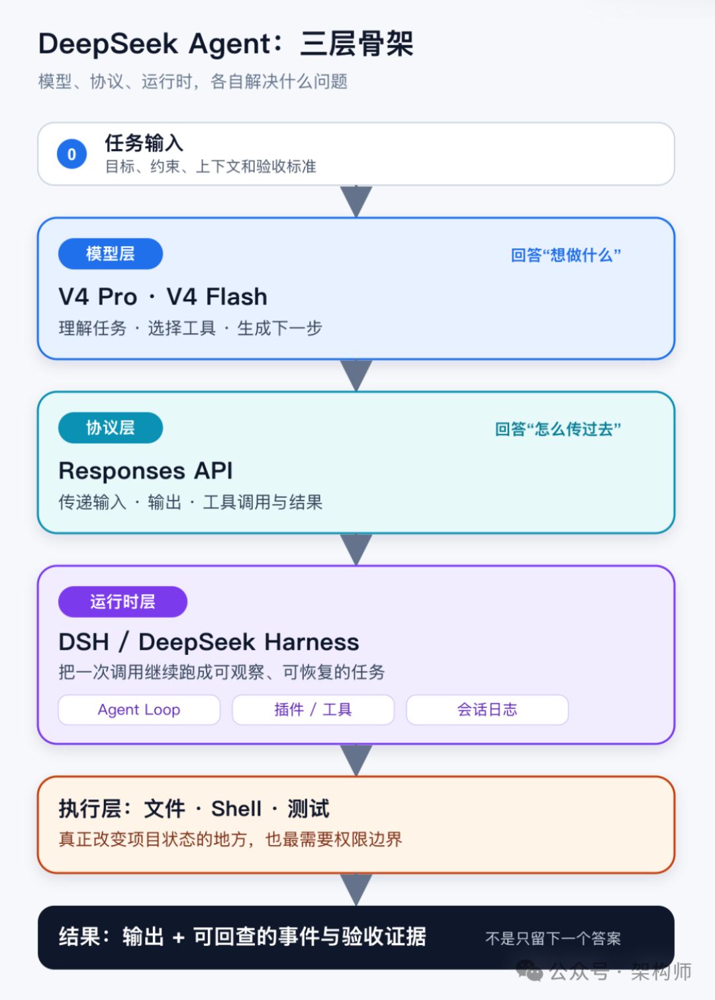
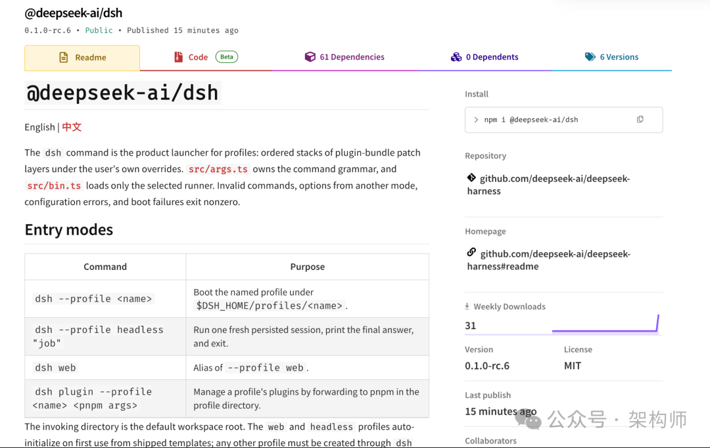
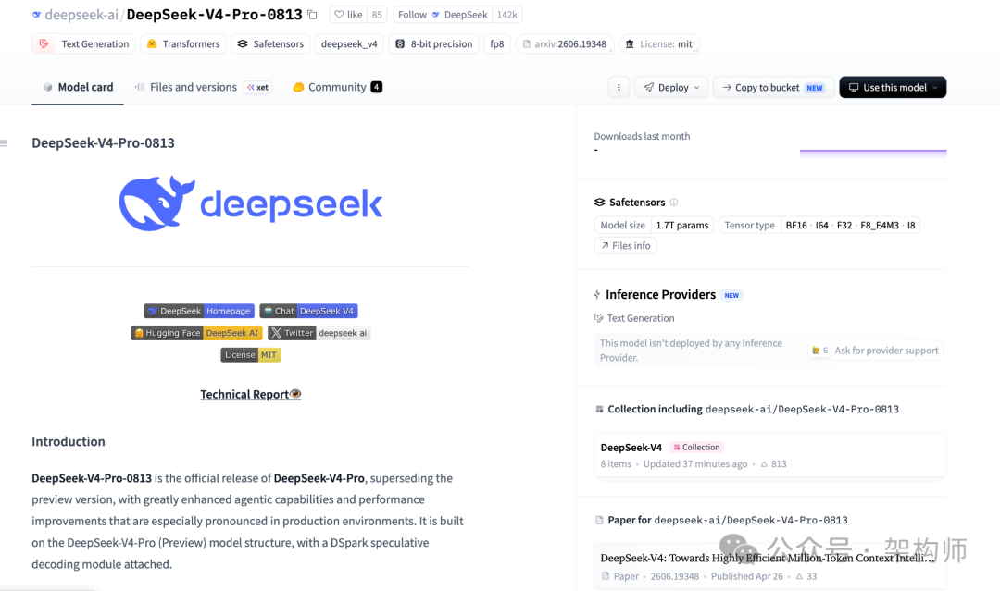
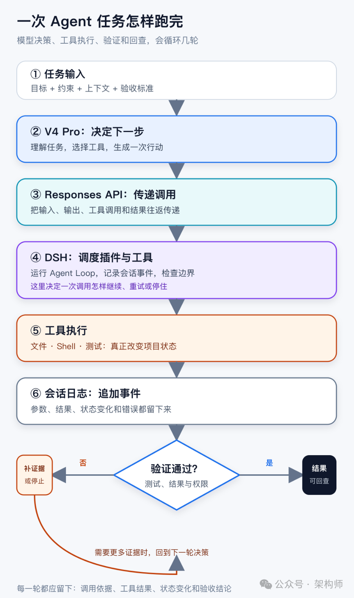

# DSH（DeepSeek Harness）来了：从 DeepSeek V4 Pro 看 Agent 的模型、协议与运行时

> 8 月 13 日，DeepSeek 发布了 V4 Pro 正式版。同一天，DeepSeek 也公开了自己的 Agent 运行时 **DSH（DeepSeek Harness）**。Responses API 已经原生接入 Codex，官方 npm 包 `@deepseek-ai/dsh` 也已发布。DSH 目前仍处于开发者预览阶段。

<!-- more -->

## 先给一张地图

三层分工：V4 Pro 提高模型层的上限，Responses API 传递 Agent 的交互内容，DSH 公开运行时如何加载插件、记录会话和继续执行。

| 层次 | 这次公开的内容 | 这一层要看什么 |
|------|--------------|--------------|
| 模型层 | V4 Pro / V4 Flash | 模型能不能稳定理解任务、调用工具并完成验证 |
| 协议层 | Responses API | 多轮输入、工具调用和结果怎样在客户端与模型之间往返 |
| 运行时层 | DSH / Harness | Loop、插件、会话、沙箱和权限怎么协同 |

一次任务通常会经过这些环节：

任务 → V4 Pro → Responses API → DSH 运行时 → 工具 / 文件 / 测试 → 可回查结果



## 一、DSH：先看运行时边界

DSH 是 DeepSeek Harness 的缩写。官方仓库以 MIT 协议开源，当前版本标为 developer preview。截至 8 月 13 日晚间，官方 npm 页面显示的版本是 `0.1.0-rc.6`。

本地试跑的入口：
```bash
npx @deepseek-ai/dsh web
```
默认在 `http://127.0.0.1:3080` 启动 Web 界面。适合在隔离环境里认识结构，不适合把预览版当作生产依赖。



### "一切皆插件"到底意味着什么

在 DSH 里，模型、工具、技能、会话、沙箱、存储、循环、调度和 UI 都可以拆成插件，由运行时加载。官方架构文档把模型适配器、工具注册、会话日志和 Agent Loop 都列为插件。**Cordis** 负责插件的加载、卸载和依赖关系，插件之间通过服务和事件协作。

插件化让替换有了明确位置：换模型时可以保留 Agent Loop，撤掉工具时权限判断和会话记录也有各自的位置。

### 四种模式

| 模式 | 默认取舍 | 更适合观察什么 |
|------|---------|--------------|
| 标准模式 | 提供较完整的工具组合 | 完整 Agent 任务怎样运行 |
| PTC 模式 | 由模型生成代码，组合多轮工具调用 | 程序化工具调用怎样减少往返 |
| 极简模式 | 只保留 shell 和文件编辑工具 | 最小环境下模型与工具的基线表现 |
| 创造模式 | 查看当前运行时，在内存中试验 Cordis 插件 | 观察插件如何组合 |

一开始把所有工具和扩展都打开，出了问题很难判断是哪一层造成的。

### 会话日志

DSH 把 Session Event Log 放在运行时的中心位置。事件只追加、不改写；模型下一轮所需的上下文，可以从这份事件流重新拼出来。恢复、分叉、检索和回放也共用这份记录。

一次工具调用，内存里留下"成功"两个字还不够。调用参数、返回结果和中间的状态变化都要记下来。聊天记录供人阅读；会话日志还要支持恢复、审计和下一轮决策。

### 接缝：给替换留出位置

DSH 把模型、工具、文件系统和子进程等模块放到可替换的 **seam（接缝）** 上。一个接缝通常包含服务定义、提供方和使用方，运行时通过这条接缝调用具体实现。

长期维护时可以单独更换模型适配器，Agent Loop 继续复用；撤销某个工具后，权限策略和会话记录也不会消失。

## 二、V4 Pro：模型层提高了什么

官方更新说明给出的 Agent 评测：

| 评测 | 分数 | 说明 |
|------|------|------|
| Terminal Bench 2.1 | 87.9 | 终端环境中的综合任务表现 |
| DeepSWE | 62.7 | 软件工程任务 |
| Toolathlon-Verified | 74.1 | 工具使用与任务完成 |
| HLE（无工具 / 有工具） | 42.7 / 60.0 | 工具是否接入会明显影响结果 |

这些分数能看出官方用什么任务检验模型，不能直接换算成某个团队的生产效率。模型、Harness、提示词、工具和运行参数都会影响结果。



API 侧注意事项：
- V4 Pro 模型版本是 `DeepSeek-V4-Pro-0813`，调用名仍是 `deepseek-v4-pro`
- V4 Flash 当前对应 `DeepSeek-V4-Flash-0731`，调用名仍是 `deepseek-v4-flash`
- 两个模型都支持 1M 上下文和最高 384K 输出
- 支持 Responses API、Chat Completions 和 Anthropic API
- 思考强度提供 low、high、max 三档

## 三、Responses API：协议层补上了什么

这次发布加入了 OpenAI Responses API，并针对 Codex 做了适配。客户端可以传入多轮历史，接收模型输出，再提交工具调用结果。

**Responses API 仍然是无状态接口**。多轮历史由客户端保存并重新传入；上下文窗口再大，也不会替客户端保存会话。会话保存、历史压缩和失败恢复，都要由上层运行时处理。

已有的 Chat Completions 和 Anthropic API 入口仍然可用。接入 Codex 时，官方提供一键配置脚本，会先备份原有配置，再写入 DeepSeek 的模型目录和 provider 配置，也提供恢复入口。

## 四、价格：单价之外，还要算任务成本

2026 年 8 月 13 日现行价格（单位：每 100 万 token）：

| 模型 | 缓存命中输入 | 缓存未命中输入 | 输出 |
|------|------------|--------------|------|
| deepseek-v4-flash | $0.0028 | $0.14 | $0.28 |
| deepseek-v4-pro | $0.003625 | $0.435 | $0.87 |

北京时间 2026 年 8 月 17 日 00:00 切换新价格，按高峰/非高峰时段计费：

- **非高峰价**（高峰的一半）：v4-pro 输出 $1.98/百万 token，v4-flash 输出 $0.66/百万 token
- **高峰价**：v4-pro 输出 $3.96/百万 token，v4-flash 输出 $1.32/百万 token
- 高峰时段（北京时间）：09:00–12:00 和 14:00–18:00

实际账单要看三个变量：
1. **缓存命中**：稳定的系统提示、工具定义尽量放在前缀，能否命中用实际请求验证
2. **批处理任务安排到非高峰**：代码索引、离线评测有调度空间
3. **别只看输入单价**：Agent 多轮调用工具时，输出 token 和重试都会计费

正式接入前，拿自己的任务集测一遍：缓存命中率、工具调用成功率、测试通过率、平均延迟和单任务总成本。

## 五、一次 Agent 任务，三层怎么配合



| 位置 | 主要职责 | 少了它会怎样 |
|------|---------|------------|
| V4 Pro / V4 Flash | 理解任务、推理、选择下一步工具 | 模型可能无法形成可靠的行动计划 |
| Responses API | 传递多轮输入、输出、工具调用和结果 | 客户端需要自行拼接协议，调用链容易断 |
| DSH / Harness | 管理 Loop、插件、会话事件、扩展和边界 | 长任务难以恢复，工具和状态难以审计 |

写 Agent benchmark 成绩时，模型名称还不够。还要交代使用了什么 Harness、哪些工具、怎样的提示词、什么思考强度，以及失败任务如何处理。少了这些信息，数字就很难复现。

## 六、把事实和猜测分开

| 类型 | 当前可以说到哪里 |
|------|----------------|
| 已确认事实 | V4 Pro GA、API 模型名不变、Responses API 原生支持、价格切换时间、DSH 开发者预览状态和插件式架构 |
| 个人判断 | DSH 可能会成为 DeepSeek Agent 生态的重要运行时入口，但还要看版本稳定性、插件生态和真实任务结果 |
| 待验证线索 | fingerprint 变化原因、线上波动与发布的关系、DSH 与 Claude Code / Codex 的产品竞争关系 |

## 七、现在适合怎么试

| 任务 | 重点观察 |
|------|---------|
| 只读代码检索 | 能不能找到正确文件、调用关系和证据位置 |
| 跨文件小改动 | Diff 是否集中，测试是否真的通过 |
| 带工具循环的故障定位 | 遇到证据不足或权限不足时，能不能停下来 |

每次试跑至少记录：模型版本、思考强度、缓存命中情况、工具调用次数、输入/输出 token、总耗时，以及最终的测试和验收结果。

模型调用跑通后，再试 DSH。先在本地预览版里看插件如何加载、会话事件如何记录、模型上下文如何从日志重建，再决定是否适合放进自己的 Agent 平台。文件系统、子进程、网络访问和凭据边界要单独检查。

## 写在最后

这次更新有三处变化：V4 Pro 提高了工具任务的模型上限，Responses API 提供了更适合 Agent 的交互方式，DSH 让开发者可以看到并调整插件、状态和扩展。价格也给出了很实际的提醒：Agent 的成本取决于模型单价，也取决于缓存前缀、任务调度、思考强度和工具循环。

## 官方资料

- [DeepSeek API 更新日志](https://api-docs.deepseek.com/news/aug13)
- [DeepSeek API 模型与价格](https://api-docs.deepseek.com/pricing)
- [DeepSeek Responses API 文档](https://api-docs.deepseek.com/api/responses)
- [DeepSeek Codex 接入文档](https://api-docs.deepseek.com/guides/codex)
- [DeepSeek Harness 官方仓库](https://github.com/deepseek-ai/dsh)
- [DeepSeek Harness 架构说明](https://github.com/deepseek-ai/dsh/blob/main/docs/architecture.md)
- [DeepSeek Harness npm 包](https://www.npmjs.com/package/@deepseek-ai/dsh)