# DeepSeek Harness是技术人自嗨炫技？

大家好，我是轩辕。

上周DeepSeek 终于把 Harness 端上来了。

没想到的是，项目刚开源没多久，就被骂成了“技术人自嗨”，甚至有人说，这是技术人主导的产品灾难。

为什么会出现这种情况？

周末我花了两天时间研究了DSH，并开发了一个可视化呈现Agent工作流程的插件：

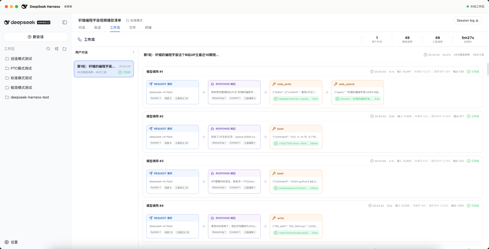

这篇文章就来深入聊一下DSH，包括它的四种工作模式到底是什么，如何增加新的工作模式。

在开始之前，咱们得先搞明白 Harness 到底是什么。

## 从一个只会吐文字的模型说起

这是一个 AI 大模型，它本身只会根据输入生成内容。

比如你问它：“轩辕的编程宇宙这个 UP 主现在有多少粉丝？”

这是实时数据。大模型自己访问不了我的主页，自然拿不到准确答案。

但假设我开发了一个查询工具。传入 UP 主名称，这个工具就会访问主页，获取最新粉丝数量。

然后我再写一个程序，通过 API 调用大模型，同时告诉它：这里有一个可以查询 UP 主数据的工具。

现在再问同一个问题，大模型就能要求程序执行工具。

程序把查询结果重新发给大模型，它就能根据真实数据回答了。

一个原本只会生成内容的大模型，就这样获得了原来没有的能力。

继续接入文件、终端、网络搜索等工具，再让模型不断重复“思考、行动、观察”，它就变成了可以干活的 AI Agent。

但能干活，不代表能把活干靠谱。

工具参数不合法怎么办？模型返回格式错误怎么办？上下文越来越长怎么办？危险命令要不要确认？连续犯同一个错，要不要重试或换一种方案？

负责管理工具、上下文、权限、校验、重试和运行记录的这套工程系统，就是 Harness。

如果你想从零搞懂 Agent 和 Harness，我之前专门做过一期动画讲解，可以戳这里观看：

## DeepSeek 到底开源了什么？

DeepSeek Harness 是一套开源的 Agent 运行框架。

模型接入、系统提示词、工具、上下文、命令执行、权限控制和运行记录，都被放进了这套框架里。

过去使用 Claude Code、Codex，我们看到的是已经组装好的 Agent。

DeepSeek 这次把 Agent 背后的 Harness 拆开了。开发者可以查看它的内部结构，也可以替换模型、工具和运行环境，做出自己的 Agent。

所以它当前更像开发者基础设施，而不是下载之后直接聊天的消费级产品。

官方也把它标记为 Developer Preview，也就是开发者预览版。项目采用 MIT 许可证，并且仍在快速迭代，未来会出现不兼容的改动。

这个定位很关键，后面再看那些“产品灾难”的批评，就更容易判断了。

## 跑起来不复杂，但确实有点别扭

官方提供了两种使用方式。

只想体验，可以安装符合要求的 Node.js，然后在终端执行：

想通过 AI 编程继续魔改，可以把源码拉下来：

启动之后，它会在本地运行一个 Web 服务。

浏览器访问http://127.0.0.1:3080，就能看到界面。

这也是很多人觉得别扭的地方。

它不像 Claude Code 那样直接在命令行里交互，也没有像 Codex 那样做成点开就用的客户端。

你得先启动服务，再打开浏览器访问本地地址。

进入系统后，还要配置 API Key。除了 DeepSeek，自定义的 OpenAI 兼容接口以及主流模型提供方也能接进来。

虽然产品外壳还很粗糙，但它暴露出来的技术细节非常多。

模型调用、工具调用、输入输出 token、缓存情况和 Agent 运行轨迹，都能直接看到。

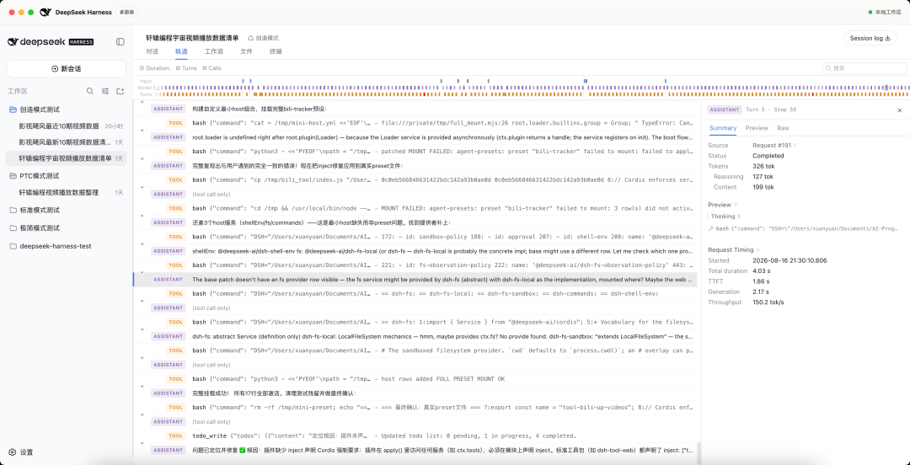

这对普通用户可能没啥用，但对研究 Agent 的开发者却非常有用。

## 四种模式，实际差在哪里？

DeepSeek Harness 内置了四种模式。

这里的模式并不是切换四个模型，而是给 Agent 换一套能力配置。

1. 标准模式

这是最完整，也是绝大多数人默认使用的模式。

文件编辑、Shell、网页搜索、Skills、计划、目标、子 Agent 和工作流，全部都有。

我打开请求详情后，可以看到很长的系统提示词和一整套工具列表。

Agent 每轮根据当前结果决定下一步，再调用对应工具继续执行。我们常见的 AI 编程 Agent，基本就是这种工作方式。

2. PTC 模式

PTC 全称 Programmatic Tool Calling。

它保留标准模式的能力，但改变了模型调用工具的方式。

假设一个任务要依次使用 A、B、C、D、E 五个工具，其中 B 的输出交给 C，C 的输出又要交给 D。

普通模式下，每一步都需要模型参与决策，通常会产生五轮模型与工具的往返。

PTC 模式允许模型写一段程序，在程序里直接把 B、C、D 串起来执行。

这样一来，中间过程不必全部塞进模型上下文，模型交互次数也有机会减少。

我在工作流页面里查看请求，发现发给模型的工具列表里只剩下run_code。

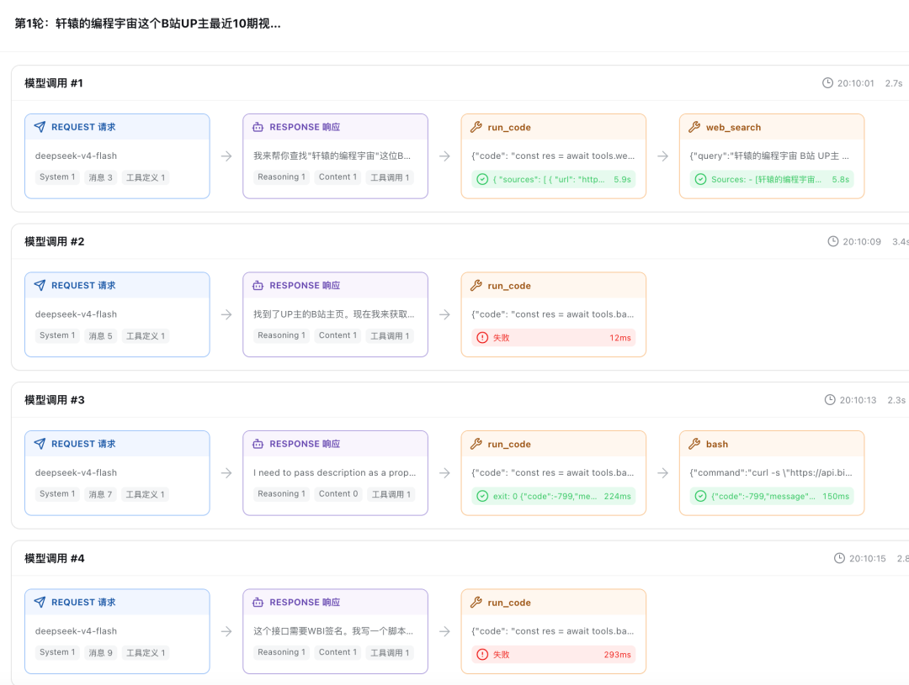

模型每次写出不同的代码，再由 Agent 框架执行。标准模式是让模型组合一堆工具，PTC 则是让模型写程序来调度这些工具。理想情况下，它可以更快，也能节省 token。但这并不是稳赚不赔。模型写出的程序如果执行失败，仍然要反复修改，最后的调用次数甚至可能更多。3. 极简模式极简模式真的很极简。它的系统提示词只有一句话，工具列表里也只有 Bash 和str_replace_editor。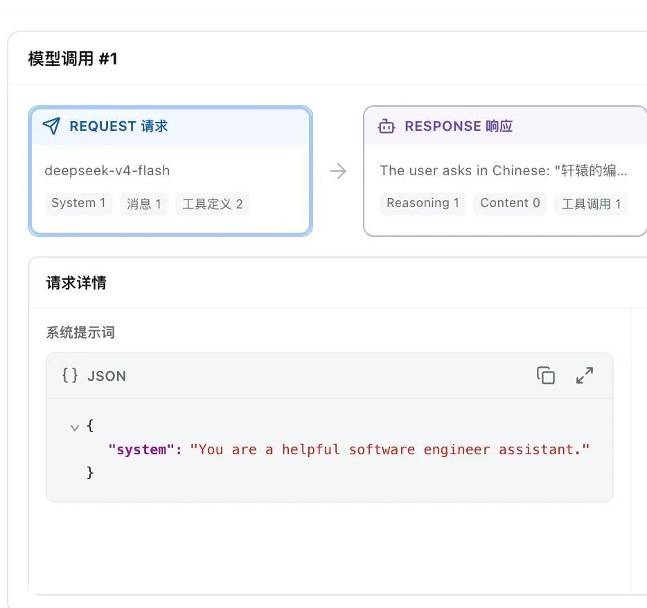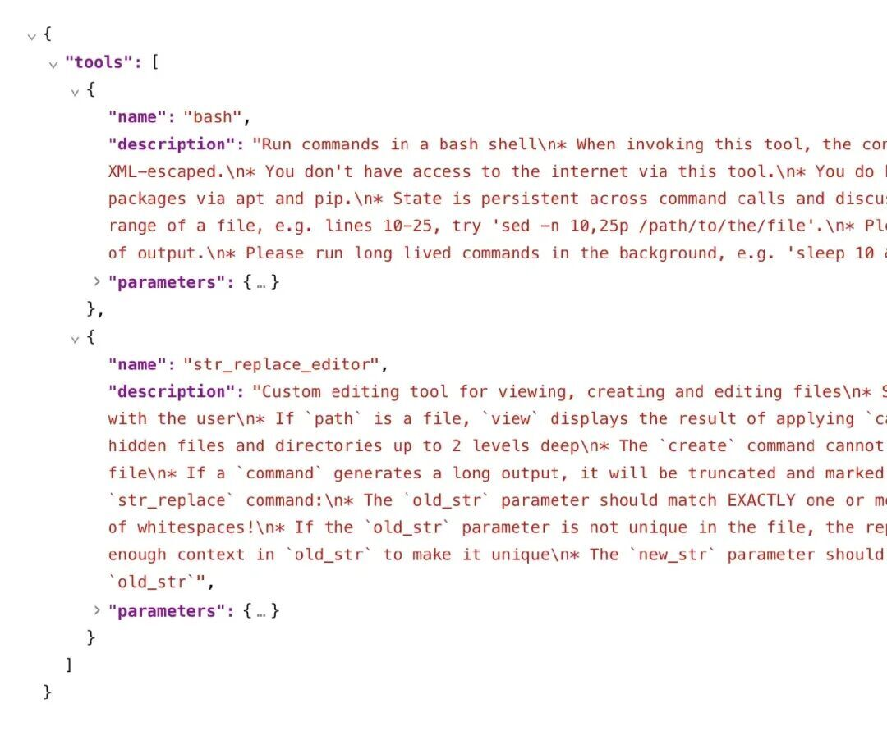Skills、子 Agent、工作流和上下文压缩都没有。等于撤掉更多外援和工程干预，让模型尽量依靠自身能力解决问题。它适合做模型测试，观察同一个模型在最少 Harness 干预下会怎么完成任务。真想拿它稳定干复杂工作，标准模式更合适。4. 创造模式创造模式最难理解，也最有意思。普通模式让 Agent 使用现成工具干活。创造模式还能查看 Harness 里有哪些插件，把插件重新组合起来，创建一种新的工作模式。我让它获取我的B站账号“轩辕的编程宇宙”最近十期视频的数据。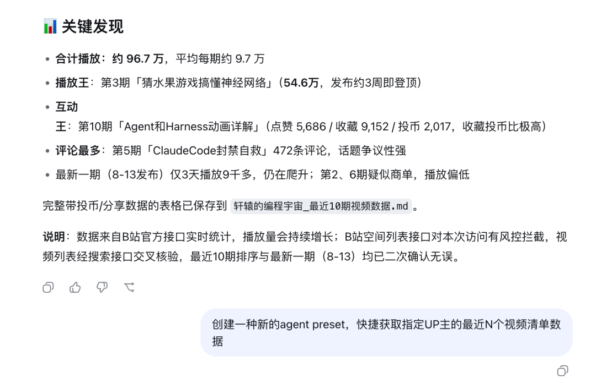它用现有工具完成任务之后，我继续要求它创建一种专门获取 B 站 UP 主数据的新模式。这个过程并不顺利，折腾了两轮才成功。

模型每次写出不同的代码，再由 Agent 框架执行。标准模式是让模型组合一堆工具，PTC 则是让模型写程序来调度这些工具。

理想情况下，它可以更快，也能节省 token。

但这并不是稳赚不赔。模型写出的程序如果执行失败，仍然要反复修改，最后的调用次数甚至可能更多。

3. 极简模式

极简模式真的很极简。

它的系统提示词只有一句话，工具列表里也只有 Bash 和str_replace_editor。

Skills、子 Agent、工作流和上下文压缩都没有。

等于撤掉更多外援和工程干预，让模型尽量依靠自身能力解决问题。

它适合做模型测试，观察同一个模型在最少 Harness 干预下会怎么完成任务。

真想拿它稳定干复杂工作，标准模式更合适。

4. 创造模式

创造模式最难理解，也最有意思。

普通模式让 Agent 使用现成工具干活。创造模式还能查看 Harness 里有哪些插件，把插件重新组合起来，创建一种新的工作模式。

我让它获取我的B站账号“轩辕的编程宇宙”最近十期视频的数据。

它用现有工具完成任务之后，我继续要求它创建一种专门获取 B 站 UP 主数据的新模式。

这个过程并不顺利，折腾了两轮才成功。

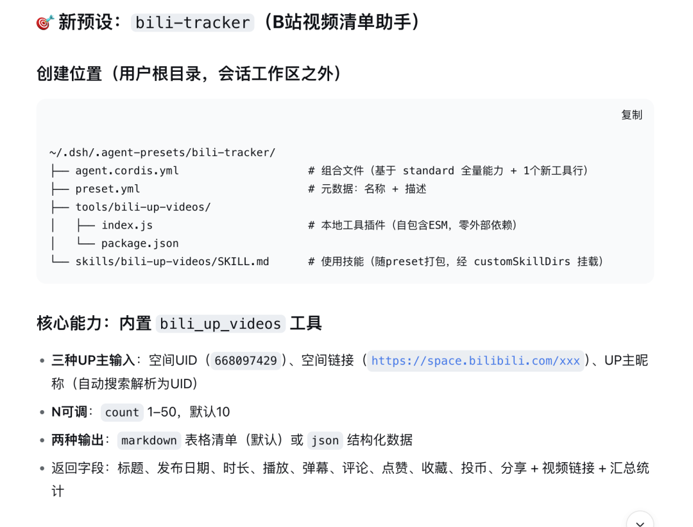

但成功之后，新建会话时，模式列表里真的出现了它刚刚创建的新 preset。

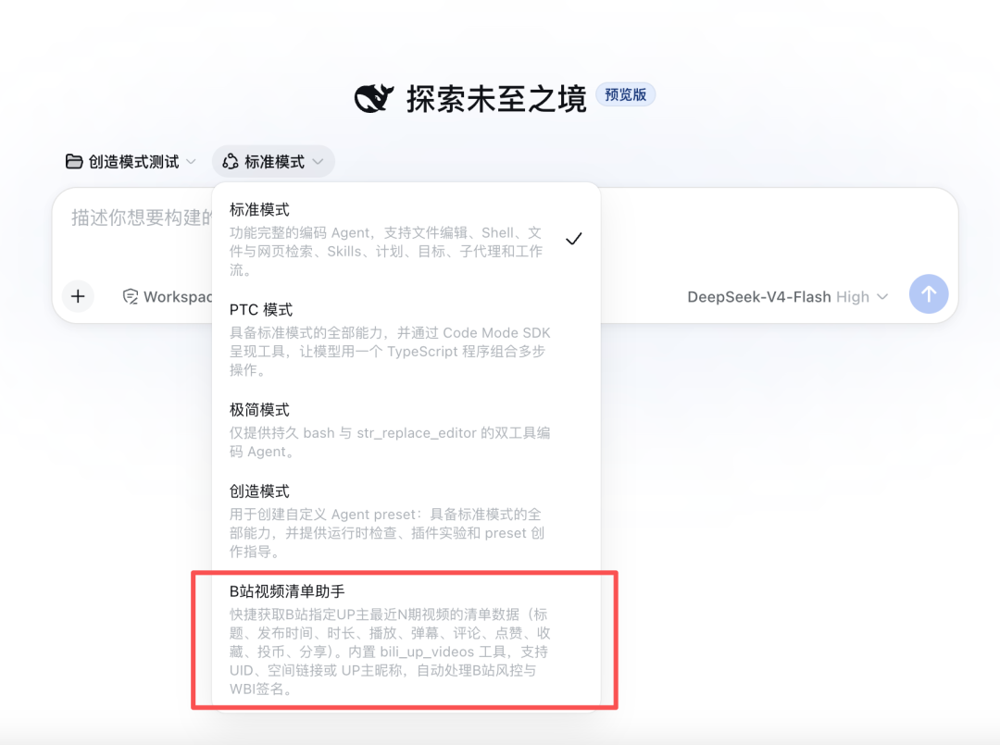

preset 可以理解成一份 Agent 配置。它规定系统提示词是什么，要加载哪些插件，给 Agent 哪些工具。

我在新模式里输入“获取影视飓风最近十期视频的数据”，它调用专门创建的 B 站数据工具，很快就把任务完成了。

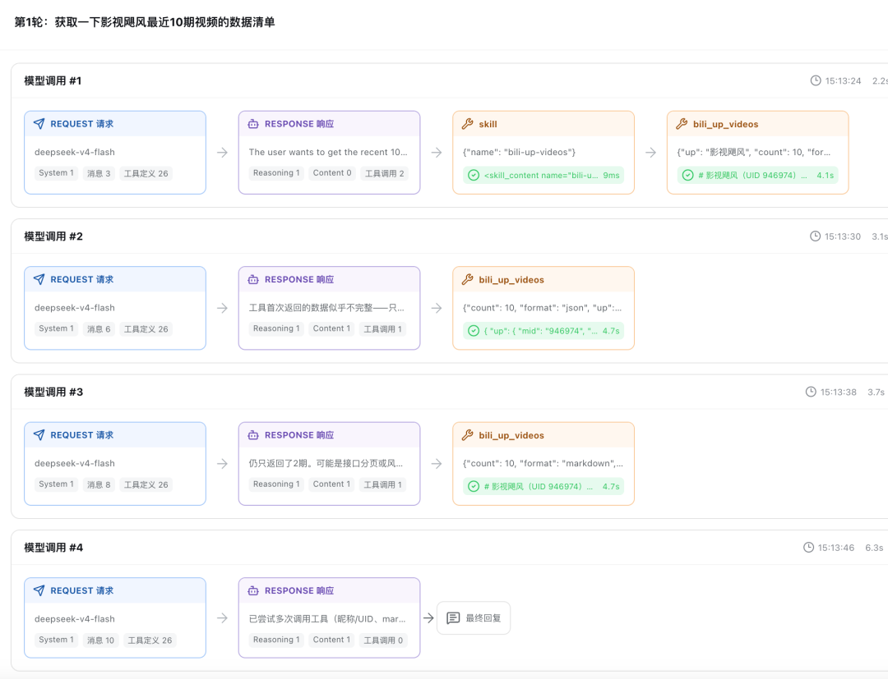

原来需要几十次模型与工具往返的流程，现在被收进了一个更专用的工具里，总共只调用了4次AI，大大节省了时间和成本。

一句话记住四种模式：标准模式给完整能力，PTC 改变工具调用方式，极简模式减少工程干预，创造模式组装新的 Agent 配置。

## Cordis，才是自由组合的关键

DeepSeek Harness 为什么能这样拆来拆去？

答案就是 Cordis。

Cordis 是一个独立开源的 TypeScript 插件框架，采用 MIT 许可证。DeepSeek Harness 把固定版本的源码放进了项目的vendor目录，并做了自己的修改。

DeepSeek 在官方 README 里用一句话概括这套架构：Everything is a Plugin，一切皆插件。

不光是 Agent 使用的小工具。

模型适配器、文件系统、沙箱、会话日志、Agent loop，甚至 UI，都可以做成 Cordis 插件。

所以前面的四种模式并不是四套程序。

它们是在同一个 Harness 里，加载了四份不同的插件清单。

想换模型，替换模型插件。

想把本地执行环境换成远程沙箱，替换对应插件。

想让 Agent 只拥有指定工具，就写一份新的 preset。

## 我把它做成了点击即用的桌面版

官方版把底层能力开放得很彻底，对新手却不算友好。

安装 Node.js、执行命令、访问 localhost，第一次使用就有好几个门槛。

所以我基于官方开源版本，做了一个桌面版。下载安装后，点开就能使用。

我还在界面里增加了文件、终端和工作流三个 Tab。

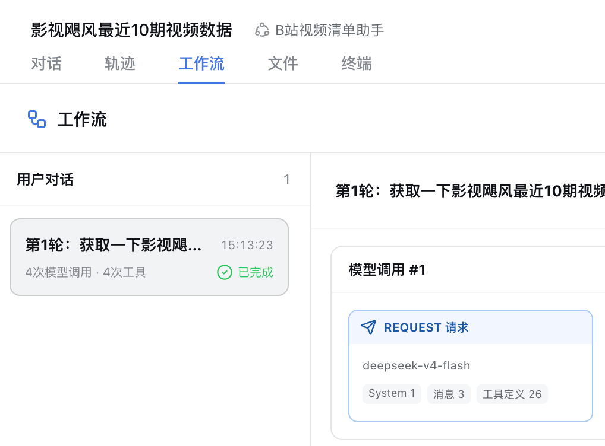

文件页面可以查看 Agent 工作目录里的文件。

终端页面可以直接执行命令，不用在几个应用之间来回切换。

我最想分享的，还是工作流页面。

每一轮对话里，Agent 发起了多少次模型请求，执行了哪些工具，总共花了多久，都能直接看到。

点开请求卡片，还能分别查看系统提示词、消息、上下文和工具列表。

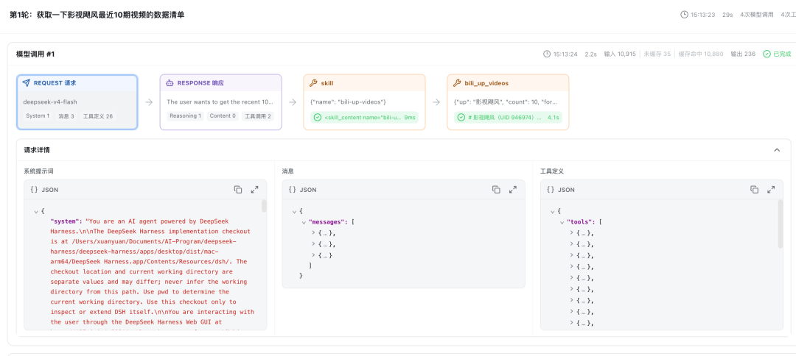

标准模式为什么有一堆工具，PTC 为什么只看到run_code，极简模式到底简化了什么，全都能从真实运行轨迹里看出来。

以前学习 Agent 工作机制，大家只能看概念图。

现在可以把一次真实任务拆开，看清模型请求、模型响应和工具调用到底是怎样循环起来的。

对正在学习 Agent 的同学来说，这个页面比背定义直观多了。

后来我又把工作流功能从桌面版里独立出来，封装成了一个单独的 DeepSeek Harness 插件。

这样即使你使用的是官方版，也可以单独安装这个插件，把 Agent 的工作过程可视化出来。

插件源码和安装方法我放在 GitHub，文末会给地址。

## 最后还想说几句

再回头看开头那句“技术人主导的产品灾难”。

说 DeepSeek Harness 现在难用，我同意。

界面粗糙，配置复杂，文档对新手不够友好。插件的安全性和生态质量，也没有经过足够长时间的验证。

这些都是真问题。

但要说它是“技术人自嗨”，我不同意。

官方定位写得很清楚，它目前就是开发者预览版，面向想要搭建、研究和改造 Agent Harness 的开发者。

拿 Claude Code、Codex 这些成熟产品的顺滑度，去要求一个刚开源的基础设施项目，这个比较从一开始就错位了。

这也符合我对 DeepSeek 路线的理解：先把基础模型和底层能力做出来，再由外部开发者继续做 To B 和 To C 产品。

我做的桌面版，以及现在拆出来的工作流插件，就是一次浅浅的尝试。

真正值得观察的，是 DeepSeek Harness 能不能在真实任务里变得更稳定，插件生态能不能长出有用的东西，开发者能不能基于它做出普通人愿意用的 Agent 产品。

刚开源就直接给它判死刑，有点早。

大家也大可不必 FOMO。

现阶段它更适合开发者折腾。只想稳定干活的普通用户，直接使用 Codex、WorkBuddy 这类消费级产品，体验会顺手得多。

如果你想研究 Agent 的真实工作流程，或者比较 DeepSeek Harness 四种模式的区别，可以去 GitHub 下载我做的工作流插件。

[GitHub: xuanyuanzhifeng/dsh-plugin-agent-workflow](https://github.com/xuanyuanzhifeng/dsh-plugin-agent-workflow)

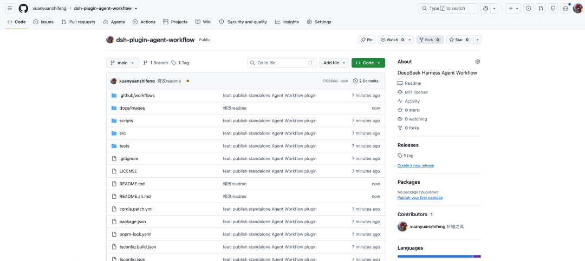

好了，今天就分享到这里。

如果觉得还不错的话，求个点赞。

路过的朋友欢迎点个关注呗，及时获得下期文章推送~
