# DeepSeek Harness 虚拟机部署体验

> 作者：大唐小少 | 2026-08-22
> 在 CentOS 虚拟机环境中从零部署 DeepSeek Harness 的完整体验

---

## 一、DeepSeek Harness 介绍

DeepSeek Harness（命令行简称 dsh）是 DeepSeek 于 2026 年 8 月 13 日正式发布并开源的首款 Agent 产品。它不是新的大模型，也不是 API 客户端，而是**智能体运行时框架（Agent Harness）**——负责把模型接入文件系统、终端、网页、代码工具和其他 Agent，并组织上下文、工具调用与任务执行的整套基础设施。

官方给出的设计理念：

> Model + Harness = Agent

模型负责思考推理，Harness 负责实际执行。它负责把大模型"接"进真实世界的那一层：读写文件、调用工具、执行命令、控制权限、决定重试还是中止，可以理解为 AI 的"操作系统外壳"。

DSH 最核心的设计理念是**"一切皆插件"**（everything is a plugin）。整个框架由 220+ 个独立 npm 包组成，模型、工具、技能、会话、沙箱、存储、循环、调度、UI 等所有 Agent 能力均由插件组合而成，可自由替换、灵活重组，支持运行时热插拔。理论基础是 DeepSeek 联合北京大学发表的论文《A Programming Paradigm for Spatiotemporal Composability》。

整套框架基于 Cordis 插件元框架打造。Cordis 仅承担插件加载、卸载和依赖管理的底层工作。全部业务组件为独立的 Cordis 插件——包括模型适配器、工具注册表、会话日志，以及 agent loop 本身——每一部分都可以从配置替换。

**三个优势**：

- **完全可定制**：企业无需修改核心源码，即可通过插件替换任意模块
- **副作用可撤销**：插件卸载后，其注册的服务、事件、资源会完整清理，无残留
- **渐进式扩展**：可从最小内核开始，按需加载插件，适配全场景

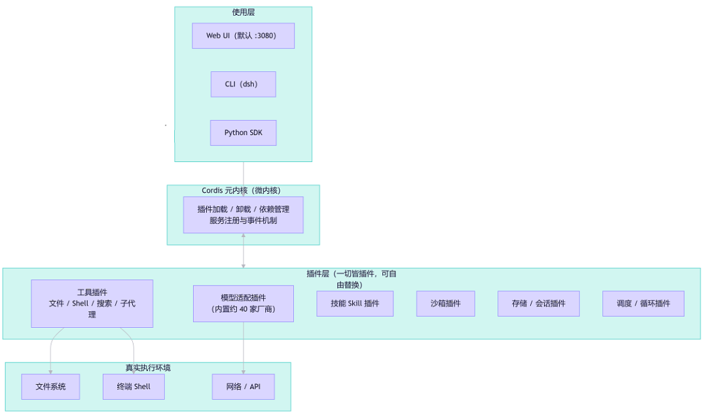

### 四种预设模式

| 模式 | 插件组合 | 适用场景 |
|------|----------|----------|
| 标准模式 | 全量工具集，逐轮工具调用 | 通用开发与复杂任务 |
| PTC 模式 | 模型生成 TS 代码批量编排 | 低延迟、省 Token，批量处理 |
| 极简模式 | 仅保留 Bash + 文件编辑 | 大模型编程能力基准测试 |
| 创造模式 | 支持热加载插件、自定义 Agent 预设 | 插件开发与调试 |


---

## 二、与其它主流 Agent 框架对比

DeepSeek Harness 与其他框架最本质的区别在于**没有"核心"**。主流 Agent 架构是核心（Agent 循环、上下文管理、执行器）不可动 + 外挂扩展（MCP 工具、Skills、Hooks 等只能加不能改）；DSH 的 Cordis 则把模型适配器、工具注册表、会话/存储、沙箱/权限、Agent 循环、调度、UI 全部做成插件——将 Agent 框架当作操作系统内核来做。

Cordis 与传统 DI 容器和轻量钩子方案的关键差异在于**可逆副作用**：插件是带依赖声明、生命周期、可逆副作用的"组件"，卸载时能完整逆转副作用。可以在 DSH 中把后端的 LLM 插件从 Model-A 无缝替换为 Model-B，而依赖它的组件（如 Agent Loop）会自动重新连接到新的服务提供者，会话中的对话记录毫发无损。

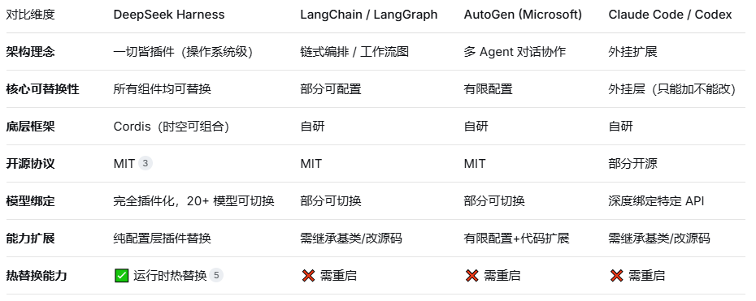

---

## 三、CentOS 虚拟机部署指南

### 环境要求

| 项目 | 要求 |
|------|------|
| 操作系统 | Linux；推荐 CentOS 8 Stream / CentOS 9 |
| Node.js | ≥ 22.19.0（官方硬性要求，推荐 22 LTS） |
| 内存/磁盘 | 建议 2C4G 以上；npm 缓存与插件约需 1~2GB |
| 网络 | 可访问 npm registry、GitHub、api.deepseek.com |
| API Key | DeepSeek API Key（platform.deepseek.com 申请，sk- 开头） |
| 端口 | 默认 3080（Web UI） |

### 步骤一：安装 Node.js

```bash
curl -fsSL https://rpm.nodesource.com/setup_22.x | sudo bash -
sudo yum install -y nodejs
node --version
npm --version
```

### 步骤二：安装 pnpm（源码部署需要）

```bash
npm install -g pnpm
pnpm --version
```

### 步骤三：安装 DeepSeek Harness

**方式 A：npm 一键启动（最快体验）**
```bash
npx @deepseek-ai/dsh web
```

**方式 B：全局安装（推荐长期使用）**
```bash
npm install -g @deepseek-ai/dsh
dsh --version
```

**方式 C：源码安装（插件开发/二次开发）**
```bash
npm install -g pnpm
git clone https://github.com/deepseek-ai/deepseek-harness.git
cd deepseek-harness
pnpm install
pnpm run build
```

**方式 D：Python SDK（需 Python ≥ 3.10）**
```bash
python3 -m pip install deepseek-harness-sdk
```

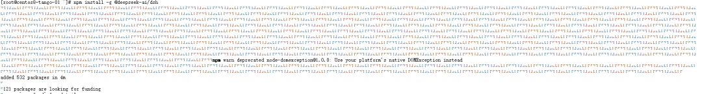

### 步骤四：配置环境变量

```bash
echo 'export PATH=/usr/local/node/bin:$PATH' >> ~/.bashrc
source ~/.bashrc
dsh --version
```

`dsh --help` 查看支持命令：

```
dsh: boot a DeepSeek Harness profile — an ordered stack of plugin-bundle patch layers under your own overrides.

Commands:
  web [options] [args...]    boot the web profile
  plugin [options] [args...] manage a profile's plugins
```

### 步骤五：配置 API Key

```bash
echo 'export DEEPSEEK_API_KEY=sk-你的密钥' >> ~/.bashrc
source ~/.bashrc
```

### 步骤六：启动 Web 服务

```bash
dsh --profile web --host 0.0.0.0 --port 3080
```

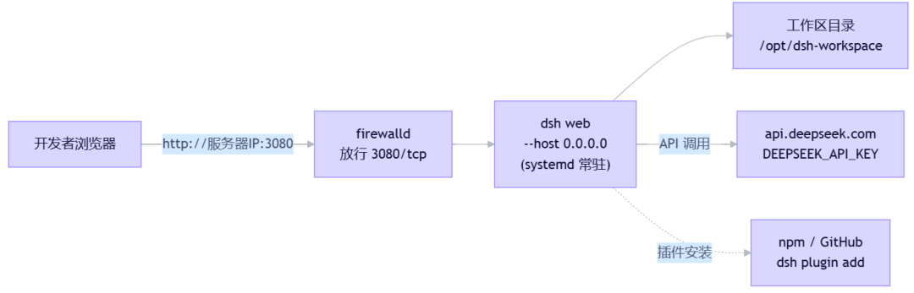

通过本地电脑访问服务 IP 和端口：

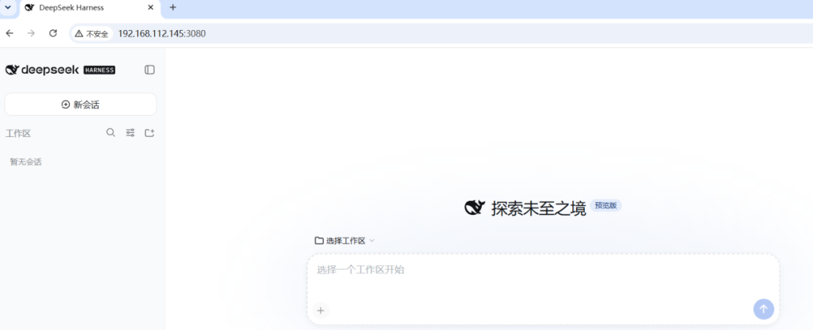

### 远端访问问题

直接访问远端服务会提示 `crypto.randomUUID is not a function`。两种解决方法：

**方法 1：安装 dsh-lan-access 插件**

```bash
dsh plugin --profile web add dsh-lan-access
```

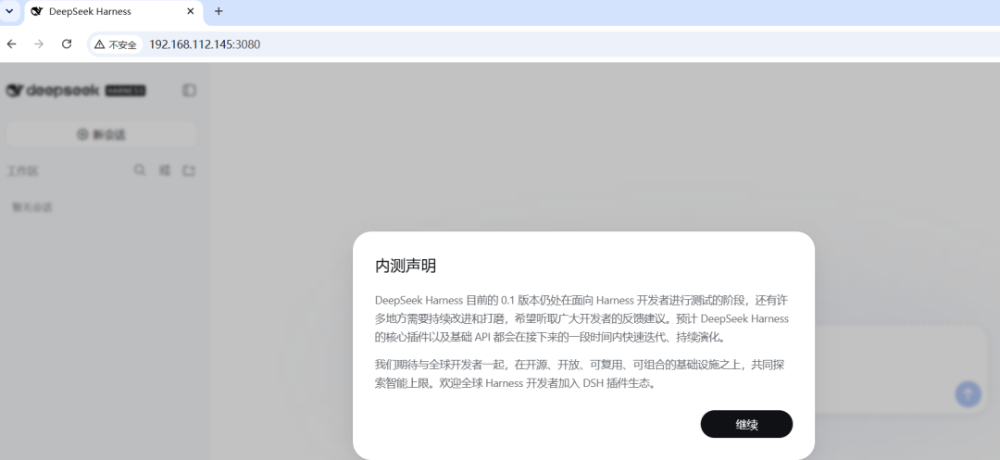

**方法 2：SSH 本地端口转发**

```bash
ssh -L 3080:127.0.0.1:3080 root@xx.xx.xx.xx
```

然后访问 http://127.0.0.1:3080，出现内测声明：

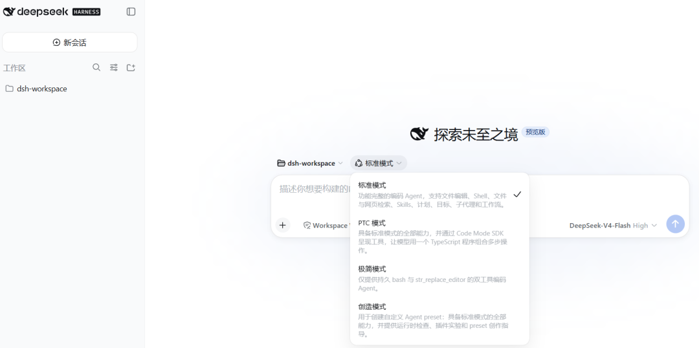

选择模式，支持四种模式：

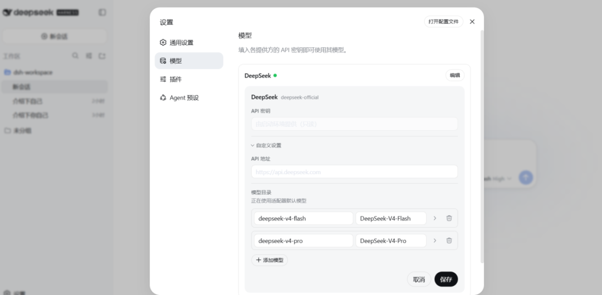

可在配置中切换模型，默认是 DeepSeek 自己的模型：

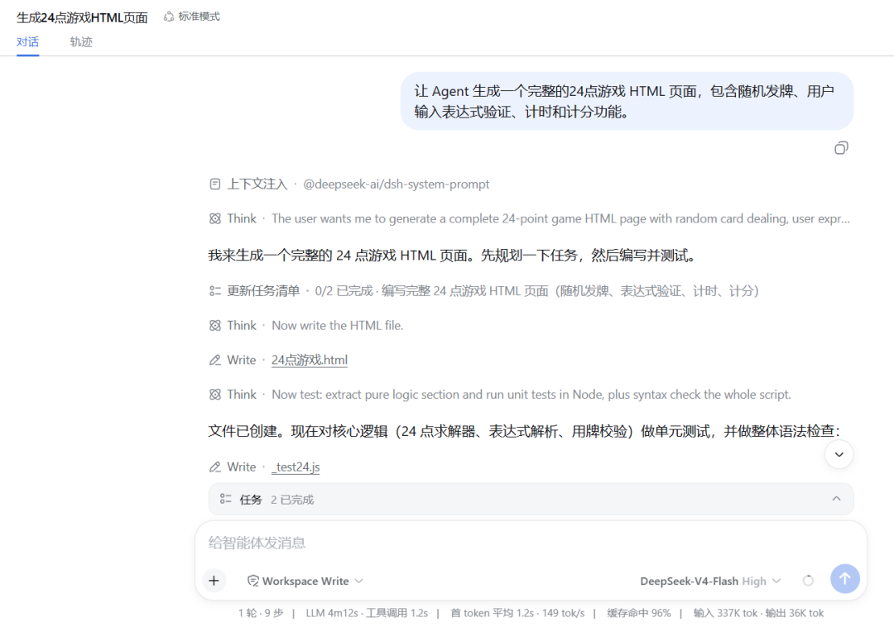

---

## 四、实际运行体验

选择一个"生成 24 点游戏的 HTML 页面"任务进行验证，下方会显示 Token 消耗情况：

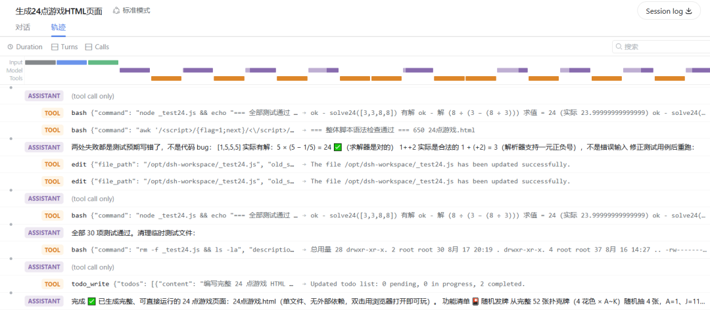

输出 Agent 执行的记录信息：

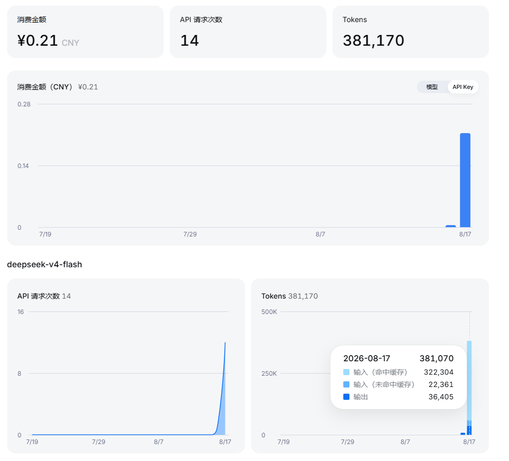

**Token 消耗**：单个任务 38 万 Tokens，约 0.21 元。

---

## 五、参考资料

- 官方 GitHub：https://github.com/deepseek-ai/deepseek-harness
- 官方架构文档：https://github.com/deepseek-ai/deepseek-harness/blob/master/docs/architecture.zh.md
- 官方产品页：http://www.deepseek.com/harness/
- 论文：《A Programming Paradigm for Spatiotemporal Composability》（DeepSeek & 北京大学）