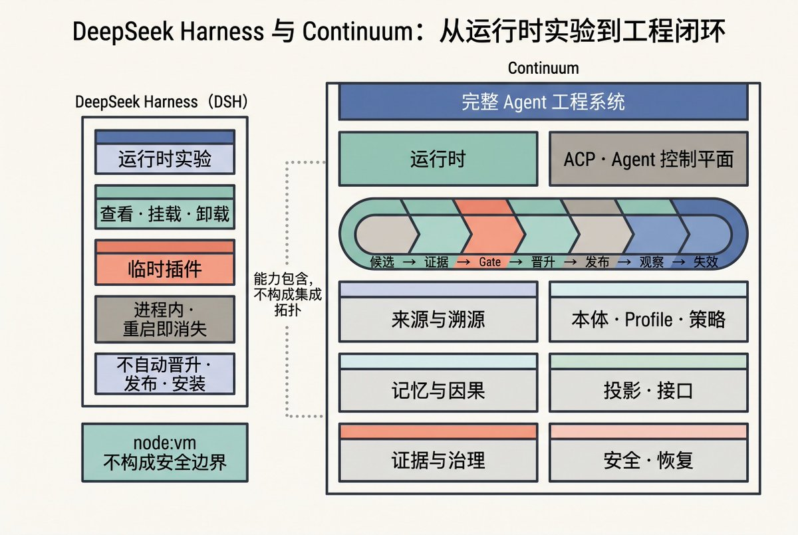

# 从 Runtime 实验走向工程闭环：DeepSeek Harness 的工程比较

## 卷首语

最近抽时间仔细研究了一下DeepSeek Harness（简称DSH）。把它的官方文档、Architecture、实现说明以及背后的Cordis论文看下来，确实有些惊喜，也有些话想说。

惊喜在于，DSH并不是又一套简单地把模型和工具封装起来的Agent framework。从 [DSH官方定位](https://www.deepseek.com/harness/en/)来看，它目前仍是一个处于developer preview阶段的开源agent harness，接口还可能发生破坏性变化。它既不是已经定型的企业平台，也不是一套成熟的自主进化系统。它首先提供的是一种runtime architecture：把model adapter、Tool、Session、Storage、Sandbox、Agent Loop乃至UI放进同一套可配置的Plugin system并记录模型实际看到的context和执行轨迹。

DSH甚至允许Agent检查当前runtime并在进程中动态挂载临时Plugin。这些设计所触及的已经不再是简单地“增加几个工具”，而是Agent工程系统应该如何组织自身的问题。

但也正因如此，围绕DSH的讨论就很容易从“Agent可以改变runtime”迅速跳到“Agent已经能够自我进化”，尤其是在这个“突破天天有”的时候。其实，这两件事之间还隔着一条很长的工程链路。因为能够生成变化，不等于变化有效；能够挂载Plugin，不等于它有资格成为正式版本；组件可以自由组合，也不代表组合后的能力一定更强。

这篇文章不准备急着给DSH贴上“下一代底座”或者“自主进化系统”的标签。我想讲清楚三件事：DSH今天究竟实现了什么，现有的研究能够证明什么，以及从当前DSH进程中的一次临时Plugin挂载到可验证、可恢复、可治理的Agent工程系统，中间还缺什么。

## 一、Agent产品真正难维护的不是模型调用

一个演示级Agent当然可以从“模型加几个工具”开始。但当其进入长期运行态后，问题会迅速转向模型外部：上下文怎样组装、权限在哪一步检查、失败后如何恢复、后台任务怎样接续、会话如何重放、工具和沙箱能否替换，以及发生事故时能不能还原模型当时看到了什么……这才是重点，也是主要矛盾。

DSH对这些问题从工程的角度给出了两个回答。

第一项是细粒度(fine-grained replaceability)的可替换性。一个运行中的DSH由profile、bundle和配置补丁组成插件树。[官方Architecture文档](https://github.com/deepseek-ai/deepseek-harness/blob/47f943859bef60e4160492346772ded9b24f765a/docs/architecture.md)明确列出：模型适配器、工具注册表、Session Log和Agent Loop都是插件；开发者可以通过配置替换能力，而不必修改Harness本体。这里所谓“没有需要打补丁的特权核心”，并不是说系统没有内核，而是说产品功能不应硬编码进一个不可替换的巨型核心。而Cordis kernel、宿主进程和权限边界仍然存在。

第二项是可重建的执行历史。DSH把追加式Session Event Log作为模型上下文的来源，规定“模型可见的内容必须被记录”。恢复、分叉、回放和遥测都从同一条事件流派生。这个设计的价值很现实：当Agent在第几十步出错时，团队不必依赖一份残缺的聊天记录猜测现场，而可以检查输入、工具定义、模型输出和工具结果如何共同形成了那条轨迹。

对我来说，这不是一个新命题。从MAL（Multi-Agent Ledger）到后来的DIMC项目（皆未开源），我一直把原始材料和事件记录留在底层。MAL以Timeline/Event组织多Agent协作中的现场、上下文恢复和长期连续性。分层压缩是为了把有限的上下文用得更好，不是为了替换原始对话、文件和事件；新的摘要可以继续叠加，底层材料**绝对不能**被覆盖。

DIMC在这条路上再往前走了一步。它不只保留材料和事件，还把对象、主张、证据、反证、缺证和状态历史分开。新的判断可以建立在旧材料之上，但不能改写旧材料；当前结论可以更新，也不能吞掉它经过的证据和争议。这样，系统才不仅能恢复“发生过什么”，还可以继续追问“为什么会得到这个判断”。

DSH在执行轨迹这一层走向了相同的方向。它把Session Event Log作为模型上下文的来源，要求模型真正见过的输入都能从日志中重建。恢复、分叉、回放和遥测也因此不必各自保存一套历史，而是从同一条事件流派生。

差别在于，DSH记录的核心对象仍是当前Session中的执行事实：模型看到了什么、调用了什么工具、工具返回了什么结果。MAL关心的是跨上下文、跨Agent的连续性；DIMC进一步处理材料、证据、主张和状态如何长期保留、相互关联并持续演化。它们的共同点不是“都有日志”，而是都不把当前上下文或当前视图当成唯一历史。不同的是，DSH保证的是模型可见内容能够从Session Event Log重建；MAL和DIMC还要求摘要、当前视图和新结论不能覆盖原始材料及其历史。

DSH当前最扎实的价值，是把Agent产品里容易散落成胶水代码的部分，变成显式的组件合同和事件记录。

我一直坚持并多次提出过一个观点：无论是AI Harness还是工程控制，**原始raw material和现场必须保留**——这是回溯审计的必要条件。虽然这里还牵扯到更多分层、边界、投影、晋升、回归测试与审计阀门等建模细节，但DSH至少已经开始记录model-visible content，为执行轨迹的回溯提供了基础。

## 二、Cordis解决的是组件生命周期，不是Agent行为正确性

**DSH的插件系统建立在Cordis之上**。[Cordis论文](https://github.com/cordiverse/paper/blob/948a07b369c62adb3b12e102458be5c18dfb69b9/paper.pdf)把动态组合拆成两个问题：组件卸载后能否撤销自己的影响，即“时间可组合性”；依赖变化后组件能否重新满足或停止运行，即“空间可组合性”。它要求框架内的注册行为携带**逆操作**，并用依赖声明驱动组件的装载与卸载。

这套形式模型确实给出了定理，但这个定理有明确前提。以全局恢复为例，不同组件的变换及逆操作需要满足成对独立、可交换等条件。论文证明的是：当前提成立时，卸载一个组件可以撤回该组件的贡献，而不破坏其他组件的贡献。论文**并没有证明任意TypeScript插件天然满足这些前提，更没有证明组合后的Agent会做出更好的决策**。

Cordis论文对系统边界写得比较清楚：只有系统能够独占修改并恢复的位置，才能进入可逆状态；数据一旦写入外部文件、发往网络或触发第三方系统，就可能越过边界。此时需要延迟提交或业务补偿，而不是指望框架自动“倒带”。**对于不可信代码，Cordis的语言级依赖控制也不够，仍需独立进程、软件隔离或虚拟化容器提供真正的安全边界。**

这也限定了Cordis在DSH中解决问题的能力。它让组件的装载、依赖和卸载变得可表达，使一次临时Plugin挂载至少有机会在进程内部被撤下。但它不会自动把这次挂载变成一个可审计的工程判断。插件是否应当保留、它改动过的外部状态如何处置、谁要为一次越过进程边界的调用负责......这些仍然是Runtime之外的问题。

因此，Cordis可以改善组件的装卸纪律，却不能替开发者验证逆操作，也不能撤销已经发出的邮件、转账和外部API调用。**组件状态能够恢复，与Agent行为能够纠错，是两个不同层次的问题。** 所以从这个角度来看，还有一段路要走。

## 三、DSH的能力边界比“自我进化”窄得多

DSH已经实现了一组“自指Cordis工具集”（self-referential Cordis toolset）。[官方实现说明](https://github.com/deepseek-ai/deepseek-harness/blob/47f943859bef60e4160492346772ded9b24f765a/.agents/notes/implemented/feature/2026-07-08-self-referential-cordis-toolset.md)已经写清楚了：Agent既可以检查当前进程中的服务、插件、工具和事件接口，也可以执行模型生成的JavaScript，临时挂载一个内存插件后将它卸载。这意味着Agent不只调用预先登记的工具，还能在会话中试验新的工具、监听器和服务。

但官方实现说明同时列出了几条不能忽略的限制： 1、临时插件只存在于当前进程内存，重启后消失； 2、它不会自动写入配置，也没有自动保存、晋升或安装路径； 3、它只能卸载自己创建的临时插件，不能移除Loader、已配置或已安装插件； 4、这是一项显式启用的开发能力，不是产品默认功能； 5、临时插件可通过[ctx.shell](https://x.com/JoeyDeepWorld/status/ctx.shell)、ctx.fs和ctx.web接触真实环境，信任等级等同于Bash； 6、node:vm与受限Context用于约束Agent可接触的接口并减少意外的全局污染；它们不构成security boundary。临时Plugin仍可通过暴露的服务取得host executor的权限并可能影响同一进程中的其他会话。

这里最容易被混淆的是“已经发生过”和“已经成为版本”。即便一次mount出现在Session Event Log中，并在当前会话里展示出效果，这最多也只说明系统记录了实验轨迹，并不等于系统已经为这段代码、这段代码所依赖的配置及其产生的影响建立了正式版本。记录一次调用，只能证明它在当前会话里发生过；而这段代码能否在进程重启后仍被保留，并进入正式版本与发布流程，则是另一回事。

这些事实支持了一个克制的判断：DSH已经提供“让Agent改动当前运行时”的实验原语，但没有提供完整的自我进化闭环。它解决的是候选变化如何被装上、观察和撤下，尚未解决哪次变化应该成为下一个正式版本。

## 四、自修改研究真正强调的是修改之后的选择

2026年8月更新的 [Self-Harness: Harnesses That Improve Themselves](https://arxiv.org/abs/2606.09498v2) v2为“Harness本身可以成为优化对象”提供了更直接的证据。该研究让同一个模型分析失败轨迹、提出尽量小的Harness修改，再用回归测试决定是否保留候选版本。在Terminal-Bench-2.0、SWE-bench Verified和AppWorld三个基准、三个模型构成的九种组合中，最终Harness的held-in与held-out通过率都得到提升；论文报告最高相对增益为132%。在Terminal-Bench-2.0上，MiniMax M2.5的held-out通过率从40.5%升至61.9%。

这项结果说明：即使不更换底座模型，提示、工具规则、验证机制和运行流程仍可能带来显著收益。但它证明的是基准环境中的版本化优化，不是生产系统可以在任务进行中安全地替换任意组件。论文的证据来自三个基准和三个模型，也没有建立企业权限、真实外部副作用及长期在线漂移的安全结论。把它视为一个积极信号没有问题；但据此断言“自主进化已经成熟”，就超出了论文的证据范围。

[Darwin Gödel Machine: Open-Ended Evolution of Self-Improving Agents](https://arxiv.org/abs/2505.22954v3)（DGM）给出了另一条路径。它让coding agent修改自身代码，用基准测试进行经验验证，并保留一组可继续探索的候选Agent。论文报告SWE-bench从20.0%提升到50.0%，Polyglot从14.2%提升到30.7%；该工作后来发表于ICLR 2026。实验使用了沙箱和人工监督，开放式探索算法本身仍然固定，作者也把如何让元层搜索过程参与演化列为后续工作。

Self-Harness与DGM的共同点不在于它们都让Agent修改自己，而在于它们都把“生成修改”放进了一个选择过程：候选必须接受某种评测，失败的版本会被拒绝，保留下来的版本还要继续面对后续任务。这个过程已经比单次临时Plugin挂载走得更远，但它的选择压力仍主要来自受控基准。基准上的版本选择，不能直接替代生产环境中的准入判断；后者还要处理权限、作用域、外部副作用、发布责任和故障后的追溯。

上述的两项研究共同指向一个朴素的结论：**生成修改只是开始。真正昂贵的环节是建立选择压力，包括评测集、回归规则、晋升条件和失败隔离。** 没有这套机制，自修改只是持续制造新版本。

## 五、组件的组合不等于能力的简单叠加

Ming Liu的预印本 [More Is Not Always Better: Cross-Component Interference in LLM Agent Scaffolding](https://arxiv.org/abs/2605.05716v1) 对Planning、Tools、Memory、Self-Reflection和Retrieval五类组件进行了全组合实验。在其测试范围内，五组件全开并不总是最优：HotpotQA上仅使用工具的配置高于全组件配置，GSM8K上一个三组件组合也优于全组件配置。研究据此提出“跨组件干扰”问题。

这份证据应当谨慎使用。该论文只有一个主要设置使用了10个随机种子；70B结果未达到统计显著。测试集中在两个基准，推理预算只有四步；作者也承认工具协议、提示联合优化和模型覆盖可能影响结论。它不足以证明复杂Harness普遍有害，却足以反驳一个常见但未经证明的假设：**单个组件各自有效，组合起来就一定更强。**

从复杂系统的视角看，出现这类结果并不意外。Agent的整体表现不能被理解为Planning、Tools、Memory、Self-Reflection和Retrieval各自效果的简单叠加。组件一旦进入同一条执行链，就会通过context window、prompt、状态传递和feedback loop相互影响。因此，两个单独有效的组件组合之后，整体表现可能更好，也可能低于其中任何一个组件。这还不足以证明Agent已经构成严格意义上的复杂自适应系统，但至少说明它具有明显的nonlinearity、coupling和context dependence。工程上真正需要评测的不能只是每个组件的有效性，而应该评测整套组件的配置在具体任务中的实际表现。

**这也正是自修改系统需要严格回归测试的原因。**

一次修改可能改善某个局部指标，同时改变工具描述、上下文长度、注意力分配和后续轨迹。软件依赖图可以保持整洁，模型行为仍可能退化。

## 六、从临时Plugin挂载走向工程闭环

DSH已经实现：Agent可以检查当前DSH进程中正在运行的Cordis runtime，并在其中组合能力、挂载临时Plugin和卸载它们。这是一组重要的实验原语。但一套系统从“能够在当前进程中挂载临时Plugin”走向“能够把变化长期留在生产系统中”，中间还隔着一条完整的工程闭环。

**这条闭环至少包括四类基础设施。**

首先是可信评测。系统必须区分真实泛化与对评测集的适配，并同时覆盖成本、延迟、安全、长任务稳定性以及低频高损失场景。单一benchmark的通过率无法承担版本晋升的全部责任。一次修改是否有效，不能先凭一次成功的轨迹下结论。评测前应写明目标、比较基线和通过阈值；候选需要在未参与调优的任务上稳定改善结果，且不让其他任务退化、不新增不可接受的权限风险，成本、延迟和长期运行负担也要落在预算内。

其次是正式发布链路。如果要让当前DSH进程中的临时Plugin进入正式发布链路，它首先必须转化为可审查的versioned artifact，并携带provenance、verification evidence、兼容范围和版本标识，再经过policy gate、发布、持续观察、rollback和废止流程。进程内的unmount只能撤销一次临时挂载，不等于生产环境中的版本治理。

第三是强隔离与least privilege。模型生成的代码不会因为被包装成Plugin就天然可信。它能访问哪些文件、网络、凭据和跨会话状态，必须由宿主进程之外的独立权限边界限制；涉及真实外部系统的高风险操作，还要按风险级别要求明确审批，并留下完整审计记录。隔离既是为了防恶意代码，也是为了防一段看似正常的修改把影响扩散到整个系统。

最后是责任归属。候选变化不能离开提出它的failure trace、评测记录和批准责任。团队至少要能查到：它为什么被提出、基于哪个版本、谁在什么权限下批准、发布后影响了哪些状态和用户；一旦出了问题，又该回到哪个版本，哪些后续变化需要一并失效。一个系统越能改变自己，就越不能把责任交给“演化过程”这个抽象概念。自主性可以交给Agent，责任链却不能随之消失。

这四项不是四个松散的外围设施，而是一条change lifecycle：评测判断候选变化是否有效；隔离限制其风险边界；发布链路决定它能否进入正式状态；责任链保存每次决定的依据、权限与后果。**任何一环的缺失，系统都只能不断制造新版本，无法形成可依赖的工程演进。**

Continuum是我设计开发的一套完整Agent工程系统。它沿着MAL和DIMC的思路继续发展，但不是二者的改名或简单升级：MAL解决跨上下文、多Agent协作中的连续性，DIMC把材料、主张、证据、反证和因果关系组织成可信记忆；Continuum则把这套记忆底座接入Run、Workflow、Task、Contract、权限、恢复、交付和可重建投影。它要处理的不只是系统如何记住过去，还包括系统怎样依据这些记录持续运行、作出判断并留下可以追溯的结果。

Agent Control Plane，以下简称ACP，是Continuum在这套底座上新增的变更治理子系统。它专门处理一个问题：系统提出的改变，凭什么能被保留。模型生成的代码、prompt、工具、workflow或临时Plugin，不能直接成为正式系统状态；它们首先只能是candidate。ACP为candidate记录provenance、版本、作用域、风险和预期影响，使其在隔离边界内接受评测，收集Result、verification evidence、MissingEvidence与CounterEvidence，并依据Contract、Policy和授权形成GateResult。只有经过Promotion的candidate才能成为正式版本；发布后的Observation仍可以触发rollback、supersession或invalidation。

因此，ACP不是另一套Agent系统，也不接管Continuum的全部职责。它把MAL和DIMC已经建立的连续性、来源和证据能力，用在“系统如何改变自己”这件事上。

因此，**下面四件事必须严格分开：**

Agent提出了修改 ≠ 修改在候选环境中运行 ≠ 修改通过了某项检查 ≠ 修改成为正式可依赖的系统状态

本文并不把DSH与ACP当作同类产品。DSH是一套Agent harness与运行时架构；ACP则是Continuum内部专门治理系统变更的子系统。这里真正可比较的是：DSH已经实现的临时Plugin挂载能力，与Continuum通过ACP治理同类变化的方式。Continuum的材料、记忆、证据和运行底座并不由ACP替代，而是ACP作出判断的前提。

DSH回答的是：Agent可以在当前DSH进程里检查什么、动态组合什么。它已经提供了重要的基础构成：可追踪的event stream、可替换的能力接口、可逆的插件生命周期、临时Plugin的挂载与卸载，以及sandbox和approval等可替换机制。它解决了候选变化如何被产生、挂载、观察和撤下。

ACP回答的则是：哪些变化有资格离开实验现场，进入正式系统并持续存在。DSH的动态挂载扩大了Agent能够尝试的范围；ACP管理的是系统允许发生哪些状态变化。前者产生新的可能性，后者把经过验证的可能性变成可追溯、可撤销、可追责的正式状态。

ACP不替代Continuum的其他部分。任务如何持续、运行中断后怎样恢复、工作区和资源如何管理、领域Profile怎样定义、交付是否履约，都不是它单独解决的。它依赖Continuum保留的材料、状态和证据，也依赖Runtime维持任务执行；它只为系统变更建立一条从candidate、评测和Promotion，到发布后Observation、rollback与invalidation的控制链。

因此，让模型生成下一版并不是自修改最大的拦路虎。真正困难的是决定哪一版才有资格成为下一版：谁根据什么evidence，在什么权限与作用域下，允许这次修改被保留。Evaluation、isolation、promotion、rollback和audit trail，最终都服务于这个判断。只有这条控制链接入完整的记忆、运行和证据系统，自修改才可能越过一次临时Plugin挂载，成为可运行、可恢复、可治理的工程能力。

## 结论：临时Plugin挂载只是起点，工程闭环要决定什么能够保留。

截至目前，对DSH更合适的定位是：一套高度composable、强调执行轨迹可重建的Agent runtime。它把模型适配器、工具、Session、Sandbox和Agent Loop放进同一套Plugin system；它记录模型实际看到的context，也允许Agent检查当前DSH进程中正在运行的Cordis runtime、挂载临时Plugin，并在实验结束后将其撤下。对于长期运行的Agent来说，能否看清当时发生过什么，比再增加一个工具更重要。

能在当前DSH进程中挂载临时Plugin，不等于系统已经学会了演进，更不能说已经达到了自改进阶段。一次mount只是把一个候选变化装进当前进程；它可能有效，也可能只是碰巧通过了一次任务。进程重启后，它会消失，也没有理由自动成为下一版系统。这里的差别不在于Agent能不能写出代码、工具或workflow，而在于系统能否判断：这次变化是否值得被保留。

这个判断不能只靠一次benchmark、模型打分或者一段看起来不错的轨迹。系统需要知道候选变化从哪里来、基于什么版本和材料产生、运行在什么作用域内，以及预期会影响哪些工具、状态、资源和后续任务；它还需要保留支持它的Result、verification evidence、MissingEvidence与CounterEvidence。否则，后来出现故障时，团队只能面对一个已经混入系统的结果，却无法定位它究竟改变了什么，也无法解释当初为什么允许它留下。

这也是我讨论Continuum和ACP的原因。Continuum把MAL留下的连续性与事件记录、DIMC形成的材料、证据和因果记忆，接入真实的Runtime、Task、Workflow、权限、恢复和交付。ACP只是其中专门治理系统变更的子系统：它不替代这套材料、记忆和运行底座，而是依据它们判断一个candidate能否经过评测、Promotion与发布后观察，成为正式状态。

因此，下一代Agent系统的关键并不是让模型获得不受限制的自修改能力，虽然这个能力很重要，而是让每一次执行、变化和交付都成为可验证、可恢复、可撤销、可追责的state transition。自主性可以交给Agent，责任链却不能随之消失。

DSH已经让我们看到当前runtime可以被Agent检查和扩展。接下来我们面临的不只是一次评测是否通过，而是一组更困难的系统问题：什么证据才足以允许一次改变被保留？谁又可以在什么授权和作用域内作出这个决定？它一旦被保留，系统能否回溯它来自哪里、经过了哪些评测和判断、影响了哪些状态与依赖？系统能否在事后定位、审计、撤销或使其失效？只有这些问题解决了，自修改才不只是把临时Plugin挂进当前进程，而是成为可控制的工程演进。