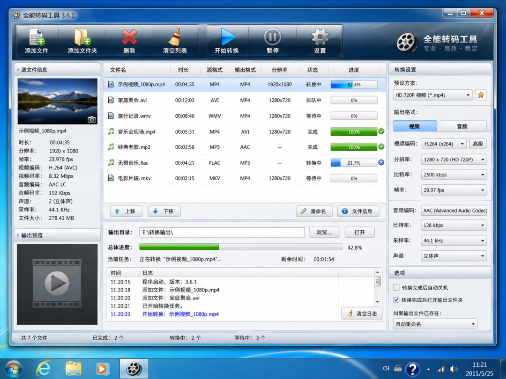
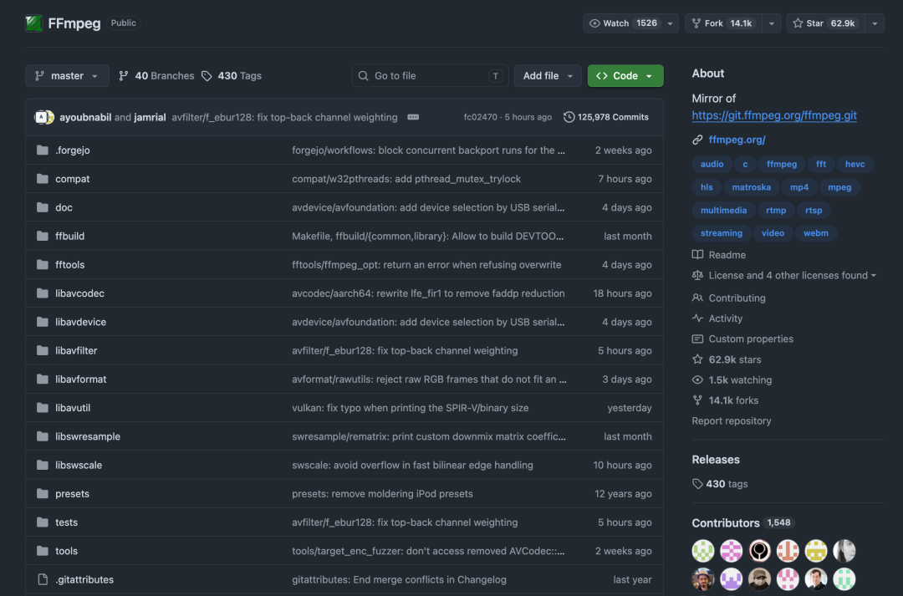
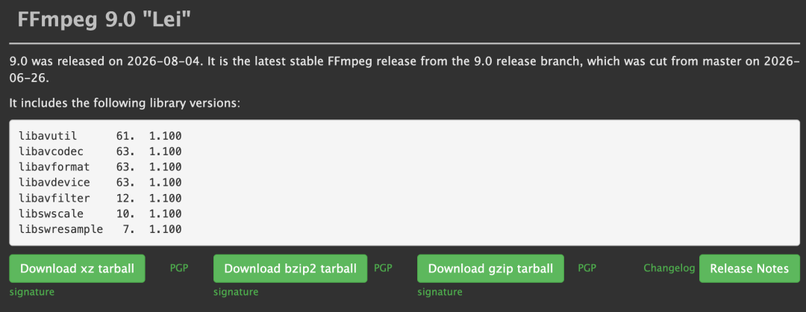

# FFmpeg 9.0 代号叫「Lei」，纪念一位离世十年的中国开发者

> FFmpeg 9.0 发布，代号「Lei」纪念中国音视频开发者雷霄骅（26 岁离世）。文章回顾了 FFmpeg 的历史、创始人 Fabrice Bellard 的传奇经历，以及 FFmpeg 在 AI 时代的核心基础设施地位。

<!-- more -->

## FFmpeg 是什么

FFmpeg 是一套处理多媒体内容的框架，能解码、编码、转码、封装、解封装、推流、滤镜处理和播放音视频。它既有普通人能直接运行的 `ffmpeg`、`ffprobe`、`ffplay`，也有开发者调用的 `libavcodec`、`libavformat`、`libavfilter` 等一整套库。

浏览器播放视频、播放器解码、直播软件推流、剪辑软件导出、云服务批量转码时，背后都藏着 FFmpeg。

## 天才创始人

2000 年，法国程序员 **Fabrice Bellard** 启动了 FFmpeg 项目。他还做了 QEMU、Tiny C Compiler、JSLinux、QuickJS，曾用普通台式机把圆周率算到 2.7 万亿位（破超级计算机纪录），拿过三次国际混乱 C 代码大赛冠军，被誉为「写穿互联网底层的男人」。

## 版本时间线

| 年份 | 版本 | 代号 | 说明 |
|------|------|------|------|
| 2000 | — | — | Fabrice Bellard 发起 FFmpeg |
| 2011 | — | — | 社区分裂，Libav 项目出现 |
| 2012 | 1.0 | — | 进入稳定版本节奏 |
| 2016 | 3.0 | Einstein | 硬件加速和现代格式支持 |
| 2022 | 5.0 | Lorentz | 旧 API 大规模清理 |
| 2025 | 8.0 | Huffman | 加入 Whisper 语音识别滤镜 |
| 2026 | 9.0 | Lei | 加入 ONNX Runtime DNN 后端及 GPU Execution Provider 支持 |

## 代号「Lei」的由来

FFmpeg 每个版本代号以科学家、数学家、工程师命名。2026 年 3 月，中国开发者刘歧在邮件列表推荐了「Lei」——雷霄骅（中国传媒大学博士生，2013-2016 年间留下大量 FFmpeg 中文教程和示例代码）。2026 年是他离世十周年。8.1 版用了「Hoare」，但维护者 Michael Niedermayer 承诺下次发布时采用。9.0 正式命名为「Lei」。

## 雷霄骅（雷神）

雷霄骅是中国传媒大学数字视频技术方向博士生，CSDN 博客保留 900 多篇内容（「最简单的基于 FFmpeg 的视频播放器」「FFmpeg 视音频编解码零基础学习方法」等），GitHub 留下 30 个公开仓库（播放器、推流器、VideoEye 码流分析工具等）。2016 年 7 月 17 日突然离世，年仅 26 岁。

## AI 越火，FFmpeg 越忙

大模型不认识 MP4/mp3，只能处理经解码、缩放、抽帧、重采样后的张量。FFmpeg 在 AI 流水线中的角色：

| 场景 | FFmpeg 在做什么 |
|------|----------------|
| 视频模型训练 | 解码统一分辨率/帧率/像素格式，抽帧、切片、去音轨 |
| 语音模型训练 | 提取音频、转单声道、统一采样率 |
| 视频理解 | 批量生成关键帧和元数据 |
| AI 视频生成 | 拼视频、补帧率、编码、音轨、字幕和封面 |
| 数字人与配音 | 对齐时长、混音、调采样率、封装成片 |
| 普通 AI 用户 | 压缩、截取、提取音频、生成 GIF、烧录字幕 |

OpenAI Whisper 的 `load_audio` 直接调用 FFmpeg。FFmpeg 8.0 加入 Whisper 音频滤镜，9.0 增加 ONNX Runtime DNN 后端和 GPU Execution Provider 支持。