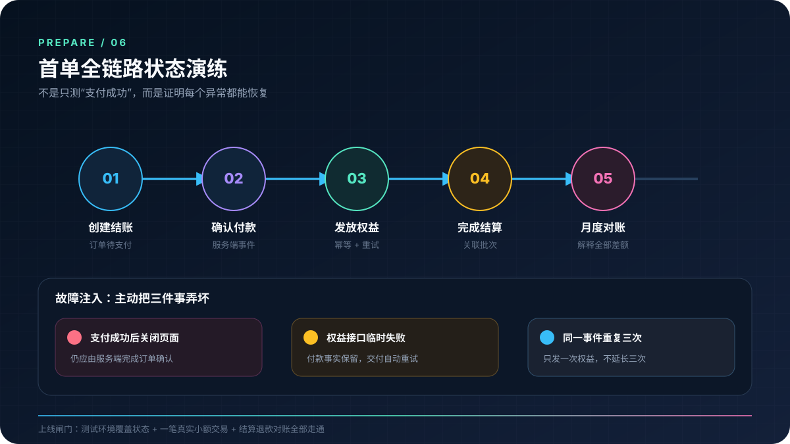

> 本文由 [简悦 SimpRead](http://ksria.com/simpread/) 转码， 原文地址 [coderliang.com](https://coderliang.com/community/articles/first-order-dry-run)

> 代码改变世界。专注全栈开发、AI 工程与安全研究，分享技术洞察与实战经验。

# 独立站首单演练：从下单到对账的全流程手册

最后这次演练不要只测支付按钮。最好从用户下单一直走到月底对账，看看每个状态有没有记录、出了问题谁处理、怎么恢复。

## 演练分两轮

### 第一轮：测试环境覆盖状态

测试环境适合大量、可重复地验证边界条件。至少覆盖支付成功、失败、用户中断、延迟确认、重复事件、退款、交付失败和通知失败。

### 第二轮：可控金额的真实交易

真实环境才能验证生产域名、真实密钥、支付方式资格、账单描述、通知、结算周期、银行到账和退款路径。金额应足够小且符合平台规则，不要用虚假交易制造流水。

真实演练前先确认测试方式不违反支付平台条款，并清楚标记内部订单。

## 建一张状态表

订单、付款和权益不要混成一个状态。它们相关，但不是一回事。

| 场景 | 订单 | 付款 | 权益 | 必须发生的动作 |
|------|------|------|------|----------------|
| 新建结账 | 待支付 | 未支付 | 无 | 允许继续付款 |
| 支付成功 | 已确认 | 已支付 | 待发放 / 已发放 | 记录事件并幂等交付 |
| 支付失败 | 待支付或失败 | 失败 | 无 | 提示重试，不发权益 |
| 交付失败 | 已确认 | 已支付 | 发放失败 | 告警并自动重试 |
| 全额退款 | 已退款 | 已退款 | 按政策撤销 | 通知用户并记账 |
| 拒付处理中 | 争议中 | 争议 | 限制或保留 | 收集证据、人工判断 |

状态转换应由可信的服务端事件触发，并允许安全重放。刷新页面、重复 Webhook 或人工点击不应重复发放。

## 演练脚本

### A. 正常购买

1. 用全新用户从价格页进入结账；
2. 确认产品、金额、币种和账单描述；
3. 完成付款后立刻关闭返回页面；
4. 检查服务端是否仍收到事件并发放权益；
5. 检查用户通知、内部通知和订单后台；
6. 用同一事件重放，确认不会重复发放。

### B. 失败与恢复

1. 模拟支付被拒绝；
2. 模拟需要额外验证但用户中断；
3. 让权益交付接口暂时失败；
4. 确认订单保持已付款，交付进入重试；
5. 恢复接口，确认只补发一次；
6. 检查人工是否能看懂失败原因并安全重试。

### C. 退款与权益

1. 从客服流程发起全额退款；
2. 检查用户收到清晰通知；
3. 检查权益按已公布政策处理；
4. 检查退款进入订单账本；
5. 检查支付平台余额与后续银行结算差异；
6. 若支持部分退款，再单独测试一次。

### D. 结算与对账

等待真实交易完成结算后，把四份数据放在一起：应用订单、支付平台交易、支付平台结算、银行流水。

用下面的关系检查差异：

**期初平台余额 + 销售 - 退款 - 拒付 - 手续费 - 已结算 = 期末平台余额**

银行到账则应能关联到具体结算批次。若币种转换或跨境转账产生额外费用，单独记录，不要把差额塞进 "其他"。

## 通知演练

逐个确认谁会收到、多久收到、收到后做什么：

- 支付成功但交付失败；
- Webhook 连续失败；
- 退款或拒付；
- 结算延迟或银行退回；
- 单日失败率异常；
- 支付账户要求补充资料。

每条通知必须包含可定位的内部订单号和处理入口，但不应泄露密钥、完整支付凭证或不必要的个人数据。

## 14 天故障桌面推演

假设主要支付账户或经营账户连续 14 天不可用，回答：

- 已付款用户还能获得服务吗？
- 新用户会看到什么，而不是反复支付失败？
- 退款从哪里支付？
- 云服务和 API 账单能否继续扣款？
- 谁联系服务商，资料放在哪里？
- 备用通道何时启用，是否已合法开通并测试？
- 现金余额能支撑多久？

这项推演的价值不在于预测冻结，而在于发现单点依赖。

## 上线闸门

只有同时满足以下条件，才建议打开正式获客：

- 测试环境的核心状态全部通过
- 真实小额付款、交付、结算和退款走通
- 重复事件不会重复发货或延长会员
- 支付成功但交付失败能够自动恢复
- 用户能找到价格、取消、退款与客服说明
- 订单、平台结算和银行流水能够对上
- 异常通知有明确接收人和操作手册
- 关键账户失效时有 14 天应急方案

## 演练复盘模板

每次演练只记录五项：场景、预期、实际、证据链接、改进负责人。所有未通过项进入发布清单，并在修复后重新演练，不用 "线上再观察" 代替验收。

做到这里，"前期准备" 才算比较扎实：你手里不只是几个海外账号，而是一套亲自走过、能解释也能恢复的经营流程。