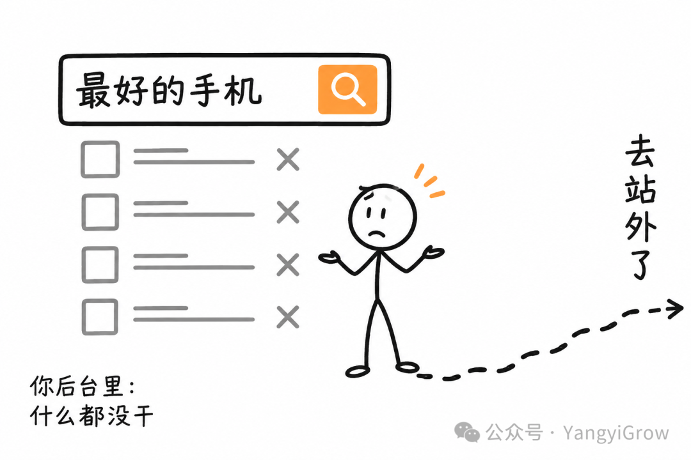
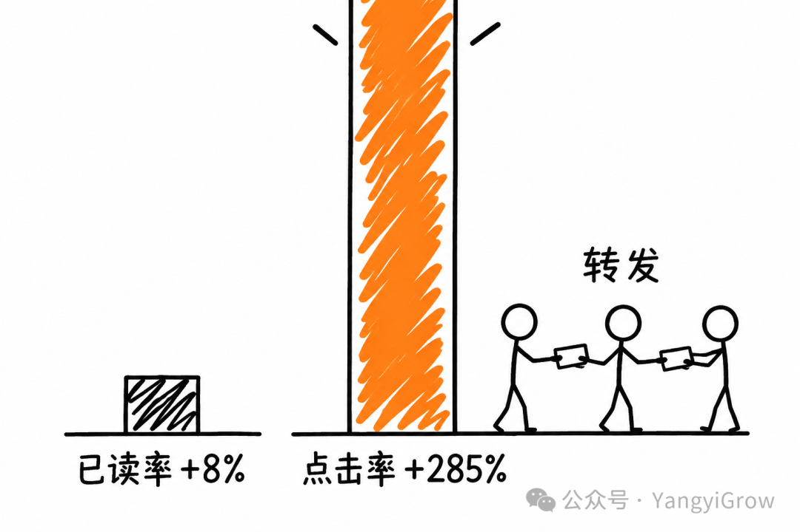
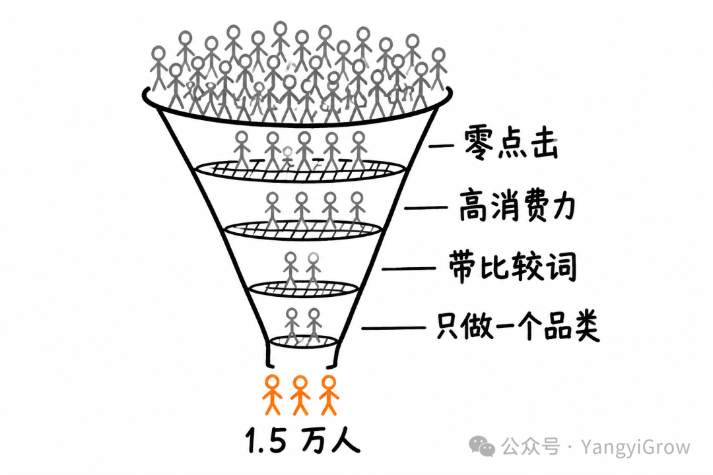
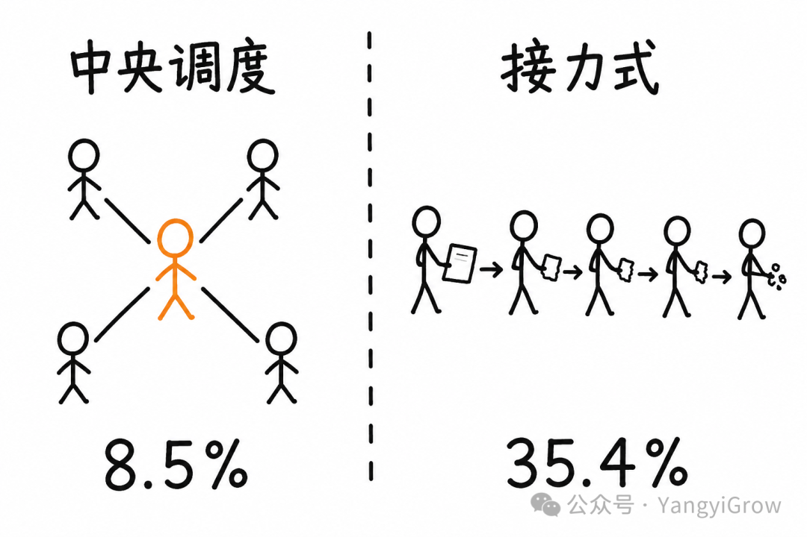

# Flipkart 如何用 AI 让私域消息被疯狂转发：285% CTR 背后的搜索召回新范式

> 有人发了 15,061 条营销消息，换回 37,258 次访问。多出来的那部分，是用户自己转发出去的。起点在搜索日志里。

## 核心洞察

这篇文章分析了印度最大电商 Flipkart 发表在 arXiv 上的论文（KDD 2026 workshop 接收），研究他们如何用 AI Agent 系统改造私域召回策略。核心发现是：**真正关键的不是 AI 写得有多好，而是把"催单"改成"帮用户做功课"**——这让用户愿意转发，转发带来了远超发送数的访问。

### 关键数据

- **发送 15,061 条** → **回来 37,258 次访问**（2.5 倍）
- 消息已读率 +8%，点击率 CTR +285%
- 23 天线上真实实验，非实验室
- 成本：每人约 2 毛钱 AI 成本

## 一、被忽视的宝藏人群：搜索了但没点的人

传统 CRM 的召回逻辑只覆盖三类人：会员、购物车弃单、浏览未下单。但有一批人在后台数据里"什么都没干"——搜了一圈，一个结果都没点，然后消失了。

这批人恰恰是最有价值的：他们有明确购买意图和预算，缺的只是信息。他们去了 Google、小红书、B 站做功课，然后未必回来。

Flipkart 用四条 PySpark 规则从搜索日志里捞出这批人：

1. **零点击查询**：用户搜了但没点任何结果——"你站内没有他要的答案"的最强信号
2. **高消费能力用户**：后台已有字段，把昂贵 AI 算力花在转化价值高的人身上
3. **查询带主观修饰词**：`best`、`latest`、`top`、`good`、`around`、`under` 等——说明用户在比较，需要信息；直接搜具体型号说明在找货，需要货架
4. **限定一个品类**：只做手机，因为搜索量大且外部评测内容极其丰富

## 二、285% CTR 的真正来源

看到 285% 这个数字，直觉反应是"AI 文案写得牛"。但数据揭示了更深层的原因：

- **已读率只涨 8%** → 打开消息的人数几乎没变
- **CTR 涨 285%** → 短链点击远超发送数

短链上埋了按天区分的 UTM。已读率只能追踪直接收件人，CTR 追踪的是所有点击——包括收件人转发给的朋友、同事、家人。论文原文说："转发出去之后的二次收件人，已读率没法可靠追踪。"

真正让用户愿意转发的，不是文案技巧，而是这条消息帮他省了事儿。"你上周不是在挑手机吗，这 3 款都在 4000 以内，参数我列了"——转给纠结中的同事，是在替对方省时间。

Flipkart 改掉的不是文案，是**消息的性质**：从"催你买"改成"功课我替你做完了"。

## 三、数据该打几折

作者对 285% 持谨慎态度，指出三个问题：

1. **对照组不干净**：用的是历史同品类活动而非同期随机分流 A/B 实验
2. **人群是精挑细选的**："高消费能力 + 明确探索意图"本身 CTR 就高于大盘
3. **GMV 写得很虚**：只说"有大量重叠"，没给金额也没做增量实验

但有一个事实骗不了人：UTM 显示访问数超过发送数，用户确实转发了。

## 四、可复用的四条经验

### 1. 筛人规则不需要 AI

四条 SQL 级别的规则（零点击、高消费力、带比较词、单品类）就能锁定目标人群。这是整篇论文最容易被忽略也最值得抄的部分。

### 2. 成本账：漏斗比模型重要

系统用 Gemini 2.5 Flash，每个查询约 8 次 LLM 调用，单次成本 0.02-0.03 美元（约 1.5-2 毛钱）。关键洞察：

> **Agent 的成本关口在漏斗最前面，不在模型选型。** 给 500 万人跑 Agent 换哪个模型都得破产；给 1.5 万人跑，用最贵的模型都无所谓。

### 3. 把"转发率"写进私域 KPI

送达率、已读率、点击率、ROI 这四个指标只衡量"你压榨了用户多少"。转发率是唯一骗不了人的内容质量指标——没有人会转发一条催单短信。技术上也简单，短链埋 UTM 就够了。

### 4. 别在所有品类上试

适合：客单价高、决策周期长、参数复杂、外部有大量评测内容的品类（手机、家电、数码、汽车配件、母婴耐用品、B 端软件）。

不适合：生鲜、日用、快消——用户搜"洗衣液"没什么功课可做，AI 也搜不出有价值的东西。

## 五、Agent 架构的两条硬警告

### 1. 别用接力式架构

论文消融实验：中央调度架构指令违规率 **8.5%**，顺序接力架构（A→B→C→D）违规率 **35.4%**，差了 4 倍多。原因：信息在 Agent 之间传递时会变形丢失。

正确做法：一个总控统一分派，每个子 Agent 只对总控负责，输出结构化数据，不许自己往下传。总控还做了件聪明事——如果发现搜索词已经足够明确（如"iphone 17 pro new"），直接终止流程，一分钱不花。

### 2. 末端必须加独立的事实审核

系统参数准确率 99.1%，上市日期准确率 99.2%——这不是模型本身的水平，是最后那个 Review Agent 拿真实商品库逐条对账磨出来的。AI 编的参数全删掉，用真实数据盖上去。

> **AI 写的产品参数一律不可信，必须用商品库回填。** 一个参数写错，你赔的钱比省下来的多得多。

## 总结

这篇论文的核心不是技术，是一个思维转变：

- 传统 CRM 的底层假设是"用户忘了买，我得提醒他"→ 话术全是催单
- 这套系统的底层假设是"用户卡住了，我得帮他"→ 内容是做功课

催单是在花用户的耐心。做功课是在存用户的信任。耐心花完了就没了，信任存下来是复利。

---

> 💡 **原文链接**：[新型SEO转化打法！用AI填补信息短板！](https://mp.weixin.qq.com/s/pNveR3dL3eu6DiN8_dA5eA)
> 
> 📄 **论文**：arXiv 2608.18543，KDD 2026 Workshop
