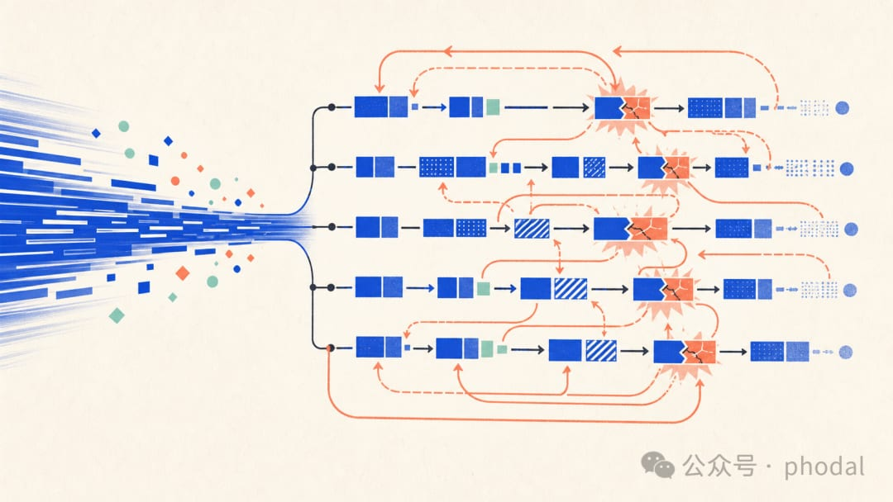
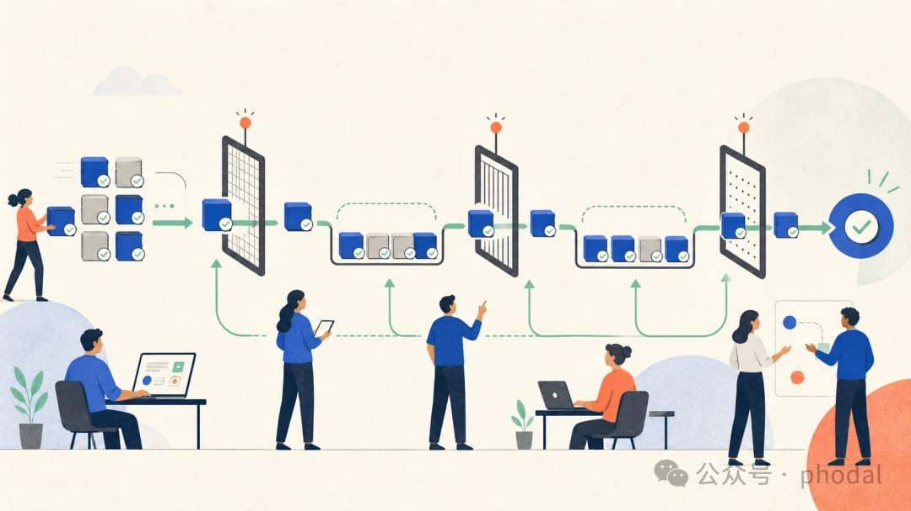

# 设计流动摩擦：AI 原生团队的核心能力

> AI 正在把软件研发从生产能力问题推向流动能力问题。当开发能力的边际成本急剧下降，真正限制团队的，开始变成需求、设计、Review、测试和发布之间等待、切换与返工产生的"流动摩擦"。

<!-- more -->

## 引言

过去几年，讨论 AI 对软件研发的影响，最常使用的仍是个人生产力：一个功能要多久、一名开发者能同时推进多少任务、Coding Agent 能生成多少代码。AI 确实显著降低了执行成本。

但开发者变快，不代表团队同比变快。代码、Pull Request 和测试都增加了，从需求提出到用户获得价值的时间却没有等比例缩短。需求、设计、Review、合并、测试和发布仍在排队，**局部提速反而让端到端交付变得更不稳定**。

> AI 正在把软件研发从生产能力问题推向**流动能力问题**。我把变化在需求、设计、Review、测试和发布之间等待、切换与返工产生的阻力，称为"流动摩擦"（Flow Friction）。

当代码生成的边际成本下降，真正限制团队的，开始变成这些变化能否以匹配的节奏穿过整个系统。

## AI 对团队各环节的加速并不均匀

如果 AI 能够将每个角色的产能同时提升五倍，团队或许只需要扩大整体吞吐量就可以了。现实却不是如此。

| 环节 | AI 加速幅度（示意） | 瓶颈本质 |
|------|---------------------|----------|
| 需求 | ~1.2× | 受限于决策，不是文档生成 |
| 设计 | ~1.5× | 受限于体验判断，不是绘图速度 |
| 开发 | ~5.0× | 代码生成能力爆发 |
| Review/测试 | ~1.3× | 上下文恢复与验证能力 |

### 产品工作受限于决策，而不是文档生成

产品经理借助 AI 可以更快地整理会议记录、生成用户故事、分析竞品，甚至产生大量需求假设。但**产品工作的真正瓶颈通常不在于把需求写成文档，而在于获得足够的信息并作出决策**。

客户会议没有举行，关键利益相关者没有参与，商业目标尚未明确，优先级冲突没有解决——再完整的用户故事也只是未经确认的假设。

过去，一个产品经理晚一天确认需求，开发团队可能仍在完成上一批功能，这个延迟会被较长的开发周期自然吸收。现在，**开发环节的消费速度已经超过了团队产生有效决策的速度**。

### 设计工作受限于体验判断，而不是绘图速度

设计师通过 AI 生成页面、原型已经非常快，但设计工作的核心并不只是画出页面。设计师需要理解用户路径，处理空状态、异常状态、权限差异和响应式行为，需要在产品目标、技术限制和设计系统之间不断取舍。

**当开发能力大幅提升之后，设计师很容易成为开发的上游瓶颈。** 为了避免等待，开发者和 Agent 可能根据现有组件自行补全设计。局部实现得以推进，但原本应该由设计师统一处理的体验决策，开始分散在不同 Agent 和不同代码分支中。

最终，设计师并没有减少工作——他需要在代码已经形成之后重新检查、纠正和统一。原本应该发生在设计阶段的探索和取舍，被推迟成了开发之后的返工。

### 开发同时经历上游饥饿和下游拥堵

AI 原生团队可能同时出现两种看似矛盾的状态：

- **上游饥饿**：没有足够的需求和设计可以继续工作
- **下游拥堵**：已经生成的代码在 Review、合并和测试环节大量排队

开发环节就像一条突然扩宽的高速公路：**入口没有足够车辆，出口又无法承接已经进入的车流**。

## 流动摩擦如何被放大为系统返工

当开发比上下游快得多，团队通常会让 Agent 提前探索、顺手重构或补更多测试，试图填满产能。这些工作本身有价值，却会持续增加尚未完成的变化，把局部提速转化为系统返工。

### 不成熟的需求更快地变成代码

过去，需求歧义会在开发过程中逐步暴露。现在，**Agent 可以根据当前上下文迅速选择一个合理解释，并形成完整实现。歧义没有消失，只是更快地被固化成了代码。**

例如，"管理员可以导出成员列表"没有说明权限模型和导出数据范围。前端、后端和测试 Agent 都可能给出局部合理的实现，却未必表达同一个业务决策。等差异在 Review 中暴露，一个待澄清的问题已经变成一组需要修改的代码、测试、文档和接口。

### 更多并行开发带来更多合并与所有权问题

开发速度提升之后，团队自然会增加并行度。Git 冲突只是最表层的问题；即使代码能够合并，不同 Agent 仍可能在相邻模块中引入不同的抽象、命名和错误处理方式。

> 每个 PR 单独看都可能正确，放在一起却会失去一致性。

**AI 降低了写代码的成本，却提高了团队共同拥有代码的成本。**

### 测试规模增长并不等于验证能力增长

AI 很擅长根据实现补充测试，但测试数量增加，不等于验证能力增长。由实现生成的测试很容易证明"代码按照当前写法运行"，却未必证明"系统实现了正确的业务行为"。

问题发现得越晚，开发阶段节省的时间就越容易以 Bug 修复、回归测试和重复交付的形式回到系统中。

## 代码已经够快，变化还需要持续流动

当开发能力从价值流中的主要瓶颈变成最快环节之后，团队不能继续只优化开发。真正重要的问题是：

1. 产品能否持续形成有效决策
2. 设计能否及时提供可消费的体验边界
3. 代码能否以小批次安全并行
4. Review 能否获得足够上下文
5. 测试能否验证真正的业务行为
6. 生产反馈能否回到下一轮决策

> AI 原生团队的竞争力，不在于能够同时启动多少 Agent，也不在于一天能够生成多少需求、原型、代码和测试。**真正重要的是，团队能够让多少变化以较少的等待、冲突和返工，从一个尚未确认的想法，持续流动为用户可以感知的价值。**

> 代码可能已经足够快了。接下来需要重新设计的，是变化穿过整个团队时的流动摩擦。

## 关联文章

- [重构协同：关于 AI Native 团队的思考](./bestblogs-2026-08-15.md) — 大淘宝技术，编码变快≠交付变快
- [实用循环工程](./bestblogs-2026-08-15.md) — Addy Osmani，goal vs loop + 执行验证分离
- [数据治理五大概念辨析](./data-governance-concepts.md)