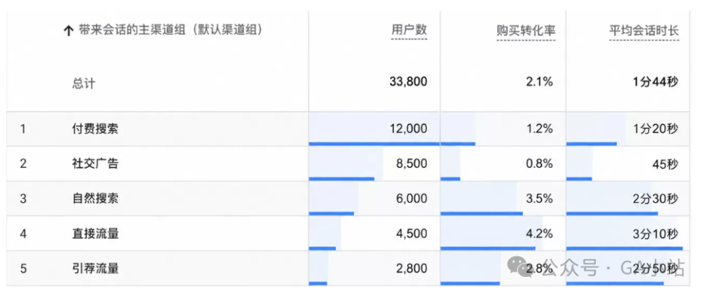
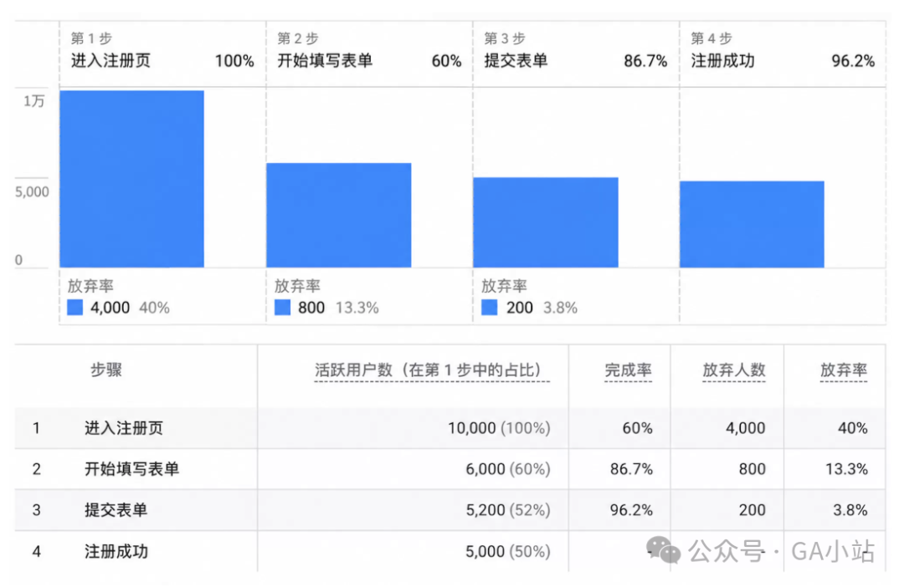
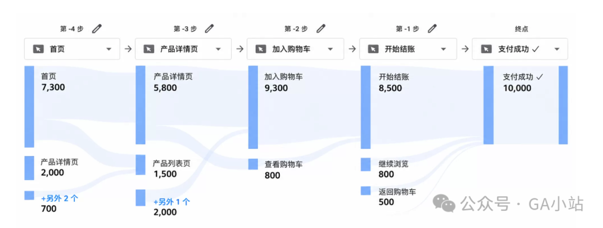
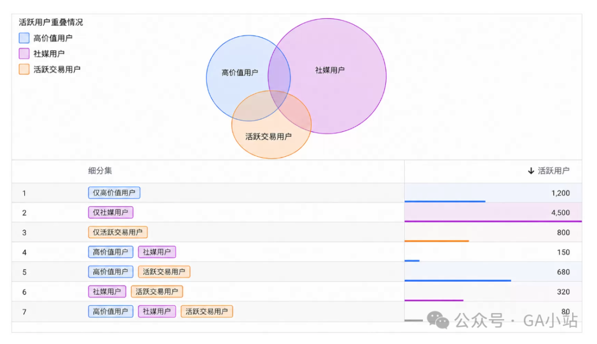
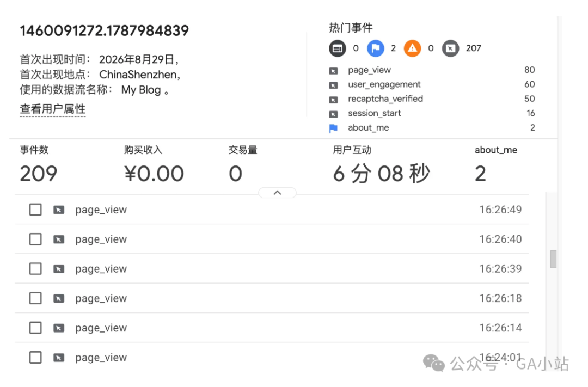
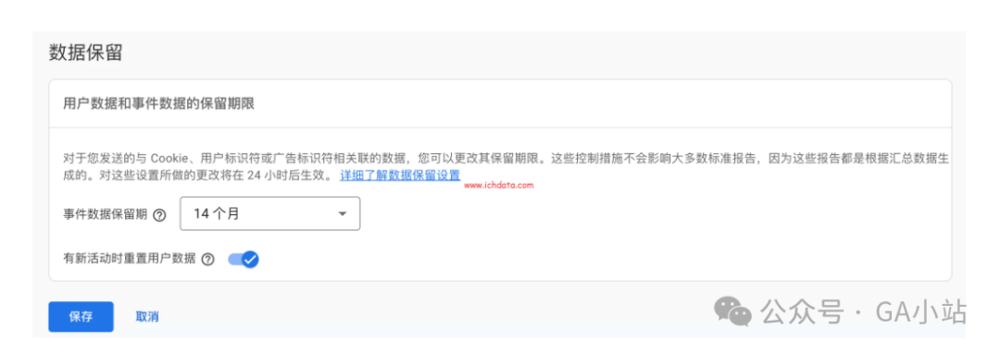

# GA4探索报告完整指南：如何选择自由形式、漏斗、路径、同类群组和细分

> 标准报告告诉你"发生了什么"，探索报告回答"为什么发生"和"接下来怎么办"。先明确问题，再选分析方法。

## 什么是 GA4 探索报告

GA4 探索报告是一个高度可自定义的分析工作区。你可以自行组合维度、指标、细分、筛选条件和可视化方式，回答标准报告难以直接回答的问题。

**核心原则**：
- 探索数据存在处理延迟，不适合实时监控
- 明细数据范围受数据保留期限限制
- 适合：自定义分析逻辑、比较人群、深入拆解行为
- 不适合：替代日常流量看板

## 7 种探索类型详解

开始前应先明确问题，再选择合适的分析方法。

### 1. 自由形式（Free Form）

**适合场景**：横向比较渠道、设备、页面、国家或事件表现。

**典型问题**：哪些渠道带来了大量流量但购买转化率很低？

**分析思路**：对比多个维度的流量与转化数据，识别表现异常的渠道。

### 2. 漏斗探索（Funnel Exploration）

**适合场景**：已有明确转化流程，想知道用户在哪一步退出。

**典型问题**：注册流程在哪一步流失最严重？

**分析思路**：设置已知的转化步骤，观察每步的流失率。

### 3. 路径探索（Path Exploration）

**适合场景**：不预设完整流程，从某个起点或终点观察真实行为路径。

**典型问题**：用户在完成购买前最常访问哪些页面？

**分析思路**：从起点或终点回溯，找出最常见的行为路径。

### 4. 细分重叠（Segment Overlap）

**适合场景**：判断不同用户群是否为同一批人。

**典型问题**：社交媒体广告吸引的用户，是否同时也是高价值用户？

**分析思路**：创建多个细分，查看它们的重叠程度，判断用户群体的重合度。

### 5. 用户分层图表（User Exploration）

**适合场景**：从某个细分进一步查看匿名用户的事件序列。

**典型问题**："加购未购"用户到底卡在哪里？

**分析思路**：按行为特征分层，查看各层用户的具体事件序列，找出典型断点模式。

### 6. 同类群组探索（Cohort Exploration）

**适合场景**：比较同一时期获得或完成同一行为的用户，后续是否回访、购买或完成关键事件。

**典型问题**：新版本上线后，用户留存是否改善？

**分析思路**：按时间或行为分组，对比不同群组的后续表现。

### 7. 用户生命周期（User Lifetime）

**适合场景**：比较不同渠道、广告活动或首触点带来的用户，在后续生命周期内产生的收入、关键事件或互动表现。

**典型问题**：哪些渠道的用户长期价值更高？

**分析思路**：按首次触点分组，追踪90天或更长时间内的用户价值表现。

## 细分、对比项与筛选条件：区别是什么

这是探索报告中最常被混淆的三个概念。

| 概念 | 作用范围 | 可复用 |
|------|----------|--------|
| 细分（Segment） | 定义用户子集，跨探索复用 | ✅ 可保存复用 |
| 对比项（Comparison） | 在当前视图中拆分对比 | ❌ 当前视图专用 |
| 筛选条件（Filter） | 过滤数据范围 | ❌ 仅当前页签生效 |

## 数据保留设置

探索使用用户级和事件级明细数据，受数据保留设置影响。

**设置路径**：管理 → 媒体资源设置 → 数据收集与修改 → 数据保留

**建议**：尽早设置为最长可用期限。调长期限后，尚未被删除的历史数据可适用新设置；已经被删除的明细数据无法恢复。

## 总结

探索报告的重点不是做出更多图表，而是先明确问题，再选择合适的方法。这样，探索才是分析工具，而不是另一个难维护的报表库。
