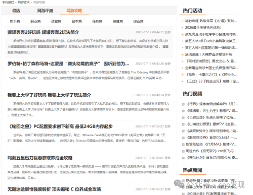
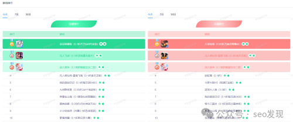
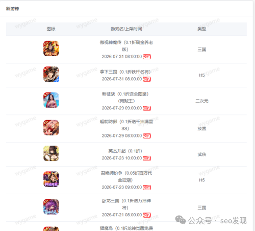

# 1篇文章带你入门游戏下载行业！学会不用求人！

> 作者从企业站转型到流量站游戏下载行业的实战经验：找高权重游戏站参考做内容、接入游戏 CPS 后台、保持日常更新，就能从小站起步逐步做起来。

<!-- more -->

## 作者经历

作者从企业站转型到游戏下载行业时，曾一度无人指点、无人看得起。最初只是找一个 WordPress 模板不停发文章，经过无数次的煎熬，终于从零做到爱站权重 7，未借助任何其他手段。

> 做就是了！

## 三步入门方法

### 第1步：找高权重游戏站参考

打开爱站工具，查找知名游戏网站，查询其权重。如果权重高，就打开该站直接参考其内容结构，尤其是资讯页面。无需采集工具，手动参考即可。

### 第2步：找到游戏 CPS 后台

找到常用的游戏名称信息，这些信息直接关系到游戏 CPS 的收益结果。后台通常都有游戏排行榜，直接搬到自己网站里。

### 第3步：保持网站更新频率

日常保持更新，直接参考新游信息。新游信息非常有用，直接搬到自己网站，修改好标题即可。

## 作者观点

### 关于做网站

- 有人一直不停研究界面、程序、功能，但最终结果可能一无所有。会研究这些的人，作者认为往往是很多做不起来网站的人（个人观点）
- 真正能做起来网站、赚到钱的人，往往一点都不懂程序、不懂编程。因为他们眼中只有一个目标：**赚钱**

> 实在不行，换圈子，换人，换掉身边负能量的人。

### 关于心态

> 人生道路上的终点是你自己决定的，不要让任何思想左右你的决定！

> 你向（钱）看，拿出决心，我不信干不好！

---

> **风险提示**：本文为个人创业、副业经验与思路交流，不构成任何投资建议或收益承诺。请理性看待收益，谨慎尝试。

## 关联文章

- [游戏下载站养站30个网站成本核算明细分享](./game-station-cost-breakdown.md) — 王杨，2026-07-16
- [别把闲置域名当摆设！手搓几个游戏站试一下！](./idle-domain-game-site.md) — 王杨，2026-08-09
- [40块1个站点游戏下载站模板+SEO功能游戏养站系统](./game-seo-system.md) — 王杨，2026-08-10