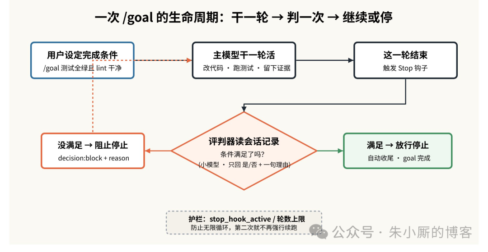
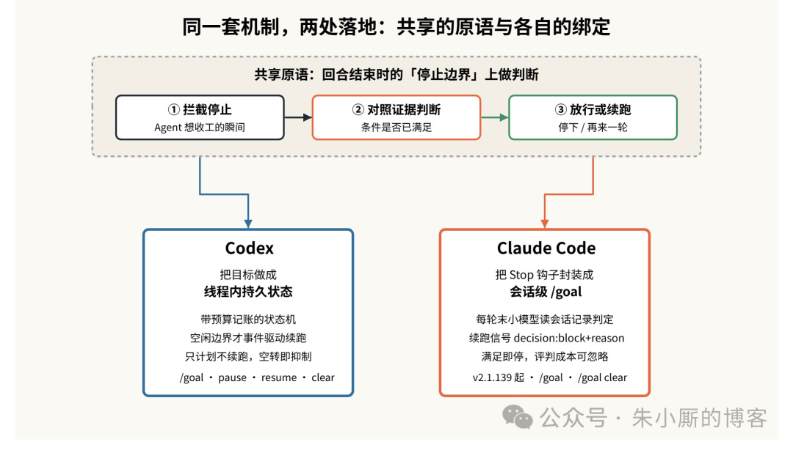
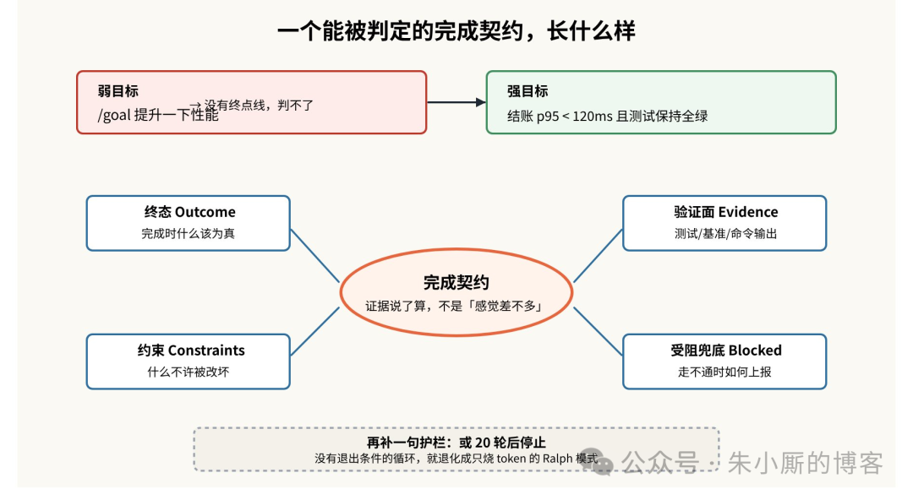

# /goal 是怎么实现的：让智能体自己判断「干完了没有」

> 让 AI 编程助手改一个 bug，它改完一轮停下来等你；你看了眼测试还没全绿，只好再敲一句「继续」——如此往复五六轮，真正在打字的其实是你。`/goal` 就是冲着这个反复劳动去的：你只描述完成条件，剩下的「该不该停、要不要再来一轮」交给系统自己判断。

它不是让智能体脱缰狂奔的「后台自动化」，而是一份由用户界定、可随时收回的**完成契约**：你定义目标，智能体对照线程里的证据推进，而这个目标可以被暂停、恢复、清除、判为完成，或因预算耗尽而停下。

## 核心原理：在「停止边界」上插一次判断

`/goal` 的巧妙之处在于，它没有另造一个外部循环，而是复用了智能体本就有的一个生命周期时机——**回合结束、准备停下的那一刻（Stop 事件）**——在这里插入一次判断。

整条链路拆成三拍：

1. 智能体像平常一样干完一轮活（改代码、跑测试）
2. 这一轮结束触发 Stop 判断
3. 判断器读一遍会话记录，问一句「完成条件满足了吗」

答是，就放行，目标标记完成；答否，就拦住这次停止，把「为什么还没完成」作为理由回灌，让智能体基于最新状态再干一轮。

心智模型：普通提示是「问 → 干 → 出结果 → 等你」，目标是「干 → 查 → 继续或完成」。

**关键细节**：判断器不亲自跑命令，它只读会话记录（transcript）来下结论。所以只有当证据出现在对话里，它才判得动。`npm test` 的输出留在会话里就能判；但「工作区是不是干净了」这种不体现在对话里的状态，它无从判起。这条约束决定了目标怎么写——得让智能体把验证动作显式做出来、把结果留在记录里。

## 判断靠什么：证据，而不是「感觉差不多」

这是 `/goal` 和「让模型自己说完成了」最本质的区别。一个目标不应该因为模型觉得大概做完了就算完成，而应该在把目标和具体证据对照之后才算完成——改动的文件、跑过的命令、通过的测试、基准输出、生成的产物。

终点线是被证据钉死的，模型只是在这条线内自由选择下一步动作。

判断交给小模型（Haiku）来做：它只需要吐出「是/否 + 一句理由」，相比主模型跑一整轮，这点开销可以忽略不计。这也是为什么 `/goal` 在 token 效率上明显优于无脑循环——评判便宜，而且一旦条件命中就立刻停。那句「一句理由」还顺带成了很好的可观测性。

## 同一套机制，两处落地

**Codex 的 Goal**：最「重」也最结构化。Goal 是一份持久化的线程内状态——目标属于它诞生的那个线程，因为相关上下文都在这个线程里。记录着目标本身、生命周期（active / paused / complete / 预算受限）、预算记账和进度。续跑是事件驱动而非死循环，只在真正空闲时才检查。调度刻意保守——只做计划不触发续跑；被打断则暂停；空转轮次自动抑制续跑。命令面：`/goal`、`/goal pause`、`/goal resume`、`/goal clear`（Codex 0.128.0+）。

**Claude Code 的 /goal**（v2.1.139+）：走的是「把 Stop 钩子做成好用的会话级封装」这条路。底座是会话级的 Stop 钩子，每轮结束由 Haiku 读会话记录判定，满足就自动停。屏幕上有 `◎ /goal active` 指示器，能看到经过时间、轮数和 token 用量。完成条件最长约 4000 字。

> 一句话记住关系：Stop 钩子是原语，Claude Code 的 `/goal` 是它面向会话的封装，Codex 的 Goal 则把它升级成带预算和状态机的线程内契约。

## 怎么写一个「能被判定」的目标

好目标通常包含四件事：

1. **终态**：完成时什么该为真
2. **验证面**：用哪个测试、基准、命令输出或产物来证明它
3. **约束**：工作过程中什么不能被改坏
4. **受阻兜底**：当没有可行路径时，该停下并报告什么、还缺什么

对比：`/goal 提升一下性能` 是弱目标，没有可判定的终点线。改写为 `/goal 让结账基准的 p95 降到 120ms 以下，同时保持正确性测试全绿；只改动结账服务与相关测试；每轮记录改了什么、基准结果如何、下一步试什么；如果基准跑不起来或没有可行路径，就停下并给出已尝试的路径、已有证据、阻塞点和还需要什么输入`——一下给了智能体一个完整的操作契约。

目标要**窄到能审计，又宽到留有探索空间**。还有一条实用护栏：在条件里补一句「或 20 轮后停止」。

## 什么时候别用它

`/goal` 不是万能锤。一次性的小改动、一句解释、一段简短的代码评审，普通提示更合适。终点线本身很模糊时也别用：「把这个做得更好」给不了任何可判定的完成条件。还有一种误用是拿目标去掩盖不确定性——如实写进条件里，让智能体在受阻时诚实上报，而不是产出一个看似漂亮、实则站不住的结论。

说到底，`/goal` 把一个线程从「一串互相孤立的提示」变成了「围绕一个既定结果的有状态工作循环」。目标被限定在线程内，带着生命周期状态和预算记账，可暂停、可恢复、可清除、可判完成、可因预算停下。智能体可以一直往前走，但只能在你划定的契约之内走——直到工作真正完成，或者诚实地卡住。