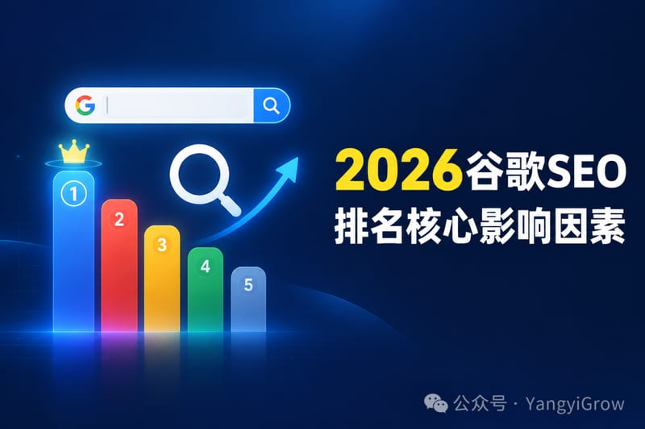
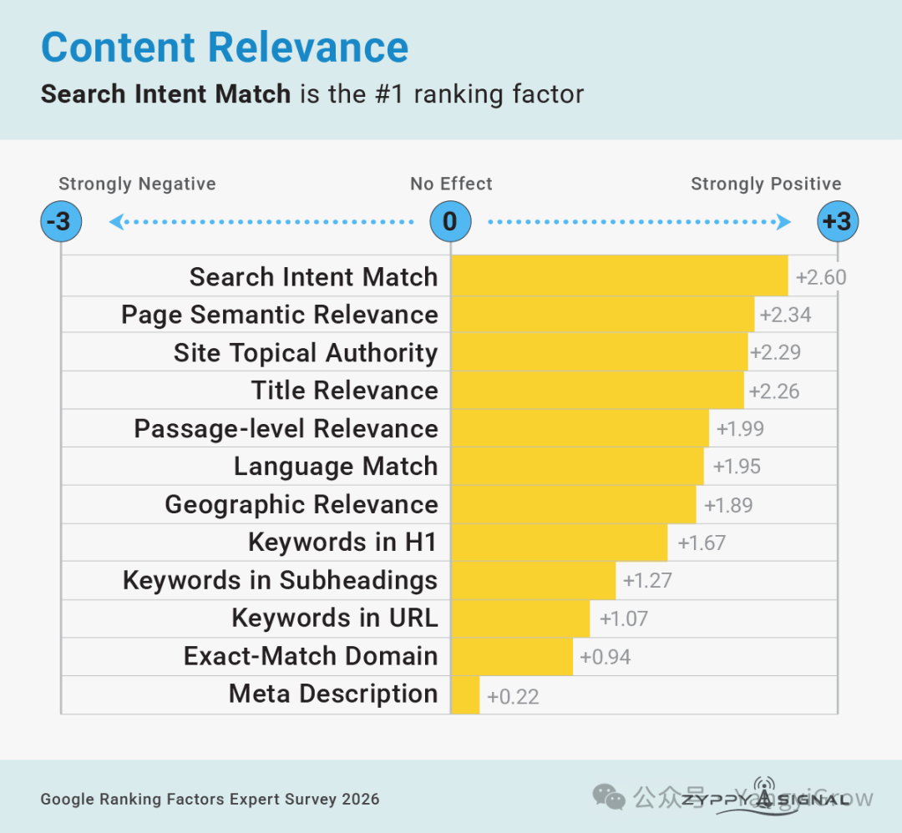
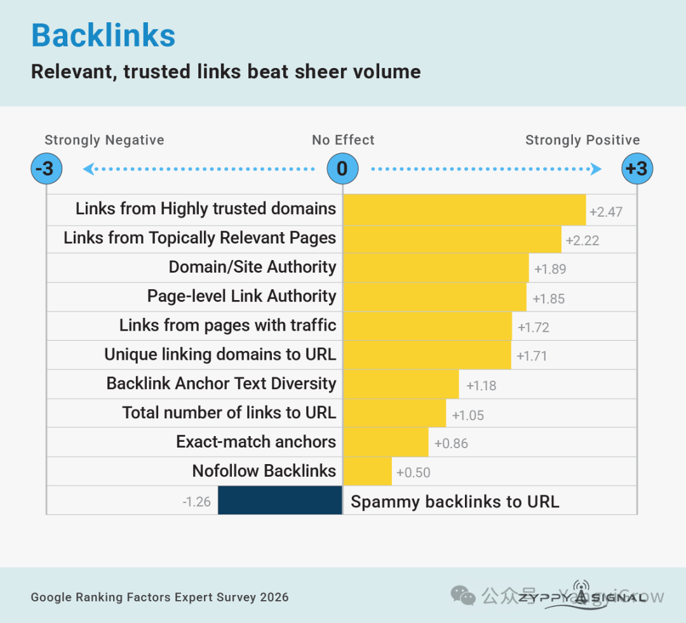
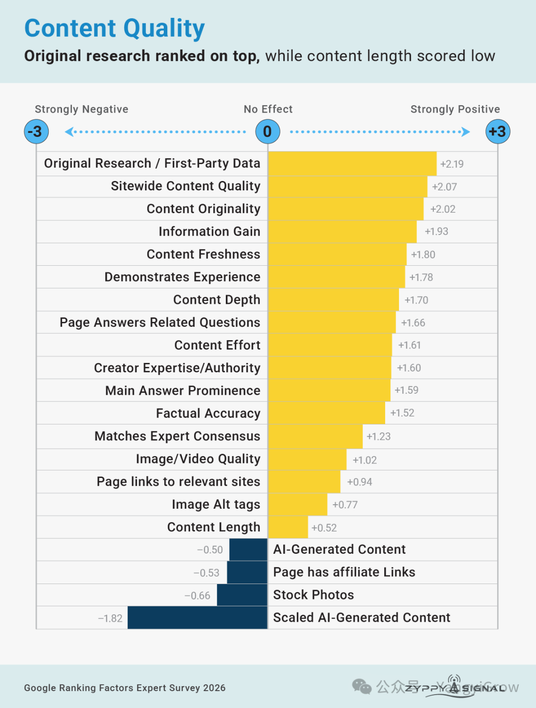
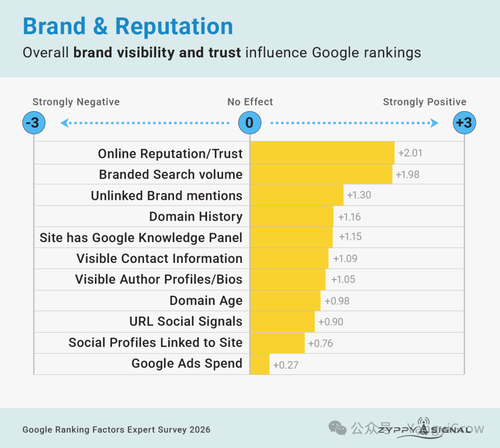
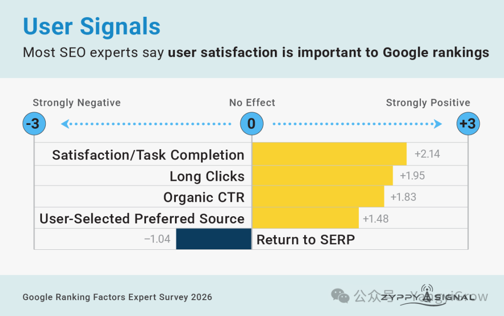
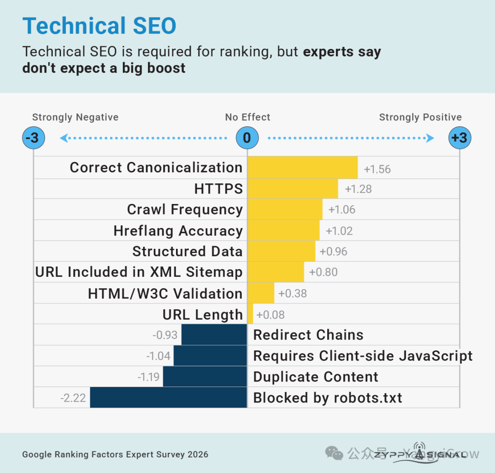
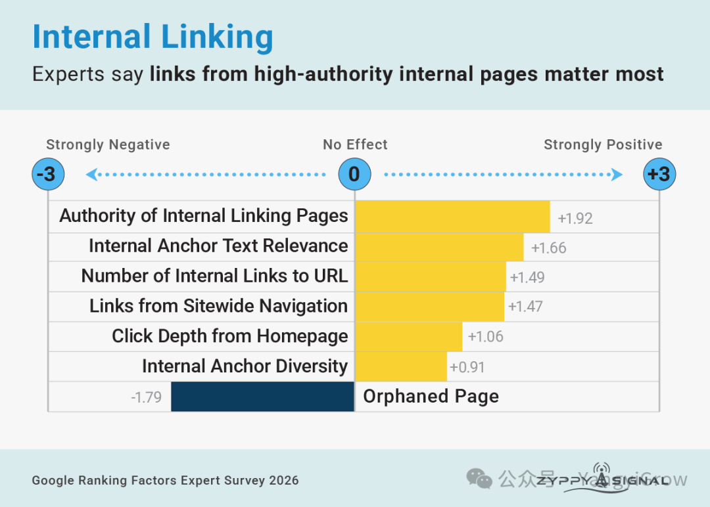
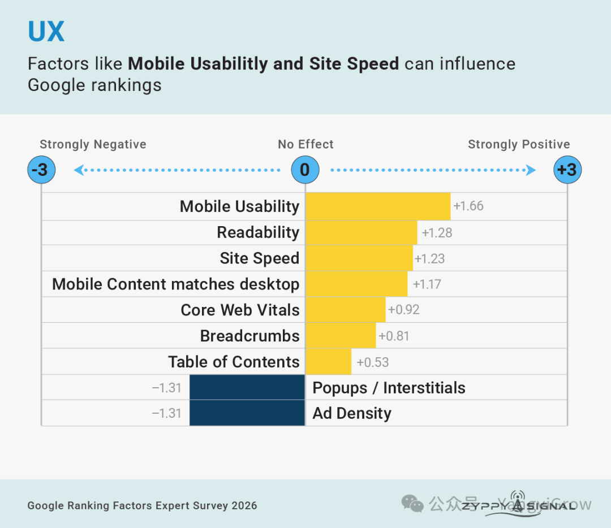

# 2026年Google SEO高排名核心影响因素

13,665 个数据点告诉你，2026 年 Google 排名靠什么！💡Zyppy 的 Cyrus Shepard 和 Dawn Shepard 拉了 131 个一线 SEO专家做调研，攒出 13,665 个数据点，这是 2026 年最大的一份「圈内人怎么看 Google」的样本。我把全文转译了一遍，人名和机构名保留英文。这两年，隔三差五就有人喊 SEO 死了、外链死了、AI 来了内容不值钱了。这份调查的数据挺有意思。前三名其实和五年前差不多。但有不少细节发生了变化。尤其是 AI、用户点击信号、还有内容质量到底怎么算。这篇是AI转译，观点全部来自原文和 131 位专家受访者，非常有价值。一、这份调查是怎么做出来的第一份 Google 排名因素调查，是 Rand Fishkin 在 2005 年做的。那会儿还叫 SEOmoz。从那之后，SEO 这行经历了 AI 崛起、Google API 泄露、反垄断审判、外加一轮又一轮算法更新。老问卷早就跟不上了。所以这次 Zyppy 重新设计了题目，把这些新变量塞了进去，算是接过了这个传统。方法很直接。第一，先从几百个候选因素里砍到 103 个最要紧的。第二，每个受访者对这 100 多个因素逐个打分。题目是「你认为以下每个因素对 Google 自然搜索排名有多大正面或负面影响？」7 分制，+3 是强正面，-3 是强负面。第三，最后加一道开放题：「最重要的三个 Google 排名因素是什么？」想答啥答啥。他们联系了 200 多位 SEO（顺带一提，大部分 SEO 都讨厌「专家」这个词），中间跟错邮箱、漏掉私信，损失了不少人，最后 131 人完成了问卷。这 131 人累计花了 2,620 分钟，也就是 43.6 小时。二、Top 10 总榜先看总榜。每条后面的百分比，是 131 人里有多少人把这条列进了自己的「前三」。定义是原文给的，我压缩了一下。相关性 Relevance，57.1%。内容匹配并满足用户的搜索意图，就叫相关。语义上对得上，需求上也得符合用户预期。外链 Backlinks，54.8%。「外链已死」的传言被严重夸大了。受访者把「来自可信、相关站点的链接」评成了最重要的因素之一。很多人特别强调，链接得来自有真实访客的页面。内容质量 Content Quality，47.6%。近一半的人把它列进前三。原创性、准确性、新鲜度都算。权威与信任 Authority & Trust，36.5%。Google 有多信你这个站、这个作者、这个品牌。这个也和Google要求的EEAT有关。行为 / 点击信号 Click Signals，29.4%。用户怎么选结果、怎么跟页面互动。Google 在看用户。品牌信号 Brand Signals，27.0%。你是不是一个别人会主动搜、会信、会访问的品牌或实体。用户满意度 User Satisfaction，19.8%。用户满意、任务完成，这是最终结果。技术 SEO 健康度，17.5%。抓取和索引是所有其他因素的地基。主题权威 Topical Authority，14.3%。你的品牌或站点在某个主题上，跟「专业」这两个字绑得多紧。内链 Internal Links，11.1%。你怎么用链接和站点架构把页面串起来。好了，总榜看完，下面一个板块一个板块拆。三、相关性：搜索意图匹配，全场第一103 个因素里，「Search Intent Match」（搜索意图匹配）是毫无争议的第一名。它的定义是「页面在多大程度上满足了搜索者想要的结果类型或任务」。注意，这已经超出关键词匹配和语义相关的范围了。专家们的意思很直白：你得真的把用户要的东西给他。另一头，Meta Description 被评得极低。大部分 SEO 压根不信它有任何影响。Melissa Popp（RicketyRoo）：「你可以把内容做得技术上完美，标题层级干干净净，URL 结构漂亮。但如果搜的人想要 A，你回答的是 B，这些东西一个都救不了你。」Andy Chadwick：「我要加一条：信息增益。当十个页面都匹配了意图、覆盖了同样的内容，决定胜负的就是你这页有没有别人没有的东西。」Shai Aharony（Reboot Online）：「EMD（完全匹配域名）到今天还这么好使，我跟大家一样惊讶。我们正在用一个 EMD 去排一个竞争激烈的词，花的力气只是主站争同一个词的零头。」四、外链：谁说你不需要外链了？「来自高可信域名的链接」和「来自主题相关页面的链接」，这两条是整个调查里评分最高的因素之二。反过来，Google 嘴上说会忽略大部分垃圾链接，但受访者仍然把垃圾链接评成了最大的负面因素之一。Nitin Manchanda：「一百个来自真实受众的链接，胜过一千个从来没人点的链接。」Andrew Shotland（Local SEO Guide）：「有了 AI，链接的作用可能更大了。几周前一个客户被 Reuters 的文章提到并加了链接。接下来一周，他们在 ChatGPT 里的可见度涨了 4 倍。」Geoff Kenyon（Pomar）：「精确匹配锚文本是把双刃剑。到某个点之前它带来真实增长，过了那个点就开始压制表现。关键变量是它在整个锚文本里占多大比例，跟绝对数量没关系。」五、内容质量：AI 内容没原罪，规模化灌水才有内容质量这块，是今年的结果跟往年拉开距离最大的地方。「原创研究」和「第一方数据」排在最前面。AI 时代，独特的、非商品化的内容值钱了。很多人对 AI 生成内容持负面看法。但注意前提，只有在「规模化生产、几乎不加价值」的时候才负面。说白了，Google 罚的是灌水，不是工具。Everett Sizemore 有句话说得挺准：「用 AI 帮你用一半时间发十倍数量的同等质量内容，不如用 AI 帮你发同等数量、但质量高十倍的内容。」Gianluca Fiorelli（I Love SEO）：「共识太多，你会因为不够相关而隐形。信息增益太多，你会因为太反主流而被暗中限流。」Ross Simmonds（Foundation）：「AI 让内容变便宜了。任何人一晚上都能糊出一千篇文章。Google 知道这事儿。所以质量正在变成过滤器。当内容量爆炸，发布成本降到零……信任的成本反而上去了。」Abby Gleason：「我见过高质量 AI 规模化生成带来的正面结果。前提是那个站本来就有大量独特内容和 UGC，而且 AI 内容会经过人工编辑的深度审核。」六、品牌与声誉：Google 靠品牌判断信谁品牌是 Google 学习「该信谁」的主要方式之一。「在线声誉 / 信任」和「品牌搜索量」（有多少人直接搜你的名字），被评为最重要的因素之二。至于老话题「Google 广告支出」，勉强挤进了正面，原因大概是它能提高你的曝光。Dan Petrovic（DEJAN）：「这是一场人气比拼。一旦 Google 认定你跟某个查询相关，它并不会真正奖励 10 倍好的内容……我甚至可以说，过于专家级的内容反而伤可见度。你得找到那个『金发姑娘区间』：尽可能广地吸引尽可能多的人，让大家谈论你、分享你、链接你、提到你。」Jan-Willem Bobbink（GSC Wizard）：「品牌信号在我看来是最强的因素。只要人们搜你、聊你，哪怕网站技术状况一团糟、内容也没优化，你照样能过关。」Roger Montti（Martinibuster）：「如果 Google 那份专利可信，从 2012 年起，品牌搜索就是新的外链。」Will Critchlow（SearchPilot）：「广告支出没有直接效果。但它能影响其他信号，所以最终可能有好处。」七、用户信号：Google 在看用户，这次有证据了Google 反垄断审判和 API 泄露把不少内幕摊在了桌面上。这一年，用户信号在调查里大幅跃升。SEO 们现在更清楚 Google 盯用户盯得有多紧。用户信号里，「满意度 / 任务完成」评分最高。「返回 SERP」（用户点进页面又退回 Google 结果页）被评为负面。AJ Kohn（Infinite Visibility Group）：「Navboost 仍然是个怪物。所以站点真的应该建一个满意度指标（一般按页面类型），去模拟满意度。因为当你的点击信号比 SERP 上其他竞争者差的时候，排名是有天花板的。」Gerry White（Dergal）：「跳出率是个烂指标。但用户从你这儿『乒乓跳』到另一个结果，我相信这是 Google 绝对会采纳的明确信号。」Diego Ivo（Conversion）：「用户信号是搜索引擎的最终裁决。我的问题是：当大多数浏览变成 agentic（AI 代理式）浏览，他们怎么测？」八、技术 SEO：入场券，不是加分项Google 能不能抓取、能不能索引你的页面，这是 SEO 的地基。地基打好了，其他排名因素才谈得上。大部分受访者把技术 SEO 叫「table stakes」，说白了就是上牌桌的底注。技术烂肯定会伤，但你别指望技术好就能把平庸的内容抬上去。Marshall Simmonds（Define Media Group）：「技术 SEO 到现在已经是商品了。它不一定能让你赢，但绝对能让你输。」Dana DiTomaso（Kick Point）：「我们有个客户，不小心把 canonical 指向了跟原内容完全不相干的页面。修好之后，展示量和点击量几乎立刻上来了，我记得大概是 +60%。」Maryanna Franco：「我越来越把技术 SEO 看成机器理解的基础设施，而不只是检索的基础设施。」九、内链：一条好内链顶一条好外链内链一直被当成外链的小弟小妹，其实挺委屈的。但不少专家说，内链只要做对了，在 SEO 策略里能起很大作用。Gaston Riera：「我经常跟同事讨论，一条好的内链，跟一条非常好的外链一样值钱。」Fili Wiese（Search Brothers）：「内链是站点能从头到尾自己掌控的排名杠杆……内链决定了哪些页面攒权重、哪些页面 Google 认为重要、以及主题在整个站点里怎么连起来。」十、UX：移动可用性重要，速度吵翻了受访者认为用户体验信号是重要的，尤其是移动端可用性。但站点速度和 Core Web Vitals，是全部因素里争议最大的两条。Ian Lurie：「UX 因素重要，是因为它们影响行为。是的，Google 会检查它们，它们也直接影响排名。但行为更重要，因为行为会影响 Navboost 和算法里其他零零碎碎的东西。」Ryan Jones（SERPrecon）：「速度和 CWV 是 SEO 里最被高估的东西。它们简直是有史以来最小的因素之一，如果还在用的话。要么页面加载出来了你没事，要么没及时加载出来你有事。」Greg Gifford（SearchLab Digital）：「对大型电商站，速度真的很重要。对本地车行，某些页面加载好几秒很常见，但这也是意料之中的，人们就想看那些巨大的高清图。」最后回顾一下把这份调查压成三句话：第一，大的规则其实没变。相关性、外链、内容质量还是前三，跟五年前差不多。第二，用户信号上位了。反垄断审判和 API 泄露之后，大家不再猜 Google 看不看用户行为，这是板上钉钉的事儿。第三，AI 内容本身没原罪。规模化、没附加值的 AI 内容才有。原创研究和第一方数据是今年最值钱的内容特征。做数量，不如做质量。原文：Google Ranking Factors Expert Survey 2026，作者 Cyrus Shepard 与 Dawn Shepard，发布于 Zyppy Signal，2026 年 9 月 9 日。https://signal.zyppy.com/p/google-ranking-factors[1]131 位贡献者的完整名单和机构在原文末尾，感兴趣的可以去看。这些人加起来花了 43.6 小时填这份问卷，向他们致敬。Referenceshttps://signal.zyppy.com/p/google-ranking-factors:https://signal.zyppy.com/p/google-ranking-factors

# 13,665 个数据点告诉你，2026 年 Google 排名靠什么！

💡Zyppy 的 Cyrus Shepard 和 Dawn Shepard 拉了 131 个一线 SEO专家做调研，攒出 13,665 个数据点，这是 2026 年最大的一份「圈内人怎么看 Google」的样本。我把全文转译了一遍，人名和机构名保留英文。

这两年，隔三差五就有人喊 SEO 死了、外链死了、AI 来了内容不值钱了。

这份调查的数据挺有意思。前三名其实和五年前差不多。

但有不少细节发生了变化。尤其是 AI、用户点击信号、还有内容质量到底怎么算。

这篇是AI转译，观点全部来自原文和 131 位专家受访者，非常有价值。

## 一、这份调查是怎么做出来的

第一份 Google 排名因素调查，是 Rand Fishkin 在 2005 年做的。那会儿还叫 SEOmoz。

从那之后，SEO 这行经历了 AI 崛起、Google API 泄露、反垄断审判、外加一轮又一轮算法更新。老问卷早就跟不上了。所以这次 Zyppy 重新设计了题目，把这些新变量塞了进去，算是接过了这个传统。

方法很直接。

第一，先从几百个候选因素里砍到 103 个最要紧的。

第二，每个受访者对这 100 多个因素逐个打分。题目是「你认为以下每个因素对 Google 自然搜索排名有多大正面或负面影响？」7 分制，+3 是强正面，-3 是强负面。

第三，最后加一道开放题：「最重要的三个 Google 排名因素是什么？」想答啥答啥。

他们联系了 200 多位 SEO（顺带一提，大部分 SEO 都讨厌「专家」这个词），中间跟错邮箱、漏掉私信，损失了不少人，最后 131 人完成了问卷。这 131 人累计花了 2,620 分钟，也就是 43.6 小时。

## 二、Top 10 总榜

先看总榜。每条后面的百分比，是 131 人里有多少人把这条列进了自己的「前三」。定义是原文给的，我压缩了一下。

好了，总榜看完，下面一个板块一个板块拆。

## 三、相关性：搜索意图匹配，全场第一

103 个因素里，「Search Intent Match」（搜索意图匹配）是毫无争议的第一名。

它的定义是「页面在多大程度上满足了搜索者想要的结果类型或任务」。注意，这已经超出关键词匹配和语义相关的范围了。专家们的意思很直白：你得真的把用户要的东西给他。

另一头，Meta Description 被评得极低。大部分 SEO 压根不信它有任何影响。

Melissa Popp（RicketyRoo）：「你可以把内容做得技术上完美，标题层级干干净净，URL 结构漂亮。但如果搜的人想要 A，你回答的是 B，这些东西一个都救不了你。」

Andy Chadwick：「我要加一条：信息增益。当十个页面都匹配了意图、覆盖了同样的内容，决定胜负的就是你这页有没有别人没有的东西。」

Shai Aharony（Reboot Online）：「EMD（完全匹配域名）到今天还这么好使，我跟大家一样惊讶。我们正在用一个 EMD 去排一个竞争激烈的词，花的力气只是主站争同一个词的零头。」

## 四、外链：谁说你不需要外链了？

「来自高可信域名的链接」和「来自主题相关页面的链接」，这两条是整个调查里评分最高的因素之二。

反过来，Google 嘴上说会忽略大部分垃圾链接，但受访者仍然把垃圾链接评成了最大的负面因素之一。

Nitin Manchanda：「一百个来自真实受众的链接，胜过一千个从来没人点的链接。」

Andrew Shotland（Local SEO Guide）：「有了 AI，链接的作用可能更大了。几周前一个客户被 Reuters 的文章提到并加了链接。接下来一周，他们在 ChatGPT 里的可见度涨了 4 倍。」

Geoff Kenyon（Pomar）：「精确匹配锚文本是把双刃剑。到某个点之前它带来真实增长，过了那个点就开始压制表现。关键变量是它在整个锚文本里占多大比例，跟绝对数量没关系。」

## 五、内容质量：AI 内容没原罪，规模化灌水才有

内容质量这块，是今年的结果跟往年拉开距离最大的地方。

「原创研究」和「第一方数据」排在最前面。AI 时代，独特的、非商品化的内容值钱了。

很多人对 AI 生成内容持负面看法。但注意前提，只有在「规模化生产、几乎不加价值」的时候才负面。说白了，Google 罚的是灌水，不是工具。

Everett Sizemore 有句话说得挺准：

> 「用 AI 帮你用一半时间发十倍数量的同等质量内容，不如用 AI 帮你发同等数量、但质量高十倍的内容。」

「用 AI 帮你用一半时间发十倍数量的同等质量内容，不如用 AI 帮你发同等数量、但质量高十倍的内容。」

Gianluca Fiorelli（I Love SEO）：「共识太多，你会因为不够相关而隐形。信息增益太多，你会因为太反主流而被暗中限流。」

Ross Simmonds（Foundation）：「AI 让内容变便宜了。任何人一晚上都能糊出一千篇文章。Google 知道这事儿。所以质量正在变成过滤器。当内容量爆炸，发布成本降到零……信任的成本反而上去了。」

Abby Gleason：「我见过高质量 AI 规模化生成带来的正面结果。前提是那个站本来就有大量独特内容和 UGC，而且 AI 内容会经过人工编辑的深度审核。」

## 六、品牌与声誉：Google 靠品牌判断信谁

品牌是 Google 学习「该信谁」的主要方式之一。

「在线声誉 / 信任」和「品牌搜索量」（有多少人直接搜你的名字），被评为最重要的因素之二。

至于老话题「Google 广告支出」，勉强挤进了正面，原因大概是它能提高你的曝光。

Dan Petrovic（DEJAN）：「这是一场人气比拼。一旦 Google 认定你跟某个查询相关，它并不会真正奖励 10 倍好的内容……我甚至可以说，过于专家级的内容反而伤可见度。你得找到那个『金发姑娘区间』：尽可能广地吸引尽可能多的人，让大家谈论你、分享你、链接你、提到你。」

Jan-Willem Bobbink（GSC Wizard）：「品牌信号在我看来是最强的因素。只要人们搜你、聊你，哪怕网站技术状况一团糟、内容也没优化，你照样能过关。」

Roger Montti（Martinibuster）：「如果 Google 那份专利可信，从 2012 年起，品牌搜索就是新的外链。」

Will Critchlow（SearchPilot）：「广告支出没有直接效果。但它能影响其他信号，所以最终可能有好处。」

## 七、用户信号：Google 在看用户，这次有证据了

Google 反垄断审判和 API 泄露把不少内幕摊在了桌面上。这一年，用户信号在调查里大幅跃升。

SEO 们现在更清楚 Google 盯用户盯得有多紧。

用户信号里，「满意度 / 任务完成」评分最高。「返回 SERP」（用户点进页面又退回 Google 结果页）被评为负面。

AJ Kohn（Infinite Visibility Group）：「Navboost 仍然是个怪物。所以站点真的应该建一个满意度指标（一般按页面类型），去模拟满意度。因为当你的点击信号比 SERP 上其他竞争者差的时候，排名是有天花板的。」

Gerry White（Dergal）：「跳出率是个烂指标。但用户从你这儿『乒乓跳』到另一个结果，我相信这是 Google 绝对会采纳的明确信号。」

Diego Ivo（Conversion）：「用户信号是搜索引擎的最终裁决。我的问题是：当大多数浏览变成 agentic（AI 代理式）浏览，他们怎么测？」

## 八、技术 SEO：入场券，不是加分项

Google 能不能抓取、能不能索引你的页面，这是 SEO 的地基。地基打好了，其他排名因素才谈得上。

大部分受访者把技术 SEO 叫「table stakes」，说白了就是上牌桌的底注。技术烂肯定会伤，但你别指望技术好就能把平庸的内容抬上去。

Marshall Simmonds（Define Media Group）：「技术 SEO 到现在已经是商品了。它不一定能让你赢，但绝对能让你输。」

Dana DiTomaso（Kick Point）：「我们有个客户，不小心把 canonical 指向了跟原内容完全不相干的页面。修好之后，展示量和点击量几乎立刻上来了，我记得大概是 +60%。」

Maryanna Franco：「我越来越把技术 SEO 看成机器理解的基础设施，而不只是检索的基础设施。」

## 九、内链：一条好内链顶一条好外链

内链一直被当成外链的小弟小妹，其实挺委屈的。

但不少专家说，内链只要做对了，在 SEO 策略里能起很大作用。

Gaston Riera：「我经常跟同事讨论，一条好的内链，跟一条非常好的外链一样值钱。」

Fili Wiese（Search Brothers）：「内链是站点能从头到尾自己掌控的排名杠杆……内链决定了哪些页面攒权重、哪些页面 Google 认为重要、以及主题在整个站点里怎么连起来。」

## 十、UX：移动可用性重要，速度吵翻了

受访者认为用户体验信号是重要的，尤其是移动端可用性。

但站点速度和 Core Web Vitals，是全部因素里争议最大的两条。

Ian Lurie：「UX 因素重要，是因为它们影响行为。是的，Google 会检查它们，它们也直接影响排名。但行为更重要，因为行为会影响 Navboost 和算法里其他零零碎碎的东西。」

Ryan Jones（SERPrecon）：「速度和 CWV 是 SEO 里最被高估的东西。它们简直是有史以来最小的因素之一，如果还在用的话。要么页面加载出来了你没事，要么没及时加载出来你有事。」

Greg Gifford（SearchLab Digital）：「对大型电商站，速度真的很重要。对本地车行，某些页面加载好几秒很常见，但这也是意料之中的，人们就想看那些巨大的高清图。」

## 最后回顾一下

把这份调查压成三句话：

第一，大的规则其实没变。相关性、外链、内容质量还是前三，跟五年前差不多。

第二，用户信号上位了。反垄断审判和 API 泄露之后，大家不再猜 Google 看不看用户行为，这是板上钉钉的事儿。

第三，AI 内容本身没原罪。规模化、没附加值的 AI 内容才有。原创研究和第一方数据是今年最值钱的内容特征。做数量，不如做质量。

原文：Google Ranking Factors Expert Survey 2026，作者 Cyrus Shepard 与 Dawn Shepard，发布于 Zyppy Signal，2026 年 9 月 9 日。https://signal.zyppy.com/p/google-ranking-factors[1]

131 位贡献者的完整名单和机构在原文末尾，感兴趣的可以去看。这些人加起来花了 43.6 小时填这份问卷，向他们致敬。

Referenceshttps://signal.zyppy.com/p/google-ranking-factors:https://signal.zyppy.com/p/google-ranking-factors

#### References
