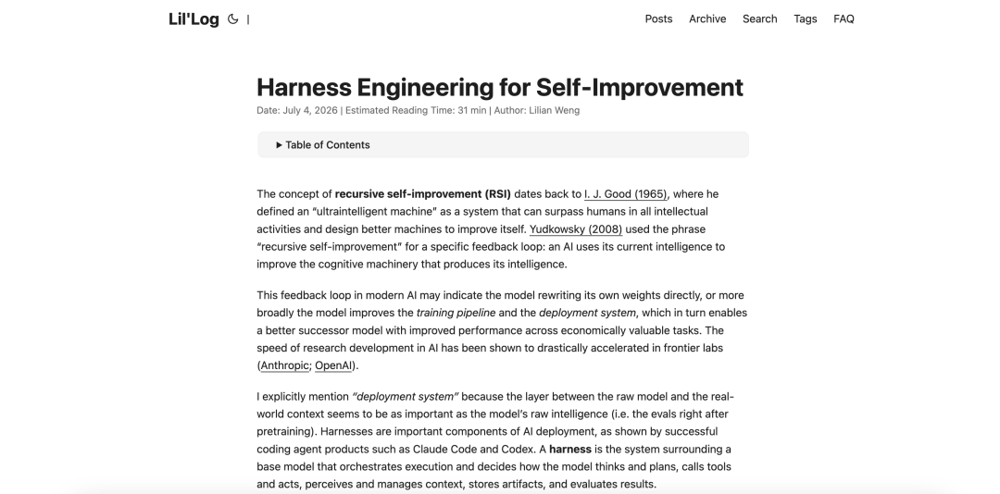
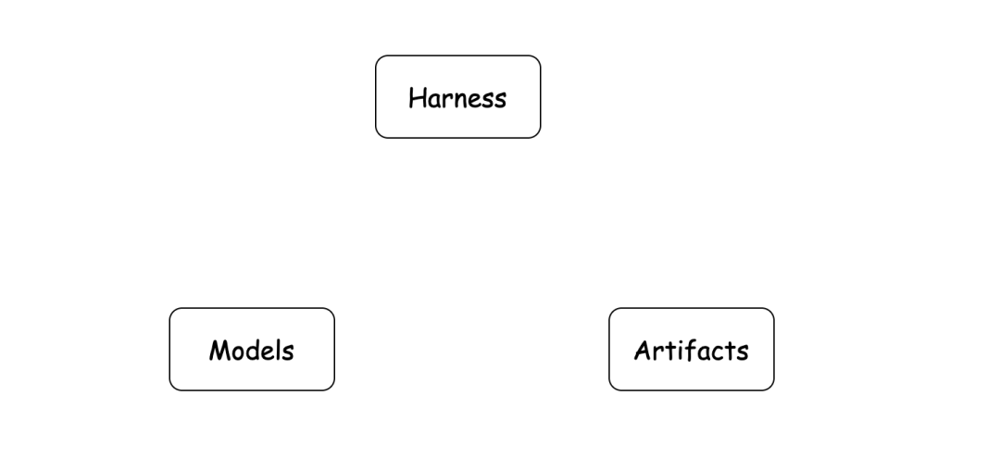
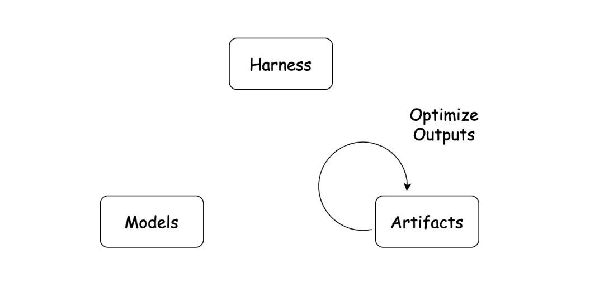
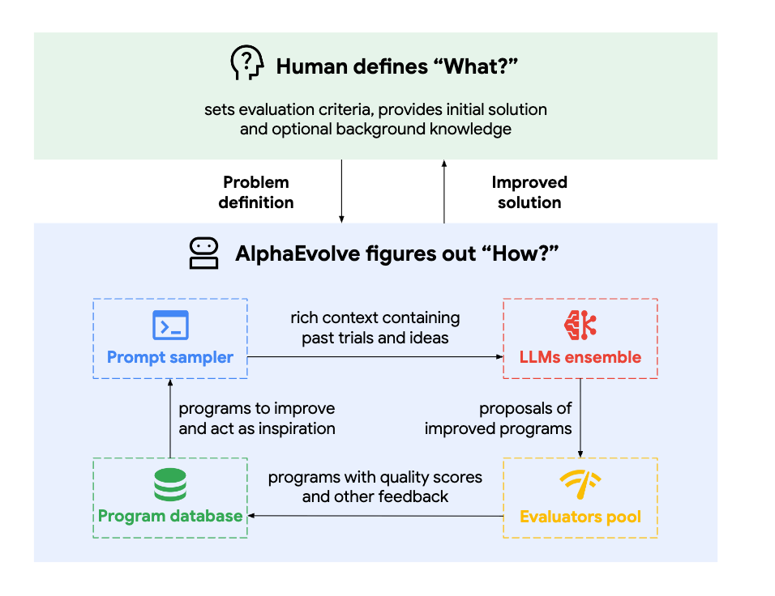
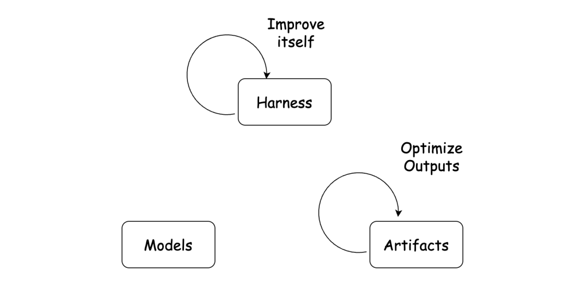
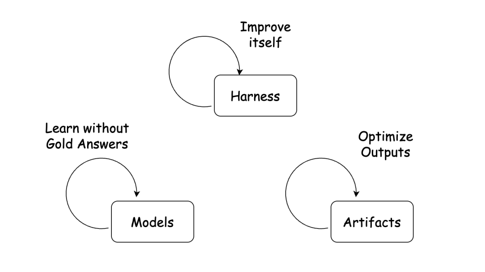

# 简单聊聊 Agent 自进化

前不久翁荔写了一篇类似综述的 blog 详细介绍了 RSI (recursieve self-improvement) 的概念与发展https://lilianweng.github.io/posts/2026-07-04-harness/[1]。我感觉这篇文章还是太偏学术了一些，把很多简单的 prompt, mem, loop 机制用复杂的公式表述出来，理解起来有些困难（这是篇很认真、很全面的文章，仍旧推荐大家去阅读原文）。

今天读到了另外一篇类似的文章，整体非常简洁，分享给大家。帮助大家了解当下正火的自进化究竟是什么。

写在前面：我认为 agent 的发展工业界是领先于学术界的，或者说工业与学术之间并没有这么严格的区分，做的事情也是类似的。所以下面介绍到的概念，很多都已经成为大家日常使用的模式。

最近，AI Agent 领域越来越频繁地出现 self-improvement、self-evolving、self-learning、adapting 等说法。

这些词的字面意思很接近，指向的却不一定是同一件事：有的系统在反复优化代码和算法，有的会给自己积累记忆、创造工具，还有的会直接更新模型参数。

为了方便讨论，本文不再纠结不同英文名词的细微差别，后面统一使用"自进化"这个词。

理解这三个问题，也就能看懂当前自进化研究的三条主要路线。

## 先把 Agent 拆成三部分

判断一个系统属于哪类自进化之前，可以先把它拆成三个部分：Model、Harness 和 Artifact。

**Model**，也就是模型。它通常是大语言模型，负责理解输入、推理并生成结果，可以把它看成 Agent 的"大脑"。

**Harness**，可以理解为 Agent 的外围系统。它包括系统提示词、任务循环、记忆、工具、Skills、上下文管理和路由机制等。模型本身只能根据输入生成输出，而 Harness 把模型组织成一个能够规划、调用工具并连续执行任务的 Agent。

因此，我们经常可以用一个简单公式来理解 Agent：

> Agent = Model + Harness

**Artifact** 是 Agent 生产的产物。它可以是一段代码、一种算法、一篇研究报告、一项科学发现，也可以是机器人的新控制策略。Artifact 不是 Agent 自身的组成部分，而是 Agent 最终要交付或优化的对象。

按照"哪一部分发生变化"，当前的自进化大致可以分成三类：

| 分类 | 发生变化的对象 | 模型参数是否更新 | 常见结果 |
|------|---------------|-----------------|---------|
| 产物迭代优化 | Artifact | 否 | 更好的代码、算法、论文或机器人策略 |
| Agent 外围系统进化 | Harness | 否 | 更好的提示词、记忆、工具、Skills 或子 agent 选择 |
| 无标准答案的模型学习 | Model | 是 | 模型能力或行为本身发生变化 |

这三类的目标都可以叫进化，但实现路径完全不同。

## 第一类：产物迭代优化

第一类也是目前最容易理解、最常见的路线：Agent 自身基本保持不变，不断优化它生产的产物。

它的工作流程通常是：人类给出目标和评价标准；Agent 生成一个候选结果；系统运行测试或实验，获得反馈；Agent 根据反馈修改结果；达到标准后结束，否则继续循环。

写代码的读者对这个过程应该很熟悉。Coding Agent 先修改代码，再运行测试，看到报错后继续修改，直到测试通过，本质上就是一个"生成—验证—改进"的闭环。

Google DeepMind 的 AlphaEvolve 是更典型的例子。它把大语言模型生成代码的能力和自动评估机制结合起来，用于发现和优化算法。在这个系统中，真正不断进化的是候选算法，而不是底层模型。

大语言模型给这类方法带来的关键变化，是把"搜索操作"也变得更灵活了。过去做算法优化时，研究人员往往需要提前定义有限的搜索空间和操作规则。现在，模型既可以提出候选方案，也可以阅读历史结果、分析失败原因，再决定下一步从哪里搜索。搜索空间更大，搜索策略也不必完全由人手写。

这类系统的价值最终落在 Agent 之外：更快的 GPU Kernel、更高效的软件、更好的科学假设，或者更可靠的机器人动作策略。

它的边界也很明确：如果 Agent 只是反复改代码，Agent 自身没有获得可迁移的新记忆、新工具或新参数，那么它优化的是产物，而不是自己。

## 第二类：Harness 系统进化

第二类不修改模型参数，而是让 Agent 改进自己的 Harness。

这条路线的现实动机很直接：训练模型成本高、周期长，但一个已经部署的 Agent，仍然可以通过修改提示词、积累记忆、创造工具等方式，变得更适合某类任务。

### 提示词与记忆优化

最简单的做法是保存历史问题和答案。但机械记忆很难泛化：下一次任务只要稍有变化，旧答案可能就没用了。

更有效的方式，是从执行记录中提炼可以复用的规则。例如，Agent 发现某类任务总在同一步失败，就把解决方法写入提示词、Playbook 或长期记忆。以后遇到相似任务时，它不必重新踩坑。

虽然模型权重完全没变，但整个 Agent 的行为已经发生变化。只要我们把 Harness 也视为 Agent 的一部分，这当然可以算作一种自进化。

### 把重复过程封装成工具和 Skills

有些经验无法只靠几句话复用。比如，让 Agent 从一段很长的视频中找到关键帧。如果每次都在上下文里解释如何读取视频、按间隔抽帧、识别画面和导出结果，既浪费 Token，也不稳定。

更合理的做法是把流程写成代码，再封装为可以重复调用的工具或 Skill。工具通常负责执行具体操作，Skill 则可以把工具、步骤、领域知识和检查规则组织成一套完整工作流。

Agent 完成一次任务后，如果能把成功经验沉淀成 Skill，下一次就能直接复用。Hermes Agent 就把跨会话记忆、自动创建 Skill，以及在使用过程中继续改进 Skill，放进了同一个学习闭环中。

这类系统进化的不是模型，而是模型周围可复用的能力层。

### Multi-Agent

当记忆、工具和 Skills 越积越多，新的问题也会出现：系统变慢、工具选择更困难，不相关的上下文还可能互相干扰。一个只处理股票问题的 Agent，并不需要携带做菜工具。

与其让一个 Agent 记住所有事情，不如建立多个专家 Agent，再通过 Router 把不同任务交给合适的专家。因此，多 Agent 系统也可以看成 Harness 进化的延伸。它不再只是增加一个工具，而是重新组织能力和上下文。

这里最大的难点往往不是如何创造更多专家，而是如何准确判断一个任务应该交给谁。

## 第三类：无标准答案的模型学习

这类工作不一定使用"自进化"这个名字，更常见的标签是自训练、自博弈、弱监督、强化学习、测试时训练、在线学习或持续学习。

它们面对的共同问题是：没有标准答案时，模型从哪里获得学习信号？

一种方法是制造"伪答案"。即使没有人工标签，预训练模型的判断通常也比随机猜测更有信息量。系统可以从多次输出、一致性、置信度或其他内部信号中选出相对可靠的答案，再把它们当成训练目标。

如果这个答案可以当做目标，我们可以做 SFT，如果答案可以转化成 reward，我们就可以用来做 RL。

另一种方法是从环境中获得弱反馈。模型可以和过去版本的自己博弈，也可以进入代码环境、游戏或模拟器，根据执行成功、失败、得分高低来学习。反馈未必告诉模型正确答案是什么，但可以告诉它某种行为是否更有效。

持续学习关注的则是另一个长期难题：模型学习新知识时，怎样避免忘记旧能力。比如，一个视觉模型先学会识别轿车，再学习识别 SUV；如果直接用新数据微调，它对轿车的识别能力可能下降，这就是灾难性遗忘。重放一部分旧样本，是缓解这个问题的重要办法之一。

这一类和前两类最根本的区别，是模型权重真的发生了变化。它的潜在收益更大，但训练成本、稳定性和安全风险也更高。

## 三类自进化的边界正在变模糊

现实系统很少永远停留在单独一层。Agent 在优化一段 GPU Kernel 时，最初变化的只是产物。但为了提高搜索效率，它可能继续修改自己的提示词、工具、记忆和搜索策略。Harness 达到上限后，系统还可能把搜索过程中产生的数据用于训练模型。

于是，一个完整闭环可能变成：更强的模型，构建更好的 Harness；更好的 Harness，加速产物搜索；更好的产物和实验结果，又提供新的训练数据与反馈。

NVIDIA 的 ENPIRE 已经把类似闭环带到真实机器人环境：Coding Agent 分析机器人执行日志，查阅资料并修改训练基础设施和算法代码，再让机器人重新执行和验证。这里既有产物优化，也有 Harness 对真实实验流程的组织。

## 判断"自进化"，只需要问三个问题

以后再看到一个号称能够自进化的系统，可以先不看宣传用词，直接问三件事：

1. **什么东西发生了变化？** 是最终产物、Agent 的提示词和工具，还是模型参数？
2. **变化由什么反馈驱动？** 是单元测试、自动评测、环境奖励、模型内部信号，还是人类反馈？
3. **优化闭环最终落在哪里？** 如果闭环落在 Benchmark 上，我们得到的是更强的刷题系统；落在代码上，我们得到的是更好的软件；落在科学实验和现实环境中，才可能产生新的发现、材料和机器人能力。

自进化真正值得期待的地方，不是 Agent 学会改写自己的提示词，而是它能否持续改善外部世界里的真实产物。

从这个角度看，Model、Harness 和 Artifact 不是互相竞争的三条路线，而是同一个系统的三个层次。今天的系统往往只优化其中一层，未来更完整的系统，很可能会让三层在同一个反馈闭环中一起进化。
