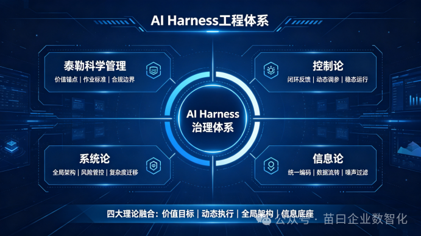
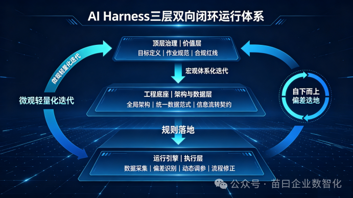
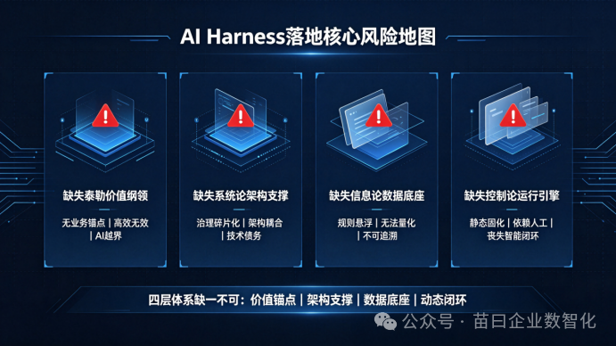

# 【AI Harness 系列】追本溯源，从"科学管理"和"老三论"看 Harness 工程

> AI Harness Engineering（AI 驾驭工程）并非凭空诞生。其顶层治理准则、动态运行机制、系统架构风险、工程落地底座，均可通过泰勒科学管理 + 老三论（系统论、控制论、信息论）进行理论溯源与范式拆解。

<!-- more -->

## 四大理论体系解读

### 1. 泰勒科学管理：AI 工程的顶层价值治理范式

将 AI Model、AI Agent 类比为"数字化工人"，泰勒科学管理即为整套 AI 治理体系的顶层组织纲领与价值锚点。其核心价值复刻工业科学管理的核心目标：实现 AI 作业流程标准化、产出结果可度量、作业行为可管控。

该理论主要解决核心顶层问题：如何定义 AI 的工作目标、作业规范、业务边界与合规红线，彻底规避 AI 无序作业、盲目迭代的问题，让 AI 所有作业行为锚定真实业务价值。

对应 Martin Fowler 所述的 **Feedforward（前馈控制）**。

### 2. 控制论：AI Harness 的动态稳态运行内核

控制论承接顶层治理规则，解决"人工制定的治理规则如何自动化落地、动态适配、持续生效"的核心技术问题，是整套体系的智能化运行引擎。

依托经典控制论的黑盒闭环负反馈机制，系统持续完成：数据采集 → 标准比对 → 偏差识别 → 动态调参 → 流程修正的全闭环操作，实时修正 AI 作业偏差，让动态变化的 AI 系统始终维持业务稳态，实现无需人工干预的智能化迭代管控。

对应 Martin Fowler 所述的 **Feedback（后馈控制）**。

### 3. 系统论：全局整体性架构与风险管控视角

系统论的核心包含两层内涵：

- **整体性原则**：AI Harness 治理不能局限于单点 AI 模型优化，需统筹模型、平台、业务、合规、运维全链路，实现全局最优
- **复杂性只会转移，不会消失**：AI Harness 本身是嵌入原有业务架构的全新复杂子系统，在简化 AI 作业管控的同时，会将复杂性迁移至工程架构层，衍生出系统耦合、链路冗余、架构泥球等次生问题

该理论帮助我们跳出单点功能视角，从全局架构维度预判、规避碎片化改造引发的系统性风险。

### 4. 信息论：全链路信息流通工程底座

信息论是 AI Harness 落地运行的核心数据与信息底座，核心作用是搭建全域标准化信息流通契约。通过统一体系内的信息编码规则、数据传输机制、噪声过滤策略、标准化数据范式、跨模块交互标准，系统性解决多系统、多节点之间的数据传递、保真传输、合规流转核心问题，为整套 AI 治理体系的自动化、标准化运行提供坚实的信息基础。

## 核心的三层双向闭环运行体系

依托四大基础理论，AI Harness 构建起"**自上而下规则落地、自下而上偏差迭代**"的双向闭环运行模式，实现人工顶层治理与机器自动化治理的深度融合、持续演进。

### 自上而下：规则—底座—引擎逐层落地

1. **顶层治理（价值层）**：基于泰勒科学管理，结合业务场景制定明确的 AI 作业目标、标准化流程、合规约束红线，确立整套体系的核心治理纲领
2. **中层底座（架构与数据层）**：依托系统论搭建全局一体化架构，规避系统耦合与复杂度风险；依托信息论统一全链路数据范式与信息流转规则，搭建可被机器识别、执行的静态工程底座
3. **底层运行（执行层）**：通过控制论闭环反馈引擎，将顶层人工治理规则、中层静态架构规范，转化为可实时执行、动态调整、持续迭代的自动化运行流程

### 自下而上：双层偏差回流迭代优化

- **微观轻量化迭代**：AI 运行过程中的数据偏差、流程漏洞、接口适配问题实时回流至中层工程底座，系统自动优化数据范式、传输规则与作业流程，实现高频次、小粒度的机器自迭代
- **宏观体系化迭代**：针对架构耦合、业务价值冲突、规则适配失效等系统性深层问题，数据偏差将回流至顶层治理层，由人工复盘修订治理纲领、业务目标与约束规则，完成整套体系的顶层重构与版本升级

## 落地核心价值与关键避坑要点

泰勒科学管理与老三论构成的四层体系缺一不可，任意模块缺失都会导致 AI Harness 工程治理体系断层失效：

| 缺失模块 | 核心风险 |
|---------|---------|
| 缺失泰勒价值纲领 | 无业务锚点，AI 高效无效、极易越界。体系仅有技术效率优化能力，无顶层业务价值与合规约束，导致 AI 产出脱离业务目标、存在合规漏洞 |
| 缺失系统论架构支撑 | 治理碎片化，滋生系统性技术债务。仅聚焦单点 AI 管控，落地过程中产生架构耦合、链路冗余、模块孤岛，长期积累大量技术债务 |
| 缺失信息论数据底座 | 规则悬浮纸面，无法机器化落地。人工治理规则无标准化数据支撑，最终造成治理制度与实际执行脱节 |
| 缺失控制论运行引擎 | 体系静态固化，丧失 AI 智能化核心能力。仅依赖人工运维迭代，彻底失去 AI 工程治理的自动化价值 |

## 结语

AI Harness 工程的核心本质，并非对 AI 模型本身的调优，而是依托经典工业管理与复杂系统科学，面向概率性、存在固有不确定性的 AI 作业体系，搭建一套有价值锚点、有架构支撑、有数据底座、有动态闭环的标准化、可控化、可演进的软件工程治理体系。