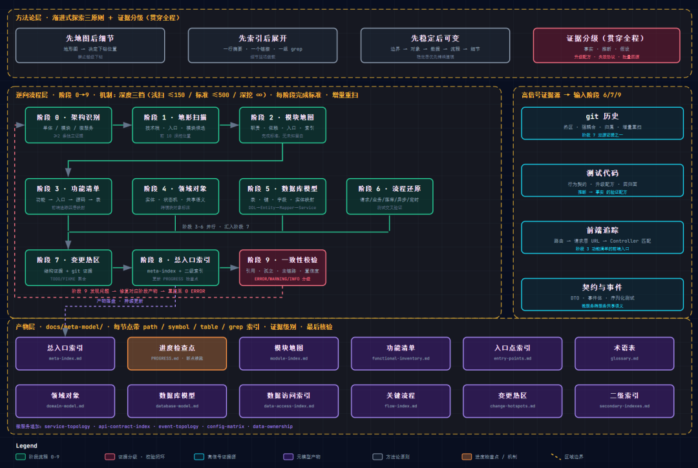

# 基于 Harness 工程和渐进式探索的源代码逆向工程——Skills 技能设计和实践

> 接手一个百万行存量项目时，最昂贵的动作不是"读代码"，而是"重复读代码"。本文介绍一套以渐进式探索为核心的逆向工程技能（Skill）实践：先把大型代码库逆向成"可导航元模型"，再让后续的每个需求、每个 Bug 都在这张地图上做定点打击，而不是一次次全库重扫。

<!-- more -->

## 一、大型存量代码库的"理解困局"

四个客观性质：

1. **上下文是预算，不是垃圾桶**：百万行代码全部塞进上下文，有效信息密度被稀释，真正重要的边界、入口、状态变更点淹没在大量无关实现细节里
2. **一次性理解无法沉淀**：传统报告"面向作者当时的关注点"，无法回答三个月后的新问题——这个接口有哪些调用方？这张表被哪些服务写入？
3. **记忆必然漂移**：代码库持续演化，而人类记忆停在过去。用过期索引定位问题比没有索引更危险
4. **重复扫描有复利成本**：团队层面，十个人各自理解过一遍项目就有十份互不相通的私人地图；每次新人入职、每次交接，全库扫描重来一遍

结论：**对大型存量项目的理解，不能靠"读"，要靠"工程"**。

## 二、核心思想：从"总结报告"到"可导航元模型"

传统逆向的产物是"摘要"；本文介绍的技能把产物定义为**元模型（Meta-Model）**——一个对项目本身进行建模的模型，区别于摘要的四个特性：

- **可导航**：每个结论挂在层级结构里，从总入口逐层下钻
- **可钻取**：每个节点携带源码索引（path / symbol / config / table / grep keywords），从结论一步跳回代码
- **可更新**：随代码演化持续维护，不是一次会话的产物
- **可验证**：每条结论标注证据级别，任何一条可被重新验证或宣告失效

元模型回答的不是"这个项目是什么"，而是"下一次任务需要什么"。

### 三个原则

1. **先地图，后细节**：永远先建立项目地形图（技术栈、入口、模块划分、数据流入口），再决定从哪里下钻
2. **先索引，后展开**：每一轮输出以"索引"为骨架——一行摘要、一个链接、一组检索关键词。细节知识被"延迟装载"，只在任务需要时展开
3. **先稳定，后可变**：建模顺序按稳定性排序：系统边界 → 模块边界 → 领域对象 → 数据模型 → 关键流程 → 可变实现细节

## 三、逆向工程的九个阶段

| 阶段 | 名称 | 一句话 |
|------|------|--------|
| 0 | 架构类型识别 | 判断单体 / 模块化单体 / monorepo / 微服务 |
| 1 | 项目地形扫描 | 技术栈、构建、入口、配置、测试目录 |
| 2 | 模块地图 | 稳定模块、职责、上下游依赖 |
| 3 | 功能清单逆向 | 用户功能 → 前后端入口 → 源码 → 表 |
| 4 | 领域对象抽取 | 实体、状态机、跨模块共享语义 |
| 5 | 数据库模型逆向 | 表、键、字段语义、实体映射 |
| 6 | 关键流程还原 | 请求/业务/落库/异步/定时五条链路 |
| 7 | 高风险变更区 | 结构证据 + git 证据 + 技术债聚合 |
| 8 | 总入口索引 | meta-index + 二级索引 + 进度检查点 |
| 9 | 一致性校验 | 引用完整性、孤立对象、主链路、低置信度 |

**阶段 0：架构类型识别**。先回答"这是什么类型的系统"，判断依据来自目录结构、构建文件、启动入口数量、部署清单、服务调用配置等客观证据，至少两条独立证据交叉。

**阶段 1：项目地形扫描**。"先地图"的落地动作。只看根目录、构建文件、入口文件、配置目录、文档与测试目录，回答五个问题。纪律：不读业务细节。

**阶段 2：模块地图**。把系统拆成稳定模块，记录职责、输入输出、上下游依赖、关键入口、典型变更点。完成标准：所有顶层代码目录都有归属，模块间依赖没有未知留白。

**阶段 3：功能清单逆向**。需求价值最高的部分。按用户可感知功能拆分，每个功能记录：所属模块、前端落点、后端 Controller、核心 Service、关键表、外部依赖、grep 关键词。

**阶段 4：领域对象抽取**。提炼实体、值对象、状态机、枚举、DTO、聚合，重点回答哪些是业务语义核心、哪些跨模块共享、状态如何迁移。

**阶段 5：数据库模型逆向**。主表、关系表、主键/唯一键、字段语义、代码实体到库表的四层映射（DDL → Entity → Mapper → Service）。

**阶段 6：关键流程还原**。五条链路：用户请求链路、核心业务处理链路、数据落库链路、异步消息链路、定时任务链路。

**阶段 7：高风险变更区**。识别需求高变区、高频 Bug 区、公共底座区、强耦合区、边界复杂区。一半证据来自 git 历史而非代码结构。

**阶段 8：总入口索引**。收敛为一份小而稳定的 `meta-index.md`，并更新进度检查点 `PROGRESS.md`。

**阶段 9：一致性校验**。收尾质检，防止"能看但不好用"的孤立模型。

## 四、阶段之间的关系

三种关系：

- **递进依赖**：前一阶段的产物是后一阶段的输入，不允许"越级下钻"
- **稳定层优先**：越靠上的层越稳定，越值得投入精力精确建模
- **校验闭环**：阶段 9 回检阶段 0-8 的所有产物，发现断裂就修复重跑，直到 0 ERROR

对于微服务架构，需要叠加**双层级约束**：服务级元模型（服务拓扑、接口契约、事件拓扑、配置矩阵、数据归属）与模块级元模型（模块地图、领域对象、流程）。

## 五、渐进式探索的六个落地机制

**机制一：入口索引（meta-index.md）**。总入口文件必须小、稳定、可持续维护，每个条目一行、一个链接、一句摘要。

**机制二：深度三档与停止规则**。浅扫档（≤150 文件）、标准档（≤500 文件）、深挖档（无硬上限）。达到上限即停止下钻，把未覆盖项写入进度检查点。

**机制三：阶段完成标准（exit criteria）**。每个阶段有可勾选的完成标准，解决"什么时候可以进入下一阶段"和"什么时候必须停手"。

**机制四：进度检查点（PROGRESS.md）**。记录目标档位、已完成阶段、待验证清单、下轮建议。新会话第一步读 PROGRESS.md + meta-index.md，从遗留项继续。

**机制五：最小上下文原则**。处理具体需求时，只展开与任务直接相关的最小文件集合。

**机制六：增量重扫**。用 `git diff --name-only` 确定变更目录，只重扫变更区并更新对应文档。

## 六、证据分层：对抗记忆漂移

每条结论必须标记为三级之一：

- **事实**：已由代码、配置、测试、文档直接确认，可 grep 到
- **推断**：代码迹象强，但未完全闭环
- **假设**：需要继续读取或运行验证

**升级配方**：推断升事实必须满足任一——测试命中、多路径交叉、配置或文档佐证、运行验证。

**失效协议**：元模型里的任何标识符都不是永真。定期用 grep 批量回源验证索引里的 path、symbol、表名是否仍存在。验证失败的对象标记"已失效（日期）：原因"，移入"历史/已变更"小节。

## 七、三个高信号证据源

1. **git 历史**：时间维度的热区。高活跃可能意味着活跃开发而非高风险，必须与结构证据合并使用
2. **契约与事件**：跨服务共享语义（DTO、状态枚举、事件体、幂等键）是最有价值的领域对象，在接口契约索引中单独建模
3. **测试代码**：行为契约的最高信号。有测试覆盖的关键流程，用测试还原期望行为比读十遍实现更准确

**前端追踪：四层映射**。六步链路：识别前端技术栈 → 收集路由清单 → 提取菜单与权限码 → 在请求层收敛 URL 清单 → 与后端 Controller 做交集匹配 → 页面→API→Controller→Service→表 映射落盘。

## 八、一致性校验：让元模型"能用"

阶段 9 检查清单包括：引用完整性、孤立对象、主链路覆盖、数据归属（微服务）、重复语义、索引完备、过度建模、低置信度。输出按 ERROR / WARNING / INFO 分级，每条带对象名、问题类型、修复建议。修复后重跑直到 **0 ERROR**。

## 九、结语

把大型代码库逆向成元模型，本质上是一次认知范式的转换：从"读懂项目"转向"把项目建成可导航、可验证、可持续维护的知识资产。渐进式探索是这场转换的方法论——先地图后细节、先索引后展开、先稳定后可变，配合证据分级对抗记忆漂移，配合进度检查点实现跨会话续跑，配合一致性校验保证产物可用。

> 理解代码库不应该是一次性的事件，而应该是一项持续投资的基础设施。当团队里的任何一个人都能从 meta-index.md 出发，在五分钟内定位到改动点、影响面与回归面时，这个团队就真正拥有了对存量系统的"制度性理解"。