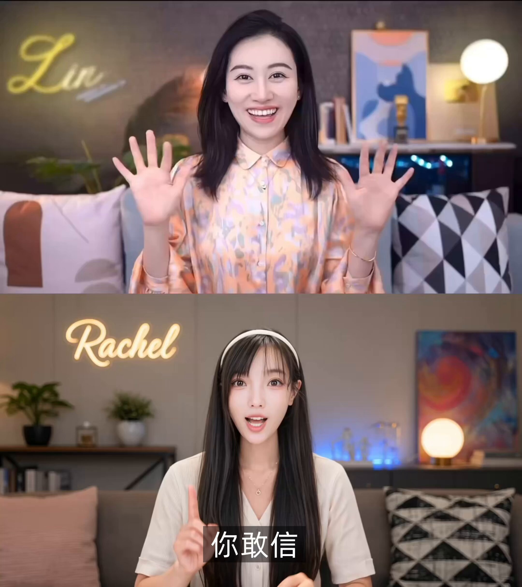

# 用 Codex 和 Hypit 复刻视频并沉淀可复用工作流

> Rachel 展示了把参考视频和开源 Hypit 交给 Codex 后，如何从一次视频复刻进一步得到可修改、可复用的视频工作流。

<!-- more -->

## 线程正文

Agent 时代，复刻一条爆款视频从而沉淀出自己的工作流，到底有多简单？

我把小 Lin 说的参考视频结合 Hypit [@hypitai](https://x.com/hypitai) 丢给 Codex，想看看 AI 能不能复刻千万粉博主的口播视频。

结果它生成的不只是一条成片，而是一套可以继续修改和复用的视频 Workflow。

Hypit 目前已开源。它不是 Agent，也不是视频模型，而是给 Claude Code、Codex 等 AI Agent 使用的开源视频语言和系统。人物、台词、字幕、B-roll 和特效都跟着文字与叙事事件走，不再钉死在时间线的某一秒。

换主持人，只重新生成相关镜头；修改图表或背景，也只需要调整对应组件。复刻完成后，还能继续换人物、换内容、换语言，批量生成不同版本。

如果你也想让 AI 真正开始复刻视频，可以试试 Hypit。下次想 Clone 爆款，直接把视频交给你的 Agent。

- [查看原帖中的演示视频](https://x.com/Zesee/status/2099732287168401899)
- [Hypit 开源仓库](https://github.com/hypit-ai/hypit)

## 跟帖

目前 Hypit 已开源，可以点个 Star 支持一下：

- https://github.com/hypit-ai/hypit
- 原帖：https://x.com/Zesee/status/2099732552856535291
