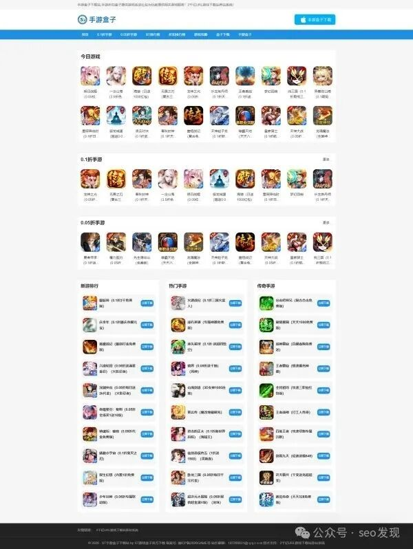

# 别把闲置域名当摆设！手搓几个游戏站试一下！

> 很多站长手握一批闲置域名，与其被动等终端上门，不如主动利用起来做游戏站，通过九游 CPS 等方式实现域名价值变现。

<!-- more -->

## 核心思路

很多站长手握一批闲置域名，就等终端上门。但现实是：运气好的情况下也许能等到，假如等不到了，资源就白白浪费。一般人手上的闲置域名，很难等到终端买家。

不如换个思路：**手搓几个游戏网站。**

## 实操方法

以九游为例：

1. **去九游注册账号**
2. **手工搓内容**：把九游 CPS 后台的游戏逐个手搓到你的网站上
3. **资讯栏目**：参考九游网站的内容来写——毕竟人家是权重高的网站，内容结构有参考价值

## 作者总结

- 很多时候，站长觉得网站没用，但其实是不是真的没效果，只有做了才知道
- 市面上有很多 CPS 项目，只要不懒，入门游戏站不难
- 学会了 CPS 之后，可以进一步实操单游戏私域

## 作者观察

- 前两年搞自媒体的站长，很多又回归做网站——怎么算，网站都更划算
- 现在搞 GEO 的人，很多也回到了从前做网站的路上
- 不如现在脚踏实地，用几年时间做成绩看看

## 作者态度

> 很多人私信上来就问"一个网站要赚多少钱"，作者基本上不会理。不想和心态不好的站长交朋友，因为这种心态会导致思路偏差。

---

> **风险提示**：本文为个人创业、副业经验与思路交流，不构成任何投资建议或收益承诺。项目存在市场、运营、时间成本等多重因素，不存在稳赚不赔的项目。请理性看待收益，谨慎尝试。