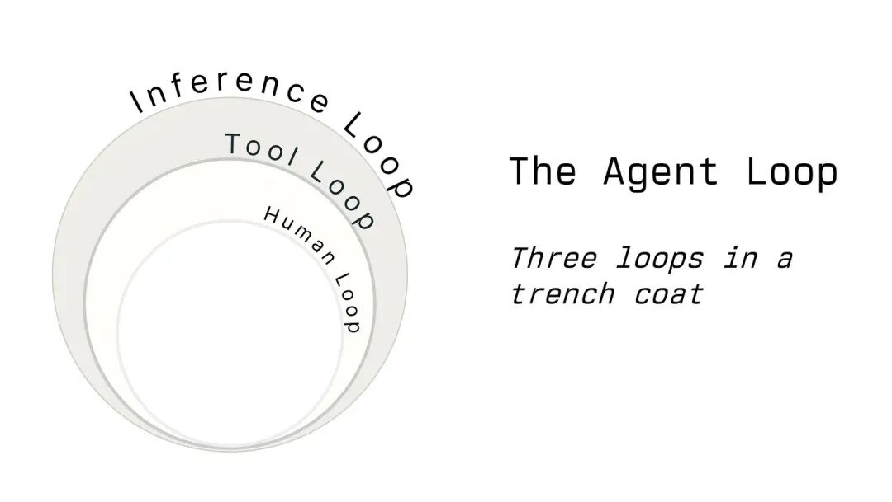

# Agentic Loop：三个循环

人们经常把智能体循环讲得太简单，说成一个循环。实际上，三个循环套在一件风衣里，才拼出了用户眼中的"智能体"体验。

## 推理循环

要用最简单粗暴的方式解释大语言模型，那就是：它接收文本，然后预测下一个字符……呃……token。靠的就是推理循环。

你的推理循环有三项职责：

- 调用聊天补全 API（推断接下来的词）
- 把工具使用请求交给工具循环
- 持久化聊天历史（包括工具结果和后续用户消息）

构建智能体时，第一个要写的"外层"循环就是推理循环。它把系统提示词、用户和助手消息，以及可用工具发给大语言模型的"聊天补全"端点。Anthropic 有一套。OpenAI 也有。OpenRouter 则把这些接口统一封装得更好用。

模型返回消息后，你要把它们追加到"聊天历史"里，才能继续对话。聊天历史可以放在数组、数据库表或 Redis 键里，怎么存都行。

（大多数）大语言模型提供商的 API 都是无状态的。每次请求都得带上完整对话，这就是"长对话会更快消耗 token"的原因。

## 工具循环

大语言模型就像泡在罐子里的大脑。单靠它自己，干不了实事。你交给大语言模型的工具，才是让它成为智能体的关键。

工具循环要根据名称找到模型想调用的工具，再把模型生成的参数传给你自己的函数。不过，有几点需要注意：

- 工具调用本身也是模型生成的文本，所以工具名和参数都可能是它编出来的。你得防住这些假调用。
- API 会返回一个 tool_call_id（Anthropic 用的是 tool_use_id）。API 和模型靠这个 ID 对应调用和结果。
- 有些提供商没有为工具结果定义错误码或错误状态，返回内容本身就是错误信息。可以用 XML 标签标记，例如 `<tool_call_error>Phone number blocked</tool_call_error>`。

## 人类循环

这个名字我纠结了很久。严格说来，这个循环可以没有，负责审批的也不一定是人。不过我认为 AI 应该为人服务，所以还是叫"人类循环"。

如果你希望自己掌控智能体，就得实现第三个循环，用它批准或拒绝工具调用，或者给模型换个方向。

这并不是代码里的循环。它更像一次阻塞调用：某个人或某个系统在外面反复权衡，要不要放行工具调用。循环不在代码里，而在审批者的决策过程里。

人类循环大概是智能体系统里最难实现的一环。代码不能真的阻塞几个小时。服务器重启怎么办？同时还有几千个请求等你响应怎么办？这就是 Temporal 之类的持久化执行框架存在的原因。

## 回到循环

三个循环合起来就是：

- **推理循环**：调用聊天补全 API，再把工具调用交给……
- **工具循环**：处理模型发起的工具调用，再把审批交给……
- **人类循环**：请求批准，或者给出新的方向。审批结果随后作为工具结果返回。

这三个循环构成了智能体系统的基础。RAG、渐进式发现、工具自动审批等能力，都是在它们之上搭起来的。

> — 我甚至还做了这张图！
