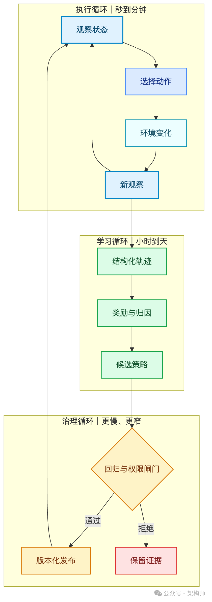
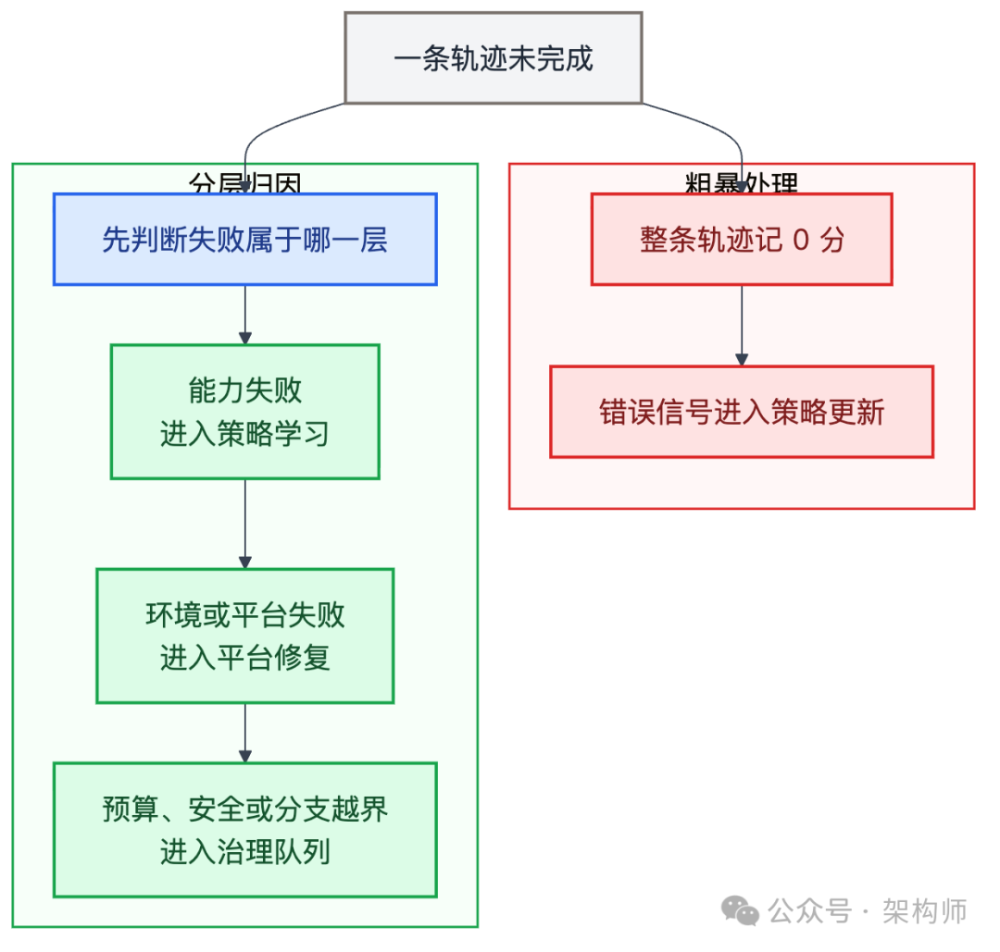
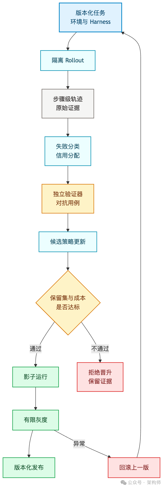

# 长程Agent训练九 best practices

## 核心问题

长程自主 Agent 的训练，是在一个会变化的世界里生成经验，再用这些经验修改模型。工作现场设计错了，训练会把错误一起写进参数。

## 先看结论

- 长程的关键不是轮数多，是前一步会改变后一步所面对的状态
- 训练系统里至少有三个循环：执行循环、学习循环、治理循环。三者权限和更新速度不应相同
- **工具列表不等于训练环境**。可复现、可隔离、可重置、可回放，是长程训练的基础设施
- **轨迹不是聊天记录**。原始 Token、步骤边界、工具返回、环境版本、奖励归属和终止原因都要能对齐
- 高奖励只证明 Agent 越来越会优化当前指标。成功率、回归逃逸率、副作用、成本和验证分歧要分开看
- 交互跨度更适合一点点放长。过早放大 Horizon，常常会同时放大无效探索、方差、信用分配难度和环境成本
- **训练分数上升，不能直接换成生产权限**。影子运行、有限灰度、独立审计和快速回滚是另一道门

## 三个循环

- **执行循环**：观察状态、选择动作、调用工具、收到新观察，以秒或分钟计
- **学习循环**：收集完整轨迹、分析成败、更新模型，以训练步、小时或天计
- **治理循环**：决定任务能否进入训练、环境/验证器/评估集版本化、候选策略灰度，出现退化时回到哪一版

## 九项实践

### 实践一：从可验证边界开始选任务

训练任务的起点更适合放在验证信号稳定、副作用可控、失败容易撤回的地方。

四个问题筛选起步任务：初始状态能否重现、结果能否从 Agent 之外验证、做错后能否低成本恢复、一次成功能否用多个样本再次证明。

### 实践二：环境要能说真话，也要能回到起点

环境既能大批量运行，又能重现一条因果链。容器重启不等于环境已经重置。依赖缓存、数据库记录、临时文件、外部服务副作用和时钟都可能泄露上一条轨迹的状态。

### 实践三：保存完整事实，另外构造当前上下文

长轨迹至少包含：任务指令、每一步原始输出、工具调用、环境观察、状态变化、奖励、终止原因，以及当时真正进入模型上下文的内容。

避免 retokenization drift：Rollout 生成的 Token 与重新编码后的 Token 不完全一致，动作掩码、对数概率和奖励归属也会跟着错位。

### 实践四：不要让一个分数承担全部目标

先把奖励和验证拆成几本账，分开记录：
- **结果**：目标状态是否真的达到
- **过程**：关键步骤是否可执行、可复现
- **副作用**：权限、数据、依赖和外部系统是否被不必要地改变
- **成本**：耗时、Token、计算、API 调用和人工复核成本是否可接受

### 实践五：先把失败分清，别动不动就给模型扣分

六类失败：能力失败、环境失败、基础设施失败、预算终止、安全拒绝、验证分歧。真正能直接变成策略学习信号的，主要是第一类。

一条几十步的轨迹最后失败，从哪一步开始跑偏？信用分配算法要有用，前提是它拿到的失败标签不是一锅粥。

### 实践六：验证器也要版本化、对抗化

验证器本身也需要测试。用故意破坏的实现攻击它，记录它漏掉了哪些错误，并给每次评估绑定验证器版本。

候选 Harness 可以改声明过的可编辑表面，runs记录、tracer、verifier 和 LLM configuration 等关键部分保持只读。

### 实践七：先训练短而清楚的路，再逐步放长

AgentGym-RL 在 Deep Search 环境的实验：更大的交互预算早期提升更快，后期却出现训练坍缩。较短轮次的信号更稳定，能力上限也较低。

ScalingInter-RL 的方法：先限制交互范围，等模型学会较短、较清楚的路径，再增加交互跨度。

三档：短轨迹（单工具）→ 中轨迹（诊断/尝试/修正）→ 长轨迹（跨工具/跨服务/跨时段）。

### 实践八：吞吐提高后，要追踪轨迹的"年龄"

AgentRL 把推理和训练拆成独立资源池，通过异步队列收集已完成轨迹。轨迹需要带上生成策略版本、环境版本、验证器版本和生成时间。

### 实践九：不只看模型还在输出什么

RAGEN 发现 Echo Trap：模型逐渐过拟合自己生成的推理模式，组内奖励方差和 Token 熵下降，梯度开始失稳。

RAGEN-2 发现 Template Collapse：模型的输出仍然流畅，可推理越来越像一套通用模板，和当前问题的关系正在变弱。

仪表盘分开看：任务成功率与保留集成功率、奖励均值与方差、Token 熵与输入相关性、回归逃逸与验证分歧、成本与人工接管率。

## 五份合同

- **环境合同**：Agent 醒来时看到的世界
- **轨迹合同**：这一趟到底发生了什么
- **验证合同**：做对了的拆解
- **Rollout 合同**：一次最多折腾到哪里
- **晋升合同**：训练分数怎么换成更大权限

## 最小路径

1. 先做只读分类
2. 在沙箱生成候选 Diff
3. 先收轨迹，不急着更新模型
4. 用负向用例打验证器
5. 从短 Horizon 开始更新
6. 影子运行后再给写权限

## 配图

*图1：执行、学习与治理三个转速不同的循环*

*图2：分层归因的训练路径*

*图3：版本化工作现场到灰度发布*
