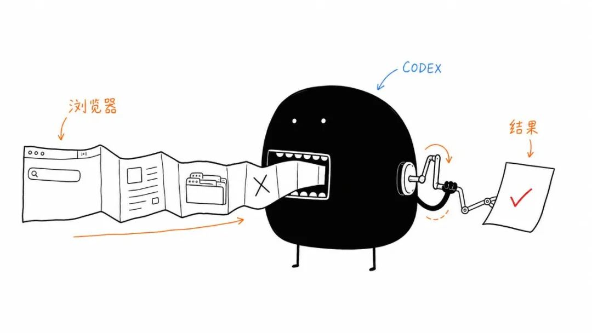
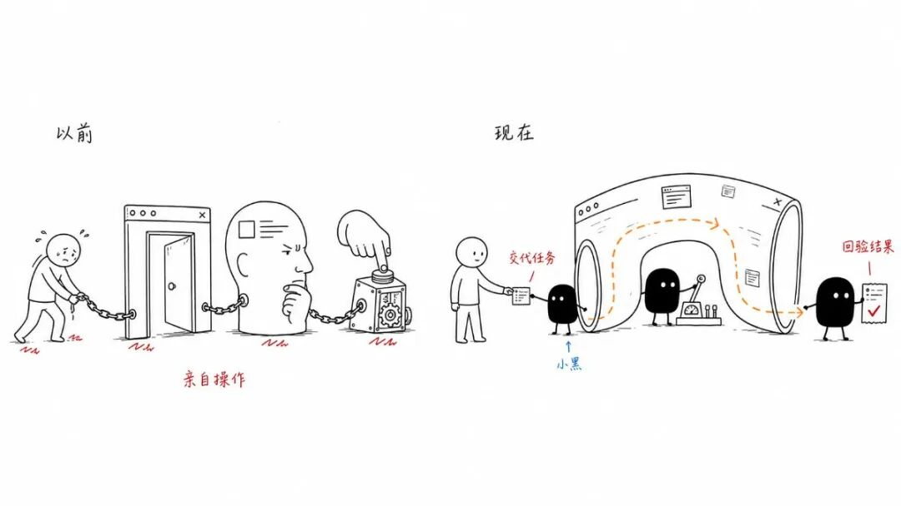
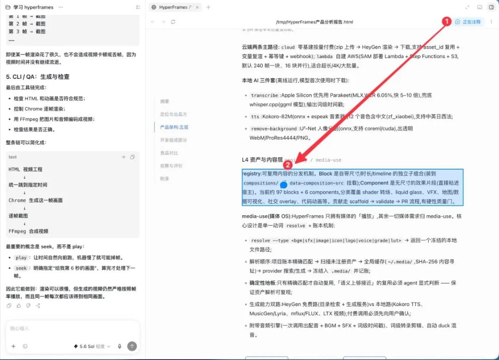
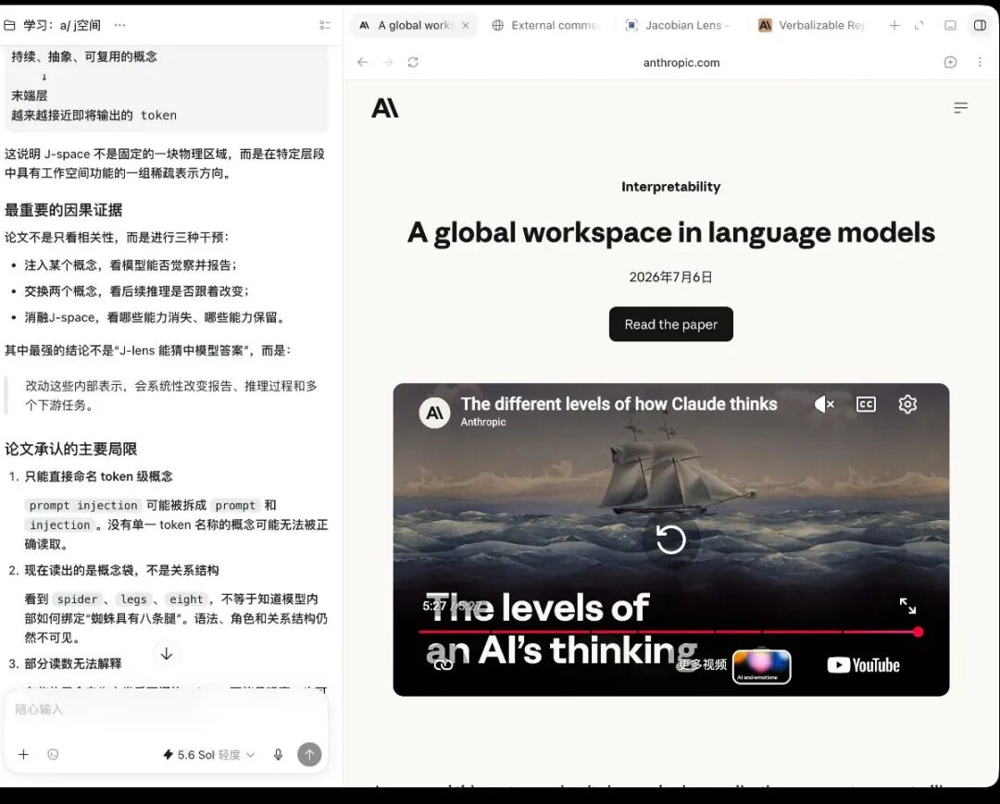
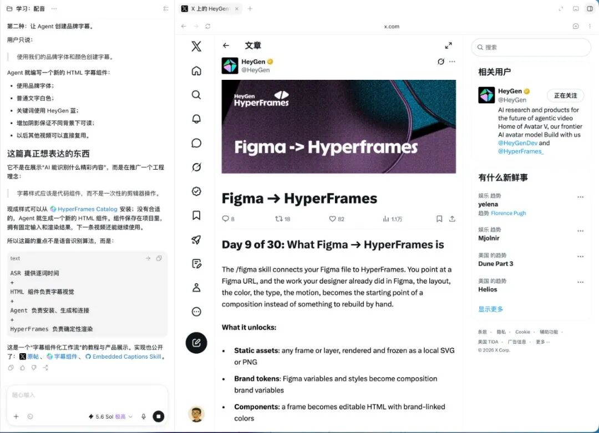
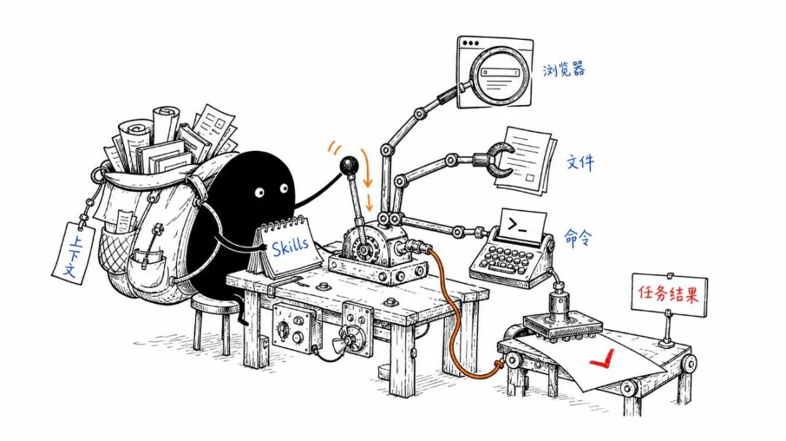

# Codex 吞掉了浏览器，下一口是整台电脑

## 核心观点

Codex 正在吃掉浏览器作为独立入口的地位，阅读的起点已从「打开资料」变成「审核结果」。Agent App = Agent + 工具 + Skills + 上下文。

## Atlas 死了，活在 Codex 里

OpenAI 的 Atlas 浏览器（2025年10月21日出生）活了 292 天后停止工作。它的浏览器 Agent 能力正在进入 ChatGPT 和 Codex。

## Codex 吃掉 Atlas，顺手吞了阅读器

读论文不再从文档第一页开始。把问题交给 Codex，它自己查上下游资料，读完后直接做成 HTML 报告。批注发回 Codex，继续修改同一份报告。

阅读的起点已经从「打开资料」变成了「审核结果」。

## 标签页正在失去存在的意义

四个标签页，Codex 一次读完。学习 Anthropic 的 J-space 时，同时打开四个页面，Codex 直接读取全部页面，再告诉每篇讲了什么、彼此是什么关系。

以前四次阅读，现在只是 Codex 的一次任务。

## 连刷 X 都开始轮不到我了

HyperFrames 在 X 上发了一组系列文章。只把其中一篇交给 Codex，剩下的帖子它自己沿着前后文逐篇点开，全部读完后给一份完整报告。

## AgentOS 雏形

Codex 已经显出了 AgentOS 的雏形：

> **Agent App = Agent + 工具 + Skills + 上下文**

工具让 Agent 动手，Skills 保存做法，上下文让同一个任务继续往下走。

以前先打开软件，现在先交代任务。浏览器没有消失，它只是退到了 Agent 身后。

## 配图

*工作入口变了：以前先打开软件，现在先交代任务*

*Atlas 死了，却活在 Codex 里*

*HTML 阅读越厚——阅读起点从「打开资料」变成「审核结果」*

*四个标签页，Codex 一次读完*

*连刷 X 都开始轮不到我了*

*Agent App = Agent + 工具 + Skills + 上下文*
